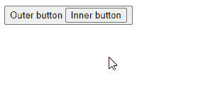

# Vue 事件处理:完全指南

> 原文：<https://javascript.plainenglish.io/vue-event-handling-696ddda08e49?source=collection_archive---------13----------------------->

## 通过事件处理轻松地为您的 Vue.js 应用程序添加交互性，并应用各种事件修改器来自定义事件触发条件。


我们监听应用程序中的事件，以便在事件发生时执行特定的操作。例如，我们可以在单击按钮、按下按键、更改文本输入值等时显示内容或获取数据。在本文中，我们将学习如何在 Vue.js 应用中处理事件以实现交互性。

# 监听 Vue.js 中的事件

为了监听事件，我们将处理程序传递给附加到元素的`v-on`指令，例如:

```
<button v-on:click="handler">Click me</button>
```

我们还可以使用`@`符号来简化语法:

```
<button @click="handler">Click me</button>
```

Vue.js 中有两种类型的事件处理程序:内联处理程序和方法处理程序。

# 内嵌事件处理程序

为了创建内联事件处理程序，我们传递事件被触发时将执行的内联 JavaScript。例如:

```
<template>
  <p>Count: {{ count }}</p>
  <button @click="count++">Add 1</button>
</template><script>
export default {
  data() {
    return {
      count: 0,
    };
  },
};
</script>
```

# 方法事件处理程序

当我们有跨越多行代码的更复杂的逻辑时，我们使用方法事件处理程序。我们传递在 Vue.js 组件上定义的[方法](https://codingbeautydev.com/blog/vue-methods/)的名称，以使用它来处理事件。

例如:

```
<template>
  Count: {{ count }}
  <br />
  <button @click="increment">Add 1</button>
</template><script>
export default {
  data() {
    return {
      count: 0,
    };
  },
  methods: {
    increment() {
      this.count++;
      if (this.count % 5 === 0) {
        alert(`${this.count} is divisible by 5.`);
      }
    },
  },
};
</script>
```

# 调用内联处理程序中的方法

我们也可以直接在事件处理程序中调用[方法](https://codingbeautydev.com/blog/vue-methods/)。这对于传递参数很有用。

```
<template>
  <p>Count: {{ count }}</p>
  <button @click="increment(2)">Add 2</button>
  <button @click="increment(3)">Add 3</button>
</template><script>
export default {
  data() {
    return {
      count: 0,
    };
  },
  methods: {
    increment(amount) {
      this.count += amount;
      if (this.count % 5 === 0) {
        alert(`${this.count} is divisible by 5.`);
      }
    },
  },
};
</script>
```

# 用美化来美化

使用 Vuetify 材料设计框架创建优雅 web 应用程序的完整指南。


在这里 免费获得一份 [**。**](https://mailchi.mp/583226ee0d7b/beautify-with-vuetify)

# 在事件处理程序中访问事件参数

当直接传递一个[方法](https://codingbeautydev.com/blog/vue-methods/)的名称时，与该事件相关联的 DOM 事件对象将被传递给[方法](https://codingbeautydev.com/blog/vue-methods/)的第一个参数:

```
<template>
  <button
    id="btn-1"
    @click="handleClick"
  >
    Button 1
  </button>
</template><script>
export default {
  methods: {
    handleClick(event) {
      const target = event.target;
      alert(`Button with ID ${target.id} clicked`);
    },
  },
};
</script>
```

我们还可以使用内嵌箭头函数来访问这个事件对象:

```
<template>
  <button
    id="btn-1"
    @click="(event) => handleClick('Peter', event)"
  >
    Button 1
  </button>
</template><script>
export default {
  methods: {
    handleClick(username, event) {
      const target = event.target;
      alert(
        `${username} clicked the button with ID ${target.id}`
      );
    },
  },
};
</script>
```

或者我们可以在从内联处理程序调用[方法](https://codingbeautydev.com/blog/vue-methods/)时传递特殊的`$event`变量:

```
<template>
  <button
    id="btn-1"
    @click="handleClick('Peter', $event)"
  >
    Button 1
  </button>
</template><script>
export default {
  methods: {
    handleClick(username, event) {
      const target = event.target;
      alert(
        `${username} clicked the button with ID ${target.id}`
      );
    },
  },
};
</script>
```

# Vue.js 事件修改器

Vue.js 提供了事件修饰符，允许我们将数据逻辑与事件相关的逻辑分开。例如，`.prevent`事件修改器消除了在事件处理方法中调用`event.preventDefault()`的需要:

```
<template>
  <form @submit.prevent="onSubmit">
    <input
      name="email"
      type="email"
      placeholder="Email"
    />
    <button type="submit">Sign up</button>
  </form>
</template><script>
export default {
  methods: {
    onSubmit() {
      alert('Signed up successfully.');
    },
  },
};
</script>
```

类似地，`.stop`事件修饰符消除了在事件方法处理程序中调用`event.stopPropagration()`的需要:

```
<template>
  <button
    id="outer-btn"
    @click="handleOuterButtonClick"
  >
    Outer button
    <button
      id="inner-btn"
      @click.stop="handleInnerButtonClick"
    >
      Inner button
    </button>
  </button>
  <p>{{ message1 }}</p>
  <p>{{ message2 }}</p>
</template><script>
export default {
  data() {
    return {
      message1: '',
      message2: '',
    };
  },
  methods: {
    handleOuterButtonClick() {
      this.message2 = 'Outer button clicked';
    },
    handleInnerButtonClick() {
      this.message1 = 'Inner button clicked.';
    },
  },
};
</script>
```



下面是 Vue.js 中常见事件修饰符的列表:

*   `.stop`
*   `.prevent`
*   `.self`
*   `.capture`
*   `.once`
*   `.passive`

# 链式事件修改器

我们可以在 Vue.js 中链接事件修饰符:

```
<a @click.stop.prevent="handleLink1Click"></a>

<a @click.once.prevent="handleLink2Click"></a>
```

# 关键修饰符

在监听键盘事件时，通常会检查特定的按键。Vue.js 为此提供了关键修饰符。

例如，我们可以只听“回车”键:

```
<input @keyup.enter="handleSubmit" />
```

我们可以使用通过`KeyboardEvent.key`暴露的任何有效键名作为修饰符，将它们转换成 kebab-case:

```
<input @keyup.page-down="handlePageDown" />
```

# 关键别名

Vue.js 为最常用的键提供了别名:

*   `.enter`
*   `.tab`
*   `.delete (captures both "Delete" and "Backspace" keys)`
*   `.esc`
*   `.space`
*   `.up`
*   `.down`
*   `.left`
*   `.right`

# 系统修饰键

将系统键修饰键应用到键事件只会在按下相应的修饰键时触发事件。

```
<!-- Ctrl + Enter -->
<input @keyup.ctrl.enter="clearTextField" /><!-- Ctrl + Click -->
<div @click.ctrl="handleCtrlClick">Do something</div>
```

## 精确修饰符

`.exact`修改器让我们控制触发事件所需的系统修改器的确切组合:

```
<!-- this will fire even if Alt or Shift is also pressed -->
<button @click.ctrl="handleClick">Button</button><!-- this will only fire when Ctrl and no other keys are pressed -->
<button @click.ctrl.exact="handleCtrlClick">Button</button><!-- this will only fire when no system modifiers are pressed -->
<button @click.exact="handleClick">Button</button>
```

# 鼠标按钮修饰符

鼠标按钮事件修饰符将只调用特定按钮的事件处理程序。它们是:

*   `.left`
*   `.middle`
*   `.right`

```
<button @click.left="handleLeftClick">Button</button><button @click.middle="handleMiddleClick">Button</button><button @click.right="handleRightClick">Button</button>
```

# 结论

我们可以通过向事件的`v-on`指令传递内联代码或方法处理程序来监听 Vue.js 中的事件。我们可以对一个事件应用不同的修饰符来进一步定制事件触发条件。

*更新于:*[*codingbeautydev.com*](https://codingbeautydev.com/blog/vue-event-handling/)*。*

# 订阅编码美容简讯

每周获取新的 web 开发技巧和教程。


[**订阅**](https://codingbeautydev.com/newsletter/)