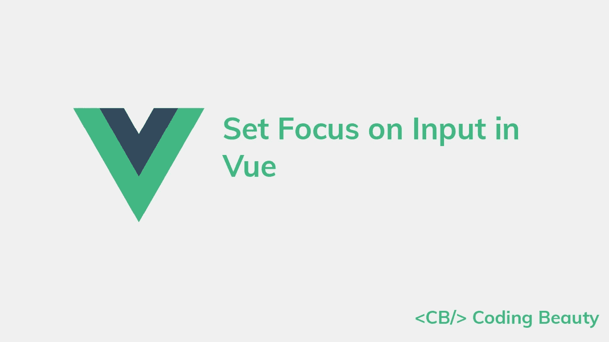
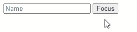
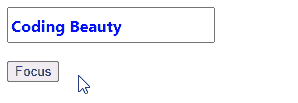
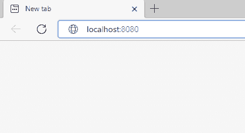
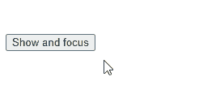
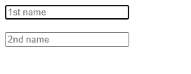

# 如何在 Vue.js 中设置输入焦点

> 原文：<https://javascript.plainenglish.io/vue-focus-input-8bf54c2419a3?source=collection_archive---------7----------------------->

## 关于如何在 Vue.js 中轻松设置输入元素焦点的教程。



要在 Vue.js 中设置输入焦点:

1.  在`input`元素上设置一个 ref。
2.  从 Vue 实例的`$refs`属性访问新的 ref。
3.  在 ref 元素对象上调用`focus()`方法。

# 在单击按钮时设置输入焦点

例如:

`App.js`

```
<template>
  <div id="app">
    <input
      ref="name"
      placeholder="Name"
    />{{ ' ' }}
    <button @click="focusInput">Focus</button>
  </div>
</template><script>
export default {
  methods: {
    focusInput() {
      this.$refs.name.focus();
    },
  },
};
</script>
```



Clicking the button sets focus on the input

首先，我们通过将`input` `ref`属性设置为一个值(`name`)来创建一个新的 Vue 实例 ref。

```
<input
  ref="name"
  placeholder="Name"
/>
```

这样做之后，我们就能够访问 Vue 实例的`$refs`属性来访问表示输入元素的对象。然后我们调用这个对象上的`focus()`方法来设置输入的焦点。

```
this.$refs.name.focus();
```

我们将`focusInput()`方法设置为`Focus`按钮的`click`事件的处理程序。所以当点击按钮时，`focusInput()`被调用，`input`获得焦点。

```
<button @click="focusInput">Focus</button>
```

# 将焦点设置在自定义输入组件上

定制输入组件对于抽象围绕`input`元素构建的逻辑和重用以特定方式设计的`input`元素非常有用。

对于定制组件，在其 ref 对象上调用`focus()`将导致错误。为了让它工作，我们需要向自定义组件添加一个`focus()`方法，该方法调用其根`input`元素的`focus()`方法。

例如:

`components/CustomInput.vue`

```
<template>
  <input
    placeholder="Name"
    class="custom-input"
    ref="input"
  />
</template><script>
export default {
  methods: {
    // 👇 Create custom "focus" method
    focus() {
      this.$refs.input.focus();
    },
  },
};
</script><style scoped>
.custom-input {
  font-family: 'Segoe UI';
  font-weight: bold;
  font-size: 16px;
  color: blue;
  height: 30px;
  width: 200px;
}
</style>
```

`App.js`

```
<template>
  <div id="app">
    <custom-input ref="name"></custom-input>
    <br />
    <br />
    <button @click="focusInput">Focus</button>
  </div>
</template><script>
import CustomInput from './components/CustomInput.vue';export default {
  methods: {
    focusInput() {
      // 👇 call custom "focus" method
      this.$refs.name.focus();
    },
  },
  components: { CustomInput },
};
</script>
```

现在，我们可以在单击按钮时将焦点设置在自定义输入组件上。



Clicking the button sets focus on the custom input component

# 页面加载后将焦点设置在输入上

为了在页面加载后立即给出输入焦点，我们可以使用输入 ref 从 Vue 实例的`mounted`生命周期钩子中调用`focus()`方法。在组件被添加到 DOM 后，调用`mounted`方法，这发生在页面加载时。

例如:

`App.js`

```
<template>
  <div id="app">
    <input
      ref="name"
      placeholder="Name"
    />
  </div>
</template><script>
export default {
  mounted() {
    this.focusInput();
  },
  methods: {
    focusInput() {
      this.$refs.name.focus();
    },
  },
};
</script>
```



The input gains focus after the page loads.

# 重新渲染后将焦点设置在输入上

有些情况下，我们需要等待 DOM 更新后再调用`focus()`来获得输入元素的焦点。

例如，我们可能使用一个布尔变量来确定输入元素是否应该出现在 DOM 中。

因为 Vue 批处理状态更新，input 元素可能不会立即添加到 DOM 中，我们也不能立即访问它的 ref。

我们可以使用`nextTick()`实例方法来确保在调用`focus()`之前修改布尔变量之后，DOM 已经被更新为包含输入。

```
<template>
  <div id="app">
    <!-- 👇 conditional rendering with "v-if" directive -->
    <input
      v-if="showInput"
      ref="name"
      placeholder="Name"
    />
    <br /><br />
    <button @click="focusInput">Show and focus</button>
  </div>
</template><script>
export default {
  data() {
    return {
      showInput: false,
    };
  },
  methods: {
    focusInput() {
      // 👇 Set boolean variable to show input
      this.showInput = true; this.$nextTick(() => {
        // This callback will only be called after the
        // DOM has been updated
        this.$refs.name.focus();
      });
    },
  },
};
</script>
```



The input gains focus after the DOM is updated to include it.

# 按 Enter 键后，将焦点设置在下一个输入上

假设我们有多个需要在页面上填充的输入元素。我们可以通过在用户按下回车键以表示他们完成了一次输入时，将注意力集中在随后的文本输入上来改进 UX。

我们通过在第一个输入中为`keypress`事件分配一个监听器来实现这一点。因为有了`enter`事件修饰符，事件监听器只有在按下某个键并按下 Enter 键时才会被调用。

我们为第二个输入创建一个 ref，在`keypress.enter`事件监听器中，我们调用 ref 对象上的`focus()`方法来设置第二个输入的焦点。

```
<template>
  <div id="app">
    <form>
      <input
        placeholder="1st name"
        @keypress.enter="focusName2"
      />
      <br /><br />
      <input
        ref="name2"
        placeholder="2nd name"
      />
    </form>
  </div>
</template><script>
export default {
  methods: {
    focusName2() {
      this.$refs.name2.focus();
    },
  },
};
</script>
```



Pressing Enter sets focus on the next input

*原载于*[*codingbeautydev.com*](https://cbdev.link/769e3f)

# ES13 中 11 个惊人的新 JavaScript 特性

本指南将带您了解 ECMAScript 13 中添加的所有最新功能。这些强大的新特性将会用更短、更富于表现力的代码来更新您的 JavaScript。


[**报名**](https://cbdev.link/900477) 立即免费领取一份。