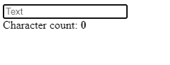

# 如何在 Vue 中获取输入值

> 原文：<https://javascript.plainenglish.io/vue-get-input-value-206d5adc832c?source=collection_archive---------1----------------------->

## 了解如何获取输入字段的值，以便在 Vue 中执行操作或显示信息。


在通过文本字段接受用户输入后，必须有一种方法来检索数据并对其进行处理。在本文中，我们将学习如何在 Vue 中轻松获取输入字段的值。

# v-model 指令

为了在 Vue 中获得输入值，我们可以使用`v-model`指令在值和变量之间建立双向绑定。

例如:

```
<template>
  <div id="app">
    <input
      type="text"
      v-model="text"
      placeholder="Text"
    />
    <br />
    You typed: <b>{{ text }}</b>
  </div>
</template><script>
export default {
  data() {
    return {
      text: '',
    };
  },
};
</script>
```

每当用户改变输入域中的文本时，`text`变量就会自动更新。然后我们可以使用这个变量来执行一个动作或显示信息。在这个例子中，我们只是在它下面显示输入的值。


# 使用带有输入值的 Vue 计算属性

我们可以使用一个计算属性来显示从该值派生的信息，而不是只显示输入字段中的值。

例如，我们可以显示该值的字符数:

```
<template>
  <div id="app">
    <input
      type="text"
      v-model="text"
      placeholder="Text"
    />
    <br />
    Character count: <b>{{ count }}</b>
  </div>
</template><script>
export default {
  data() {
    return {
      text: '',
    };
  },
  computed: {
    // Computed property named "count", depending on the
    // "text" variable
    count() {
      return this.text.length;
    },
  },
};
</script>
```



Displaying the number of characters the input value has

# 如何在更改时获取输入值

我们可以为`input`组件的`input`事件创建一个处理程序，以便在输入值发生变化时执行一个操作。我们可以使用`v-on`指令(`v-on:input`)来监听事件，该指令可以缩写为`@`符号(`@input`)。

在下面的例子中，我们使用`input`事件在开发人员控制台中记录新的输入值。

```
<template>
  <div id="app">
    <input
      type="text"
      v-model="text"
      placeholder="Text"
      @input="handleInput"
    />
    <br />
  </div>
</template><script>
export default {
  data() {
    return {
      text: '',
    };
  },
  methods: {
    handleInput(event) {
      console.log(event.target.value);
    },
  },
};
</script>
```


Logging the input value to the console on change

我们还可以通过`input`事件来实现输入字段值和变量之间的自定义单向绑定。代替`v-model`，我们可以使用`value`道具手动设置输入中的文本。

在下面的例子中，我们使用`input`事件和`value`属性来分隔输入字段中输入的卡号的数字，并提供更好的用户体验。

```
<template>
  <div id="app">
    <input
      type="text"
      :value="cardNo"
      placeholder="Card number"
      @input="handleInput"
      @keypress="handleKeyPress"
    />
    <br />
  </div>
</template><script>
export default {
  data() {
    return {
      cardNo: '',
    };
  },
  methods: {
    handleInput(event) {
      this.cardNo = event.target.value
        // Remove spaces from previous value
        .replace(/\s/g, '')
        // Add a space after every set of 4 digits
        .replace(/(.{4})/g, '$1 ')
        // Remove the space after the last set of digits
        .trim();
    },
    handleKeyPress(event) {
      const num = Number(event.key);
      const value = event.target.value;
      // Only allow 16 digits
      if ((!num && num !== 0) || value.length >= 16 + 3) {
        event.preventDefault();
      }
    },
  },
};
</script>
```


Spacing out the entered card number

# 如何用 Ref 获取输入值

在大多数情况下，`v-model`和`@input` / `value`足以读取或更新输入字段的值。但是，我们也可以使用`ref`属性来获取输入值。我们可以在任何 DOM 元素上设置这个属性，并使用 Vue 实例的`$refs`属性来访问表示元素的对象。

例如:

```
<template>
  <div id="app">
    <!-- Create new ref by setting "ref" prop -->
    <input
      type="text"
      placeholder="Text"
      ref="inputField"
    />
    <button @click="handleShout">Shout</button>
    <br />
    <b>{{ shout }}</b>
  </div>
</template><script>
export default {
  data() {
    return {
      shout: '',
    };
  },
  methods: {
    handleShout() {
      // Access ref with "$refs" property
      const message = this.$refs.inputField.value;
      this.shout = `${message.toUpperCase()}!!!`;
    },
  },
};
</script>
```


*最初发表于:*[*【codingbeautydev.com】*](https://cbdev.link/90e2c9)

# JavaScript 做的每一件疯狂的事情

一本关于 JavaScript 微妙的警告和鲜为人知的部分的迷人指南。


[**报名**](https://cbdev.link/d3c4eb) 立即免费领取一份。