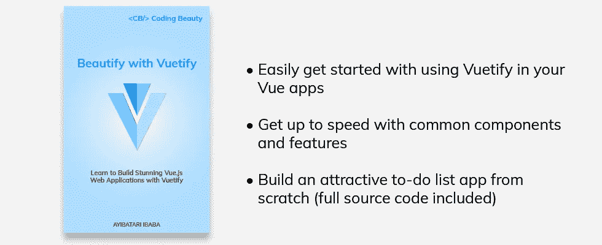

# 如何在 Vue 中检测鼠标悬停

> 原文：<https://javascript.plainenglish.io/vue-hover-c8b8eb786814?source=collection_archive---------4----------------------->

## 检测鼠标在元素上的移动，以自定义其外观，或者当用户悬停在元素上时显示其他元素。


当用户用鼠标悬停在 UI 元素上时，想要检测是很常见的。然后我们可以定制元素的外观，或者当鼠标在元素上时显示其他元素。

# 悬停时设置元素样式

有了 CSS，我们可以用`:hover`伪类轻松定制悬停时元素的外观:

```
.element {
  background: blue;
}.element:hover {
  background: lightblue;
}
```

当用户将鼠标悬停在具有`element`类的元素上时，它会将该元素的背景色更改为`lightblue`。

但是 Vue.js 没有内置的悬停检测功能，所以我们必须通过使用状态变量和监听元素上的特定事件来自己实现它。

为了检测鼠标何时悬停在一个元素上，我们将监听`mouseenter`事件。为了检测鼠标何时停止悬停在元素上，我们将监听`mouseleave`事件。

**注意**:虽然我们也可以监听`mouseover`事件来检测悬停，但是这个事件是在 DOM 树中的一个元素和它的每一个祖先元素上触发的(即它冒泡)，这可能会在深层层次结构中导致严重的性能问题。不会起泡，所以我们可以放心使用。

我们将使用一个变量来跟踪元素的悬停状态:

```
<template>
  <div
    @mouseenter="hover = true"
    @mouseleave="hover = false"
  ></div>
</template><script>
export default {
  data() {
    return {
      hover: false,
    };
  },
};
</script>
```

然后，我们可以使用该变量有条件地向元素添加类，以改变悬停时的外观:

```
<template>
  <div
    @mouseenter="hover = true"
    @mouseleave="hover = false"
    class="div"
    :class="{ 'div-hover': hover }"
  ></div>
</template><script>
export default {
  data() {
    return {
      hover: false,
    };
  },
};
</script><style>
.div {
  background-color: blue;
  width: 200px;
  height: 100px;
}.div-hover {
  background-color: yellow;
}
</style>
```


# 悬停时显示其他元素

我们还可以在检测到鼠标悬停时显示其他元素。例如，我们可以显示一个工具提示来显示关于元素的更多信息。

我们可以通过将状态变量传递给附加到元素的 v-if 指令，在悬停时显示另一个元素:

```
<template>
  <button
    @mouseenter="hover = true"
    @mouseleave="hover = false"
    class="div"
    :class="{ 'div-hover': hover }"
  >
    Button
  </button>
  <p v-if="hover">Tooltip</p>
</template><script>
export default {
  data() {
    return {
      hover: false,
    };
  },
};
</script>
```


# 用美化来美化

使用 Vuetify 材料设计框架创建优雅 web 应用程序的完整指南。



在 这里免费获得一份 [**。**](https://mailchi.mp/583226ee0d7b/beautify-with-vuetify)

# 检测 Vue.js 组件上的悬停

我们还可以使用`mouseenter`和`mouseleave`方法来检测自定义 Vue.js 组件上的悬停。

**组件/样式按钮. vue**

```
<template>
  <div>
    <button>Styled button</button>
  </div>
</template><style>
button {
  height: 30px;
  width: 100px;
  background-color: lightgreen;
}
</style>
```

**App.vue**

```
<template>
  <styled-button
    @mouseenter="hover = true"
    @mouseleave="hover = false"
  ></styled-button>
  <p v-if="hover">Tooltip</p>
</template><script>
import StyledButton from './components/StyledButton.vue';export default {
  components: {
    StyledButton,
  },
  data() {
    return {
      hover: false,
    };
  },
};
</script>
```


**注意**:如果你使用的是 Vue 2.x，你需要使用`.native`事件修改器来监听 Vue.js 组件上的本地 DOM 事件:

```
<styled-button
  @mouseenter.native="hover = true"
  @mouseleave.native="hover = false"
></styled-button>
```

# 结论

虽然 Vue.js 没有内置的悬停检测支持，但是我们可以通过监听`mouseenter`和`mouseleave`事件并更改这些事件的处理程序中的布尔状态变量的值来实现它。

*更新于:*[*codingbeautydev.com*](https://codingbeautydev.com/blog/vue-hover/)*。*

# 订阅编码美容时事通讯

每周获取新的网站开发技巧和教程。


[**订阅**](https://codingbeautydev.com/newsletter)