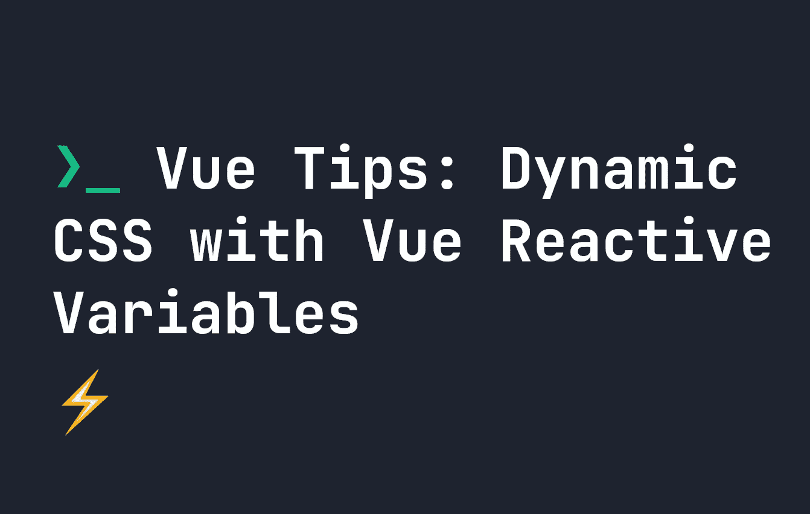

# Vue.js 提示:带有 Vue.js 反应变量的动态 CSS

> 原文：<https://javascript.plainenglish.io/vue-js-tips-dynamic-css-with-vue-js-reactive-variables-d48520704f8c?source=collection_archive---------11----------------------->

## 关于如何用 Vue 3 的组合 API 将 JavaScript 变量直接放入 CSS 的指南。



如果你使用 Vue.js，你可能习惯于根据代码中的逻辑对标签应用不同的类。这是因为我们可能希望根据特定条件被动地更新元素的类。例如，假设一个变量`check`被设置为 true，我们希望一个`div`显示为**红色**，否则，它应该是**蓝色**。对于这样的用例，通常会看到以下代码:

```
<div :class="check === true ? 'red' : 'blue'">
    Hello World
</div>
```

然而，你知道吗，你可以用 Vue 3 把 Vue.js 反应变量直接放在你的 CSS 中？我们必须使用 composition API ( [阅读更多:composition 和 options API 的区别](https://fjolt.com/article/vue-composition-api-vs-options-api))，但是一旦我们这样做了，我们就可以避免下面的代码，直接将变量放在我们的 CSS 中。

**我们来看一个简单的例子**。假设我们的 Vue.js 模板中有以下脚本:

```
<script setup>
import { ref } from 'vue'const check = true;
let color = ref('#ff0000');if(check == true) {
  color.value = '#0000ff';
}
</script>
<template>
  <input value="Hello World" />
</template>
```

简单吧？如果`check`为`true`，则`color`变量为“`#0000ff`”。否则就是“`#ff0000`”。在我们的 CSS 中，有了 Vue 3，我们现在可以通过使用`v-bind`直接引用`color`:

```
<style>
  input {
    color: v-bind(color)
  }
</style>
```

现在，如果`color`被动更新，输入的`color`将改变为`color`变量设置的值。这意味着你可以在 HTML 标签中避免一些笨拙的逻辑，并开始在 CSS 中直接使用 JavaScript 变量——我认为这很酷。

*更多内容请看*[***plain English . io***](https://plainenglish.io/)*。报名参加我们的* [***免费周报***](http://newsletter.plainenglish.io/) *。关注我们关于*[***Twitter***](https://twitter.com/inPlainEngHQ)[***LinkedIn***](https://www.linkedin.com/company/inplainenglish/)*[***YouTube***](https://www.youtube.com/channel/UCtipWUghju290NWcn8jhyAw)*[***不和***](https://discord.gg/GtDtUAvyhW) *。***