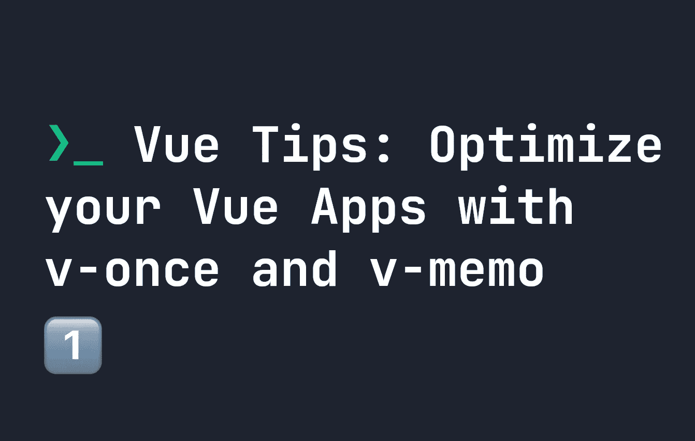

# Vue.js 提示:用“v-once”和“v-memo”优化你的 Vue.js 应用

> 原文：<https://javascript.plainenglish.io/vue-js-tips-optimize-your-vue-js-apps-with-v-once-and-v-memo-be7fb931e746?source=collection_archive---------8----------------------->

## “v-once”和“v-memo”如何提供有用和直观的方法来减少重复渲染和优化代码。



Vue.js 就像我们在网络上使用的任何其他工具一样——你的收获将取决于你如何使用它。如果你写的代码优化的很差，你仍然会得到一个很慢的网站，即使 Vue.js 有很多技巧来尝试提高性能。因此，今天我们将看看如何使用两个鲜为人知的 Vue HTML 属性`v-once`和`v-memo`来优化性能。这两者都允许我们优化组件或组件树何时被重新渲染。

这两个属性实际上并不经常使用，但是它们在一系列不同的情况下非常有用。在本指南中，我希望我能够让您了解每种方法的作用，以便您可以在下一个 Vue.js 项目中使用它们。

# v-once in Vue.js

当一个反应元素更新时，Vue.js 会相应地更新你的 DOM 和任何 [CSS Vue 变量](https://fjolt.com/article/vue-tips-dynamic-styles)。但是，如果您知道某个东西应该只渲染一次，那么您可以直接告诉 Vue.js，这样它就永远不会更新 DOM 树的那个部分。为此，我们使用了神奇的属性`v-once`。让我们看一个例子，我在一个`<h1>`标签上使用了`v-once`:

```
<script setup>
import { ref } from 'vue'let message = ref("Hello World")let updateMessage = () => {
    message.value = 'Goodbye World'
}
</script><template>
    <h1 v-once>{{message}}</h1>
    <input :value="message" />
    <button @click="updateMessage">
        Update Message
    </button>
</template>
```

这里，我们有一个名为`message`的反应变量，设置为 **Hello World** ，可以通过点击按钮更新为 **Goodbye World** 。我们在我们的`h1`头中使用这个`message`变量，并将其作为我们的`input`的值。

尽管点击按钮会更新`input`的值，但是`h1`仍然会有旧的 **Hello World** 文本，因为它有属性`v-once`。本质上，`h1`只渲染一次，不会再更新。这对于在某些地方使用变量并让它们更新非常有用，但在其他地方则不然。这对优化你的代码也很有帮助！这也适用于在`<h1>`或其子结构中提到的任何变量——整个结构只呈现一次。

`v-once`几乎可以在任何地方使用——包括在`v-for`循环中——这使得它在 Vue.js 中普遍有用。

# 虚拟备忘录

`v-memo`有点类似于`v-once`，但是它给了我们更多的灵活性。在`v-memo`中，我们可以定义一个变量数组，如果它们更新了，我们将重新呈现这个元素和其中的任何标签。这甚至适用于 HTML 标记中没有提到的变量——所以我们也可以使用这种方法强制重新呈现。

这样做的好处是，如果我们遇到多个变量总是同时更新的情况，我们可以避免多次重新渲染。让我们看看我们用于`v-once`的代码的修改版本。在这里，我们现在有两个变量- `message`和`question`。每次更新都是通过点击不同的按钮实现的——一个是问题按钮，一个是信息按钮。我在`<h1>`标签上使用`v-memo`只是为了更新它，如果`message`更新:

```
<script setup>
import { ref } from 'vue'let message = ref("Hello World")
let question = ref("How are you?")let updateMessage = () => {
  message.value = 'Goodbye World'
}
let updateQuestion = () => {
  question.value = 'What is your name?'
}
</script><template>
  <h1 v-memo="[ message ]">{{message}} - {{question}}</h1>
  <button @click="updateMessage">
    Update Message
  </button>
  <button @click="updateQuestion">
    Update Question
  </button>
</template>
```

如果我们点击**更新问题**按钮，用户不会有任何改变，因为`v-memo`只关注`message`的变化，而不是`question`的变化——但是`question`变量仍然会在后台更新。**然而**，如果我们点击**更新消息**按钮，那么`<h1>`将立即更新，因为我们已经告诉`v-memo`仅在变量发生变化时更新。

这是一个非常巧妙的优化技巧，但它还有其他用途。例如，只有在代码中满足特定条件时，才可以更新元素和其中的所有元素/变量。唯一需要注意的是你不能在`v-for`循环中使用`v-memo`——所以这是需要注意的。

通过将变量添加到`v-memo`中的数组对象，可以为`v-memo`定义多个变量，如下所示:

```
<h1 v-memo="[ message, question ]"></h1>
```

有趣的是，传入一个空数组使得`v-memo`和`v-once`的工作方式相同😄：

```
<h1 v-memo="[]"></h1>
```

# 结论

我希望你喜欢这个 Vue.js 技巧，以及`v-once`和`v-memo`的概述。这两个属性都非常有用，我希望你能在下一个 Vue.js 项目中找到使用它们的方法。要了解更多 Vue.js 内容，你可以点击这里查看我在我的博客上写的其他文章:

[](https://fjolt.com/category/vue) [## Fjolt - Vue

### Vue 的内容和教程

fjolt.com](https://fjolt.com/category/vue) 

*更多内容请看*[***plain English . io***](https://plainenglish.io/)*。报名参加我们的* [***免费周报***](http://newsletter.plainenglish.io/) *。关注我们关于*[***Twitter***](https://twitter.com/inPlainEngHQ)[***LinkedIn***](https://www.linkedin.com/company/inplainenglish/)*[***YouTube***](https://www.youtube.com/channel/UCtipWUghju290NWcn8jhyAw)*[***不和***](https://discord.gg/GtDtUAvyhW) *。***