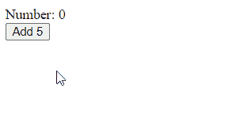

# 如何使用 Vue 方法:简单指南

> 原文：<https://javascript.plainenglish.io/vue-methods-5f5ebb6148aa?source=collection_archive---------2----------------------->


Vue 方法是一个与每个 Vue 实例相关联的函数，用`methods`属性创建。当用户与元素交互时，我们可以使用它们来执行某些操作，比如单击按钮，或者在文本输入中输入数据。请继续阅读，了解更多关于如何定义和使用 Vue 方法的信息。

# 创建 Vue 方法

为了创建一个方法，我们将一个对象分配给 Vue 实例的 method 属性。传递的对象的每个键对应一个方法名。

```
<script>
export default {
  methods: () => ({
    handleClick: () => {
      alert('You clicked the button.');
    },
    handleChange: () => {
      console.log('Text input changed');
    },
  }),
};
</script>
```

这是 JavaScript，所以我们可以使用 ES 2015 中引入的更短的方法定义语法:

```
<script>
export default {
  methods: {
    handleClick() {
      alert('You clicked the button.');
    },
    handleInput() {
      console.log('Text input changed');
    },
  },
};
</script>
```

# 调用方法

为了用一个方法处理一个事件，我们将它传递给一个附加在元素上的`v-on`指令。例如:

```
<template>
  <div>
    <button v-on:click="handleClick">Click me</button>
    <input v-on:input="handleInput" />
  </div>
</template><script>
export default {
  methods: {
    handleClick() {
      alert('You clicked the button.');
    },
    handleInput() {
      console.log('Text input changed');
    },
  },
};
</script>
```

我们也可以使用`@`符号来简化语法:

```
<template>
  <div>
    <button @click="handleClick">Click me</button>
    <input @input="handleInput" />
  </div>
</template><script>
export default {
  methods: {
    handleClick() {
      alert('You clicked the button.');
    },
    handleInput() {
      console.log('Text input changed');
    },
  },
};
</script>
```

# 从 Vue 方法访问数据

我们可以用`this.{propertyName}`访问一个数据属性，其中 propertyName 是从`data()`方法返回的一个属性的名称。例如:

```
<template>
  <div>Num: {{ num }}</div>
  <button @click="addOne">Add 1</button>
</template><script>
export default {
  data() {
    return {
      num: 0,
    };
  },
  methods: {
    addOne() {
      this.num++;
    },
  },
};
</script>
```


# 将参数值传递给 Vue 方法

Vue 方法可以像普通的 JavaScript 函数一样接受参数。我们可以通过使用参数值直接在模板中调用方法来传递参数:

```
<template>
  <div>Number: {{ num }}</div>
  <button @click="add(5)">Add 5</button>
</template><script>
export default {
  data() {
    return {
      num: 0,
    };
  },
  methods: {
    add(amount) {
      this.num += amount;
    },
  },
};
</script>
```



# 结论

我们可以通过向`methods`属性传递一个对象来定义 Vue 实例上的方法。Vue 方法类似于 JavaScript 函数，允许我们为我们的 Vue 应用添加交互性。

# 订阅编码美容简讯

每周获取新的 web 开发技巧和教程。


[**订阅**](https://codingbeautydev.com/newsletter/)