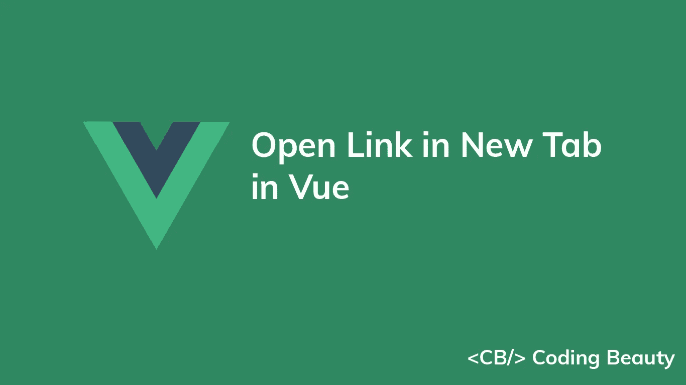

# 如何在 Vue 的新标签页中打开链接

> 原文：<https://javascript.plainenglish.io/vue-open-link-in-new-tab-6d4cbc009f0e?source=collection_archive---------4----------------------->



要在 Vue 的新标签页中打开一个链接，创建一个 anchor ( `<a>`)元素，并将其`target`属性设置为`_blank`，例如，`<a href="https://codingbeautydev.com" target="_blank"></a>. The _blank`值指定该链接应该在新标签页中打开。

`App.vue`

```
<template>
  <div id="app">
    <a
      href="https://codingbeautydev.com"
      target="_blank"
      rel="noopener noreferrer"
    >
      Coding Beauty
    </a> <br /><br /> <a
      href="https://codingbeautydev.com/blog"
      target="_blank"
    >
      Coding Beauty Blog
    </a>
  </div>
</template>
```

锚元素的`target`属性指定在哪里打开链接的文档。默认情况下，`target`的值为`_self`，这使得链接的页面在它被点击的同一个框架或标签中打开。为了在新的标签页中打开页面，我们将`target`设置为`_blank`。

出于安全目的，我们还将`rel`属性设置为`noreferrer`。它可以防止打开的页面获得任何关于打开它的页面的信息。


# 单击按钮时在新标签中打开链接

有时我们更喜欢点击按钮而不是链接来打开新标签页。

要在单击按钮时打开新标签页中的链接，创建一个`button`元素并设置一个调用`window.open()`方法的`click`事件监听器。

`App.vue`

```
<template>
  <div id="app">
    <p>
      Click this button to visit Coding Beauty in a new tab
    </p> <button
      role="link"
      @click="openInNewTab('https://codingbeautydev.com')"
    >
      Click
    </button>
  </div>
</template><script>
export default {
  methods: {
    openInNewTab(url) {
      window.open(url, '_blank', 'noreferrer');
    },
  },
};
</script>
```


我们使用`window`对象的 [open()](https://developer.mozilla.org/en-US/docs/Web/API/Window/open) 方法以编程方式在新标签页中打开一个链接。该方法有三个可选参数:

1.  `url`:要在新标签页中打开的页面的 URL。
2.  `target`:和`<a>`元素的`target`属性一样，该参数的值指定了链接文档的打开位置，即浏览上下文。它接受`<a>`元素的`target`属性接受的所有值。
3.  `windowFeatures`:以逗号分隔的窗口功能选项列表。`noreferrer`就是这些选项之一。

将`_blank`传递给`target`参数会使链接在新标签页中打开。

当按钮被点击时，事件监听器被调用，事件监听器又调用`window.open()`，它在一个新的选项卡中打开指定的链接。

*原载于*【codingbeautydev.com】

# *JavaScript 做的每一件疯狂的事情*

*一本关于 JavaScript 微妙的警告和鲜为人知的部分的迷人指南。*

**

*[**报名**](https://cbdev.link/d3c4eb) 立即免费领取一份。*