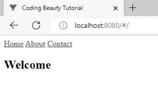
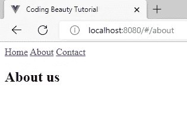
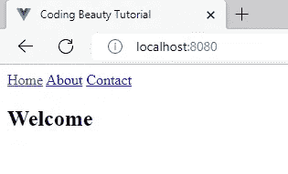
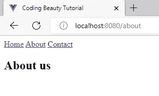

# 如何在 Vue 路由器中删除 URL 中的哈希

> 原文：<https://javascript.plainenglish.io/vue-router-remove-hash-a7d9ac8f9c06?source=collection_archive---------8----------------------->

## 了解如何在 Vue 路由器中轻松删除 URL 中的哈希字符。


要从 Vue 3 中的 Vue 路由器的 URL 中删除哈希，将`createRouter()`中的`history`选项设置为`createWebHistory()`的结果。

`main.js`

```
const router = VueRouter.createRouter({
  history: VueRouter.createWebHistory(),
  ...
});
```

如果你使用的是 Vue 2，在`VueRouter()`构造函数中将`mode`选项设置为`'history'`。

`main.js`

```
const router = new VueRouter({
  mode: 'history',
  ...
});
```

# 从 Vue 3 和 Vue 路由器 4 中的 URL 中删除哈希

这是一个样例 Vue 3 应用程序，其中我们使用了 Vue Router 4。

`main.js`

```
import { createApp } from 'vue';
import { createRouter } from 'vue-router';
import App from './App.vue';
import HomePage from '@/views/HomePage.vue';
import ContactPage from '@/views/ContactPage.vue';
import AboutPage from '@/views/AboutPage.vue';const app = createApp(App);const routes = [
  { path: '/', component: HomePage },
  { path: '/about', component: AboutPage },
  { path: '/contact', component: ContactPage },
];const router = createRouter({
  routes,
});app.use(router);app.mount('#app');
```

`App.vue`

```
<template>
  <div id="app">
    <router-link to="/">Home</router-link>{{ ' ' }}
    <router-link to="/about">About</router-link>{{ ' ' }}
    <router-link to="/contact">Contact</router-link>
    <router-view></router-view>
  </div>
</template>
```

`views/HomePage.vue`

```
<template>
  <div><h2>Welcome</h2></div>
</template>
```

`views/AboutPage.vue`

```
<template>
  <div><h2>About us</h2></div>
</template>
```

`views/ContactPage.vue`

```
<template>
  <div><h2>Contact us</h2></div>
</template>
```

这是此 web 应用程序的主页外观:



There is a hash character before the index route path.

可以看到页面的 URL 中的索引路径(`/`)前有一个哈希字符(`#`)。这是因为 Vue 路由器使用哈希历史模式来表示不同路由的 URL。在哈希模式下，在路由路径之前放置一个哈希字符，这可以防止在单击路由器链接时重新加载页面。



There is a hash character before the “/about” route path.

`vue-router`中的`createRouter()`函数创建一个路由器实例，供 Vue 应用程序使用。我们可以向函数传递一个带有一堆选项的对象来定制路由器的行为。

`main.js`

```
import { createApp } from 'vue';
import { createRouter, createWebHistory } from 'vue-router';
import App from './App.vue';
import HomePage from '@/views/HomePage.vue';
import ContactPage from '@/views/ContactPage.vue';
import AboutPage from '@/views/AboutPage.vue';const app = createApp(App);const routes = [
  { path: '/', component: HomePage },
  { path: '/about', component: AboutPage },
  { path: '/contact', component: ContactPage },
];// 👇
const router = createRouter({
  history: createWebHistory(),
  routes,
});app.use(router);app.mount('#app');
```

将`history`选项设置为来自`vue-router`的`createWebHistory()`函数的结果会将路由器从哈希历史模式切换到 HTML5 历史模式。这将从 URL 中删除哈希。



There is no hash character before the index route path.



There is no hash character before the “/about” route path.

# 从 Vue 2 和 Vue 路由器 3 中的 URL 中删除哈希

Vue 2 应用使用 Vue 路由器 3，因此路由器初始化逻辑会有所不同。

你的`main.js`文件现在可能是这样的:

`main.js`

```
import Vue from 'vue';
import App from './App.vue';
import VueRouter from 'vue-router';
import HomePage from '@/views/HomePage.vue';
import ContactPage from '@/views/ContactPage.vue';
import AboutPage from '@/views/AboutPage.vue';Vue.config.productionTip = false;
Vue.use(VueRouter);const routes = [
  { path: '/', component: HomePage },
  { path: '/about', component: AboutPage },
  { path: '/contact', component: ContactPage },
];const router = new VueRouter({
  routes,
});new Vue({
  router,
  render: (h) => h(App),
}).$mount('#app');
```

这里我们使用一个`VueRouter()`构造函数来创建一个新的路由器实例。像`createRouter()`一样，我们可以通过一组选项来定制它的行为。要从哈希历史模式切换到 HTML5 历史模式并从 URL 中删除哈希，请将`mode`选项设置为`'history'`。

`main.js`

```
import Vue from 'vue';
import App from './App.vue';
import VueRouter from 'vue-router';
import HomePage from '@/views/HomePage.vue';
import ContactPage from '@/views/ContactPage.vue';
import AboutPage from '@/views/AboutPage.vue';Vue.config.productionTip = false;
Vue.use(VueRouter);const routes = [
  { path: '/', component: HomePage },
  { path: '/about', component: AboutPage },
  { path: '/contact', component: ContactPage },
];// 👇
const router = new VueRouter({
  mode: 'history',
  routes,
});new Vue({
  router,
  render: (h) => h(App),
}).$mount('#app');
```

*原载于*【codingbeautydev.com】

# *JavaScript 做的每一件疯狂的事情*

*一本关于 JavaScript 微妙的警告和鲜为人知的部分的迷人指南。*

**

*[**报名**](https://cbdev.link/d3c4eb) 立即免费领取一份。*