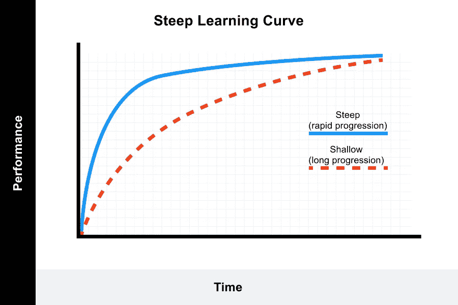

# Vue 的合成 API 有严重的问题

> 原文：<https://javascript.plainenglish.io/vues-composition-api-has-serious-issues-4ce71a0a1f36?source=collection_archive---------1----------------------->

Source: energepic.com

上个月，我发表了一篇[有争议的文章](https://medium.com/p/999bb8c556bf)，其中我讨论了许多使用 Vue 编写和扩展 web 应用程序的缺点。

许多回复都提到了新的**组合 API** 作为这些问题的潜在解决方案。我承认当我写这篇文章时，我对它只是一知半解，所以我决定对它进行更彻底的研究。

一开始看起来很有希望。旨在简化逻辑重用和改进 TypeScript 支持的复合 API 在概念上让我想起了 React 钩子。事实上，Vue 团队说钩子是组合 API 的一个很大的灵感来源。

我相信它和 Hooks 的相似性意味着我可以很快学会新的 API，并且会像我喜欢 Hooks 一样喜欢它。**我在这两方面都错了。**

但是在我讨论这些问题之前，我将试图为组合 API 及其动机辩护。

# 混血儿…很乱

在旧版本的 Vue 中，在组件之间重用逻辑的唯一方式是 mixin。Mixins 允许您定义方法、计算属性和其他可重用的代码，您可以通过简单的导入从任何组件调用这些代码。

起初，这似乎是一个好的解决方案，但是 mixins 有一些严重的缺陷。基本上，将大量代码混合在一起创建一个组件只会导致一片混乱。

为了解决逻辑重用的问题，React 引入了函数组件和 Hooks API，而不是 mixins，React 社区立即接受了这些组件。

Vue 的最新解决方案是 Composition API，它从 Hooks 中汲取了大量灵感。高级方法是相同的——创建可以从任何组件导入并使用的少量反应式逻辑，就好像该逻辑是组件本身固有的一样。

我真的很乐观，这个新的 API 将解决 Vue 的主要问题。的确，在很大程度上……但是它也创造了更多的问题。

# 学起来不容易

Source: valamis.com

你可能会认为受 Hooks 启发的 API 对喜欢 Hooks 的开发人员来说很熟悉。从高层次来看，的确如此。但是经过更深入的研究，我清楚地认识到这两个 API 是根本不同的。

我学习 Composition API 的第一个小时，充满了迷茫和挫败感。我很快意识到，因为 Vue 具有真正的反应能力 React 所缺乏的——这个新的 API 需要一个与 Hooks 完全不同的心智模型。

更重要的是，尽管 React 只有几个基本的钩子，但 Composition API 引入了无数不同的实用函数，用于创建反应变量、监视这些变量、基于这些变量进行计算，以及在组件生命周期的不同点运行代码。

例如，创建反应变量有两种方法:`ref`和`reactive`。有什么区别？`reactive`不能控制原语，而`ref`可以控制原语和原语，但是`ref`没有深度反应。此外，你要负责跟踪哪些变量是反应性的，以及它们是否是深度反应性的。

另一方面，React 只有一个钩子和一个非常简单的 API 来实现这个目的:`useState`。(`useReducer`也有，但是`useState`在大多数情况下都是你需要的。)

如果想在复合 API 中观察一个反应性变量怎么办？您可以使用`watch`，它可以观察 refs、reactive 对象或 getter (computed)函数——但是要观察 reactive 对象的属性，您需要使用 getter 函数。如果您想在反应变量改变时立即运行副作用*和*，您需要使用`watchEffect`。

React 的对应版本是`useEffect`，它也有一些令人困惑的怪癖，但公开了一个简单得多的 API。

现在也有三种完全不同的方式来定义 Vue 组件:选项 API、带有`setup()`函数的组合 API 和带有神奇的`<script setup>`简写的组合 API。这意味着你必须做出更多的决定，这些决定可能会导致不一致或者将来后悔。

因此，虽然组合 API 确实提供了大量的灵活性和实用性，但它也引入了复杂性和陡峭的学习曲线。

但是有些人会——而且许多人已经这样做了——公开接受这个新的 API。这很好。当掌握后，我确信它和钩子一样强大。

这里更大的担忧是这一切对 Vue 的未来意味着什么。

# 分裂的房子

组合 API 在很大程度上解决了它想要解决的许多问题。然而许多 Vue 开发者仍然拒绝采用它。他们认为，对于他们的用例来说，它的好处根本不值得学习曲线和增加复杂性的成本。那些采用它的人通常只是部分采用，而让他们的许多组件使用 Options API。

所以，Vue 有点分裂了。一方是开发人员，他们喜欢它简单的选项 API，认为很少或没有必要采用一个 API 来解决他们没有的问题。

另一方面，开发人员迫切需要更大的可伸缩性和改进的 TypeScript 支持，并将复合 API 视为更现代的反应式 UI 开发方法。

并且都想使用同一个库。

目前，以及在可预见的未来，这是可能的。这两种 API 都受支持，并且在同一个项目中兼容。

但是一个分裂的家庭是站不住脚的。当 React 发布 Hooks 时，很明显这是 React 团队希望库走的方向——而且(几乎)每个人都喜欢它。那些不只是离开反应为其他图书馆如 Vue。

然而，Vue 的团队似乎不确定他们想要什么。从长远来看，继续支持和开发两种完全不同的 API 是不可持续的。

当然，这些都不意味着 Vue 注定要失败。相反，这是尤雨溪和他的公司为 Vue 书写新的前进道路的黄金机会。但很难想象有哪一个不会让很多人不高兴。

*更多内容请看*[***plain English . io***](https://plainenglish.io/)*。报名参加我们的* [***免费周报***](http://newsletter.plainenglish.io/) *。关注我们关于*[***Twitter***](https://twitter.com/inPlainEngHQ)*和*[***LinkedIn***](https://www.linkedin.com/company/inplainenglish/)*。查看我们的* [***社区不和谐***](https://discord.gg/GtDtUAvyhW) *加入我们的* [***人才集体***](https://inplainenglish.pallet.com/talent/welcome) *。*