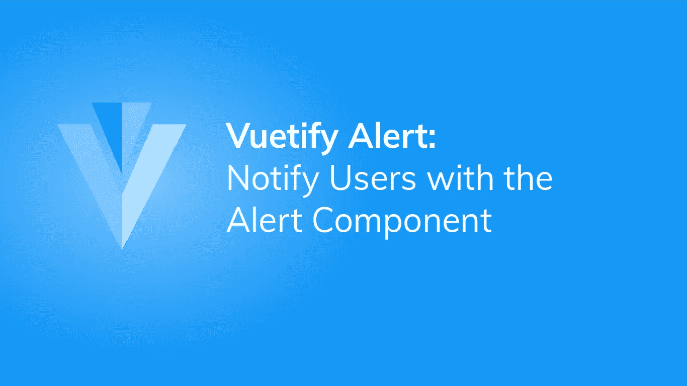
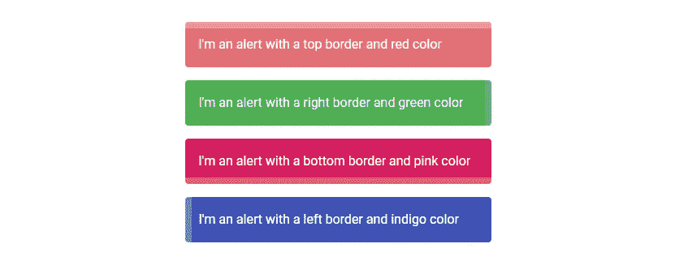
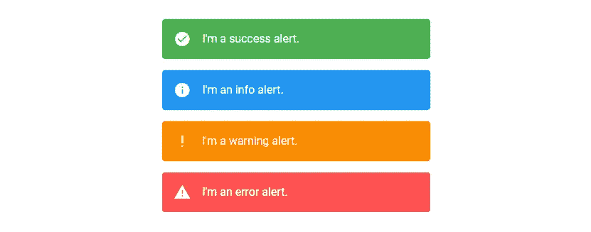

# 提醒:如何通知用户提醒

> 原文：<https://javascript.plainenglish.io/vuetify-alert-f71024cecb62?source=collection_archive---------21----------------------->



我们通过使用上下文相关的[图标](https://codingbeautydev.com/blog/vuetify-icons/)和[颜色](https://codingbeautydev.com/blog/vuetify-colors/)来将重要信息传递给用户。[图标](https://codingbeautydev.com/blog/vuetify-icons/)和[颜色](https://codingbeautydev.com/blog/vuetify-colors/)与其传达给用户的信息类型相匹配。在本文中，我们将学习如何创建和定制警报通知。

# 虚拟警报组件

Vuetify 提供了用于创建警报的`v-alert`组件:

```
<template>
  <v-app>
    <div class="d-flex justify-center ma-4">
      <v-alert> Alert Component </v-alert>
    </div>
  </v-app>
</template><script>
export default {
  name: 'App',
};
</script>
```

使用没有任何道具的`v-alert`创建一个包含文本的简单警告，没有任何[颜色](https://codingbeautydev.com/blog/vuetify-colors/)，边框或者[图标](https://codingbeautydev.com/blog/vuetify-icons/):


# 警告颜色

`v-alert`的`color`道具允许我们自定义一个告警组件的[颜色](https://codingbeautydev.com/blog/vuetify-colors/)。

```
<template>
  <v-app>
    <div class="d-flex justify-center ma-4">
      <v-col sm="6">
        <v-alert color="indigo" dark> Alert Component </v-alert>
      </v-col>
    </div>
  </v-app>
</template><script>
export default {
  name: 'App',
};
</script>
```


# 警告边框

`border`道具为警报的四个边中的一个添加了边框。每边有四个可能的值:`top`、`bottom`、`left`和`right`。

```
<template>
  <v-app>
    <div class="d-flex justify-center ma-4">
      <v-col sm="6">
        <v-alert border="top" color="red lighten-2" dark>
          I'm an alert with a top border and red color
        </v-alert>
        <v-alert border="right" color="green" dark>
          I'm an alert with a right border and green color
        </v-alert>
        <v-alert border="bottom" color="pink darken-1" dark>
          I'm an alert with a bottom border and pink color
        </v-alert>
        <v-alert border="left" color="indigo" dark>
          I'm an alert with a left border and indigo color
        </v-alert>
      </v-col>
    </div>
  </v-app>
</template><script>
export default {
  name: 'App',
};
</script>
```



# 用美化来美化

使用 Vuetify 材料设计框架创建优雅 web 应用程序的完整指南。


在这里 免费获得一份 [**。**](https://mailchi.mp/583226ee0d7b/beautify-with-vuetify)

# 彩色边框

`colored-prop`将移除警告背景以强调边框，其[颜色](https://codingbeautydev.com/blog/vuetify-colors/)设置为`color`属性的值:

```
<template>
  <v-app>
    <div class="d-flex justify-center ma-4">
      <v-col sm="6">
        <v-alert border="left" color="indigo" colored-border elevation="2">
          An alert with a colored border
        </v-alert>
      </v-col>
    </div>
  </v-app>
</template><script>
export default {
  name: 'App',
};
</script>
```


# 密集警报

将`dense`支柱设置到`v-alert`上的`true`将通过降低其高度使其更加紧凑。

```
<template>
  <v-app>
    <div class="d-flex justify-center ma-4">
      <v-col sm="6">
        <v-alert dense type="info">
          Dense alert of type info
        </v-alert>
      </v-col>
    </div>
  </v-app>
</template><script>
export default {
  name: 'App',
};
</script>
```


当设置了`border`时，边框厚度将减小，以保持与密集样式一致:

```
<template>
  <v-app>
    <div class="d-flex justify-center ma-4">
      <v-col sm="6">
        <v-alert dense type="info" border="right">
          Dense alert of type info
        </v-alert>
      </v-col>
    </div>
  </v-app>
</template><script>
export default {
  name: 'App',
};
</script>
```


# 可解除警报

`dimissable` prop 在 alert 组件的末尾增加了一个关闭[图标](https://codingbeautydev.com/blog/vuetify-icons/) [按钮](https://codingbeautydev.com/blog/vuetify-button/)。

```
<template>
  <v-app>
    <div class="d-flex justify-center ma-4">
      <v-col sm="6">
        <v-alert border="top" color="green" dismissible dark>
          Dismissable alert
        </v-alert>
      </v-col>
    </div>
  </v-app>
</template><script>
export default {
  name: 'App',
};
</script>
```


点击关闭[按钮](https://codingbeautydev.com/blog/vuetify-button/)会将警报`value`设置为`false`，这将隐藏警报:


The alert is no longer visible.

# 使用 v-model 的双向绑定

我们还可以通过使用`v-model`在变量和警报`value`之间创建双向绑定，从代码中直接控制警报的可见性。

为了了解如何在实践中做到这一点，让我们在先前代码示例中隐藏的警告下方创建一个[按钮](https://codingbeautydev.com/blog/vuetify-button/)。我们还将设置一个`alert`变量和警报可见性之间的双向绑定。

```
<template>
  <v-app>
    <div class="d-flex justify-center ma-4">
      <v-col sm="6">
        <v-alert border="top" color="green" dismissible dark v-model="alert">
          Dismissable alert
        </v-alert>
      </v-col>
    </div>
    <div class="d-flex justify-center ma-4">
      <v-btn color="primary" @click="alert = true">Reset</v-btn>
    </div>
  </v-app>
</template><script>
export default {
  name: 'App',
  data: () => ({
    alert: true,
  }),
};
</script>
```


A button below the now hidden alert.

点击[按钮](https://codingbeautydev.com/blog/vuetify-button/)会将`alert`设置为`true`，这将恢复警报的可见性。


Restoring the visibility of the alert.

# 警报图标

我们可以在带有`icon`道具的警告开始处包含一个[图标](https://codingbeautydev.com/blog/vuetify-icons/)。

```
<template>
  <v-app>
    <div class="d-flex justify-center ma-4">
      <v-col sm="6">
        <v-alert border="top" color="red accent-2" dark icon="mdi-star">
          An alert with an icon
        </v-alert>
      </v-col>
    </div>
  </v-app>
</template><script>
export default {
  name: 'App',
};
</script>
```


# 警报升级

我们可以使用`elevation`属性定制警报组件的提升量。这个属性可以取 0 到 24 之间的任何值。

```
<template>
  <v-app>
    <div class="d-flex justify-center ma-4">
      <v-col sm="6">
        <v-alert border="top" color="orange" colored-border elevation="5">
          Elevated alert
        </v-alert>
      </v-col>
    </div>
  </v-app>
</template><script>
export default {
  name: 'App',
};
</script>
```


# 概述警报

将`outlined`属性设置为`true`将显示报警的轮廓变化。这种轮廓样式使警告背景透明，并将其边框和文本的[颜色](https://codingbeautydev.com/blog/vuetify-colors/)设置为`color`属性的值。

```
<template>
  <v-app>
    <div class="d-flex justify-center ma-4">
      <v-col sm="6">
        <v-alert color="green" outlined> Outlined alert </v-alert>
      </v-col>
    </div>
  </v-app>
</template><script>
export default {
  name: 'App',
};
</script>
```


# 突出警报

`prominent`道具通过增加高度和对[图标](https://codingbeautydev.com/blog/vuetify-icons/)应用光晕使警告更加明显:

```
<template>
  <v-app>
    <div class="d-flex justify-center ma-4">
      <v-col sm="6">
        <v-alert color="red accent-2" prominent icon="mdi-school" dark>
          Prominent alert
        </v-alert>
      </v-col>
    </div>
  </v-app>
</template><script>
export default {
  name: 'App',
};
</script>
```


# 文本提醒

文本警报变体具有降低的背景不透明度。我们可以用`text`道具为这种另类风格设置一个警报:

```
<template>
  <v-app>
    <div class="d-flex justify-center ma-4">
      <v-col sm="6">
        <v-alert color="teal" text> Text alert </v-alert>
      </v-col>
    </div>
  </v-app>
</template><script>
export default {
  name: 'App',
};
</script>
```


# 异形警报

将警报上的`shaped`属性设置为`true`会在警报的左上角和右下角添加一个边框半径:

```
<template>
  <v-app>
    <div class="d-flex justify-center ma-4">
      <v-col sm="6">
        <v-alert color="blue" shaped dark> Shaped alert </v-alert>
      </v-col>
    </div>
  </v-app>
</template><script>
export default {
  name: 'App',
};
</script>
```


# 自定义过渡

我们可以使用`transition`道具自定义一个警报在切换其可见性时显示的过渡。例如，在下面的代码中，我们将`transition`属性设置为`scale-transition`，这将使警报在隐藏或显示时显示一个缩放过渡。

```
<template>
  <v-app>
    <div class="d-flex justify-center ma-4">
      <v-btn color="primary" @click="alert = !alert"> Toggle </v-btn>
    </div>
    <div class="d-flex justify-center ma-4">
      <v-col sm="6">
        <v-alert
          color="indigo"
          dark
          transition="scale-transition"
          v-model="alert"
        >
          Shaped alert
        </v-alert>
      </v-col>
    </div>
  </v-app>
</template><script>
export default {
  name: 'App',
  data: () => ({
    alert: false,
  }),
};
</script>
```

# 警报类型

`v-alert`带有一个`type`道具，它提供了 4 种样式来修改警告的[图标](https://codingbeautydev.com/blog/vuetify-icons/)和[颜色](https://codingbeautydev.com/blog/vuetify-colors/)。这些风格分别是`success`、`info`、`warning`和`error`。

```
<template>
  <v-app>
    <div class="d-flex justify-center ma-4">
      <v-col sm="6">
        <v-alert type="success"> I'm a success alert. </v-alert>
        <v-alert type="info"> I'm an info alert. </v-alert>
        <v-alert type="warning"> I'm a warning alert. </v-alert>
        <v-alert type="error"> I'm an error alert. </v-alert>
      </v-col>
    </div>
  </v-app>
</template><script>
export default {
  name: 'App',
};
</script>
```



# 摘要

使用上下文相关的[图标](https://codingbeautydev.com/blog/vuetify-icons/)和[颜色](https://codingbeautydev.com/blog/vuetify-colors/)向用户传达重要信息时，提醒非常有用。Vuetify 提供了用于创建和定制警报的`v-alert`组件。

[***注册***](http://eepurl.com/hRfyJL) *订阅我们的每周简讯，了解关于 Vuetify 和 Vue 的所有最新提示和教程。*

*在*[*codingbeautydev.com*](https://codingbeautydev.com/blog/vuetify-alert/)*获取更新文章。*