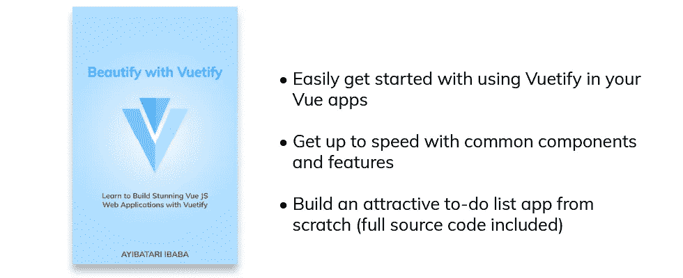
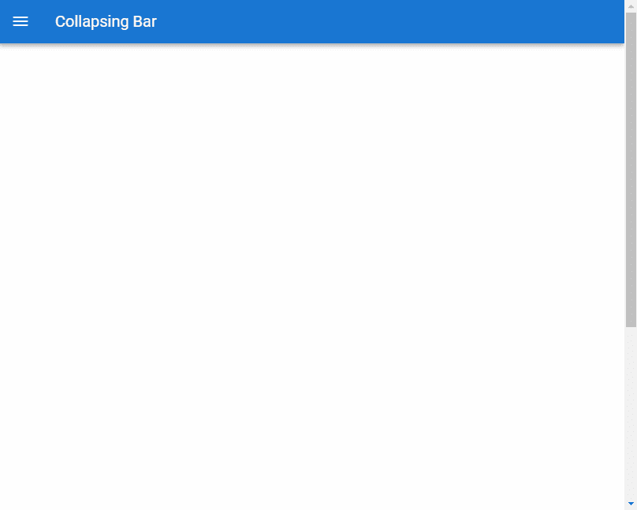
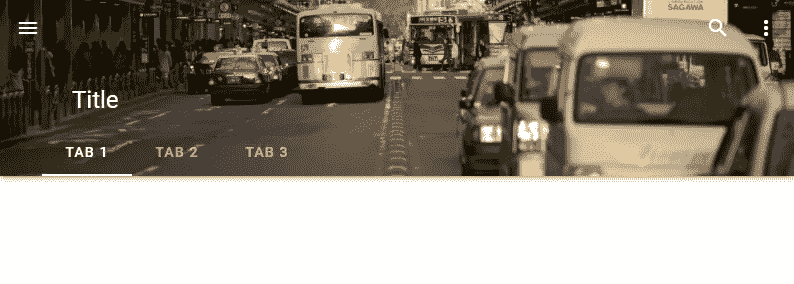

# 如何使用 Vuetify 轻松创建漂亮的应用程序栏

> 原文：<https://javascript.plainenglish.io/vuetify-app-bar-423472659a59?source=collection_archive---------10----------------------->


应用程序栏是每个用户界面的重要组成部分，通常是站点导航的主要来源。像[工具栏](https://codingbeautydev.com/blog/vuetify-toolbar/)一样，它显示在屏幕顶部，可以与[导航抽屉](https://codingbeautydev.com/blog/vuetify-navigation-drawer/)或[标签](https://codingbeautydev.com/blog/vuetify-tabs/)结合使用。在本文中，我们将学习如何使用 Vuetify 创建和定制应用程序栏。

# 虚拟应用程序栏组件

Vuetify 提供了用于创建应用程序栏的`v-app-bar`组件。我们在组件上使用了`app`属性，使得 Vuetify 在动态调整其他组件时考虑 app bar，比如`v-main`。

```
<template>
  <v-app>
    <v-app-bar app></v-app-bar>
  </v-app>
</template><script>
export default {
  name: 'App',
};
</script>
```


# 应用程序栏标题

我们可以使用`v-toolbar-title`组件来设置应用程序栏标题。

```
<template>
  <v-app>
    <v-app-bar app>
      <v-toolbar-title>Coding Beauty</v-toolbar-title>
    </v-app-bar>
  </v-app>
</template><script>
export default {
  name: 'App',
};
</script>
```


注意:虽然我们可以使用`v-app-bar-title`组件来设置应用程序栏标题，但 Vuetify 团队不建议在没有`shrink-on-scroll`属性的情况下使用它(本文稍后会讨论)，因为这会增加不必要的调整监视器和额外的计算。

# 应用程序栏导航图标

`v-app-bar-nav-icon`是一个专门为使用[工具栏](https://codingbeautydev.com/blog/vuetify-toolbar/)或应用程序栏而创建的样式化图标按钮组件。应用程序栏导航图标通常放置在[工具栏](https://codingbeautydev.com/blog/vuetify-toolbar/)或作为汉堡菜单的应用程序栏的左侧，通常用于控制[导航抽屉](https://codingbeautydev.com/blog/vuetify-navigation-drawer/)的状态。我们可以用`default`槽定制该组件的[图标](https://codingbeautydev.com/blog/vuetify-icons/)和功能。

```
<template>
  <v-app>
    <v-app-bar app>
      <v-app-bar-nav-icon> </v-app-bar-nav-icon>
      <v-toolbar-title>Coding Beauty</v-app-bar-title>
    </v-app-bar>
  </v-app>
</template><script>
export default {
  name: 'App',
};
</script>
```


# 应用程序栏颜色

app bar 组件自带`color`道具，用于定制 app bar 的[颜色](https://codingbeautydev.com/blog/vuetify-colors/)。`dark`道具使文本的[颜色](https://codingbeautydev.com/blog/vuetify-colors/)为白色

```
<template>
  <v-app>
    <v-app-bar app color="green" dark>
      <v-app-bar-nav-icon> </v-app-bar-nav-icon>
      <v-app-bar-title>Coding Beauty</v-app-bar-title>
    </v-app-bar>
  </v-app>
</template><script>
export default {
  name: 'App',
};
</script>
```


# 用美化来美化

使用 Vuetify 材料设计框架创建优雅 web 应用程序的完整指南。



在这里 **免费获得一份 [**。**](https://mailchi.mp/583226ee0d7b/beautify-with-vuetify)**

# 折叠的应用程序栏

将`v-app-bar`上的`collapse`道具设置为`true`会一直折叠应用栏:

```
<template>
  <v-app>
    <v-app-bar app color="primary" dark collapse>
      <v-app-bar-nav-icon> </v-app-bar-nav-icon>
      <v-app-bar-title>Collapsing Bar</v-app-bar-title>
    </v-app-bar>
  </v-app>
</template><script>
export default {
  name: 'App',
};
</script>
```


# 滚动时折叠

我们可以决定只在用户滚动时使用`collapse-on-scroll`道具来折叠应用栏。

```
<template>
  <v-app>
    <v-app-bar app color="primary" dark collapse-on-scroll>
      <v-app-bar-nav-icon> </v-app-bar-nav-icon>
      <v-toolbar-title>Collapsing Bar</v-toolbar-title>
    </v-app-bar>
    <v-sheet>
      <v-container style="height: 1000px"> </v-container>
    </v-sheet>
  </v-app>
</template><script>
export default {
  name: 'App',
};
</script>
```



# 应用程序栏操作

我们可以通过[图标](https://codingbeautydev.com/blog/vuetify-icons/) [按钮](https://codingbeautydev.com/blog/vuetify-button/)向应用程序栏添加我们希望用户能够轻松访问的功能。

```
<template>
  <v-app>
    <v-app-bar app color="yellow accent-3">
      <v-app-bar-nav-icon> </v-app-bar-nav-icon>
      <v-toolbar-title>Coding Beauty</v-toolbar-title>
      <v-spacer></v-spacer>
      <v-btn icon> <v-icon> mdi-heart </v-icon> </v-btn>
      <v-btn icon>
        <v-icon>mdi-magnify</v-icon>
      </v-btn>
    </v-app-bar>
  </v-app>
</template><script>
export default {
  name: 'App',
};
</script>
```


# 应用程序栏菜单

我们还可以用一个菜单组件来扩展应用程序栏的功能(`v-menu`)。

```
<template>
  <v-app>
    <v-app-bar app color="deep-purple accent-4" dark>
      <v-app-bar-nav-icon> </v-app-bar-nav-icon>
      <v-toolbar-title>Coding Beauty</v-toolbar-title>
      <v-spacer></v-spacer>
      <v-btn icon> <v-icon> mdi-heart </v-icon> </v-btn>
      <v-btn icon>
        <v-icon>mdi-magnify</v-icon>
      </v-btn>
      <v-menu left bottom>
        <template v-slot:activator="{ on, attrs }">
          <v-btn icon v-bind="attrs" v-on="on">
            <v-icon>mdi-dots-vertical</v-icon>
          </v-btn>
        </template> <v-list>
          <v-list-item v-for="n in 4" :key="n" @click="() => {}">
            Option {{ n }}
          </v-list-item>
        </v-list>
      </v-menu>
    </v-app-bar>
  </v-app>
</template><script>
export default {
  name: 'App',
};
</script>
```


点击菜单[图标](https://codingbeautydev.com/blog/vuetify-icons/)按钮[按钮](https://codingbeautydev.com/blog/vuetify-button/)将显示包含我们添加的选项的弹出窗口:


# 密集的应用程序栏

我们可以用`dense`道具让一个 app 条密集起来。密集的应用程序栏比普通的应用程序栏高度低。

```
<template>
  <v-app>
    <v-app-bar app color="deep-purple accent-4" dark dense>
      <v-app-bar-nav-icon> </v-app-bar-nav-icon>
      <v-toolbar-title>Coding Beauty</v-toolbar-title>
      <v-spacer></v-spacer>
      <v-btn icon> <v-icon> mdi-heart </v-icon> </v-btn>
      <v-btn icon>
        <v-icon>mdi-magnify</v-icon>
      </v-btn>
      <v-menu left bottom>
        <template v-slot:activator="{ on, attrs }">
          <v-btn icon v-bind="attrs" v-on="on">
            <v-icon>mdi-dots-vertical</v-icon>
          </v-btn>
        </template> <v-list>
          <v-list-item v-for="n in 4" :key="n" @click="() => {}">
            Option {{ n }}
          </v-list-item>
        </v-list>
      </v-menu>
    </v-app-bar>
  </v-app>
</template><script>
export default {
  name: 'App',
};
</script>
```


# 滚动时提升

当我们将`elevate-on-scroll`设置为`true`时，应用程序栏将停留在 0dp 的高度，直到用户开始向下滚动。一旦滚动开始，仰角上升到 4dp。

```
<template>
  <v-app>
    <v-app-bar app color="white" elevate-on-scroll>
      <v-app-bar-nav-icon> </v-app-bar-nav-icon>
      <v-toolbar-title>Coding Beauty</v-toolbar-title>
      <v-spacer></v-spacer>
      <v-btn icon> <v-icon> mdi-heart </v-icon> </v-btn>
      <v-btn icon>
        <v-icon>mdi-magnify</v-icon>
      </v-btn>
      <v-menu left bottom>
        <template v-slot:activator="{ on, attrs }">
          <v-btn icon v-bind="attrs" v-on="on">
            <v-icon>mdi-dots-vertical</v-icon>
          </v-btn>
        </template> <v-list>
          <v-list-item v-for="n in 4" :key="n" @click="() => {}">
            Option {{ n }}
          </v-list-item>
        </v-list>
      </v-menu>
    </v-app-bar>
    <v-sheet>
      <v-container style="height: 1000px"> </v-container>
    </v-sheet>
  </v-app>
</template><script>
export default {
  name: 'App',
};
</script>
```


# 用选项卡扩展应用程序栏

我们可以通过将[调整片](https://codingbeautydev.com/blog/vuetify-tabs/)放入`v-app-bar`的`extension`槽中来延长带有[调整片](https://codingbeautydev.com/blog/vuetify-tabs/)的 app bar:

```
<template>
  <v-app>
    <v-app-bar app color="primary" dark>
      <v-app-bar-nav-icon> </v-app-bar-nav-icon>
      <v-toolbar-title>Coding Beauty</v-toolbar-title>
      <v-spacer></v-spacer>
      <v-btn icon>
        <v-icon>mdi-magnify</v-icon>
      </v-btn>
      <v-menu left bottom>
        <template v-slot:activator="{ on, attrs }">
          <v-btn icon v-bind="attrs" v-on="on">
            <v-icon>mdi-dots-vertical</v-icon>
          </v-btn>
        </template>
      </v-menu> <template v-slot:extension>
        <v-tabs align-with-title>
          <v-tab>Tab 1</v-tab>
          <v-tab>Tab 2</v-tab>
          <v-tab>Tab 3</v-tab>
        </v-tabs>
      </template>
    </v-app-bar>
  </v-app>
</template><script>
export default {
  name: 'App',
};
</script>
```


# 突出的应用程序栏

将`prominent`支柱设置到`true`将增加其高度。

```
<template>
  <v-app>
    <v-app-bar app color="primary" dark prominent>
      <v-app-bar-nav-icon> </v-app-bar-nav-icon>
      <v-toolbar-title>Title</v-toolbar-title>
      <v-spacer></v-spacer>
      <v-btn icon>
        <v-icon>mdi-magnify</v-icon>
      </v-btn>
      <v-menu left bottom>
        <template v-slot:activator="{ on, attrs }">
          <v-btn icon v-bind="attrs" v-on="on">
            <v-icon>mdi-dots-vertical</v-icon>
          </v-btn>
        </template>
      </v-menu> <template v-slot:extension>
        <v-tabs align-with-title>
          <v-tab>Tab 1</v-tab>
          <v-tab>Tab 2</v-tab>
          <v-tab>Tab 3</v-tab>
        </v-tabs>
      </template>
    </v-app-bar>
  </v-app>
</template><script>
export default {
  name: 'App',
};
</script>
```


# 滚动收缩

使用`shrink-on-scroll`道具，我们可以在用户向下滚动时降低突出的应用程序栏的高度。这允许当用户滚动内容时平滑过渡到占用较少的视觉空间。

```
<template>
  <v-app>
    <v-app-bar app color="primary" dark prominent shrink-on-scroll>
      <v-app-bar-nav-icon> </v-app-bar-nav-icon>
      <v-toolbar-title>Title</v-toolbar-title>
      <v-spacer></v-spacer>
      <v-btn icon>
        <v-icon>mdi-magnify</v-icon>
      </v-btn>
      <v-menu left bottom>
        <template v-slot:activator="{ on, attrs }">
          <v-btn icon v-bind="attrs" v-on="on">
            <v-icon>mdi-dots-vertical</v-icon>
          </v-btn>
        </template>
      </v-menu> <template v-slot:extension>
        <v-tabs align-with-title>
          <v-tab>Tab 1</v-tab>
          <v-tab>Tab 2</v-tab>
          <v-tab>Tab 3</v-tab>
        </v-tabs>
      </template>
    </v-app-bar>
    <v-sheet>
      <v-container style="height: 1000px"></v-container>
    </v-sheet>
  </v-app>
</template><script>
export default {
  name: 'App',
};
</script>
```


# 应用程序栏图像

我们可以用`src`道具在应用栏上显示背景图片。当我们设置一个图像时，`color`道具作为一个后备[颜色](https://codingbeautydev.com/blog/vuetify-colors/)，当图像还没有加载或加载失败时，应用程序栏将显示这个颜色。

```
<template>
  <v-app>
    <v-app-bar
      app
      color="primary"
      dark
      prominent
      src="https://picsum.photos/1920/1080?random"
    >
      <v-app-bar-nav-icon> </v-app-bar-nav-icon>
      <v-toolbar-title>Title</v-toolbar-title>
      <v-spacer></v-spacer>
      <v-btn icon>
        <v-icon>mdi-magnify</v-icon>
      </v-btn>
      <v-menu left bottom>
        <template v-slot:activator="{ on, attrs }">
          <v-btn icon v-bind="attrs" v-on="on">
            <v-icon>mdi-dots-vertical</v-icon>
          </v-btn>
        </template>
      </v-menu> <template v-slot:extension>
        <v-tabs align-with-title>
          <v-tab>Tab 1</v-tab>
          <v-tab>Tab 2</v-tab>
          <v-tab>Tab 3</v-tab>
        </v-tabs>
      </template>
    </v-app-bar>
  </v-app>
</template><script>
export default {
  name: 'App',
};
</script>
```



# 在滚动时淡化图像

我们可能想让应用程序栏上的背景图像随着用户向下滚动而淡化。我们可以用`fade-img-on-scroll`道具做到这一点。当我们滚动时，图像的不透明度降低，直到它完全消失，我们只能看到背景[颜色](https://codingbeautydev.com/blog/vuetify-colors/)。

```
<template>
  <v-app>
    <v-app-bar
      app
      color="grey"
      dark
      prominent
      src="https://picsum.photos/1920/1080?random"
      fade-img-on-scroll
    >
      <v-app-bar-nav-icon> </v-app-bar-nav-icon>
      <v-app-bar-title>Title</v-app-bar-title>
      <v-spacer></v-spacer>
      <v-btn icon>
        <v-icon>mdi-magnify</v-icon>
      </v-btn>
      <v-menu left bottom>
        <template v-slot:activator="{ on, attrs }">
          <v-btn icon v-bind="attrs" v-on="on">
            <v-icon>mdi-dots-vertical</v-icon>
          </v-btn>
        </template>
      </v-menu> <template v-slot:extension>
        <v-tabs align-with-title>
          <v-tab>Tab 1</v-tab>
          <v-tab>Tab 2</v-tab>
          <v-tab>Tab 3</v-tab>
        </v-tabs>
      </template>
    </v-app-bar>
    <v-sheet>
      <v-container style="height: 1000px"> </v-container>
    </v-sheet>
  </v-app>
</template><script>
export default {
  name: 'App',
};
</script>
```


# 在卷轴上隐藏

当用户用`hide-on-scroll`道具开始滚动时，我们可以隐藏应用栏。

```
<template>
  <v-app>
    <v-app-bar app color="teal" dark hide-on-scroll>
      <v-app-bar-nav-icon> </v-app-bar-nav-icon>
      <v-app-bar-title>Title</v-app-bar-title>
      <v-spacer></v-spacer>
      <v-btn icon>
        <v-icon>mdi-magnify</v-icon>
      </v-btn>
      <v-menu left bottom>
        <template v-slot:activator="{ on, attrs }">
          <v-btn icon v-bind="attrs" v-on="on">
            <v-icon>mdi-dots-vertical</v-icon>
          </v-btn>
        </template>
      </v-menu>
    </v-app-bar>
    <v-sheet>
      <v-container style="height: 1000px"> </v-container>
    </v-sheet>
  </v-app>
</template><script>
export default {
  name: 'App',
};
</script>
```


# 倒置卷轴

当`inverted-scroll`道具设置为`true`时，应用栏将隐藏，直到用户滚动超过指定的阈值。一旦超过阈值，应用程序栏将继续显示，直到用户向上滚动超过阈值。如果没有设置`scroll-treshold`属性，将使用默认值 0。

```
<template>
  <v-app>
    <v-app-bar app color="primary" dark inverted-scroll>
      <v-app-bar-nav-icon> </v-app-bar-nav-icon>
      <v-app-bar-title>Coding Beauty</v-app-bar-title>
      <v-spacer></v-spacer>
      <v-btn icon>
        <v-icon>mdi-magnify</v-icon>
      </v-btn>
      <v-menu left bottom>
        <template v-slot:activator="{ on, attrs }">
          <v-btn icon v-bind="attrs" v-on="on">
            <v-icon>mdi-dots-vertical</v-icon>
          </v-btn>
        </template>
      </v-menu>
    </v-app-bar>
    <v-sheet>
      <v-container style="height: 1000px"> </v-container>
    </v-sheet>
  </v-app>
</template><script>
export default {
  name: 'App',
};
</script>
```


# 使用带有导航抽屉的应用程序栏

我们可以将[导航抽屉](https://codingbeautydev.com/blog/vuetify-navigation-drawer/)添加到我们的用户界面，并使用应用程序栏上的功能性`v-nav-bar-icon`组件来切换其可见性。

```
<template>
  <v-app>
    <v-app-bar app color="green" dark>
      <v-app-bar-nav-icon @click="drawer = true"> </v-app-bar-nav-icon>
      <v-toolbar-title>Coding Beauty</v-toolbar-title>
    </v-app-bar>
    <v-navigation-drawer v-model="drawer" absolute temporary>
      <v-list nav dense>
        <v-list-item-group
          v-model="group"
          active-class="deep-purple--text text--accent-4"
        >
          <v-list-item>
            <v-list-item-icon>
              <v-icon>mdi-home</v-icon>
            </v-list-item-icon>
            <v-list-item-title>Home</v-list-item-title>
          </v-list-item> <v-list-item>
            <v-list-item-icon>
              <v-icon>mdi-account</v-icon>
            </v-list-item-icon>
            <v-list-item-title>Account</v-list-item-title>
          </v-list-item>
        </v-list-item-group>
      </v-list>
    </v-navigation-drawer>
  </v-app>
</template><script>
export default {
  name: 'App',
  data: () => ({
    drawer: false,
    group: null,
  }),
};
</script>
```


# 结论

我们可以在用户界面中添加一个应用程序栏，以便快速轻松地导航。Vuetify 提供了`v-app-bar`组件，用于创建和定制应用程序栏的行为和外观。

[***注册***](http://eepurl.com/hRfyJL) *订阅我们的每周时事通讯，了解关于 Vuetify、Vue、JavaScript 等的所有最新技巧和教程。*

*在*[*codingbeautydev.com*](https://codingbeautydev.com/blog/vuetify-app-bar/)*获取更新文章。*