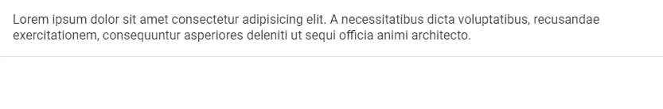

# 如何使用 Vuetify 横幅组件

> 原文：<https://javascript.plainenglish.io/vuetify-banner-f1881e1b9930?source=collection_archive---------14----------------------->

## 了解如何使用 Vuetify 横幅组件创建显示消息和相关操作的信息性和功能性横幅。


我们可以使用横幅向用户显示一条消息，其中包含一两个相关的操作。它可以是单行或多行，可以包含符合信息和动作的[图标](https://codingbeautydev.com/blog/vuetify-icons/)。请继续阅读，了解如何使用 Vuetify 横幅组件创建和定制横幅的更多信息。

# 虚拟横幅组件(虚拟横幅)

我们可以使用 Vuetify 中的`v-banner`组件来创建一个横幅。默认为多行。

```
<template>
  <v-app>
    <v-banner>
      Lorem ipsum dolor sit amet consectetur adipisicing
      elit. A necessitatibus dicta voluptatibus, recusandae
      exercitationem, consequuntur asperiores deleniti ut
      sequi officia animi architecto.
    </v-banner>
  </v-app>
</template><script>
export default {
  name: 'App',
};
</script>
```



# 单行横幅

使用`v-banner`上的单行道具，使横幅上的信息只占据一行。如果太长，它会被省略号截断。

```
<template>
  <v-app>
    <v-banner single-line>
      Lorem ipsum dolor sit amet consectetur adipisicing
      elit. A necessitatibus dicta voluptatibus, recusandae
      exercitationem, consequuntur asperiores deleniti ut
      sequi officia animi architecto.
    </v-banner>
  </v-app>
</template><script>
export default {
  name: 'App',
};
</script>
```


# 美化横幅颜色

Vuetify 允许我们用`color`道具定制`v-banner`组件的[颜色](https://codingbeautydev.com/blog/vuetify-colors/)。我们可以使用[材料设计规格](https://material.io/design/color/the-color-system.html)中的任何[颜色](https://codingbeautydev.com/blog/vuetify-colors/)。

```
<template>
  <v-app>
    <v-banner
      color="primary"
      dark
      class="ma-4"
    >
      Lorem ipsum dolor sit amet consectetur adipisicing
      elit. A necessitatibus dicta voluptatibus, recusandae
      exercitationem, consequuntur asperiores deleniti ut
      sequi officia animi architecto.
    </v-banner>
  </v-app>
</template><script>
export default {
  name: 'App',
};
</script>
```


# 用美化来美化

使用 Vuetify 材料设计框架创建优雅 web 应用程序的完整指南。


在 这里免费获得一份 [**。**](https://mailchi.mp/583226ee0d7b/beautify-with-vuetify)

# 使横幅有粘性

`sticky`道具将 banner 元素的`position` CSS 属性设置为`sticky`。

```
<template>
  <v-app>
    <div
      style="max-height: 400px"
      class="overflow-y-auto"
    >
      <v-banner
        sticky
        color="white"
      >
        Sticky banner
      </v-banner>
      Lorem ipsum dolor sit amet, consectetur adipisicing
      elit. Dicta voluptatibus maxime ullam cum quasi ad
      placeat qui ipsa odit quam sit nemo, laborum fuga enim
      saepe dolorum ex aperiam tempora? Lorem ipsum dolor
      sit amet consectetur adipisicing elit. Quasi iste
      earum nihil? Distinctio natus in cumque tempora veniam
      placeat consectetur, consequatur recusandae quaerat
      qui impedit ea cum, perferendis ipsum excepturi. Lorem
      ipsum dolor sit amet consectetur adipisicing elit.
      Libero impedit quo doloremque perferendis odit
      consequuntur maxime iure sint vel autem ipsa, eveniet
      dolore exercitationem, perspiciatis porro numquam
      earum laudantium laborum. Lorem, ipsum dolor sit amet
      consectetur adipisicing elit. Totam ducimus laborum
      suscipit distinctio tempore alias quos quasi eius
      praesentium itaque quas error fugit numquam, beatae
      sint dolor quis, officiis dignissimos. Lorem ipsum
      dolor sit amet consectetur adipisicing elit. Quas
      aliquid quia fugiat repudiandae ea, autem commodi
      praesentium obcaecati, corrupti sed ipsum dolores
      illum sit cum, officiis esse! Culpa, temporibus minus!
      Lorem ipsum dolor sit amet consectetur adipisicing
      elit. Sint placeat animi omnis nemo possimus quam
      optio earum ut amet aspernatur, consectetur nesciunt
      rem. Earum exercitationem, tempora blanditiis tenetur
      nemo magnam. Lorem ipsum dolor sit amet consectetur
      adipisicing elit. Nulla quisquam possimus officia,
      doloremque dolorum facere perspiciatis eaque rem
      quibusdam pariatur, laborum quod similique eius
      eligendi vero dicta ipsam iusto amet! Lorem ipsum
      dolor sit amet consectetur adipisicing elit. Pariatur
      ad labore doloribus voluptatem esse necessitatibus
      totam eaque fugit. Libero dolore autem totam sed
      possimus iure aspernatur dolorum voluptate odit
      laborum? Lorem ipsum dolor sit amet consectetur
      adipisicing elit. Quidem distinctio necessitatibus
      optio, quos id sint eius cupiditate. Itaque ipsum
      atque ad hic officiis vero earum, voluptatum debitis
      consectetur dolore unde. Lorem ipsum dolor sit amet
      consectetur, adipisicing elit. Eaque ullam cumque
      quasi unde illum, dolorem vel vero veritatis magnam
      consequatur commodi consectetur architecto dicta
      expedita ducimus officiis facilis sed ab. Lorem ipsum
      dolor sit, amet consectetur adipisicing elit. Minima
      veritatis neque quaerat fuga qui iste consectetur, in
      ab facilis quia laudantium voluptatum iusto ratione
      aliquid necessitatibus ipsam aspernatur sit
      dignissimos. Lorem ipsum dolor sit amet consectetur
      adipisicing elit. A ipsa pariatur modi, exercitationem
      minus quo dolorem reiciendis deserunt iste quod
      provident porro praesentium at sequi laboriosam qui
      cum saepe sint. Lorem, ipsum dolor sit amet
      consectetur adipisicing elit. Eum ab obcaecati
      perferendis. Deleniti modi eaque saepe inventore, a
      non officia ut quisquam illo fuga natus temporibus.
      Aliquid ab veritatis eius? Lorem ipsum dolor sit amet
      consectetur adipisicing elit. Sed ipsam iste laborum
      minima debitis modi corrupti, eos obcaecati aut magni,
      quod earum quaerat nobis esse eveniet omnis eligendi
      aspernatur voluptate! Lorem ipsum dolor sit amet
      consectetur, adipisicing elit. Nesciunt facilis fuga
      quas sed autem eligendi rerum dolorem optio. Nulla
      obcaecati veniam sunt ipsa exercitationem reiciendis
      totam dolorem tenetur fuga provident. Lorem ipsum
      dolor sit amet consectetur adipisicing elit.
      Temporibus ratione magni ipsam iure minima modi
      obcaecati nihil tempora debitis, quaerat corporis
      ipsum assumenda maiores nisi laboriosam doloremque.
      Ab, sapiente fuga! Lorem, ipsum dolor sit amet
      consectetur adipisicing elit. Tempore non voluptate
      quisquam quod, aliquam sequi maiores dolorum minima
      dolorem! Distinctio autem quaerat accusamus iusto
      beatae laudantium dicta omnis cum fuga. Lorem ipsum
      dolor sit amet, consectetur adipisicing elit. Quas,
      aspernatur sint maxime officiis cumque inventore, amet
      illum, soluta eum necessitatibus iure deleniti natus
      aut deserunt vitae vel facilis quod voluptatem.
    </div>
  </v-app>
</template><script>
export default {
  name: 'App',
};
</script>
```


# 概述的 Vuetify 横幅

我们可以用`outlined`道具给横幅添加一个轮廓:

```
<template>
  <v-app>
    <v-banner
      outlined
      class="ma-4"
      >Lorem ipsum dolor sit amet consectetur adipisicing
      elit.
    </v-banner>
  </v-app>
</template><script>
export default {
  name: 'App',
};
</script>
```


# 圆形横幅

将`rounded`支柱设置到`v-banner`上的`true`使角变圆。

```
<template>
  <v-app>
    <v-banner
      rounded
      color="green"
      dark
      class="ma-4"
    >
      Lorem ipsum dolor sit amet consectetur adipisicing
      elit.
    </v-banner>
  </v-app>
</template><script>
export default {
  name: 'App',
};
</script>
```


# 旗帜形

`shaped`道具在横幅的左上角和右下角添加边框半径。

```
<template>
  <v-app
    ><v-banner
      color="purple accent-4"
      class="ma-4"
      dark
      shaped
    >
      Lorem ipsum dolor, sit amet consectetur adipisicing
      elit.
    </v-banner>
  </v-app>
</template><script>
export default {
  name: 'App',
};
</script>
```


# 美化横幅磁贴

`tile`支柱从`v-banner`上移除边框半径:

```
<template>
  <v-app>
    <v-banner
      color="primary"
      class="ma-4"
      dark
      tile
      >Lorem ipsum dolor sit amet consectetur adipisicing
      elit.
    </v-banner>
  </v-app>
</template><script>
export default {
  name: 'App',
};
</script>
```


# 横幅高度

我们可以用`elevation`道具给横幅组件添加高度。

```
<template>
  <v-app>
    <v-banner
      class="ma-4"
      elevation="10"
    >
      Lorem ipsum dolor sit amet consectetur adipisicing
      elit.
    </v-banner>
  </v-app>
</template><script>
export default {
  name: 'App',
};
</script>
```


# 图标槽

横幅组件带有一个`icon`插槽，用于在其上包含一个图标:

```
<template>
  <v-app>
    <v-banner
      single-line
      class="ma-4"
      elevation="2"
      rounded
    >
      <v-icon
        slot="icon"
        color="info"
        size="36"
      >
        mdi-information
      </v-icon>
      Lorem ipsum dolor sit, amet consectetur adipisicing
      elit.
    </v-banner>
  </v-app>
</template><script>
export default {
  name: 'App',
};
</script>
```


# 图标点击

我们可以给`v-banner`的`@click:icon`事件附加一个处理程序，当用户点击横幅[图标](https://codingbeautydev.com/blog/vuetify-icons/)时执行一个动作。

```
<template>
  <v-app>
    <v-banner
      single-line
      @click:icon="iconClicked = true"
      class="ma-4"
      elevation="2"
      rounded
    >
      <v-icon
        slot="icon"
        color="info"
        size="36"
      >
        mdi-information
      </v-icon>
      Lorem ipsum dolor sit, amet consectetur adipisicing
      elit.
    </v-banner>
    <div
      v-if="iconClicked"
      class="d-flex justify-center"
    >
      Icon clicked.
    </div>
  </v-app>
</template><script>
export default {
  name: 'App',
  data: () => ({
    iconClicked: false,
  }),
};
</script>
```


# Vuetify 横幅活动槽

`v-banner`还附带了一个`actions`插槽，我们可以在横幅上使用用户可以采取的显示动作。我们用它在横幅上放置功能按钮[和](https://codingbeautydev.com/blog/vuetify-button/)。

```
<template>
  <v-app>
    <v-banner
      single-line
      class="ma-4"
      elevation="2"
      rounded
    >
      <v-icon
        slot="icon"
        color="info"
        size="36"
      >
        mdi-information
      </v-icon>
      Lorem ipsum dolor sit, amet consectetur adipisicing
      elit.
      <template v-slot:actions>
        <v-btn
          color="primary"
          text
          >Action</v-btn
        >
      </template>
    </v-banner>
  </v-app>
</template><script>
export default {
  name: 'App',
};
</script>
```


`actions`插槽在其作用域中有一个`dismiss`函数，我们可以用它来隐藏横幅。

```
<template>
  <v-app>
    <v-banner
      single-line
      class="ma-4"
      elevation="2"
      color="red"
      rounded
      dark
    >
      No internet connection <template v-slot:actions="{ dismiss }">
        <v-btn
          text
          @click="dismiss"
        >
          Dismiss
        </v-btn> <v-btn text>Retry</v-btn>
      </template>
    </v-banner> </v-app>
</template>
<script>
export default {
  name: 'App',};
</script>
```


# 结论

横幅可以用来通过一个或两个动作向用户显示消息。我们可以使用 Vuetify 横幅组件(`v-banner`)来创建横幅。该组件带有各种道具和插槽，用于定制其外观和行为。

*获得关于 Vuetify、Vue.js、JavaScript 等的每周提示和教程:*[http://eepurl.com/hRfyJL](http://eepurl.com/hRfyJL)

*更新于:*[*codingbeautydev.com*](https://codingbeautydev.com/blog/vuetify-banner/)