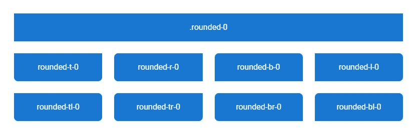
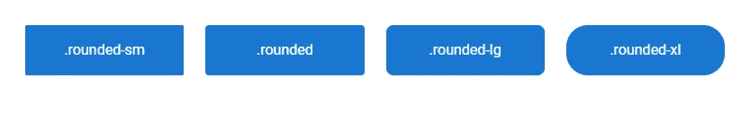
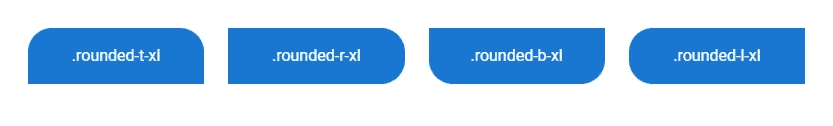
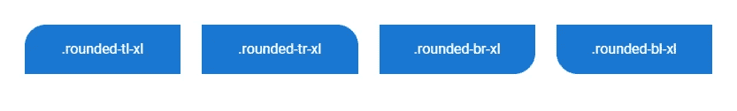

# 如何使用虚拟化边界半径类

> 原文：<https://javascript.plainenglish.io/vuetify-border-radius-e4ed188cd7fb?source=collection_archive---------3----------------------->


Vuetify 附带了 helper 类，可以轻松定制元素的边框半径，而无需创建我们自己的 CSS。我们将在本文中探索这些类。

# 药丸类

我们可以使用`rounded-pill`类创建一个圆角矩形。

```
<template>
  <v-app>
    <v-row
      class="text-center ma-2"
      justify="center"
    >
      <v-col cols="3">
        <div class="pa-4 primary white--text rounded-pill">
          .rounded-pill
        </div>
      </v-col>
    </v-row>
  </v-app>
</template>
```


# 圆形类

当应用时,`rounded-circle`类在一个元素外创建一个圆。

```
<template>
  <v-app>
    <v-row
      class="text-center ma-2"
      justify="center"
    >
      <v-col cols="3">
        <div
          class="pa-7 primary rounded-circle d-inline-block"
        ></div>
        <div>.rounded-circle</div>
      </v-col>
    </v-row>
  </v-app>
</template>
```


# 移除边框半径

类从一个元素中移除所有的边框半径。为了从特定的边移除边界半径，我们可以使用格式为`rounded-{side}-0`的类，其中`side`可以是`t`、`r`、`b`和`l`中的任何一个。为了从特定的角去除边界半径，我们可以使用格式为`rounded-{corner}-0`的类，其中`corner`可以是`tl`、`tr`、`br`和`bl`中的任何一个。

```
<template>
  <v-app>
    <v-row
      justify="center"
      class="flex-grow-0 ma-4"
    >
      <v-col cols="12">
        <div
          class="pa-4 text-center primary white--text rounded-0"
          v-text="`.rounded-0`"
        ></div>
      </v-col>
      <v-col
        v-for="value in [
          't',
          'r',
          'b',
          'l',
          'tl',
          'tr',
          'br',
          'bl',
        ]"
        :key="value"
        sm="3"
      >
        <div
          :class="`pa-4 text-center primary white--text rounded-lg rounded-${value}-0`"
          v-text="`rounded-${value}-0`"
        ></div>
      </v-col>
    </v-row>
  </v-app>
</template>
```



# 用美化来美化

使用 Vuetify 材料设计框架创建优雅 web 应用程序的完整指南。


在这里 获得免费副本 [**。**](https://mailchi.mp/583226ee0d7b/beautify-with-vuetify)

# 圆所有的角落

我们可以使用`rounded-sm`、`rounded`、`rounded-lg`或`rounded-xl`类中的一个将不同大小的边框半径应用到元素的所有角上。

```
<template>
  <v-app>
    <v-row class="ma-4 white--text">
      <v-col
        v-for="value in ['-sm', '', '-lg', '-xl']"
        :key="value"
        cols="3"
      >
        <div
          :class="`rounded${value}`"
          class="pa-4 text-center primary"
        >
          .rounded{{ value }}
        </div>
      </v-col>
    </v-row>
  </v-app>
</template>
```



# 并排设置边框半径

要将边框半径应用于特定的边，我们可以使用格式为`rounded-{side}`或`rounded-{side}-{size}`的辅助类，其中`side`可以是`t`、`r`、`b`和`l`中的一个，`size`可以是`sm`、`lg`和`xl`中的一个。

```
<template>
  <v-app>
    <v-row class="ma-4 white--text">
      <v-col
        v-for="value in ['t', 'r', 'b', 'l']"
        :key="value"
        cols="3"
      >
        <div
          :class="`rounded-${value}-xl`"
          class="pa-4 text-center primary"
        >
          .rounded-{{ value }}-xl
        </div>
      </v-col>
    </v-row>
  </v-app>
</template>
```



# 按角的边框半径

为了设置特定角的边界半径，我们可以使用格式为`rounded-{corner}`或`rounded-{corner}-{size}`的辅助类，其中`corner`可以是`tl`、`tr`、`br`和`bl`中的任意一个，`size`可以是`sm`、`lg`和`xl`中的任意一个。

```
<template>
  <v-app>
    <v-row class="ma-4 white--text">
      <v-col
        v-for="value in ['tl', 'tr', 'br', 'bl']"
        :key="value"
        cols="3"
      >
        <div
          :class="`rounded-${value}-xl`"
          class="pa-4 text-center primary"
        >
          .rounded-{{ value }}-xl
        </div>
      </v-col>
    </v-row>
  </v-app>
</template>
```



有了 Vuetify 的这些辅助类，我们可以快速地将各种大小的边框半径设置为元素的特定大小和拐角。

*更新于:*[*codingbeautydev.com*](https://codingbeautydev.com/blog/vuetify-border-radius/)

# 订阅编码美容简讯

每周使用新的 web 开发技巧和教程来提升您的技能。


[**订阅**](https://codingbeautydev.com/newsletter)