# 如何使用虚拟化底部导航组件

> 原文：<https://javascript.plainenglish.io/vuetify-bottom-navigation-60e4e89da665?source=collection_archive---------6----------------------->

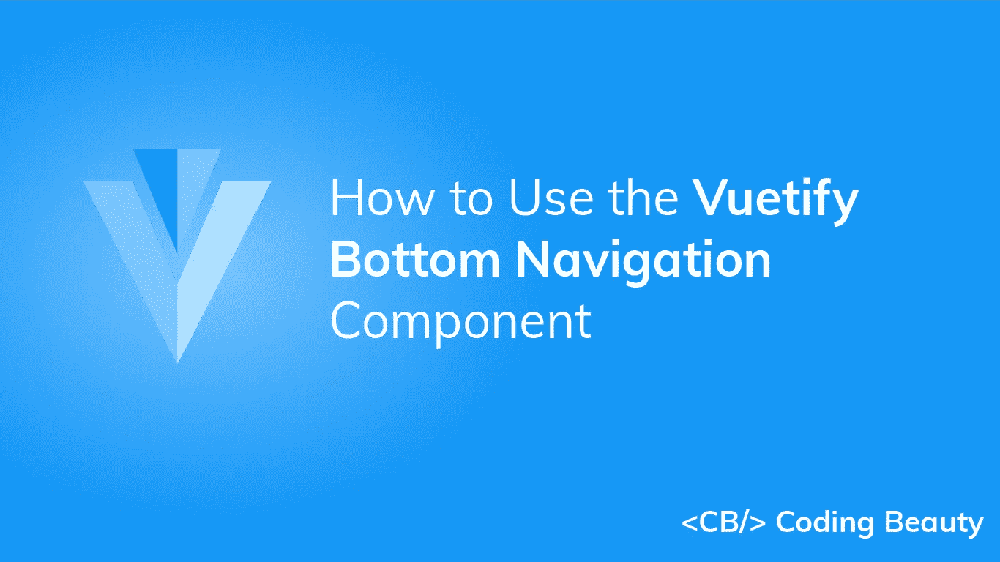

底部导航栏是侧边栏或[导航抽屉](https://codingbeautydev.com/blog/vuetify-navigation-drawer/)的替代物。它主要用于移动应用程序中，可以快速导航到应用程序的顶级目的地。在本文中，我们将学习 Vuetify 底部导航组件，以及如何使用它来轻松创建和定制底部导航栏。

# 验证底部导航组件(垂直底部导航)

Vuetify 提供了用于创建底部导航栏的`v-bottom-navigation`组件。它包括一组用于导航的`v-btn`。我们可以使用`v-bottom-navigation`的`value`道具来编程设置当前活动的[按钮](https://codingbeautydev.com/blog/vuetify-button/)。带有匹配`value`道具的[按钮](https://codingbeautydev.com/blog/vuetify-button/)将被激活。默认情况下，每个[按钮](https://codingbeautydev.com/blog/vuetify-button/)的`value`在底部导航栏的[按钮](https://codingbeautydev.com/blog/vuetify-button/)集合中设置为从零开始的索引，即第一个[按钮](https://codingbeautydev.com/blog/vuetify-button/)的`value`设置为`0`，第二个[按钮](https://codingbeautydev.com/blog/vuetify-button/)设置为`1`，第三个设置为`2`，以此类推。但是我们可以为`v-btn`的`value`属性设置一个自定义值来改变这一点。

```
<template>
  <v-app>
    <v-app-bar
      color="primary"
      app
      dark
    >
      <v-toolbar-title>App Bar</v-toolbar-title>
    </v-app-bar>
    <v-main>
      <v-container
        >Lorem ipsum dolor sit amet consectetur adipisicing
        elit. Quis blanditiis beatae praesentium repudiandae
        sunt officiis, vero maxime officia obcaecati nisi
        excepturi. Sit laboriosam provident laborum? Rem
        recusandae ea possimus illo.</v-container
      >
    </v-main>
    <v-bottom-navigation
      v-model="value"
      app
    >
      <v-btn
        value="music"
        height="100%"
      >
        <span>Music</span>
        <v-icon>mdi-music</v-icon>
      </v-btn> <v-btn
        value="books"
        height="100%"
      >
        <span>Books</span>
        <v-icon>mdi-book</v-icon>
      </v-btn> <v-btn
        value="photos"
        height="100%"
      >
        <span>Photos</span>
        <v-icon>mdi-image</v-icon>
      </v-btn>
    </v-bottom-navigation>
  </v-app>
</template><script>
export default {
  name: 'App',
  data: () => ({ value: 'music' }),
};
</script>
```

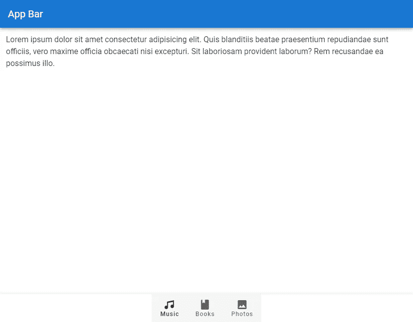

# 美化底部导航颜色

我们可以使用`v-bottom-navigation`的`color`道具来设置底部导航栏上活动[按钮](https://codingbeautydev.com/blog/vuetify-button/)的[颜色](https://codingbeautydev.com/blog/vuetify-colors/)。我们可以使用[材料设计规格](https://material.io/design/color/the-color-system.html)中的任何[颜色](https://codingbeautydev.com/blog/vuetify-colors/)。

```
<template>
  <v-app>
    <v-app-bar
      color="primary"
      app
      dark
    >
      <v-toolbar-title>App Bar</v-toolbar-title>
    </v-app-bar>
    <v-main>
      <v-container
        >Lorem ipsum dolor sit amet consectetur adipisicing
        elit. Quis blanditiis beatae praesentium repudiandae
        sunt officiis, vero maxime officia obcaecati nisi
        excepturi. Sit laboriosam provident laborum? Rem
        recusandae ea possimus illo.</v-container
      >
    </v-main>
    <v-bottom-navigation
      v-model="value"
      app
      color="primary"
    >
      <v-btn
        value="music"
        height="100%"
      >
        <span>Music</span>
        <v-icon>mdi-music</v-icon>
      </v-btn> <v-btn
        value="books"
        height="100%"
      >
        <span>Books</span>
        <v-icon>mdi-book</v-icon>
      </v-btn> <v-btn
        value="photos"
        height="100%"
      >
        <span>Photos</span>
        <v-icon>mdi-image</v-icon>
      </v-btn>
    </v-bottom-navigation>
  </v-app>
</template><script>
export default {
  name: 'App',
  data: () => ({ value: 'music' }),
};
</script>
```

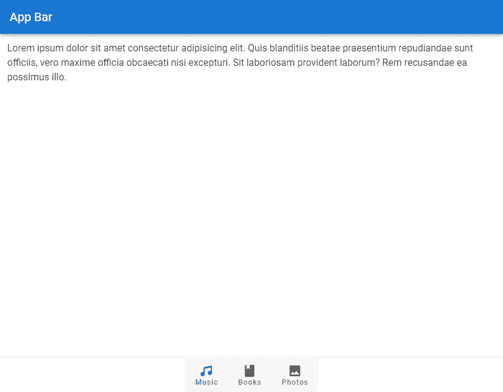

# 背景颜色

使用`background-color`道具设置底部导航栏的背景[颜色](https://codingbeautydev.com/blog/vuetify-colors/)。

```
<template>
  <v-app>
    <v-app-bar
      :color="color"
      app
      dark
    >
      <v-toolbar-title>App Bar</v-toolbar-title>
    </v-app-bar>
    <v-main>
      <v-container
        >Lorem ipsum dolor sit amet consectetur adipisicing
        elit. Quis blanditiis beatae praesentium repudiandae
        sunt officiis, vero maxime officia obcaecati nisi
        excepturi. Sit laboriosam provident laborum? Rem
        recusandae ea possimus illo.</v-container
      >
    </v-main>
    <v-bottom-navigation
      v-model="value"
      app
      :background-color="color"
      dark
    >
      <v-btn
        value="music"
        height="100%"
        :color="color"
      >
        <span>Music</span>
        <v-icon>mdi-music</v-icon>
      </v-btn> <v-btn
        value="books"
        height="100%"
        :color="color"
      >
        <span>Books</span>
        <v-icon>mdi-book</v-icon>
      </v-btn> <v-btn
        value="photos"
        height="100%"
        :color="color"
      >
        <span>Photos</span>
        <v-icon>mdi-image</v-icon>
      </v-btn>
    </v-bottom-navigation>
  </v-app>
</template><script>
export default {
  name: 'App',
  data: () => ({
    value: 'music',
    color: 'purple accent-4',
  }),
};
</script>
```

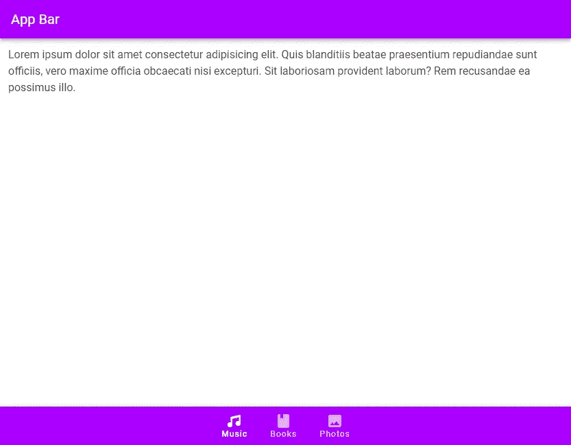

# 用美化来美化

使用 Vuetify 材料设计框架创建优雅 web 应用程序的完整指南。


在 这里免费获得一份 [**。**](https://mailchi.mp/583226ee0d7b/beautify-with-vuetify)

# v 型车

我们可以使用`v-model`在当前活动的[按钮](https://codingbeautydev.com/blog/vuetify-button/)和一个变量之间建立一个双向绑定。在下面的代码示例中，我们将[应用程序栏](https://codingbeautydev.com/blog/vuetify-app-bar/)的标题更改为点击时变为活动状态的[按钮](https://codingbeautydev.com/blog/vuetify-button/)的文本。

```
<template>
  <v-app>
    <v-app-bar
      :color="color"
      app
      dark
    >
      <v-toolbar-title>
        {{ capitalize(value) }}
      </v-toolbar-title>
    </v-app-bar>
    <v-main>
      <v-container
        >Lorem ipsum dolor sit amet consectetur adipisicing
        elit. Quis blanditiis beatae praesentium repudiandae
        sunt officiis, vero maxime officia obcaecati nisi
        excepturi. Sit laboriosam provident laborum? Rem
        recusandae ea possimus illo.</v-container
      >
    </v-main>
    <v-bottom-navigation
      v-model="value"
      app
      :background-color="color"
      dark
    >
      <v-btn
        value="music"
        height="100%"
        :color="color"
      >
        <span>Music</span>
        <v-icon>mdi-music</v-icon>
      </v-btn> <v-btn
        value="books"
        height="100%"
        :color="color"
      >
        <span>Books</span>
        <v-icon>mdi-book</v-icon>
      </v-btn> <v-btn
        value="photos"
        height="100%"
        :color="color"
      >
        <span>Photos</span>
        <v-icon>mdi-image</v-icon>
      </v-btn>
    </v-bottom-navigation>
  </v-app>
</template><script>
export default {
  name: 'App',
  data: () => ({
    value: 'music',
    color: 'green',
  }),
  methods: {
    capitalize(str) {
      return str.charAt(0).toUpperCase() + str.slice(1);
    },
  },
};
</script>
```

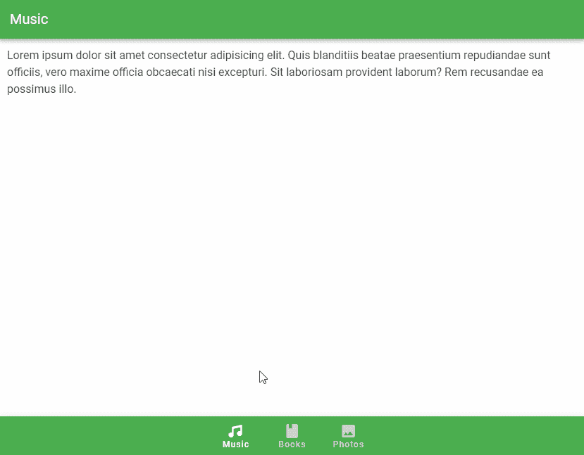

# 虚拟化底部导航增长

我们可以将`grow`道具设置为`v-bottom-navigation`上的`true`来强制`v-btn`组件填充所有可用空间。根据[底部导航材料设计规格](https://material.io/components/bottom-navigation#specs)，按钮[最大宽度`168px`。](https://codingbeautydev.com/blog/vuetify-button/)

```
<template>
  <v-app>
    <v-app-bar
      :color="color"
      app
      dark
    >
      <v-toolbar-title> App Bar </v-toolbar-title>
    </v-app-bar>
    <v-main>
      <v-container
        >Lorem ipsum dolor sit amet consectetur adipisicing
        elit. Quis blanditiis beatae praesentium repudiandae
        sunt officiis, vero maxime officia obcaecati nisi
        excepturi. Sit laboriosam provident laborum? Rem
        recusandae ea possimus illo.</v-container
      >
    </v-main>
    <v-bottom-navigation
      v-model="value"
      app
      :background-color="color"
      dark
      grow
    >
      <v-btn
        value="music"
        height="100%"
        :color="color"
      >
        <span>Music</span>
        <v-icon>mdi-music</v-icon>
      </v-btn> <v-btn
        value="books"
        height="100%"
        :color="color"
      >
        <span>Books</span>
        <v-icon>mdi-book</v-icon>
      </v-btn> <v-btn
        value="photos"
        height="100%"
        :color="color"
      >
        <span>Photos</span>
        <v-icon>mdi-image</v-icon>
      </v-btn>
    </v-bottom-navigation>
  </v-app>
</template><script>
export default {
  name: 'App',
  data: () => ({
    value: 'music',
    color: 'green',
  }),
};
</script>
```

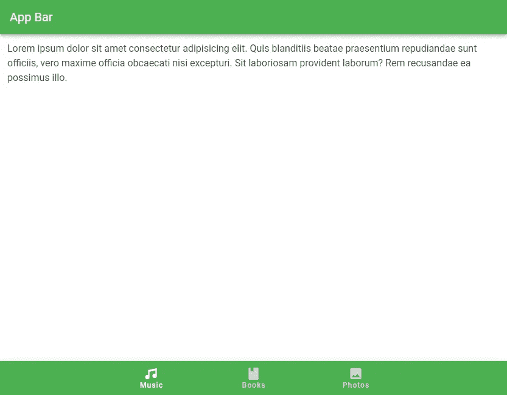

# 验证滚动时底部导航隐藏

`hide-on-scroll`道具向上滚动时隐藏底部导航栏，向下滚动时显示。这类似于 [v-app-bar 组件](https://codingbeautydev.com/blog/vuetify-app-bar/)支持的滚动技术。

```
<template>
  <v-app>
    <v-app-bar
      :color="color"
      app
      dark
    >
      <v-toolbar-title> App Bar </v-toolbar-title>
    </v-app-bar>
    <v-main>
      <v-responsive
        max-height="600"
        id="hide-on-scroll-example"
        class="overflow-y-auto"
      >
        <v-responsive
          height="1500"
          class="ma-4"
        >
          Lorem ipsum dolor sit amet consectetur adipisicing
          elit. Quis blanditiis beatae praesentium
          repudiandae sunt officiis, vero maxime officia
          obcaecati nisi excepturi. Sit laboriosam provident
          laborum? Rem recusandae ea possimus illo.
        </v-responsive>
      </v-responsive>
    </v-main>
    <v-bottom-navigation
      v-model="value"
      app
      :background-color="color"
      dark
      hide-on-scroll
      scroll-target="#hide-on-scroll-example"
    >
      <v-btn
        value="music"
        height="100%"
        :color="color"
      >
        <span>Music</span>
        <v-icon>mdi-music</v-icon>
      </v-btn> <v-btn
        value="books"
        height="100%"
        :color="color"
      >
        <span>Books</span>
        <v-icon>mdi-book</v-icon>
      </v-btn> <v-btn
        value="photos"
        height="100%"
        :color="color"
      >
        <span>Photos</span>
        <v-icon>mdi-image</v-icon>
      </v-btn>
    </v-bottom-navigation>
  </v-app>
</template><script>
export default {
  name: 'App',
  data: () => ({
    value: 'music',
    color: 'indigo',
  }),
};
</script>
```

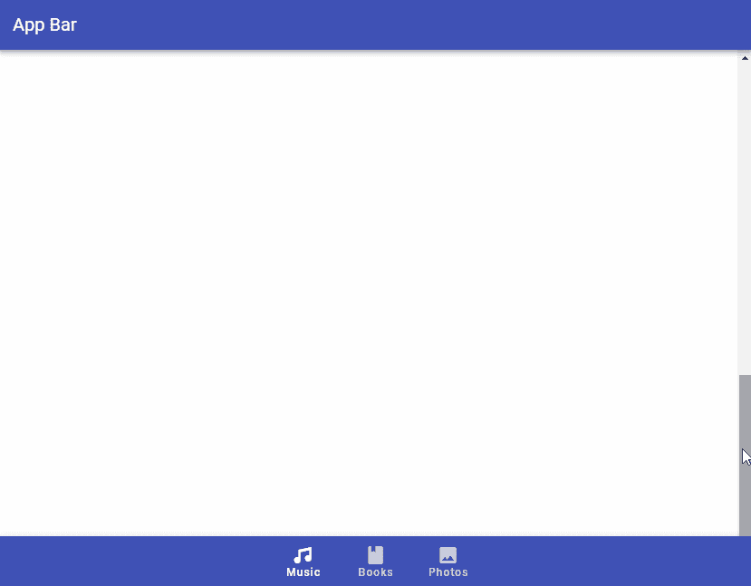

# 验证底部导航滚动阈值

`scroll-threshold`道具设置用户在隐藏底部导航栏之前必须向上滚动的距离。例如，将`scroll-treshold`设置为`0`意味着`v-bottom-navigation`只有在用户向上滚动到页面顶端时才会隐藏:

```
<template>
  <v-app>
    <v-app-bar
      :color="color"
      app
      dark
    >
      <v-toolbar-title> App Bar </v-toolbar-title>
    </v-app-bar>
    <v-main>
      <v-responsive
        max-height="600"
        id="hide-on-scroll-example"
        class="overflow-y-auto"
      >
        <v-responsive
          height="1500"
          class="ma-4"
        >
          Lorem ipsum dolor sit amet consectetur adipisicing
          elit. Quis blanditiis beatae praesentium
          repudiandae sunt officiis, vero maxime officia
          obcaecati nisi excepturi. Sit laboriosam provident
          laborum? Rem recusandae ea possimus illo.
        </v-responsive>
      </v-responsive>
    </v-main>
    <v-bottom-navigation
      v-model="value"
      app
      :background-color="color"
      dark
      hide-on-scroll
      scroll-target="#hide-on-scroll-example"
      scroll-threshold="0"
    >
      <v-btn
        value="music"
        height="100%"
        :color="color"
      >
        <span>Music</span>
        <v-icon>mdi-music</v-icon>
      </v-btn> <v-btn
        value="books"
        height="100%"
        :color="color"
      >
        <span>Books</span>
        <v-icon>mdi-book</v-icon>
      </v-btn> <v-btn
        value="photos"
        height="100%"
        :color="color"
      >
        <span>Photos</span>
        <v-icon>mdi-image</v-icon>
      </v-btn>
    </v-bottom-navigation>
  </v-app>
</template><script>
export default {
  name: 'App',
  data: () => ({
    value: 'music',
    color: 'indigo',
  }),
};
</script>
```

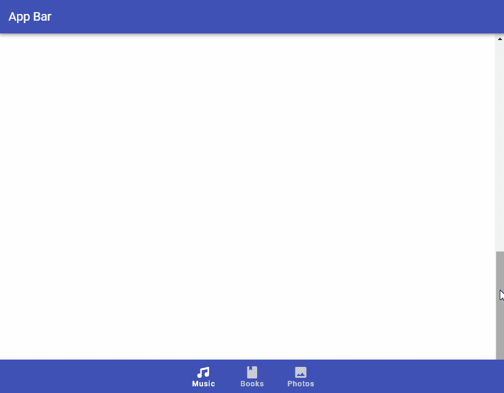

# 验证底部导航水平

使用`horizontal`支柱，我们可以将[按钮](https://codingbeautydev.com/blog/vuetify-button/)文本与提供的 [v 形图标](https://codingbeautydev.com/blog/vuetify-icons/)对齐。

```
<template>
  <v-app>
    <v-app-bar
      :color="color"
      app
      dark
    >
      <v-toolbar-title> App Bar </v-toolbar-title>
    </v-app-bar>
    <v-main>
      <v-container>
        Lorem ipsum dolor sit amet consectetur adipisicing
        elit. Quis blanditiis beatae praesentium repudiandae
        sunt officiis, vero maxime officia obcaecati nisi
        excepturi. Sit laboriosam provident laborum? Rem
        recusandae ea possimus illo.
      </v-container>
    </v-main>
    <v-bottom-navigation
      v-model="value"
      app
      :background-color="color"
      dark
      horizontal
    >
      <v-btn
        value="music"
        height="100%"
        :color="color"
      >
        <span>Music</span>
        <v-icon>mdi-music</v-icon>
      </v-btn> <v-btn
        value="books"
        height="100%"
        :color="color"
      >
        <span>Books</span>
        <v-icon>mdi-book</v-icon>
      </v-btn> <v-btn
        value="photos"
        height="100%"
        :color="color"
      >
        <span>Photos</span>
        <v-icon>mdi-image</v-icon>
      </v-btn>
    </v-bottom-navigation>
  </v-app>
</template><script>
export default {
  name: 'App',
  data: () => ({
    value: 'music',
    color: 'primary',
  }),
};
</script>
```

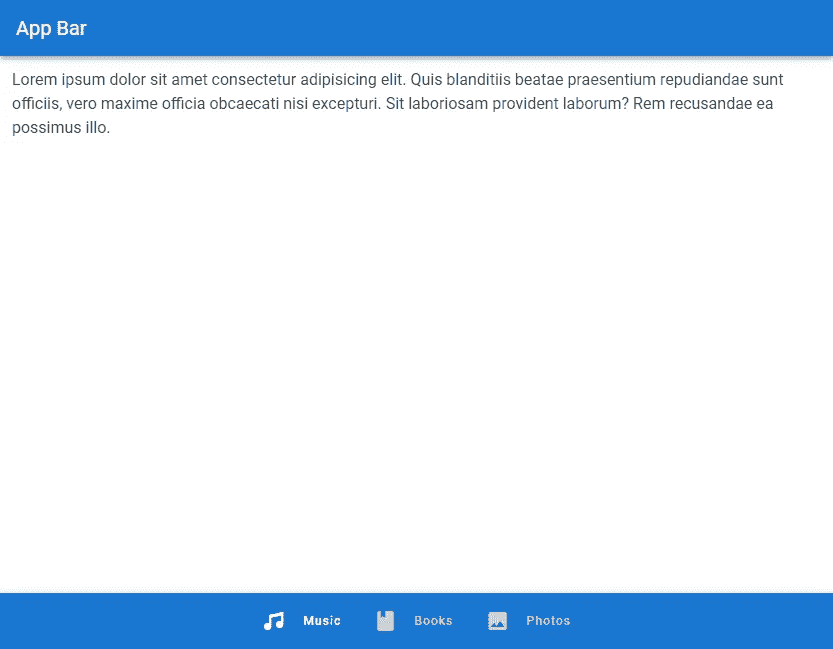

# 验证底部导航移位

我们可以用`shift`道具隐藏导航栏[按钮](https://codingbeautydev.com/blog/vuetify-button/)中未激活的文本。

```
<template>
  <v-app>
    <v-app-bar
      :color="color"
      app
      dark
    >
      <v-toolbar-title> App Bar </v-toolbar-title>
    </v-app-bar>
    <v-main>
      <v-container>
        Lorem ipsum dolor sit amet consectetur adipisicing
        elit. Quis blanditiis beatae praesentium repudiandae
        sunt officiis, vero maxime officia obcaecati nisi
        excepturi. Sit laboriosam provident laborum? Rem
        recusandae ea possimus illo.
      </v-container>
    </v-main>
    <v-bottom-navigation
      v-model="value"
      app
      :background-color="color"
      dark
      shift
    >
      <v-btn
        value="music"
        height="100%"
        :color="color"
      >
        <span>Music</span>
        <v-icon>mdi-music</v-icon>
      </v-btn> <v-btn
        value="books"
        height="100%"
        :color="color"
      >
        <span>Books</span>
        <v-icon>mdi-book</v-icon>
      </v-btn> <v-btn
        value="photos"
        height="100%"
        :color="color"
      >
        <span>Photos</span>
        <v-icon>mdi-image</v-icon>
      </v-btn>
    </v-bottom-navigation>
  </v-app>
</template><script>
export default {
  name: 'App',
  data: () => ({
    value: 'music',
    color: 'primary',
  }),
};
</script>
```

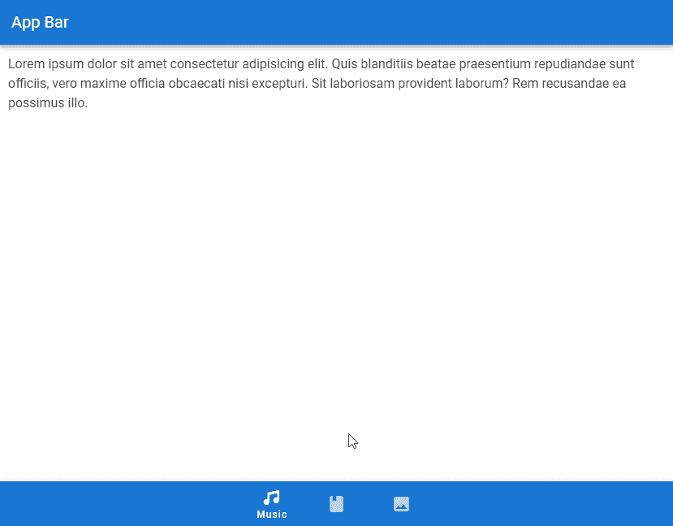

# 验证底部导航开关

我们可以使用`v-bottom-navigation`的`input-value`道具来切换底部导航栏的可见性:

```
<template>
  <v-app>
    <v-app-bar
      :color="color"
      app
      dark
    >
      <v-toolbar-title> App Bar </v-toolbar-title>
    </v-app-bar>
    <v-main>
      <v-container>
        Lorem ipsum dolor sit amet consectetur adipisicing
        elit. Quis blanditiis beatae praesentium repudiandae
        sunt officiis, vero maxime officia obcaecati nisi
        excepturi. Sit laboriosam provident laborum? Rem
        recusandae ea possimus illo.
        <v-row justify="center">
          <v-btn
            class="ma-8"
            outlined
            :color="color"
            @click="active = !active"
          >
            Toggle Navigation
          </v-btn>
        </v-row>
      </v-container>
    </v-main>
    <v-bottom-navigation
      v-model="value"
      app
      :background-color="color"
      dark
      :input-value="active"
    >
      <v-btn
        value="music"
        height="100%"
        :color="color"
      >
        <span>Music</span>
        <v-icon>mdi-music</v-icon>
      </v-btn> <v-btn
        value="books"
        height="100%"
        :color="color"
      >
        <span>Books</span>
        <v-icon>mdi-book</v-icon>
      </v-btn> <v-btn
        value="photos"
        height="100%"
        :color="color"
      >
        <span>Photos</span>
        <v-icon>mdi-image</v-icon>
      </v-btn>
    </v-bottom-navigation>
  </v-app>
</template><script>
export default {
  name: 'App',
  data: () => ({
    value: 'music',
    color: 'purple accent-4',
    active: true,
  }),
};
</script>
```

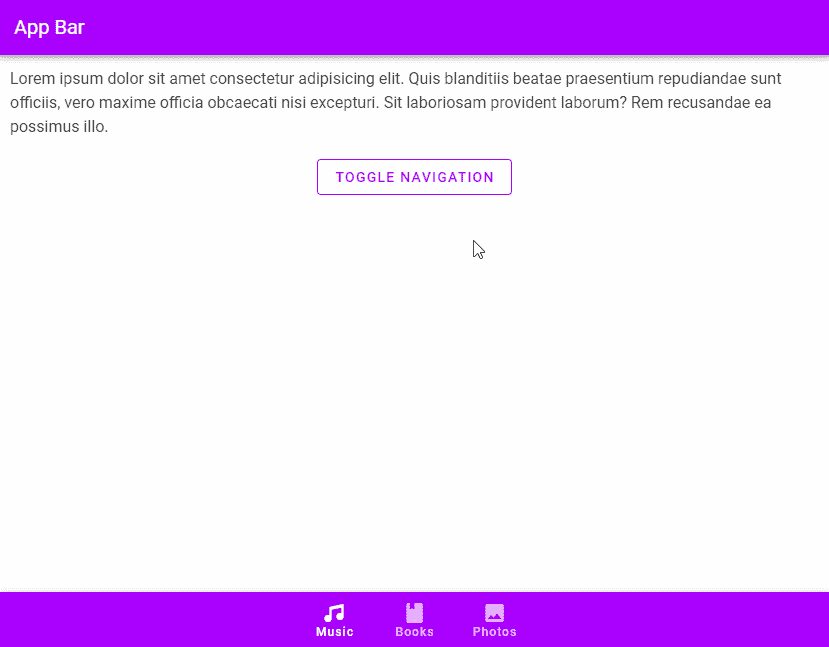

# 结论

我们可以使用底部导航栏来代替侧边栏或[导航抽屉](https://codingbeautydev.com/blog/vuetify-navigation-drawer/)，以便快速轻松地导航到我们应用程序中的重要目的地。Vuetify 提供了底部导航组件(`v-bottom-navigation`)用于创建底部导航栏。

*获得关于 Vuetify、Vue、JavaScript 等的每周提示和教程:【http://eepurl.com/hRfyJL[T21](http://eepurl.com/hRfyJL)*

*更新于:*[*codingbeautydev.com*](https://codingbeautydev.com/blog/vuetify-bottom-navigation/)