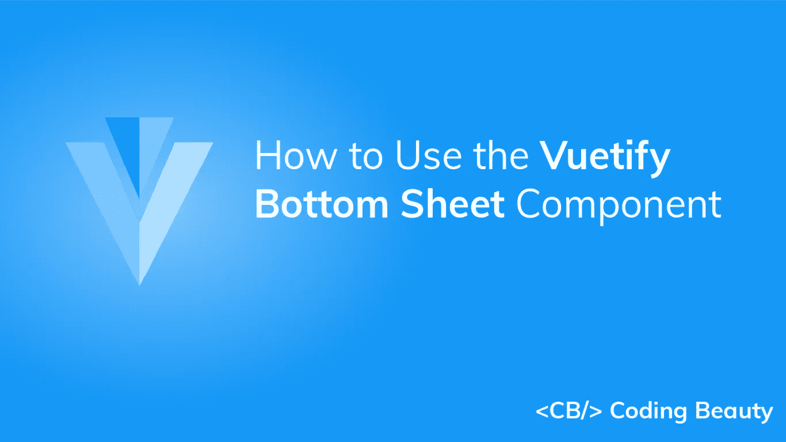

# 如何使用 Vuetify 底板组件

> 原文：<https://javascript.plainenglish.io/vuetify-bottom-sheet-30f74e0e644b?source=collection_archive---------14----------------------->

## 关于使用“验证底部表单”组件创建显示补充信息和操作的底部表单的全面指南



底部表单是一个定制的 [v 型对话框](https://codingbeautydev.com/blog/vuetify-dialog/)，它固定在屏幕的底部，就像 [v 型底部导航](https://codingbeautydev.com/blog/vuetify-bottom-navigation/)。它们主要用于手机，可以包含补充信息和动作。在本文中，我们将学习如何使用 Vuetify 底部表单组件轻松创建和定制底部表单。

# v 形底板组件(v 形底板)

Vuetify 提供了用于创建底层表单的`v-bottom-sheet`组件。像 [v-dialog](https://codingbeautydev.com/blog/vuetify-dialog/) 一样，这个组件带有一个`activator`槽，我们可以用它来设置一个[按钮](https://codingbeautydev.com/blog/vuetify-button/)，当点击它时会打开表单。

```
<template>
  <v-app>
    <div class="ma-4 text-center">
      <v-bottom-sheet v-model="sheet">
        <template v-slot:activator="{ on, attrs }">
          <v-btn
            v-bind="attrs"
            v-on="on"
            color="primary"
          >
            Open Sheet
          </v-btn>
        </template>
        <v-sheet
          class="text-center"
          height="200px"
        >
          <v-btn
            class="mt-6"
            text
            color="red"
            @click="sheet = !sheet"
          >
            close
          </v-btn>
          <div class="my-3">This is a bottom sheet</div>
        </v-sheet>
      </v-bottom-sheet>
    </div>
  </v-app>
</template><script>
export default {
  name: 'App',
  data: () => ({
    sheet: false,
  }),
};
</script><style>
html {
  overflow-y: auto !important;
}
</style>
```


# 隐藏覆盖

`v-bottom-sheet`带有一个`hide-overlay`道具，当设置为`true`时会移除覆盖。

```
<template>
  <v-app>
    <div class="ma-4 text-center">
      <v-bottom-sheet
        v-model="sheet"
        hide-overlay
      >
        <template v-slot:activator="{ on, attrs }">
          <v-btn
            v-bind="attrs"
            v-on="on"
            color="primary"
          >
            Open Sheet
          </v-btn>
        </template>
        <v-sheet
          class="text-center"
          height="200px"
        >
          <v-btn
            class="mt-6"
            text
            color="red"
            @click="sheet = !sheet"
          >
            close
          </v-btn>
          <div class="my-3">This is a bottom sheet.</div>
        </v-sheet>
      </v-bottom-sheet>
    </div>
  </v-app>
</template><script>
export default {
  name: 'App',
  data: () => ({
    sheet: false,
  }),
};
</script><style>
html {
  overflow-y: auto !important;
}
</style>
```


# 使底部薄板 v 型变得有价值

我们可以在`v-bottom-sheet`的`value`和一个变量之间建立一个双向绑定。然后，我们可以使用这个变量打开/关闭表单，或者有条件地显示某些内容。

```
<template>
  <v-app>
    <div class="ma-4 text-center">
      <div class="mb-4">
        The bottom sheet is {{ sheet ? 'open' : 'closed' }}
      </div>
      <v-bottom-sheet
        v-model="sheet"
        hide-overlay
      >
        <template v-slot:activator="{ on, attrs }">
          <v-btn
            v-bind="attrs"
            v-on="on"
            color="primary"
          >
            Open Sheet
          </v-btn>
        </template>
        <v-sheet
          class="text-center"
          height="200px"
        >
          <v-btn
            class="mt-6"
            text
            color="red"
            @click="sheet = !sheet"
          >
            close
          </v-btn>
          <div class="my-3">This is a bottom sheet</div>
        </v-sheet>
      </v-bottom-sheet>
    </div>
  </v-app>
</template><script>
export default {
  name: 'App',
  data: () => ({
    sheet: false,
  }),
};
</script><style>
html {
  overflow-y: auto !important;
}
</style>
```


# 用美化来美化

使用 Vuetify 材料设计框架创建优雅 web 应用程序的完整指南。


# 永久底板

默认情况下，当单击另一个元素时，打开的底部表单会关闭:


我们可以通过将`persistent`支柱设置到`v-bottom-sheet`上的`true`来防止这种情况:

```
<template>
  <v-app>
    <div class="ma-4 text-center">
      <v-bottom-sheet
        v-model="sheet"
        persistent
      >
        <template v-slot:activator="{ on, attrs }">
          <v-btn
            v-bind="attrs"
            v-on="on"
            color="primary"
          >
            Open Sheet
          </v-btn>
        </template>
        <v-sheet
          class="text-center"
          height="200px"
        >
          <v-btn
            class="mt-6"
            text
            color="red"
            @click="sheet = !sheet"
          >
            close
          </v-btn>
          <div class="my-3">This is a bottom sheet.</div>
        </v-sheet>
      </v-bottom-sheet>
    </div>
  </v-app>
</template><script>
export default {
  name: 'App',
  data: () => ({
    sheet: false,
  }),
};
</script><style>
html {
  overflow-y: auto !important;
}
</style>
```


# 使底部工作表插入变得有价值

在更大的屏幕上，`inset`支柱将`v-bottom-sheet`的最大宽度减小到`70%`。我们也可以使用`width`支柱手动减小宽度。

```
<template>
  <v-app>
    <div class="ma-4 text-center">
      <v-bottom-sheet
        v-model="sheet"
        inset
      >
        <template v-slot:activator="{ on, attrs }">
          <v-btn
            v-bind="attrs"
            v-on="on"
            color="primary"
          >
            Open Sheet
          </v-btn>
        </template>
        <v-sheet
          class="text-center"
          height="200px"
        >
          <v-btn
            class="mt-6"
            text
            color="red"
            @click="sheet = !sheet"
          >
            close
          </v-btn>
          <div class="my-3">This is a bottom sheet.</div>
        </v-sheet>
      </v-bottom-sheet>
    </div>
  </v-app>
</template><script>
export default {
  name: 'App',
  data: () => ({
    sheet: false,
  }),
};
</script><style>
html {
  overflow-y: auto !important;
}
</style>
```


# 创建“打开”组件

我们可以将功能列表[和底部表单](https://codingbeautydev.com/blog/vuetify-list/)结合起来，创建一个“打开”组件。

```
<template>
  <v-app>
    <div class="ma-4 text-center">
      <v-bottom-sheet v-model="sheet">
        <template v-slot:activator="{ on, attrs }">
          <v-btn
            v-bind="attrs"
            v-on="on"
            color="green"
            dark
          >
            Open in
          </v-btn>
        </template>
        <v-list>
          <v-subheader>Open in</v-subheader>
          <v-list-item
            v-for="(app, i) in apps"
            :key="i"
            @click="sheet = false"
          >
            <v-list-item-title>{{ app }}</v-list-item-title>
          </v-list-item>
        </v-list>
      </v-bottom-sheet>
    </div>
  </v-app>
</template><script>
export default {
  name: 'App',
  data: () => ({
    sheet: false,
    apps: ['Firefox', 'Chrome', 'Edge', 'Opera'],
  }),
};
</script><style>
html {
  overflow-y: auto !important;
}
</style>
```


# 结论

底部表单固定在屏幕底部，可用于显示补充内容。Vuetify 提供了用于创建和定制它们的 Vuetify 底部表单组件(`v-bottom-sheet`)。

# 提升你的技能

每周获取新的 web 开发技巧和教程。


[**订阅**](https://codingbeautydev.com/newsletter/)

在这里 获得免费副本 [**。**](https://mailchi.mp/583226ee0d7b/beautify-with-vuetify)