# 如何使用 Vuetify 日历组件

> 原文：<https://javascript.plainenglish.io/vuetify-calendar-77b3d7114a35?source=collection_archive---------2----------------------->

## 了解有关使用 Vuetify 日历组件创建显示事件和其他信息的日历的所有信息。

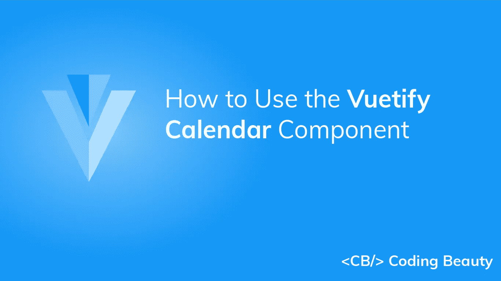

在本文中，我们将了解 Vuetify calendar 组件及其各种用于创建和定制日历的道具和插槽，这些日历可以以各种方式显示事件和其他与时间相关的信息。

# 虚拟日历组件(虚拟日历)

Vuetify 提供了用于显示日历的`v-calendar`组件。

```
<template>
  <v-app>
    <div
      class="ma-4"
      style="height: 100%"
    >
      <v-calendar></v-calendar>
    </div>
  </v-app>
</template><script>
export default {
  name: 'App',
};
</script>
```

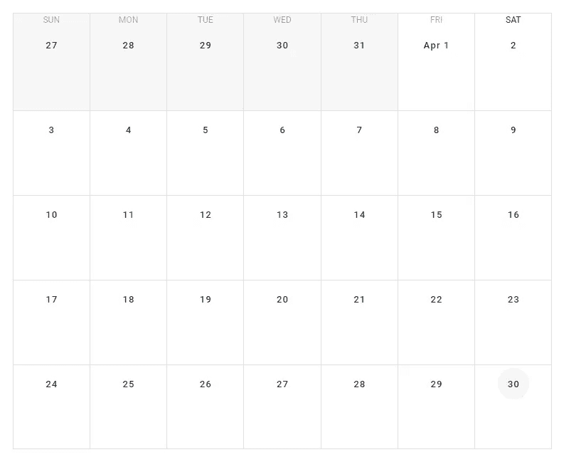

# 验证日历事件

我们可以用`events`属性在日历中显示事件。该属性采用一个数组，每个元素表示一个事件。数组中的每一项都是一个具有许多属性的对象，包括:

*   `name`:设置事件的名称。
*   `start`:设置事件的开始日期。
*   `end`:设置事件的结束日期。
*   `timed`:指定事件是否有定义的时间范围。

```
<template>
  <v-app>
    <div
      class="ma-4"
      style="height: 100%"
    >
      <v-calendar
        :events="events"
        now="2022-04-17"
      ></v-calendar>
    </div>
  </v-app>
</template><script>
export default {
  name: 'App',
  data: () => {
    return {
      events: [
        {
          name: 'Event 1',
          start: '2022-04-01',
          timed: false,
        },
        {
          name: 'Event 2',
          start: '2022-04-05',
          end: '2022-04-07',
        },
        {
          name: 'Event 3',
          start: '2022-04-09T08:00:00',
          end: '2022-04-09T10:00:00',
          timed: true,
        },
      ],
    };
  },
};
</script>
```

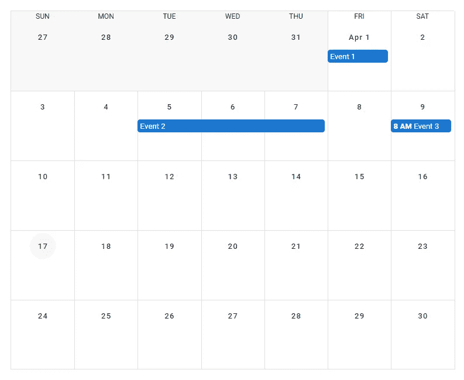

# 美化日历颜色

`v-calendar`组件提供了各种定制其不同部分的[颜色](https://codingbeautydev.com/blog/vuetify-colors/)的方法。例如，我们可以通过向表示事件的对象的`color`属性传递一个值来设置单个事件的`[color](https://codingbeautydev.com/blog/vuetify-colors/)`:

```
<template>
  <v-app>
    <div
      class="ma-4"
      style="height: 100%"
    >
      <v-calendar
        :events="events"
        now="2022-04-17"
      ></v-calendar>
    </div>
  </v-app>
</template><script>
export default {
  name: 'App',
  data: () => {
    return {
      events: [
        {
          name: 'Event 1',
          start: '2022-04-01',
          timed: false,
          color: 'green',
        },
        {
          name: 'Event 2',
          start: '2022-04-05',
          end: '2022-04-07',
          color: 'yellow darken-3',
        },
        {
          name: 'Event 3',
          start: '2022-04-09T08:00:00',
          end: '2022-04-09T10:00:00',
          timed: true,
          color: 'red',
        },
      ],
    };
  },
};
</script>
```

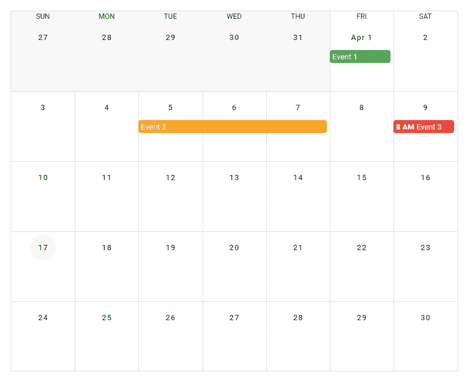

## 事件-颜色和颜色道具

我们也可以使用`event-color`属性来设置所有没有指定[颜色](https://codingbeautydev.com/blog/vuetify-colors/)的事件的[颜色](https://codingbeautydev.com/blog/vuetify-colors/)。`v-calendar`的`color`道具设置表示日历中当前日期的圆圈的[颜色](https://codingbeautydev.com/blog/vuetify-colors/)，以及当前星期几的[颜色](https://codingbeautydev.com/blog/vuetify-colors/)。

```
<template>
  <v-app>
    <div
      class="ma-4"
      style="height: 100%"
    >
      <v-calendar
        :events="events"
        now="2022-04-17"
        event-color="red accent-2"
        color="red accent-2"
      >
      </v-calendar>
    </div>
  </v-app>
</template><script>
export default {
  name: 'App',
  data: () => {
    return {
      events: [
        {
          name: 'Event 1',
          start: '2022-04-01',
          timed: false,
        },
        {
          name: 'Event 2',
          start: '2022-04-05',
          end: '2022-04-07',
        },
        {
          name: 'Event 3',
          start: '2022-04-09T08:00:00',
          end: '2022-04-09T10:00:00',
          timed: true,
        },
      ],
    };
  },
};
</script>
```

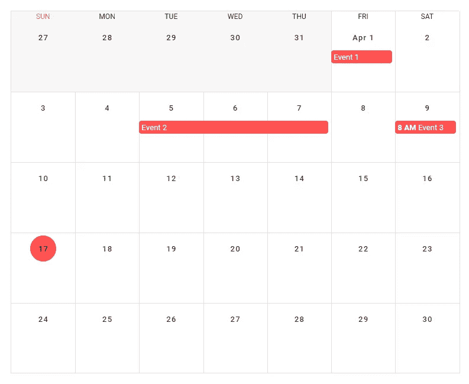

# 用美化来美化

使用 Vuetify 材料设计框架创建优雅 web 应用程序的完整指南。


在 这里免费获得一份 [**。**](https://mailchi.mp/583226ee0d7b/beautify-with-vuetify)

# 验证日历日视图

默认情况下，日历组件显示每个月的信息。我们可以用`type`道具自定义日历显示的视图。我们可以通过将`type`设置为`day`来显示某一天的信息:

```
<template>
  <v-app>
    <div
      class="ma-4"
      style="height: 100%"
    >
      <v-calendar
        :events="events"
        now="2022-04-17"
        value="2022-04-20"
        type="day"
      ></v-calendar>
    </div>
  </v-app>
</template><script>
export default {
  name: 'App',
  data: () => {
    return {
      events: [
        {
          name: 'Event 1',
          start: '2022-04-20T02:00:00',
          end: '2022-04-20T04:00:00',
          timed: true,
        },
        {
          name: 'Event 2',
          start: '2022-04-20T05:00:00',
          end: '2022-04-20T06:00:00',
          timed: true,
        },
        {
          name: 'Event 3',
          start: '2022-04-20T09:00:00',
          end: '2022-04-20T10:00:00',
          timed: true,
        },
      ],
    };
  },
};
</script>
```

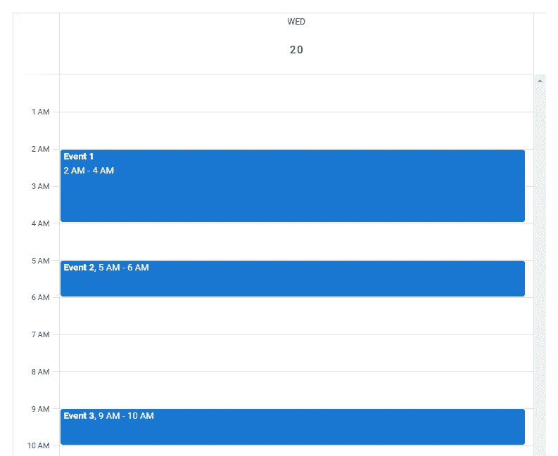

# 日历日视图槽

## 日标题和时间间隔

我们使用`v-calendar`组件的各种插槽来定制日历在日视图中的显示方式。我们可以使用`day-header`槽定制放置在日视图顶部容器中的内容。我们还有`interval`槽，用于定制放置在日视图的间隔空间中的内容。

```
<template>
  <v-app>
    <div
      class="ma-4"
      style="height: 100%"
    >
      <v-calendar
        :events="events"
        now="2022-04-17"
        value="2022-04-20"
        type="day"
      >
        <template v-slot:day-header="{ present }">
          <div
            v-if="present"
            class="text-center"
          >
            Today
          </div>
        </template> <template v-slot:interval="{ hour }">
          <div class="text-center">{{ hour }} o'clock</div>
        </template>
      </v-calendar>
    </div>
  </v-app>
</template><script>
export default {
  name: 'App',
  data: () => {
    return {
      events: [
        {
          name: 'Event 1',
          start: '2022-04-20T02:00:00',
          end: '2022-04-20T04:00:00',
          timed: true,
        },
        {
          name: 'Event 2',
          start: '2022-04-20T05:00:00',
          end: '2022-04-20T06:00:00',
          timed: true,
        },
        {
          name: 'Event 3',
          start: '2022-04-20T09:00:00',
          end: '2022-04-20T10:00:00',
          timed: true,
        },
      ],
    };
  },
};
</script>
```

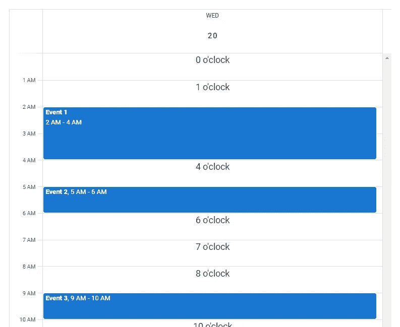

## 日体

day-body 槽允许我们在日历的日视图中定制可滚动间隔容器中的内容。

```
<template>
  <v-app>
    <div
      class="ma-4"
      style="height: 100%"
    >
      <v-calendar
        ref="calendar"
        type="week"
        value="2022-04-13"
      >
        <template v-slot:day-body="{ date, week }">
          <div
            class="current-time"
            :class="{ first: date === week[0].date }"
            :style="{ top: nowY }"
          ></div>
        </template>
      </v-calendar>
    </div>
  </v-app>
</template><script>
export default {
  name: 'App',
  data: () => ({
    ready: false,
  }),
  computed: {
    cal() {
      return this.ready ? this.$refs.calendar : null;
    },
    nowY() {
      return this.cal
        ? this.cal.timeToY({ hour: 8, minute: 10 }) + 'px'
        : '-10px';
    },
  },
  mounted() {
    this.ready = true;
    this.scrollToTime();
    this.updateTime();
  },
  methods: {
    getCurrentTime() {
      return this.cal
        ? this.cal.times.now.hour * 60 +
            this.cal.times.now.minute
        : 0;
    },
    scrollToTime() {
      const time = this.getCurrentTime();
      const first = Math.max(0, time - (time % 30) - 30);
      this.cal.scrollToTime(first);
    },
    updateTime() {
      setInterval(() => this.cal.updateTimes(), 60 * 1000);
    },
  },
};
</script><style lang="scss">
.current-time {
  height: 2px;
  background-color: red;
  position: absolute;
  left: -1px;
  right: 0;
  pointer-events: none; &.first::before {
    content: '';
    position: absolute;
    background-color: red;
    width: 12px;
    height: 12px;
    border-radius: 50%;
    margin-top: -5px;
    margin-left: -6.5px;
  }
}
</style>
```

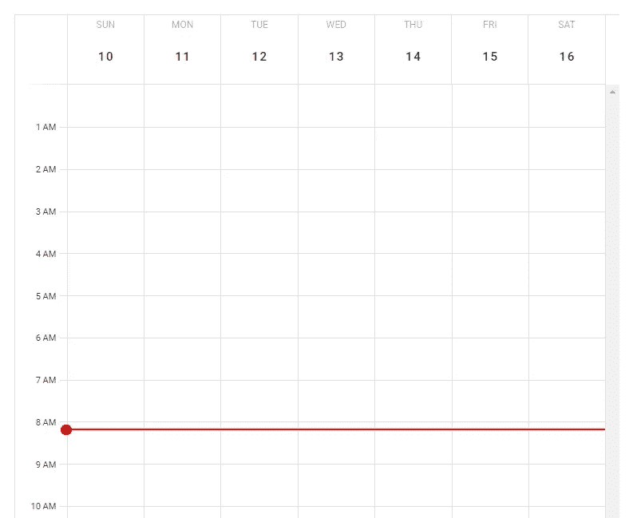

# 日历周视图

我们可以将`type`属性设置为`week`，使日历只显示特定一周的信息:

```
<template>
  <v-app>
    <div
      class="ma-4"
      style="height: 100%"
    >
      <v-calendar
        :events="events"
        type="week"
        event-color="indigo"
        value="2022-04-16"
        now="2022-04-16"
      >
      </v-calendar>
    </div>
  </v-app>
</template><script>
export default {
  name: 'App',
  data: () => {
    return {
      events: [
        {
          name: 'Event 1',
          start: '2022-04-10T02:00:00',
          end: '2022-04-10T04:00:00',
          timed: true,
        },
        {
          name: 'Event 2',
          start: '2022-04-12T08:00:00',
          end: '2022-04-12T10:00:00',
          timed: true,
        },
        {
          name: 'Event 3',
          start: '2022-04-15T04:00:00',
          end: '2022-04-15T06:00:00',
          timed: true,
        },
      ],
    };
  },
};
</script>
```

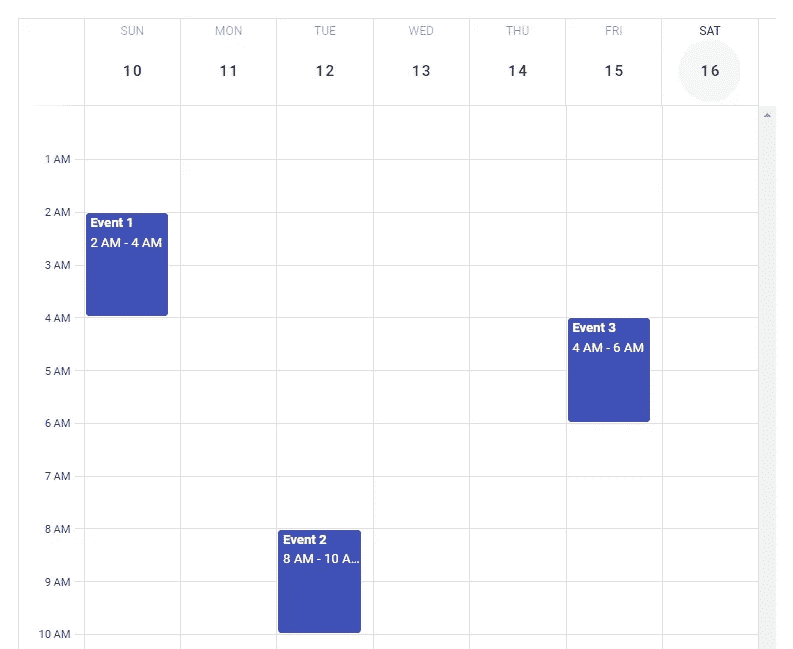

# 验证日历点击事件

`v-calendar`附带了一些点击事件，我们可以用它们来增加日历的互动性。例如，当用户单击日历中的某一天时，我们可以监听`@click:day`事件来执行一个动作。类似地，我们可以监听`@click:event`事件，当用户点击日历中的事件时执行一个动作。在下面的代码示例中，我们使用了这两个 click 事件。

```
<template>
  <v-app>
    <div
      class="ma-4"
      style="height: 100%"
    >
      <!-- Event details menu -->
      <v-menu
        v-model="selectedOpen"
        :close-on-content-click="false"
        :activator="selectedElement"
        offset-x
      >
        <v-card min-width="200px">
          <v-toolbar
            color="purple accent-4"
            dark
          >
            <v-toolbar-title>
              {{ selectedEvent.name }}
            </v-toolbar-title>
          </v-toolbar>
          <v-card-text>
            <div class="text-center">
              {{ selectedEventStart }}
              to
              {{ selectedEventEnd }}
            </div>
            <v-checkbox
              readonly
              label="All day"
              :value="!selectedEvent.timed"
            >
            </v-checkbox>
          </v-card-text>
        </v-card>
      </v-menu>
      <v-calendar
        :events="events"
        event-color="purple accent-4"
        @click:day="viewDay"
        @click:event="showEvent"
        v-model="focus"
        :type="type"
        now="2022-04-23"
      ></v-calendar>
    </div>
  </v-app>
</template><script>
import { format } from 'date-fns';export default {
  name: 'App',
  data: () => {
    return {
      focus: '',
      type: 'month',
      selectedOpen: false,
      selectedElement: undefined,
      selectedEvent: {},
      events: [
        {
          name: 'Event 1',
          start: '2022-04-01',
          timed: false,
        },
        {
          name: 'Event 2',
          start: '2022-04-04',
          end: '2022-04-06',
        },
        {
          name: 'Event 3',
          start: '2022-04-04T05:00:00',
          end: '2022-04-04T07:00:00',
          timed: true,
        },
        {
          name: 'Event 4',
          start: '2022-04-08T08:00:00',
          end: '2022-04-08T10:00:00',
          timed: true,
        },
      ],
    };
  },
  methods: {
    viewDay({ date }) {
      this.focus = date;
      this.type = 'day';
    },
    showEvent({ nativeEvent, event }) {
      const open = () => {
        this.selectedEvent = event;
        this.selectedElement = nativeEvent.target;
        requestAnimationFrame(() =>
          requestAnimationFrame(
            () => (this.selectedOpen = true)
          )
        );
      }; if (this.selectedOpen) {
        this.selectedOpen = false;
        requestAnimationFrame(() =>
          requestAnimationFrame(() => open())
        );
      } else {
        open();
      } nativeEvent.stopPropagation();
    },
  },
  computed: {
    selectedEventStart() {
      return (
        (this.selectedEvent &&
          this.selectedEvent.start &&
          format(
            new Date(this.selectedEvent.start),
            'h:mm a'
          )) ||
        '12:00 AM'
      );
    },
    selectedEventEnd() {
      return (
        (this.selectedEvent &&
          this.selectedEvent.end &&
          format(
            new Date(this.selectedEvent.end),
            'h:mm a'
          )) ||
        '12:00 AM'
      );
    },
  },
};
</script>
```

日历在月视图中开始。当用户单击某一天时，我们将日历更改为日视图:


我们还创建了一个[菜单](https://codingbeautydev.com/blog/vuetify-menu/),当用户在日或月视图中单击它时，它将显示关于事件的信息:

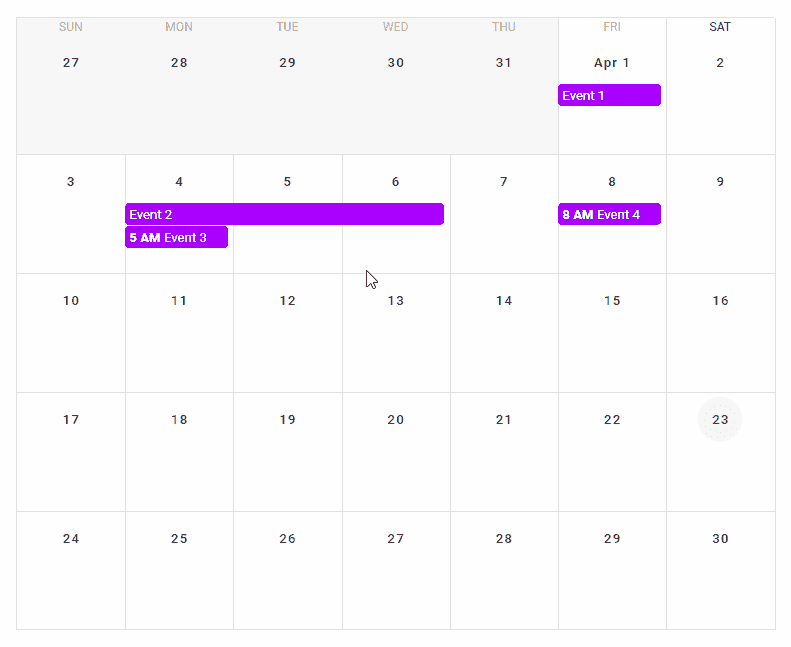

# 日历日时段

我们可以使用`v-calendar`的日槽定制在周或月视图中如何显示一天。在下面的例子中，我们使用这个槽来创建一个日历，显示某个类别的活动在一天中所占的百分比。

```
<template>
  <v-app>
    <div
      class="ma-4"
      style="height: 100%"
    >
      <v-calendar
        :now="today"
        :value="today"
        color="primary"
      >
        <template v-slot:day="{ past, date }">
          <v-row class="fill-height">
            <template v-if="past && tracked[date]">
              <v-sheet
                v-for="(percent, i) in tracked[date]"
                :key="i"
                :title="category[i]"
                :color="colors[i]"
                :width="`${percent}%`"
                height="100%"
                tile
              ></v-sheet>
            </template>
          </v-row>
        </template>
      </v-calendar>
    </div>
  </v-app>
</template><script>
export default {
  name: 'App',
  data: () => ({
    today: '2022-04-11',
    tracked: {
      '2022-04-01': [20, 45, 10],
      '2022-04-02': [40, 30, 0],
      '2022-04-03': [10, 25, 50],
      '2022-04-04': [25, 25, 20],
      '2022-04-05': [20],
      '2022-04-06': [20, 60, 10],
      '2022-04-07': [0, 0, 25],
      '2022-04-08': [60, 15, 20],
      '2022-04-09': [45, 0, 5],
      '2022-04-10': [30, 20, 20],
    },
    colors: ['blue', 'yellow darken-3', 'red accent-2'],
    category: ['Category 1', 'Category 2', 'Category 3'],
  }),};
</script>
```

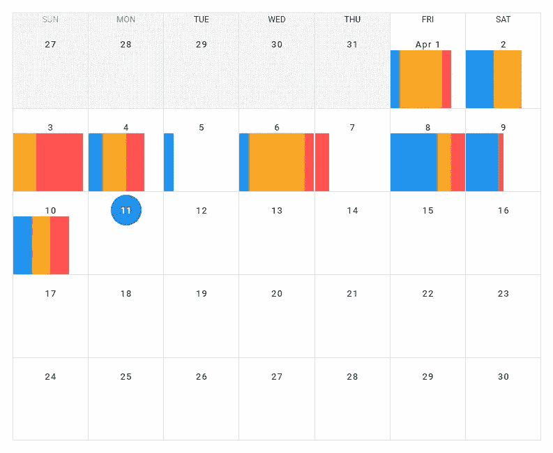

# 结论

我们可以使用 Vuetify calendar 组件(`v-calendar`)来创建一个日历，向我们的应用程序显示事件和其他信息。这个组件附带了各种各样的道具和插槽，我们可以使用它们轻松地定制它的外观和行为。

*获得关于 Vuetify、Vue.js、JavaScript 等的每周提示和教程:*[*http://eepurl.com/hRfyJL*](http://eepurl.com/hRfyJL)

*更新于:*[*【codingbeautydev.com】*](https://codingbeautydev.com/blog/vuetify-calendar/)