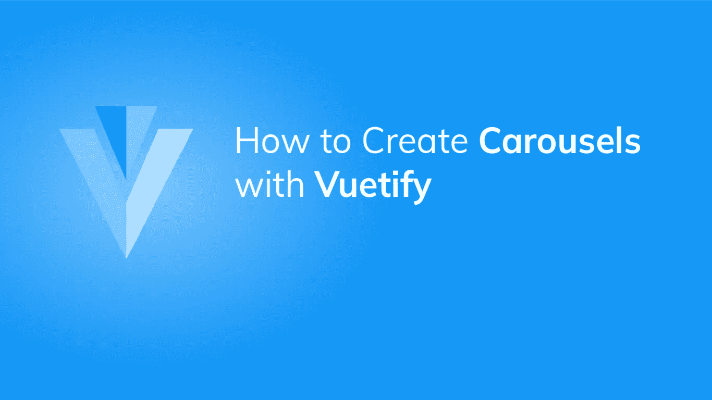

# 如何用 Vuetify 创建旋转木马

> 原文：<https://javascript.plainenglish.io/vuetify-carousel-758d694029cb?source=collection_archive---------16----------------------->



圆盘传送带对于在循环视图中显示大量图像非常有用。它附带的功能允许用户一个接一个地查看图像。它允许多个相关的可视内容占据相同的屏幕空间。在本文中，我们将学习如何使用 Vuetify 创建和定制旋转木马。

# v 形转盘组件

Vuetify 提供了用于创建传送带的`v-carousel`组件。我们可以通过向`v-carousel`添加一个新的`v-carousel-item`组件来在转盘中创建一个幻灯片。这里我们创建了 7 张幻灯片，每张幻灯片代表彩虹的一种颜色。

```
<template>
  <v-app>
    <v-carousel>
      <v-carousel-item v-for="color in colors" :key="color">
        <v-sheet :color="color" height="100%" tile>
          <v-row class="fill-height" align="center" justify="center">
            <div class="text-h2">
              {{ color }}
            </div>
          </v-row>
        </v-sheet>
      </v-carousel-item>
    </v-carousel>
  </v-app>
</template>
<script>
export default {
  name: 'App',
  data: () => ({
    colors: ['red', 'orange', 'yellow', 'green', 'blue', 'indigo', '#7f00ff'],
  }),
};
</script>
```

默认情况下，转盘将始终显示第一张幻灯片:


我们可以用显示的箭头改变当前幻灯片。左箭头将显示上一张幻灯片，而右箭头将显示下一张幻灯片:


# 转盘分隔符图标

转盘带有分隔符，指示转盘拥有的幻灯片数量以及当前正在播放的幻灯片数量。`v-carousel`带有`delimiter-icon`道具，允许我们用任何可用的图标定制分隔符图标。

```
<template>
  <v-app>
    <v-carousel delimiter-icon="mdi-minus">
      <v-carousel-item v-for="color in colors" :key="color">
        <v-sheet :color="color" height="100%" tile>
          <v-row class="fill-height" align="center" justify="center">
            <div class="text-h2">
              {{ color }}
            </div>
          </v-row>
        </v-sheet>
      </v-carousel-item>
    </v-carousel>
  </v-app>
</template>
<script>
export default {
  name: 'App',
  data: () => ({
    colors: ['red', 'orange', 'yellow', 'green', 'blue', 'indigo', '#7f00ff'],
  }),
};
</script>
```


# 自定义转盘过渡

使用`transition`道具定制转盘用于显示下一幅图像的过渡。

```
<template>
  <v-app>
    <v-carousel>
      <v-carousel-item
        v-for="color in colors"
        :key="color"
        transition="fade-transition"
      >
        <v-sheet :color="color" height="100%" tile>
          <v-row class="fill-height" align="center" justify="center">
            <div class="text-h2">
              {{ color }}
            </div>
          </v-row>
        </v-sheet>
      </v-carousel-item>
    </v-carousel>
  </v-app>
</template>
<script>
export default {
  name: 'App',
  data: () => ({
    colors: ['red', 'orange', 'yellow', 'green', 'blue', 'indigo', '#7f00ff'],
  }),
};
</script>
```

您也可以使用`reverse-transition`道具更改转盘用于显示前一幅图像的过渡:

```
<template>
  <v-app>
    <v-carousel>
      <v-carousel-item
        v-for="color in colors"
        :key="color"
        transition="fade-transition"
        reverse-transition="fade-transition"
      >
        <v-sheet :color="color" height="100%" tile>
          <v-row class="fill-height" align="center" justify="center">
            <div class="text-h2">
              {{ color }}
            </div>
          </v-row>
        </v-sheet>
      </v-carousel-item>
    </v-carousel>
  </v-app>
</template>
<script>
export default {
  name: 'App',
  data: () => ({
    colors: ['red', 'orange', 'yellow', 'green', 'blue', 'indigo', '#7f00ff'],
  }),
};
</script>
```

# 用美化来美化

使用 Vuetify 材料设计框架创建优雅 web 应用程序的完整指南。


在这里免费获得[](https://mailchi.mp/583226ee0d7b/beautify-with-vuetify)****。****

# **自动转盘转换**

## **循环**

**将`cycle`道具设置为`v-carousel`上的`true`会使其在设定的时间后自动转换到下一张幻灯片。**

```
<template>
  <v-app>
    <v-carousel cycle>
      <v-carousel-item
        v-for="color in colors"
        :key="color"
      >
        <v-sheet :color="color" height="100%" tile>
          <v-row class="fill-height" align="center" justify="center">
            <div class="text-h2">
              {{ color }}
            </div>
          </v-row>
        </v-sheet>
      </v-carousel-item>
    </v-carousel>
  </v-app>
</template>
<script>
export default {
  name: 'App',
  data: () => ({
    colors: ['red', 'orange', 'yellow', 'green', 'blue', 'indigo', '#7f00ff'],
  }),
};
</script>
```

## **间隔**

**默认情况下，当`cycle`道具设置为`true`时，转盘显示每张幻灯片的时间间隔为 6 秒，然后自动转换到下一张幻灯片。我们可以用`interval`道具修改这个间隔。**

```
<template>
  <v-app>
    <v-carousel cycle interval="1000">
      <v-carousel-item v-for="color in colors" :key="color">
        <v-sheet :color="color" height="100%" tile>
          <v-row class="fill-height" align="center" justify="center">
            <div class="text-h2">
              {{ color }}
            </div>
          </v-row>
        </v-sheet>
      </v-carousel-item>
    </v-carousel>
  </v-app>
</template>
<script>
export default {
  name: 'App',
  data: () => ({
    colors: ['red', 'orange', 'yellow', 'green', 'blue', 'indigo', '#7f00ff'],
  }),
};
</script>
```

# **隐藏导航控件**

**我们可以通过将`show-arrows`属性设置为`false`来隐藏转盘的导航控件:**

```
<template>
  <v-app>
    <v-carousel :show-arrows="false">
      <v-carousel-item v-for="color in colors" :key="color">
        <v-sheet :color="color" height="100%" tile>
          <v-row class="fill-height" align="center" justify="center">
            <div class="text-h2">
              {{ color }}
            </div>
          </v-row>
        </v-sheet>
      </v-carousel-item>
    </v-carousel>
  </v-app>
</template>
<script>
export default {
  name: 'App',
  data: () => ({
    colors: ['red', 'orange', 'yellow', 'green', 'blue', 'indigo', '#7f00ff'],
  }),
};
</script>
```

****

**我们可能想让 carousel 只在鼠标悬停在它上面时显示它的导航控件。我们可以通过将`show-arrows-on-hover`属性设置为`true`来实现这一点:**

```
<template>
  <v-app>
    <v-carousel :show-arrows-on-hover="true">
      <v-carousel-item v-for="color in colors" :key="color">
        <v-sheet :color="color" height="100%" tile>
          <v-row class="fill-height" align="center" justify="center">
            <div class="text-h2">
              {{ color }}
            </div>
          </v-row>
        </v-sheet>
      </v-carousel-item>
    </v-carousel>
  </v-app>
</template>
<script>
export default {
  name: 'App',
  data: () => ({
    colors: ['red', 'orange', 'yellow', 'green', 'blue', 'indigo', '#7f00ff'],
  }),
};
</script>
```

**现在，只有当鼠标悬停在转盘上时，您才能看到它的控件:**

****

# **定制箭头**

**我们可以定制带有`prev`和`next`槽的旋转箭头。**

```
<template>
  <v-app>
    <v-carousel>
      <template v-slot:prev="{ on, attrs }">
        <v-btn color="green" v-bind="attrs" v-on="on"> Previous </v-btn>
      </template>
      <template v-slot:next="{ on, attrs }">
        <v-btn color="blue" v-bind="attrs" v-on="on">Next</v-btn>
      </template>
      <v-carousel-item v-for="color in colors" :key="color">
        <v-sheet :color="color" height="100%" tile>
          <v-row class="fill-height" align="center" justify="center">
            <div class="text-h2">
              {{ color }}
            </div>
          </v-row>
        </v-sheet>
      </v-carousel-item>
    </v-carousel>
  </v-app>
</template>
<script>
export default {
  name: 'App',
  data: () => ({ colors: ['red', 'orange', 'yellow', 'green', 'blue', 'indigo', '#7f00ff'],
  }),
};
</script>
```

**** **[## 创建一个丰富多彩的彩虹旋转木马应用程序

### 这是我们今天要创造的东西:你将会看到建造这样的东西是多么容易，拥有令人敬畏的力量…

codingbeautydev.com](https://codingbeautydev.com/blog/vuetify-rainbow-carousel-app/)** 

# **隐藏转盘分隔符**

**将`hide-delimiters`道具设置为`true`将隐藏转盘的底部控制。**

```
<template>
  <v-app>
    <v-carousel hide-delimiters>
      <v-carousel-item v-for="color in colors" :key="color">
        <v-sheet :color="color" height="100%" tile>
          <v-row class="fill-height" align="center" justify="center">
            <div class="text-h2">
              {{ color }}
            </div>
          </v-row>
        </v-sheet>
      </v-carousel-item>
    </v-carousel>
  </v-app>
</template>
<script>
export default {
  name: 'App',
  data: () => ({
    colors: ['red', 'orange', 'yellow', 'green', 'blue', 'indigo', '#7f00ff'],
  }),
};
</script>
```

****

# **使用 v-model 的双向绑定**

**我们可以使用`v-carousel`上的`v-model`来设置当前转盘幻灯片和变量之间的双向绑定。在下面的代码中，我们创建了一个 carousel，并在它下面显示了当前幻灯片的索引和`carousel`变量:**

```
<template>
  <v-app
    <v-carousel v-model="carousel">
      <v-carousel-item v-for="color in colors" :key="color">
        <v-sheet :color="color" height="100%" tile>
          <v-row class="fill-height" align="center" justify="center">
            <div class="text-h2">
              {{ color }}
            </div>
          </v-row>
        </v-sheet>
      </v-carousel-item>
    </v-carousel>
    <div class="d-flex justify-center mt-2">Slide: {{ carousel }}</div>
  </v-app>
</template>
<script>
export default {
  name: 'App',
  data: () => ({
    carousel: 0,
    colors: ['red', 'orange', 'yellow', 'green', 'blue', 'indigo', '#7f00ff'],
  }),
};
</script>
```

****

**更改显示的转盘幻灯片会更新`carousel`，从而更新文本:**

****

**现在，让我们在文本下方添加两个[按钮](https://codingbeautydev.com/blog/vuetify-button/)来更改显示的转盘幻灯片:**

```
<template>
  <v-app>
    <v-carousel v-model="carousel">
      <v-carousel-item v-for="color in colors" :key="color">
        <v-sheet :color="color" height="100%" tile>
          <v-row class="fill-height" align="center" justify="center">
            <div class="text-h2">
              {{ color }}
            </div>
          </v-row>
        </v-sheet>
      </v-carousel-item>
    </v-carousel>
    <div class="d-flex justify-center mt-2">Slide: {{ carousel }}</div>
    <div class="d-flex justify-center mt-2">
      <v-btn class="mr-2" color="green" dark @click="carousel--"
        >Previous</v-btn
      >
      <v-btn class="ml-2" color="blue" dark @click="carousel++">Next</v-btn>
    </div>
  </v-app>
</template>
<script>
export default {
  name: 'App',
  data: () => ({
    carousel: 0,
    colors: ['red', 'orange', 'yellow', 'green', 'blue', 'indigo', '#7f00ff'],
  }),
};
</script>
```

****

**“上一张”按钮使`carousel`递减，使转盘转到上一张幻灯片，而“下一张”按钮使`carousel`递增，使转盘转到下一张幻灯片:**

****

# **摘要**

**我们在用户界面中使用一个轮播，在同一个屏幕空间中显示大量相关的可视内容。使用`v-carousel`和 v- `carousel-item`组件创建一个转盘，并定制其行为和外观。**

**[***注册***](http://eepurl.com/hRfyJL) *订阅我们的每周时事通讯，了解关于 Vuetify 的所有最新技巧和教程。***

***在*[*codingbeautydev.com*](https://codingbeautydev.com/blog/vuetify-carousel/)*获取更新文章。***