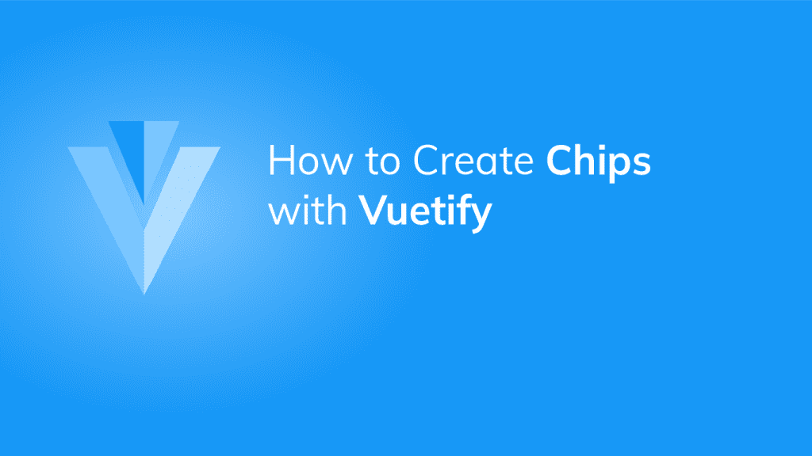

# 如何使用 Vuetify 芯片组件

> 原文：<https://javascript.plainenglish.io/vuetify-chip-68518f5acc75?source=collection_archive---------4----------------------->



芯片被用来向用户传递少量信息。它们可以是交互式的，当像[按钮](https://codingbeautydev.com/blog/vuetify-button/)一样被点击时执行某些动作，或者我们可以使用它们在[选择字段](https://codingbeautydev.com/blog/vuetify-select/)中显示选择的数据。在本文中，我们将学习如何使用 Vuetify 创建和定制芯片。

# 垂直芯片组件

Vuetify 提供了用于创建芯片的`v-chip`组件。

```
<template>
  <v-app>
    <v-row class="ma-4" justify="center">
      <v-chip>Chip Component </v-chip>
    </v-row>
  </v-app>
</template>
<script>
export default {
  name: 'App',
};
</script>
```


# 可关闭芯片

我们可以通过将`close`道具设置为`true`并监听`@click:close`事件来关闭芯片。

```
<template>
  <v-app>
    <v-row class="ma-4" justify="center">
      <v-chip v-if="chip1" class="ma-2" close @click:close="chip1 = false"
        >Chip 1</v-chip
      >
      <v-chip v-if="chip2" class="ma-2" close @click:close="chip2 = false"
        >Chip 2</v-chip
      >
      <v-chip v-if="chip3" class="ma-2" close @click:close="chip3 = false"
        >Chip 3</v-chip
      >
    </v-row>
  </v-app>
</template>
<script>
export default {
  name: 'App',
  data: () => ({
    chip1: true,
    chip2: true,
    chip3: true,
  }),
};
</script>
```

在上面的代码中，我们创建了三个可关闭的芯片。三个变量控制着`v-if`芯片的可见性:


点击芯片的关闭按钮，比如“芯片 2”，会将其可见性变量设置为`false`并将其隐藏:


# 芯片颜色

像许多 Vuetify 组件一样，`v-chip`带有`color`道具，我们可以用它来定制它的[颜色](https://codingbeautydev.com/blog/vuetify-colors/)。我们可以使用材料设计调色板中的任何颜色。

```
<template>
  <v-app>
    <v-row class="ma-4" justify="center">
      <v-chip class="ma-2">Default</v-chip>
      <v-chip class="ma-2" color="green" dark>Green</v-chip>
      <v-chip class="ma-2" color="primary">Primary</v-chip>
      <v-chip class="ma-2" color="red" dark>Red</v-chip>
    </v-row>
  </v-app>
</template>
<script>
export default {
  name: 'App',
};
</script>
```


# 用美化来美化

使用 Vuetify 材料设计框架创建优雅 web 应用程序的完整指南。


在 这里免费获得一份 [**。**](https://mailchi.mp/583226ee0d7b/beautify-with-vuetify)

# 可拖动的芯片

要使芯片可拖动，将`v-chip`的`draggable`支柱设置为`true`:

```
<template>
  <v-app>
    <v-row class="ma-4" justify="center">
      <v-chip class="ma-2" draggable>Draggable</v-chip>
    </v-row>
  </v-app>
</template>
<script>
export default {
  name: 'App',
};
</script>
```


现在可以用鼠标拖动它:


# 有源芯片滤波器

`v-chip`组件带有一个`filter`属性，当设置为`true`时，如果芯片处于活动状态，将在芯片上显示一个图标。您可以通过将芯片的`input-value`属性设置为`true`来激活芯片:

```
<template>
  <v-app>
    <v-row class="ma-4" justify="center">
      <v-chip class="ma-2" filter :input-value="true">Active Chip</v-chip>
    </v-row>
  </v-app>
</template>
<script>
export default {
  name: 'App',
};
</script>
```


默认图标是一个勾号，但是我们可以用`filter-icon`道具定制它。

```
<template>
  <v-app>
    <v-row class="ma-4" justify="center">
      <v-chip class="ma-2" filter :input-value="true" filter-icon="mdi-plus"
        >Active Chip</v-chip
      >
    </v-row>
  </v-app>
</template>
<script>
export default {
  name: 'App',
};
</script>
```


# 标签芯片

将`v-chip`上的`label`道具设置为`true`会将其边框半径改变为[卡](https://codingbeautydev.com/blog/vuetify-card/)组件(`v-card`)的边框半径:

```
<template>
  <v-app>
    <v-row class="ma-4" justify="center">
      <v-chip class="ma-2" label>Label 1</v-chip>
      <v-chip class="ma-2" label color="yellow">Label 2</v-chip>
      <v-chip class="ma-2" label color="primary">Label 3</v-chip>
    </v-row>
  </v-app>
</template>
<script>
export default {
  name: 'App',
};
</script>
```

# 纽扣芯片

我们可以用`link`道具让芯片充当[按钮](https://codingbeautydev.com/blog/vuetify-button/):

```
<template>
  <v-app>
    <div class="d-flex justify-center align-center ma-4">
      <v-chip class="ma-2" link>
        Chip Component
      </v-chip>
    </div>
  </v-app>
</template>
<script>
export default {
  name: 'App',
};
</script>
```

现在，当点击时，芯片将视觉响应并显示波纹。


## 从芯片中去除波纹

将`ripple`杆设置为`false`将消除芯片[按钮](https://codingbeautydev.com/blog/vuetify-button/)的波纹。

```
<template>
  <v-app>
    <div class="d-flex justify-center align-center ma-4">
      <v-chip class="ma-2" link :ripple="false">
        Chip Component
      </v-chip>
    </div>
  </v-app>
</template>
<script>
export default {
  name: 'App',
};
</script>
```

当点击芯片[按钮](https://codingbeautydev.com/blog/vuetify-button/)时，现在没有波纹显示:


# 轮廓薯片

我们通过将`outlined`属性设置为`true`来显示芯片的轮廓变体。轮廓筹码从当前文本[颜色](https://codingbeautydev.com/blog/vuetify-colors/)继承其边框[颜色](https://codingbeautydev.com/blog/vuetify-colors/)。

```
<template>
  <v-app>
    <v-row class="ma-4" justify="center">
      <v-chip class="ma-2" outlined color="green">Outlined 1</v-chip>
      <v-chip class="ma-2" outlined color="red">Outlined 2</v-chip>
      <v-chip class="ma-2" outlined color="indigo">Outlined 3</v-chip>
    </v-row>
  </v-app>
</template>
<script>
export default {
  name: 'App',
};
</script>
```


# 定制芯片尺寸

`v-chip`组件自带自定义大小的道具。它们是`x-small`、`small`、`large`和`x-large`。

```
<template>
  <v-app>
    <div class="d-flex justify-center align-center ma-4">
      <v-chip class="ma-2" x-small> x-small chip </v-chip>
      <v-chip class="ma-2" small> small chip </v-chip>
      <v-chip class="ma-2"> Default </v-chip>
      <v-chip class="ma-2" large> large chip </v-chip>
      <v-chip class="ma-2" x-large> x-large chip </v-chip>
    </div>
  </v-app>
</template>
<script>
export default {
  name: 'App',
};
</script>
```


# 筹码图标

我们可以在芯片中显示材料图标字体库中的任何[图标](https://codingbeautydev.com/blog/vuetify-icons/):

```
<template>
  <v-app>
    <div class="d-flex justify-center align-center ma-4">
      <v-chip class="ma-2" color="primary">
        Premium
        <v-icon right> mdi-star </v-icon>
      </v-chip>
      <v-chip class="ma-2" color="green accent-4" dark>
        <v-icon left> mdi-checkbox-marked-circle </v-icon>
        Confirmed
      </v-chip>
      <v-chip class="ma-2">
        <v-icon left>mdi-alarm</v-icon>
        7:00 AM
      </v-chip>
    </div>
  </v-app>
</template>
<script>
export default {
  name: 'App',
};
</script>
```


# 摘要

芯片有助于向用户传递细小的信息。Vuetify 提供了`v-chip`组件，用于创建带有各种道具的芯片，以进行定制。

[***注册***](http://eepurl.com/hRfyJL) *订阅我们的每周简讯，了解关于 Vuetify 和 Vue 的所有最新提示和教程。*

*到*[*codingbeautydev.com*](https://codingbeautydev.com/blog/vuetify-chip/)*获取更新文章。*