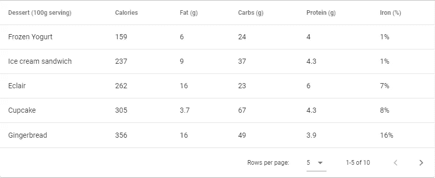
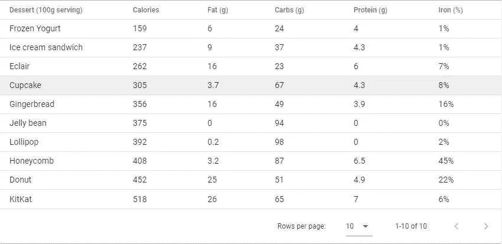
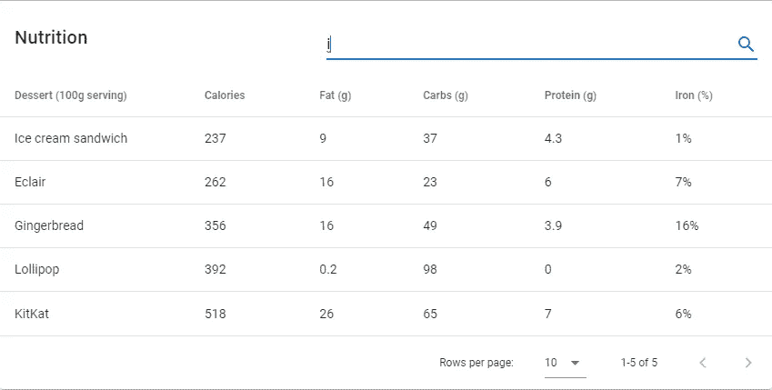
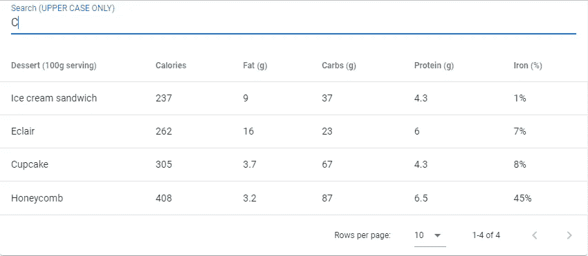

# 如何用 Vuetify 创建数据表

> 原文：<https://javascript.plainenglish.io/vuetify-data-table-ee7bcd9b514?source=collection_archive---------1----------------------->


表格是以易于理解的格式呈现结构化信息的一种很好的方式。在这篇文章中，我们将看到如何在 Vuetify 中创建数据表，它用于显示表格数据，包括某些功能，如排序、搜索、分页等。

# 垂直数据表组件

Vuetify 提供了用于创建数据表的 v-datatable 组件。这个组件的`headers`属性是一个用于配置数据表头的对象数组。这个数组中的每个对象都有一个`text`属性，它决定了为特定列显示的标题名。我们还将一个对象数组(`desserts`)传递给`items`道具。`desserts`中的每个对象对应数据表中的一行，每个属性代表该行的一个表格单元格。这些对象的属性名必须匹配`headers`数组中对象的`value`属性值之一，即(键名必须是`name`、`calories`、`fat`、`carbs`、`protein`和`iron`之一)。

我们使用`items-per-page`属性对数据表进行分页。在这里我们将它设置为 5，所以我们有 2 个页面用于 10 种甜点。

```
<template>
  <v-app>
    <v-data-table
      :headers="headers"
      :items="desserts"
      :items-per-page="5"
      class="elevation-1"
    ></v-data-table>
  </v-app>
</template>
<script>
export default {
  data() {
    return {
      headers: [
        {
          text: 'Dessert (100g serving)',
          align: 'start',
          sortable: false,
          value: 'name',
        },
        { text: 'Calories', value: 'calories' },
        { text: 'Fat (g)', value: 'fat' },
        { text: 'Carbs (g)', value: 'carbs' },
        { text: 'Protein (g)', value: 'protein' },
        { text: 'Iron (%)', value: 'iron' },
      ],
      desserts: [
        {
          name: 'Frozen Yogurt',
          calories: 159,
          fat: 6.0,
          carbs: 24,
          protein: 4.0,
          iron: '1%',
        },
        {
          name: 'Ice cream sandwich',
          calories: 237,
          fat: 9.0,
          carbs: 37,
          protein: 4.3,
          iron: '1%',
        },
        {
          name: 'Eclair',
          calories: 262,
          fat: 16.0,
          carbs: 23,
          protein: 6.0,
          iron: '7%',
        },
        {
          name: 'Cupcake',
          calories: 305,
          fat: 3.7,
          carbs: 67,
          protein: 4.3,
          iron: '8%',
        },
        {
          name: 'Gingerbread',
          calories: 356,
          fat: 16.0,
          carbs: 49,
          protein: 3.9,
          iron: '16%',
        },
        {
          name: 'Jelly bean',
          calories: 375,
          fat: 0.0,
          carbs: 94,
          protein: 0.0,
          iron: '0%',
        },
        {
          name: 'Lollipop',
          calories: 392,
          fat: 0.2,
          carbs: 98,
          protein: 0,
          iron: '2%',
        },
        {
          name: 'Honeycomb',
          calories: 408,
          fat: 3.2,
          carbs: 87,
          protein: 6.5,
          iron: '45%',
        },
        {
          name: 'Donut',
          calories: 452,
          fat: 25.0,
          carbs: 51,
          protein: 4.9,
          iron: '22%',
        },
        {
          name: 'KitKat',
          calories: 518,
          fat: 26.0,
          carbs: 65,
          protein: 7,
          iron: '6%',
        },
      ],
    };
  },
};
</script>
```

这是我们的桌子:



# 用美化来美化

使用 Vuetify 材料设计框架创建优雅 web 应用程序的完整指南。


这里免费下载[](https://mailchi.mp/583226ee0d7b/beautify-with-vuetify)****！****

# **密集数据表**

**设置`dense`属性使数据表更加紧凑，顾名思义:**

```
<template>
  <v-app>
    <v-data-table
      dense
      :headers="headers"
      :items="desserts"
      item-key="name"
      class="elevation-1"
    ></v-data-table>
  </v-app>
</template>
<script>
export default {
  data: () => ({
    desserts: [
      {
        name: 'Frozen Yogurt',
        calories: 159,
        fat: 6.0,
        carbs: 24,
        protein: 4.0,
        iron: '1%',
      },
      {
        name: 'Ice cream sandwich',
        calories: 237,
        fat: 9.0,
        carbs: 37,
        protein: 4.3,
        iron: '1%',
      },
      {
        name: 'Eclair',
        calories: 262,
        fat: 16.0,
        carbs: 23,
        protein: 6.0,
        iron: '7%',
      },
      {
        name: 'Cupcake',
        calories: 305,
        fat: 3.7,
        carbs: 67,
        protein: 4.3,
        iron: '8%',
      },
      {
        name: 'Gingerbread',
        calories: 356,
        fat: 16.0,
        carbs: 49,
        protein: 3.9,
        iron: '16%',
      },
      {
        name: 'Jelly bean',
        calories: 375,
        fat: 0.0,
        carbs: 94,
        protein: 0.0,
        iron: '0%',
      },
      {
        name: 'Lollipop',
        calories: 392,
        fat: 0.2,
        carbs: 98,
        protein: 0,
        iron: '2%',
      },
      {
        name: 'Honeycomb',
        calories: 408,
        fat: 3.2,
        carbs: 87,
        protein: 6.5,
        iron: '45%',
      },
      {
        name: 'Donut',
        calories: 452,
        fat: 25.0,
        carbs: 51,
        protein: 4.9,
        iron: '22%',
      },
      {
        name: 'KitKat',
        calories: 518,
        fat: 26.0,
        carbs: 65,
        protein: 7,
        iron: '6%',
      },
    ],
    headers: [
      {
        text: 'Dessert (100g serving)',
        align: 'start',
        sortable: false,
        value: 'name',
      },
      { text: 'Calories', value: 'calories' },
      { text: 'Fat (g)', value: 'fat' },
      { text: 'Carbs (g)', value: 'carbs' },
      { text: 'Protein (g)', value: 'protein' },
      { text: 'Iron (%)', value: 'iron' },
    ],
  }),
};
</script>
```

****

# **验证数据表搜索功能**

**我们可以用`search`属性过滤数据表上的数据。这里，我们将文本字段中输入的任何值与用于搜索表的输入绑定在一起:**

****

# **验证数据表自定义过滤器**

**我们可以通过向具有签名`(value: any, search: string | null, item: any) => boolean`的`custom-filter`属性传递一个方法来指定我们的自定义过滤函数。我们还可以通过向传递给`headers`属性的数组中的一个项目的`filter`属性提供一个函数来定制特定列的过滤:**

```
<template>
  <v-app>
    <div>
      <v-data-table
        :headers="headers"
        :items="desserts"
        item-key="name"
        class="elevation-1"
        :search="search"
        :custom-filter="filterOnlyCapsText"
      >
        <template v-slot:top>
          <v-text-field
            v-model="search"
            label="Search (UPPER CASE ONLY)"
            class="mx-4"
          ></v-text-field>
        </template>
      </v-data-table>
    </div>
  </v-app>
</template>
<script>
export default {
  data() {
    return {
      search: '',
      calories: '',
      desserts: [
        {
          name: 'Frozen Yogurt',
          calories: 159,
          fat: 6.0,
          carbs: 24,
          protein: 4.0,
          iron: '1%',
        },
        {
          name: 'Ice cream sandwich',
          calories: 237,
          fat: 9.0,
          carbs: 37,
          protein: 4.3,
          iron: '1%',
        },
        {
          name: 'Eclair',
          calories: 262,
          fat: 16.0,
          carbs: 23,
          protein: 6.0,
          iron: '7%',
        },
        {
          name: 'Cupcake',
          calories: 305,
          fat: 3.7,
          carbs: 67,
          protein: 4.3,
          iron: '8%',
        },
        {
          name: 'Gingerbread',
          calories: 356,
          fat: 16.0,
          carbs: 49,
          protein: 3.9,
          iron: '16%',
        },
        {
          name: 'Jelly bean',
          calories: 375,
          fat: 0.0,
          carbs: 94,
          protein: 0.0,
          iron: '0%',
        },
        {
          name: 'Lollipop',
          calories: 392,
          fat: 0.2,
          carbs: 98,
          protein: 0,
          iron: '2%',
        },
        {
          name: 'Honeycomb',
          calories: 408,
          fat: 3.2,
          carbs: 87,
          protein: 6.5,
          iron: '45%',
        },
        {
          name: 'Donut',
          calories: 452,
          fat: 25.0,
          carbs: 51,
          protein: 4.9,
          iron: '22%',
        },
        {
          name: 'KitKat',
          calories: 518,
          fat: 26.0,
          carbs: 65,
          protein: 7,
          iron: '6%',
        },
      ],
    };
  },
  computed: {
    headers() {
      return [
        {
          text: 'Dessert (100g serving)',
          align: 'start',
          sortable: false,
          value: 'name',
        },
        {
          text: 'Calories',
          value: 'calories',
          filter: (value) => {
            if (!this.calories) return true;
            return value < parseInt(this.calories);
          },
        },
        { text: 'Fat (g)', value: 'fat' },
        { text: 'Carbs (g)', value: 'carbs' },
        { text: 'Protein (g)', value: 'protein' },
        { text: 'Iron (%)', value: 'iron' },
      ];
    },
  },
  methods: {
    filterOnlyCapsText(value, search, item) {
      return (
        value != null &&
        search != null &&
        typeof value === 'string' &&
        value.toString().toLocaleUpperCase().indexOf(search) !== -1
      );
    },
  },
};
</script>
```

****

# **摘要**

**Vuetify `v-data-table`组件可以方便地以可理解的格式显示数据。我们不仅可以显示数据，还可以执行搜索和其他操作。它还允许用户界面定制，如使表格更紧凑，以及功能性定制，如指定定制过滤函数。**

**[***注册***](http://eepurl.com/hRfyJL) *订阅我们的每周时事通讯，了解有关 Vuetify 和 Vue 的所有最新提示和教程！。***

***在*[*codingbeautydev.com*](https://codingbeautydev.com/blog/vuetify-data-table/)*获取更新文章。***