# 如何用 Vuetify 创建日期选择器

> 原文：<https://javascript.plainenglish.io/vuetify-date-picker-f5fa59b28daa?source=collection_archive---------17----------------------->


我们使用日期选择器让用户选择日期或日期范围。在本文中，我们将学习 Vuetify 日期选择器组件，以及它如何让我们创建和定制日期选择器。

# 虚拟日期选择器组件

Vuetify 提供了用于创建日期选择器的组件`v-date-picker`。

```
<template>
  <v-app>
    <div class="d-flex justify-center mt-2">
      <v-date-picker></v-date-picker>
    </div>
  </v-app>
</template><script>
export default {
  name: 'App',
};
</script>
```

默认情况下显示当前日期:

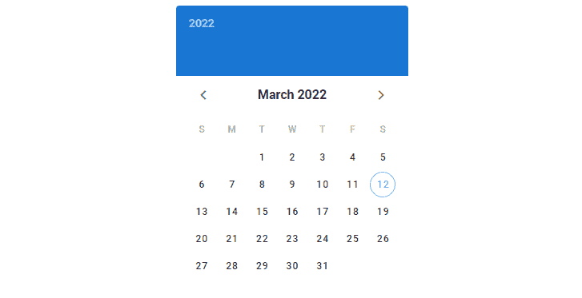

如果需要，我们可以选择当前日期:

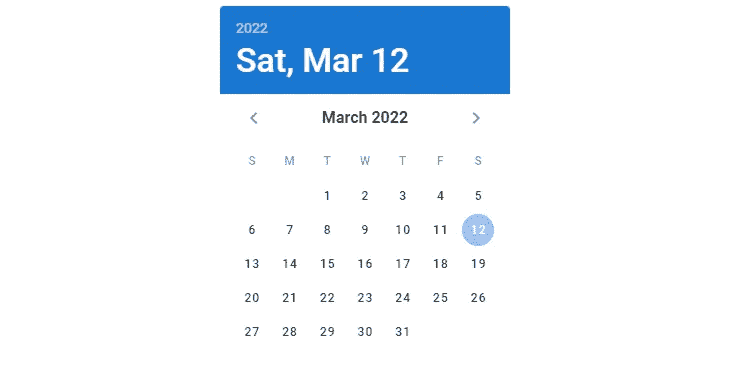

或者另一个日期:

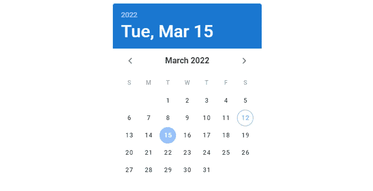

# 使用 v-model 的双向绑定

我们可以在日期选择器组件上使用`v-model`来设置选择器和变量之间的双向绑定。在下面的代码中，我们创建了一个日期选择器，并在它下面添加了一些文本来显示`date`变量的值，这是在选择器上选择的日期。

```
<template>
  <v-app>
    <div class="d-flex justify-center mt-2">
      <v-date-picker v-model="date"></v-date-picker>
    </div>
    <div class="d-flex justify-center mt-2">Date: {{ date || 'No date' }}</div>
  </v-app>
</template><script>
export default {
  name: 'App',
  data: () => ({
    date: null,
  }),
};
</script>
```

最初，日期是`null`，意味着没有选择日期。我们显示文本“无日期”来表明这一点:

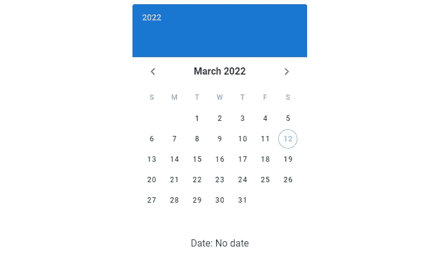

一旦我们选择了一个日期，`date`就会被绑定更新，并且文本会显示出来。日期设置为 YYYY-MM-DD 格式的字符串:

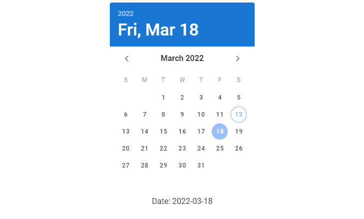

# 允许的日期

我们可以用`allowed-dates`属性在日期选择器上指定允许的日期。这里，我们向它传递一个函数，该函数接受日期的字符串值，并返回一个布尔值，该值指示是否应该允许该日期。

```
<template>
  <v-app>
    <div class="d-flex justify-center mt-2">
      <v-date-picker
        v-model="date"
        :allowed-dates="allowedDates"
      ></v-date-picker>
    </div>
  </v-app>
</template><script>
export default {
  name: 'App',
  data: () => ({
    date: null,
  }),
  methods: {
    allowedDates: (val) => parseInt(val.split('-')[2], 10) % 2 === 1,
  },
};
</script>
```

我们编写的函数只允许在 picker 上选择奇数日的日期:

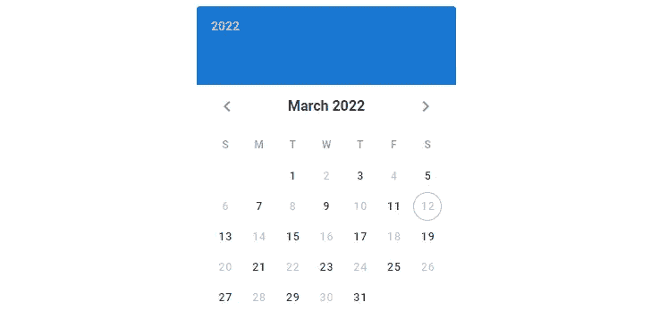

# 用美化来美化

使用 Vuetify 材料设计框架创建优雅 web 应用程序的完整指南。


在这里下载一份免费的 [**！**](https://mailchi.mp/583226ee0d7b/beautify-with-vuetify)

# 日期选取器颜色

我们可以用`color`和`header-color`道具定制日期选择器的[颜色](https://codingbeautydev.com/blog/vuetify-colors/)。

```
<template>
  <v-app>
    <div class="d-flex justify-center mt-2">
      <v-date-picker v-model="date" color="green"></v-date-picker>
    </div>
  </v-app>
</template><script>
export default {
  name: 'App',
  data: () => ({
    date: null,
  }),
};
</script>
```

我们没有在上面的代码中指定一个`header-color`，所以标题[颜色](https://codingbeautydev.com/blog/vuetify-colors/)将被设置为`color`属性的值:

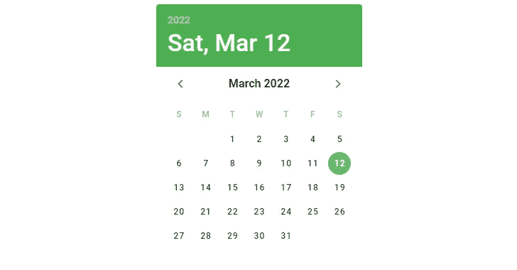

这里我们设置了一个`header-color`，日期选择器的[颜色](https://codingbeautydev.com/blog/vuetify-colors/)反映了这一点:

```
<template>
  <v-app>
    <div class="d-flex justify-center mt-2">
      <v-date-picker
        v-model="date"
        color="green"
        header-color="primary"
      ></v-date-picker>
    </div>
  </v-app>
</template><script>
export default {
  name: 'App',
  data: () => ({
    date: null,
  }),
};
</script>
```

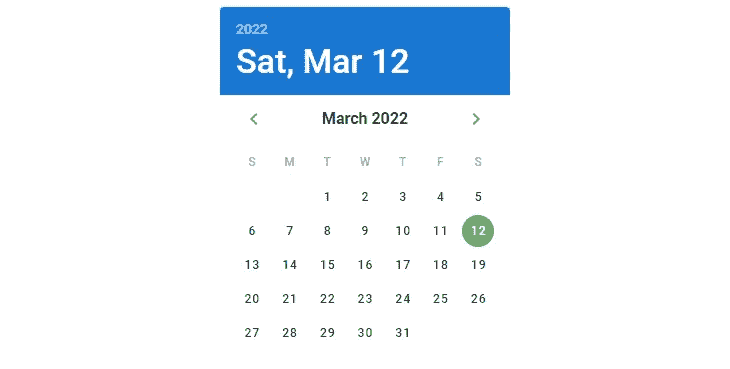

# 日期选取器提升

我们可以用`elevation`支柱设置日期拾取器的高度。`v-date-picker`组件支持最大 24°的仰角。

```
<template>
  <v-app>
    <div class="d-flex justify-center mt-2">
      <v-date-picker v-model="date" elevation="20"></v-date-picker>
    </div>
  </v-app>
</template><script>
export default {
  name: 'App',
  data: () => ({
    date: null,
  }),
};
</script>
```

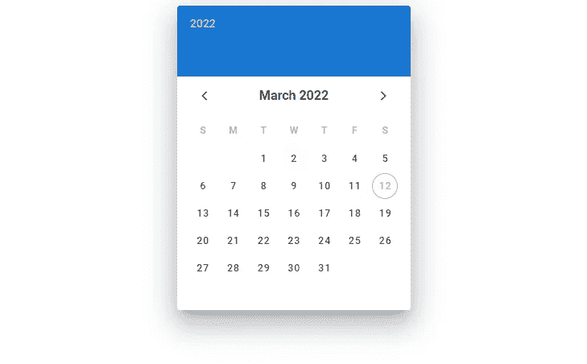

# 日期选择器图标

我们可以用`year-icon`、`prev-icon`和`next-icon`道具覆盖日期选择器使用的默认图标。

```
<template>
  <v-app>
    <div class="d-flex justify-center mt-2">
      <v-date-picker
        v-model="date"
        year-icon="mdi-calendar-blank"
        prev-icon="mdi-skip-previous"
        next-icon="mdi-skip-next"
      ></v-date-picker>
    </div>
  </v-app>
</template><script>
export default {
  name: 'App',
  data: () => ({
    date: null,
  }),
};
</script>
```

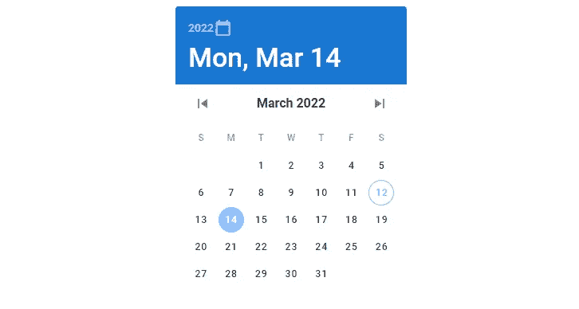

# 多次选择

我们使用`multiple`属性允许用户从选择器中选择多个日期。当`multiple`属性被设置为`true`时，日期选择器组件将期望传递给其`v-model`的变量是一个数组。

```
<template>
  <v-app>
    <div class="d-flex justify-center mt-2">
      <v-date-picker v-model="dates" multiple></v-date-picker>
    </div>
    <div class="d-flex justify-center">Selected: {{ dates }}</div>
  </v-app>
</template><script>
export default {
  name: 'App',
  data: () => ({
    dates: [],
  }),
};
</script>
```

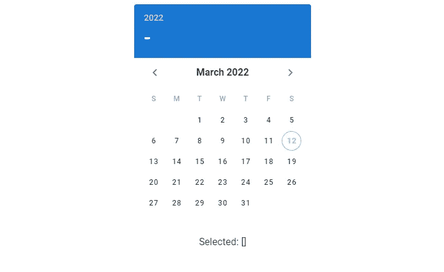

A date picker with no dates selected.

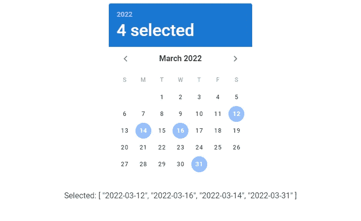

A date picker with 4 dates selected.

# 提货人-日期同步

我们可以使用`.sync`修饰符来观察`picker-date`，它是显示的月/年(取决于选取器类型和活动视图)。在下面的代码中，我们创建了一个日期选择器，并在其下方显示了文本`pickerDate`，这是一个使用`picker-date.sync`同步到`picker-date`属性的变量。

```
<template>
  <v-app>
    <div class="d-flex justify-center mt-2">
      <v-date-picker
        v-model="date"
        :picker-date.sync="pickerDate"
      ></v-date-picker>
    </div>
    <div class="d-flex justify-center">Month: {{ pickerDate }}</div>
  </v-app>
</template><script>
export default {
  name: 'App',
  data: () => ({
    date: null,
    pickerDate: null,
  }),
};
</script>
```

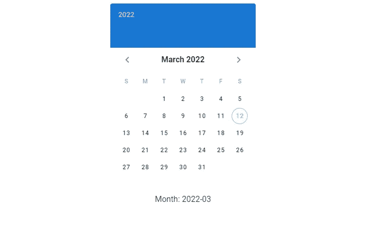

当我们在日期选择器上更改月份(使用箭头)时，`pickerDate`会更新:

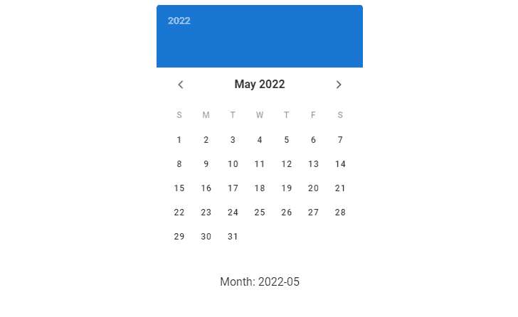

# 日期选取器范围

在日期选择器组件上使用`range`属性，允许用户从中选择日期范围。当使用`range`属性时，v-date- `picker`期望传递给它的`v-model`的值是一个长度为 2 或为空的数组。

```
<template>
  <v-app>
    <div class="d-flex justify-center mt-2">
      <v-date-picker v-model="dates" range></v-date-picker>
    </div>
    <div class="d-flex justify-center">Model: {{ dates }}</div>
  </v-app>
</template><script>
export default {
  name: 'App',
  data: () => ({
    dates: ['2022-03-05', '2022-03-15'],
  }),
};
</script>
```

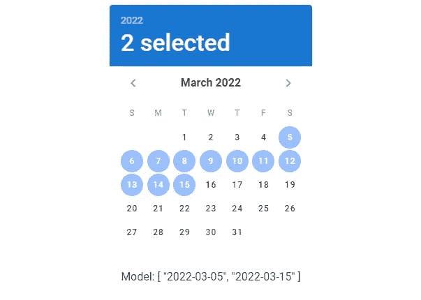

如果需要，我们可以选择另一个日期范围:

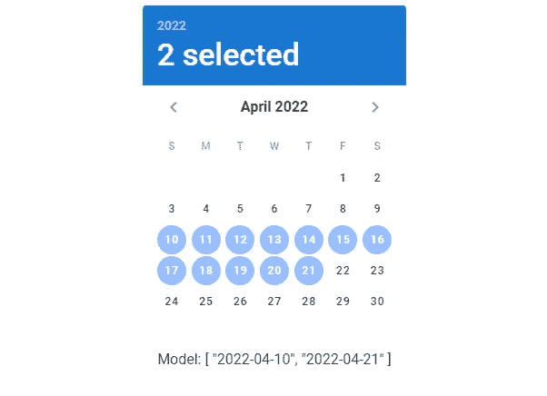

# 只读日期选择器

我们可以使用`readonly`道具来关闭与日期选择器的交互:

```
<template>
  <v-app>
    <div class="d-flex justify-center mt-2">
      <v-date-picker v-model="date" readonly></v-date-picker>
    </div>
  </v-app>
</template><script>
export default {
  name: 'App',
  data: () => ({
    date: null,
  }),
};
</script>
```

当它是只读的，并且你试图选择另一个日期，比如 3 月 16 日，它看起来是这样的:

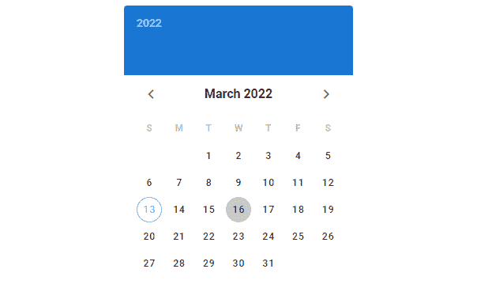

# 显示当前

默认情况下，日期选择器用圆形轮廓指示当前日期:

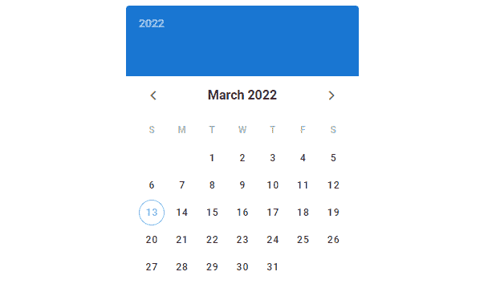

我们可以通过将`show-current`属性设置为`false`来移除该轮廓:

```
<template>
  <v-app>
    <div class="d-flex justify-center mt-2">
      <v-date-picker v-model="date" :show-current="false"></v-date-picker>
    </div>
  </v-app>
</template><script>
export default {
  name: 'App',
  data: () => ({
    date: null,
  }),
};
</script>
```

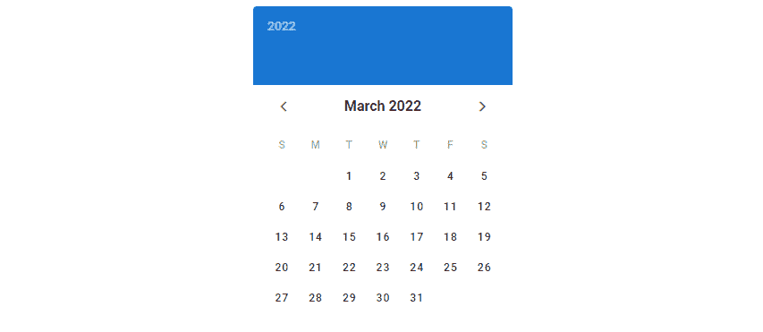

我们还可以让日期选择器将另一个日期作为当前日期。为此，我们将`show-current`属性设置为 YYYY-MM-DD 格式的日期字符串:

# 显示兄弟姐妹月份

默认情况下，上个月和下个月的日期不可见。使用`show-adjacent-months`道具来显示它们:

```
<template>
  <v-app>
    <div class="d-flex justify-center mt-2">
      <v-date-picker v-model="date" show-adjacent-months></v-date-picker>
    </div>
  </v-app>
</template><script>
export default {
  name: 'App',
  data: () => ({
    date: null,
  }),
};
</script>
```

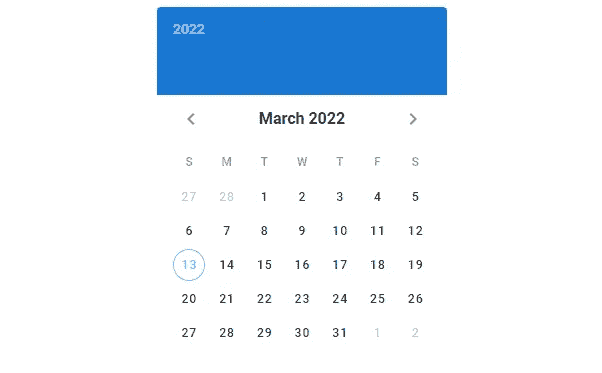

# 自定义日期选取器宽度

我们可以使用`width`道具自定义日期选择器的宽度:

```
<template>
  <v-app>
    <div class="d-flex justify-center mt-2">
      <v-date-picker v-model="date" width="400"></v-date-picker>
    </div>
  </v-app>
</template><script>
export default {
  name: 'App',
  data: () => ({
    date: null,
  }),
};
</script>
```

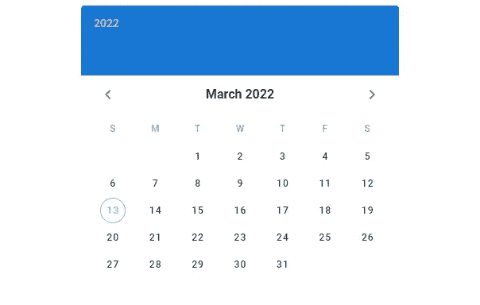

## 全宽

我们还可以使用`full-width`属性让日期选择器占据其父对象的所有可用宽度:

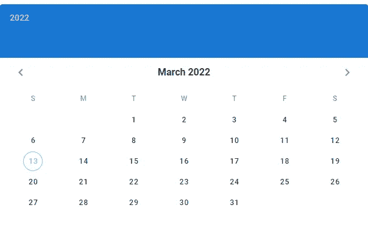

# 日期选择器事件日期

我们可以通过给`events`属性分配数组、对象或函数来指定事件。我们可以使用`event-color`属性来改变日期选择器用来指示事件的标记的默认[颜色](https://codingbeautydev.com/blog/vuetify-colors/)。在这里，我们将`events`设置为 2022 年 3 月的所有奇数日来标记它们。

```
<template>
  <v-app>
    <div class="d-flex justify-center mt-2">
      <v-date-picker
        v-model="date"
        :events="eventDates"
        event-color="green"
      ></v-date-picker>
    </div>
  </v-app>
</template><script>
export default {
  name: 'App',
  data: () => ({
    date: null,
    eventDates: null,
  }),
  mounted() {
    this.eventDates = [...Array(31)]
      .map((value, index) => index + 1)
      .filter((value) => value % 2 === 0)
      .map((value) => {
        const date = new Date();
        date.setDate(value);
        return date.toISOString().substr(0, 10);
      });
  },
};
</script>
```

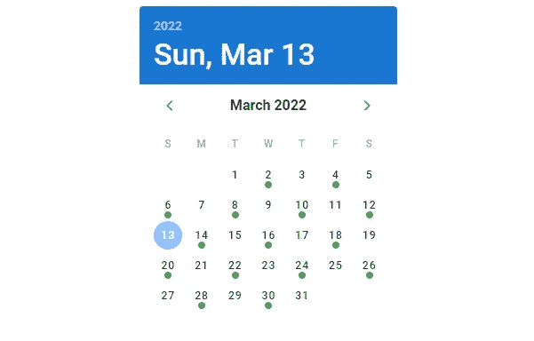

# 摘要

我们使用日期选择器来允许用户选择一个日期或日期范围。Vuetify 提供了用于创建和定制日期选择器的`v-date-picker`组件。

[***注册***](http://eepurl.com/hRfyJL) *订阅我们的每周简讯，了解更多精彩内容。*

*在*[*codingbeautydev.com*](https://codingbeautydev.com/blog/vuetify-date-picker/)*获取更新文章。*