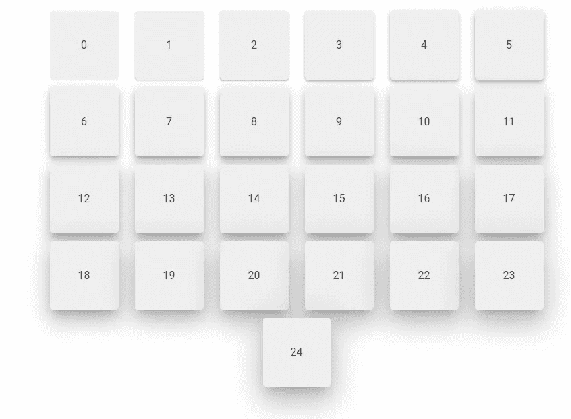

# 如何使用虚拟化提升辅助对象

> 原文：<https://javascript.plainenglish.io/vuetify-elevation-527b4d6321c7?source=collection_archive---------10----------------------->


高程提供了关于沿 z 轴的两个表面之间的相对距离或深度的重要视觉线索。Vuetify 提供了实用程序类和道具，允许我们轻松地设置元素的高度，而无需创建定制的 CSS 样式。

高程辅助对象将在应用时自定义元素的阴影高程。总共有 25 个标高:

```
<template>
  <v-app>
    <v-container class="ma-4">
      <v-row justify="center">
        <v-col
          v-for="n in 25"
          :key="n"
          cols="auto"
        >
          <v-card
            :elevation="n - 1"
            height="100"
            width="100"
            color="grey lighten-3"
          >
            <v-row
              class="fill-height"
              align="center"
              justify="center"
              v-text="n - 1"
            ></v-row>
          </v-card>
        </v-col>
      </v-row>
    </v-container>
  </v-app>
</template>
```



# 虚拟化中基于支柱的提升

许多 Vuetify 组件都有一个`elevation`支柱，用于轻松设置高度。

在下面的代码示例中，我们使用 [v-hover](https://codingbeautydev.com/blog/vuetify-hover/) 组件和 [v-card](https://codingbeautydev.com/blog/vuetify-card/) elevation prop 来更改用户用鼠标悬停在[卡片](https://codingbeautydev.com/blog/vuetify-card/)上时的阴影高度:

```
<template>
  <v-app>
    <v-hover>
      <template v-slot:default="{ hover }">
        <v-card
          :elevation="hover ? 24 : 6"
          class="pa-6 ma-4"
        >
          Prop based elevation
        </v-card>
      </template>
    </v-hover>
  </v-app>
</template>
```


# 虚拟化中基于类的提升

对于一个没有`elevation` prop 的元素，我们可以在它上面应用一个 elevation helper 类来定制 elevation。这些类的格式是`elevation-{value}`，其中`value`是海拔高度。

```
<template>
  <v-app>
    <v-hover>
      <template v-slot:default="{ hover }">
        <div
          class="pa-6 ma-4"
          :class="`elevation-${hover ? 24 : 6}`"
        >
          Class based elevation
        </div>
      </template>
    </v-hover>
  </v-app>
</template>
```


# 结论

Vuetify 提供了高程辅助对象，让我们可以控制两个曲面之间沿 z 轴的相对深度。我们可以通过在支持的组件上设置`elevation`属性，或者应用一个提升工具类来实现。

*更新于:*[*codingbeautydev.com*](https://codingbeautydev.com/blog/vuetify-elevation/)*。*

# 用美化来美化

使用 Vuetify 材料设计框架创建优雅 web 应用程序的完整指南。


在 这里免费获得一份 [**。**](https://mailchi.mp/583226ee0d7b/beautify-with-vuetify)