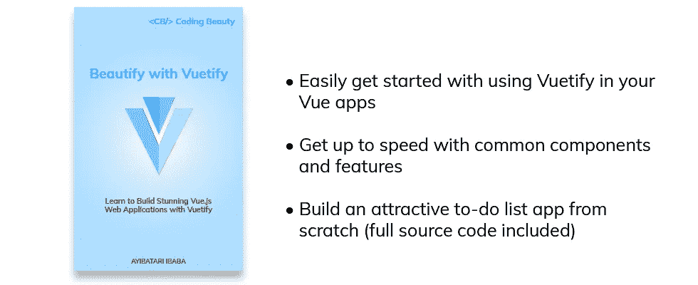
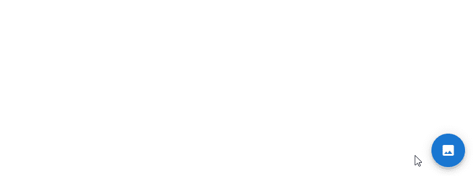

# Vuetify FAB:如何创建浮动动作按钮

> 原文：<https://javascript.plainenglish.io/vuetify-fab-504c0bc672bb?source=collection_archive---------10----------------------->

## 了解如何使用 Vuetify 创建和定制一个浮动的动作按钮(FAB)来表示屏幕的主要动作。


浮动动作按钮(FAB)用于表示在特定屏幕上要采取的主要动作。在这篇文章中，我们将学习如何使用[按钮](https://codingbeautydev.com/blog/vuetify-button/)组件(`v-btn`)来创建晶圆厂。

# 虚拟 btn fab Prop

我们可以通过将[按钮](https://codingbeautydev.com/blog/vuetify-button/)组件的`fab`道具设置为`true`来创建一个 FAB:

```
<template>
  <v-app>
    <div class="text-center ma-4">
      <v-btn fab>
        <v-icon>mdi-plus</v-icon>
      </v-btn>
    </div>
  </v-app>
</template><script>
export default {
  name: 'App',
};
</script>
```


# 美化 FAB 颜色

我们可以使用`v-btn`组件的`color`道具来定制 FAB 的`color`。

```
<template>
  <v-app>
    <div class="text-center ma-4">
      <v-btn
        fab
        color="primary"
      >
        <v-icon>mdi-plus</v-icon>
      </v-btn>
    </div>
  </v-app>
</template><script>
export default {
  name: 'App',
};
</script>
```


# Vuetify FAB 抑郁

将`v-btn`组件的`depressed`支柱设置为`true`将从 FAB 移除提升。

```
<template>
  <v-app>
    <div class="text-center ma-4">
      <v-btn
        fab
        color="primary"
        depressed
      >
        <v-icon>mdi-plus</v-icon>
      </v-btn>
    </div>
  </v-app>
</template><script>
export default {
  name: 'App',
};
</script>
```


# 用美化来美化

使用 Vuetify 材料设计框架创建优雅 web 应用程序的完整指南。



在 这里免费获得一份 [**。**](https://mailchi.mp/583226ee0d7b/beautify-with-vuetify)

# FAB 图标道具

`icon`道具将[按钮组件](https://codingbeautydev.com/blog/vuetify-button/)指定为图标。它移除背景并将 FAB [图标](https://codingbeautydev.com/blog/vuetify-icons/) [颜色](https://codingbeautydev.com/blog/vuetify-colors/)设置为`color`道具的值。

```
<template>
  <v-app>
    <div class="text-center ma-4">
      <v-btn
        fab
        color="primary"
        icon
      >
        <v-icon>mdi-plus</v-icon>
      </v-btn>
    </div>
  </v-app>
</template><script>
export default {
  name: 'App',
};
</script>
```


# 概述 Vuetify FAB

我们可以用 [v-btn 组件](https://codingbeautydev.com/blog/vuetify-button/)的`outlined`道具来创建一个轮廓化的 FAB。

```
<template>
  <v-app>
    <div class="text-center ma-4">
      <v-btn
        fab
        color="primary"
        outlined
      >
        <v-icon>mdi-plus</v-icon>
      </v-btn>
    </div>
  </v-app>
</template><script>
export default {
  name: 'App',
};
</script>
```


# Vuetify FAB 提升

我们可以用`elevation`支柱控制工厂的高度。我们可以将`elevation`设置为介于`0`和`24`之间的值。

```
<template>
  <v-app>
    <div class="text-center ma-4">
      <v-btn
        fab
        color="primary"
        elevation="10"
      >
        <v-icon>mdi-plus</v-icon>
      </v-btn>
    </div>
  </v-app>
</template><script>
export default {
  name: 'App',
};
</script>
```


# 美化 FAB 瓷砖

`tile`属性从 FAB 中删除边界半径:

```
<template>
  <v-app>
    <div class="text-center ma-4">
      <v-btn
        fab
        color="primary"
        tile
      >
        <v-icon>mdi-plus</v-icon>
      </v-btn>
    </div>
  </v-app>
</template><script>
export default {
  name: 'App',
};
</script>
```


# 限定 FAB 大小

我们可以使用`x-small`、`small`、`large`和`x-large`道具中的一个来定制工厂的大小。

```
<template>
  <v-app>
    <div class="d-flex justify-center">
      <div
        class="d-flex ma-4 align-center justify-space-around"
        style="width: 400px"
      >
        <v-btn
          fab
          color="primary"
          x-small
        >
          <v-icon>mdi-plus</v-icon>
        </v-btn>
        <v-btn
          fab
          color="primary"
          small
        >
          <v-icon>mdi-plus</v-icon>
        </v-btn>
        <v-btn
          fab
          color="primary"
        >
          <v-icon>mdi-plus</v-icon>
        </v-btn>
        <v-btn
          fab
          color="primary"
          large
        >
          <v-icon>mdi-plus</v-icon>
        </v-btn>
        <v-btn
          fab
          color="primary"
          x-large
        >
          <v-icon>mdi-plus</v-icon>
        </v-btn>
      </div>
    </div>
  </v-app>
</template><script>
export default {
  name: 'App',
};
</script>
```


# 扩展工厂

Vuetify 还不支持，但是我们可以使用自定义 CSS 创建一个[扩展 FAB](https://material.io/components/buttons-floating-action-button#extended-fab) 。

```
<template>
  <v-app>
    <div class="text-center ma-4">
      <v-btn
        fab
        color="primary"
        style="
          width: fit-content;
          border-radius: 100px;
          padding: 16px;
        "
      >
        <v-icon>mdi-plus</v-icon>
        Create
      </v-btn>
    </div>
  </v-app>
</template><script>
export default {
  name: 'App',
};
</script>
```


# 验证 FAB 快速拨号

使用快速拨号组件(`v-speed-dial`)，当按下时，FAB 可以发出一堆相关动作:

```
<template>
  <v-app>
    <v-speed-dial
      v-model="fab"
      direction="top"
      transition="slide-y-reverse-transition"
      absolute
      bottom
      right
    >
      <template v-slot:activator>
        <v-btn
          v-model="fab"
          color="blue darken-2"
          dark
          fab
        >
          <v-icon v-if="fab"> mdi-close </v-icon>
          <v-icon v-else> mdi-image </v-icon>
        </v-btn>
      </template>
      <v-btn
        fab
        small
      >
        <v-icon>mdi-pencil</v-icon>
      </v-btn>
      <v-btn
        fab
        small
      >
        <v-icon>mdi-plus</v-icon>
      </v-btn>
      <v-btn
        fab
        small
      >
        <v-icon>mdi-star</v-icon>
      </v-btn>
    </v-speed-dial>
  </v-app>
</template><script>
export default {
  name: 'App',
  data: () => ({
    fab: false,
  }),
};
</script>
```



# 在横向屏幕中使用晶圆厂

在某些情况下，我们的 fab 在相邻的屏幕上有不同的操作，就像一组选项卡项目的内容屏幕。我们可以用`fab-transition`组件显示一个转换来表示动作的改变。`fab-transition`与`v-btn`的钥匙支柱配合使用。当 FAB 键改变时，它触发转换。

```
<template>
  <v-app>
    <v-app-bar
      dark
      color="red accent-2"
      app
    >
      <v-app-bar-nav-icon></v-app-bar-nav-icon>
      <v-toolbar-title>Page Title</v-toolbar-title>
      <v-spacer></v-spacer>
      <v-btn icon>
        <v-icon>mdi-magnify</v-icon>
      </v-btn>
      <v-btn icon>
        <v-icon>mdi-dots-vertical</v-icon>
      </v-btn>
      <template v-slot:extension>
        <v-tabs
          v-model="tabs"
          align-with-title
        >
          <v-tab href="#one"> Item One </v-tab>
          <v-tab href="#two"> Item Two </v-tab>
          <v-tab href="#three"> Item Three </v-tab>
          <v-tabs-slider color="white"></v-tabs-slider>
        </v-tabs>
      </template>
    </v-app-bar>
    <v-main>
      <v-fab-transition>
        <v-btn
          :key="activeFab.icon"
          fab
          right
          absolute
          bottom
          style="bottom: 16px"
          color="red accent-2"
          dark
        >
          <v-icon>{{ activeFab.icon }}</v-icon>
        </v-btn>
      </v-fab-transition>
    </v-main>
  </v-app>
</template><script>
export default {
  name: 'App',
  data: () => ({
    fab: false,
    hidden: false,
    tabs: null,
  }), computed: {
    activeFab() {
      switch (this.tabs) {
        case 'one':
          return {
            icon: 'mdi-plus',
          };
        case 'two':
          return { icon: 'mdi-pencil' };
        case 'three':
          return {
            icon: 'mdi-play',
          };
        default:
          return {};
      }
    },
  },
};
</script>
```


# 结论

浮动动作按钮(FAB)用于指示要在屏幕上执行的主要动作。我们可以使用 [v-btn](https://codingbeautydev.com/blog/vuetify-button/) 组件的`fab`道具结合其他各种道具来创建和定制晶圆厂。

*获得关于 Vuetify、Vue.js、JavaScript 等的每周提示和教程:*[http://eepurl.com/hRfyJL](http://eepurl.com/hRfyJL)

*更新于:*[*codingbeautydev.com*](https://codingbeautydev.com/blog/vuetify-fab/)