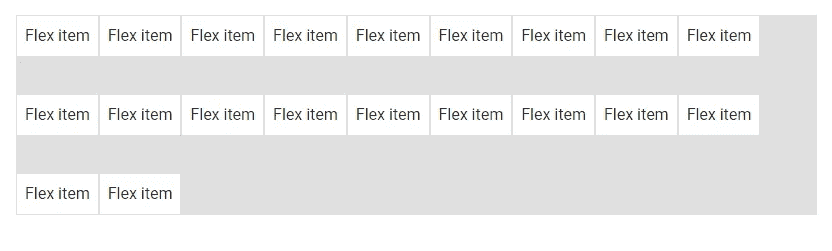

# Vuetify Flex:如何创建 Flexbox 布局

> 原文：<https://javascript.plainenglish.io/vuetify-flex-6b679694f894?source=collection_archive---------11----------------------->


flexbox 布局简化了设计灵活且响应迅速的页面布局结构的过程，无需使用`float`或手动定位。它允许根据视口的大小自动排列容器中的响应元素。在本文中，我们将了解 Vuetify 提供的各种帮助器类，它们通过对齐、对齐、换行等方式来控制 flex 容器的布局。

# 验证 Flexbox 容器

将`d-flex`助手类应用到一个元素会将它的`display`设置为`flex`，这将把它变成一个 flexbox 容器，将它的**直接子元素**转换为 flex 项目。正如我们将在后面看到的，我们可以用附加的 flex 属性工具定制这些子元素的交互。

```
<template>
  <v-app>
    <div class="ma-4">
      <v-card
        class="d-flex pa-2"
        outlined
        tile
      >
        <div>A flexbox container</div>
      </v-card>
    </div>
  </v-app>
</template><script>
export default {
  name: 'App',
};
</script>
```


# 内嵌 Flex

`d-inline-flex`类将一个元素转化为内嵌的 flexbox 容器。

```
<template>
  <v-app>
    <div class="ma-4">
      <v-card
        class="d-inline-flex pa-2"
        outlined
        tile
      >
        <div>Inline flexbox container</div>
      </v-card>
    </div>
  </v-app>
</template><script>
export default {
  name: 'App',
};
</script>
```


我们还可以自定义 flex 实用程序，使其仅应用于以下类的特定断点:

*   `d-sm-flex`
*   `d-sm-inline-flex`
*   `d-md-flex`
*   `d-md-inline-flex`
*   `d-lg-flex`
*   `d-lg-inline-flex`
*   `d-xl-flex`
*   `d-xl-inline-flex`

# 验证弯曲方向

Vuetify 提供了 flex 助手类，用于指定容器中 flex 项目的方向。这些类修改元素的`flex-direction` CSS 属性。它们是:

*   柔性排
*   柔性-行-反向
*   柔性柱
*   伸缩-列-反向

## `flex-row`和`flex-row-reverse`

`flex-row`实用程序类将灵活项目水平显示为一行。`flex-row-reverse`操作相同，但顺序相反:

```
<template>
  <v-app>
    <div class="ma-4">
      <v-card
        class="d-flex flex-row mb-6"
        color="grey lighten-4"
        flat
        tile
      >
        <v-card
          v-for="n in 3"
          :key="n"
          class="pa-2"
          outlined
          tile
        >
          Flex item {{ n }}
        </v-card>
      </v-card>
      <v-card
        class="d-flex flex-row-reverse"
        color="grey lighten-4"
        flat
        tile
      >
        <v-card
          v-for="n in 3"
          :key="n"
          class="pa-2"
          outlined
          tile
        >
          Flex item {{ n }}
        </v-card>
      </v-card>
    </div>
  </v-app>
</template><script>
export default {
  name: 'App',
};
</script>
```


## `flex-column`和`flex-column-reverse`

`flex-column`实用程序类在一列中垂直显示 flex 项目。`flex-column-reverse`做同样的事，但顺序相反:

```
<template>
  <v-app>
    <div class="ma-4">
      <div class="d-flex flex-column mb-6">
        <v-card
          v-for="n in 3"
          :key="n"
          class="pa-2"
          outlined
          tile
        >
          Flex item {{ n }}
        </v-card>
      </div>
      <div class="d-flex flex-column-reverse">
        <v-card
          v-for="n in 3"
          :key="n"
          class="pa-2"
          outlined
          tile
        >
          Flex item {{ n }}
        </v-card>
      </div>
    </div>
  </v-app>
</template><script>
export default {
  name: 'App',
};
</script>
```


这些类也有相应的变化，为某些断点设置`flex-direction`属性。

*   `flex-sm-row`
*   `flex-sm-row-reverse`
*   `flex-sm-column`
*   `flex-sm-column-reverse`
*   `flex-md-row`
*   `flex-md-row-reverse`
*   `flex-md-column`
*   `flex-md-column-reverse`
*   `flex-lg-row`
*   `flex-lg-row-reverse`
*   `flex-lg-column`
*   `flex-lg-column-reverse`
*   `flex-xl-row`
*   `flex-xl-row-reverse`
*   `flex-xl-column`
*   `flex-xl-column-reverse`

# 用美化来美化

使用 Vuetify 材料设计框架创建优雅 web 应用程序的完整指南。


在这里 获得免费副本 [**。**](https://mailchi.mp/583226ee0d7b/beautify-with-vuetify)

# 弹性调整类别

我们可以用 Vuetify 中的 flex justify 类修改灵活容器的`justify-content` flex 属性。justify-content 分别为`row`或`column`中的`flex-direction`修改 x 轴或 y 轴上的 flexbox 项目。助手类可以将`justify-content`设置为`start`(浏览器默认)、`end`、`center`、`space-between`或`space-around`。它们是:

*   `justify-start`
*   `justify-end`
*   `justify-center`
*   `justify-space-between`
*   `justify-space-around`

```
<template>
  <v-app>
    <div class="ma-4">
      <v-card
        class="d-flex justify-start mb-6"
        color="grey lighten-4"
        flat
        tile
      >
        <v-card
          v-for="n in 3"
          :key="n"
          class="pa-2"
          outlined
          tile
        >
          justify-start
        </v-card>
      </v-card> <v-card
        class="d-flex justify-end mb-6"
        color="grey lighten-4"
        flat
        tile
      >
        <v-card
          v-for="n in 3"
          :key="n"
          class="pa-2"
          outlined
          tile
        >
          justify-end
        </v-card>
      </v-card> <v-card
        class="d-flex justify-center mb-6"
        color="grey lighten-4"
        flat
        tile
      >
        <v-card
          v-for="n in 3"
          :key="n"
          class="pa-2"
          outlined
          tile
        >
          justify-center
        </v-card>
      </v-card> <v-card
        class="d-flex justify-space-between mb-6"
        color="grey lighten-4"
        flat
        tile
      >
        <v-card
          v-for="n in 3"
          :key="n"
          class="pa-2"
          outlined
          tile
        >
          justify-space-between
        </v-card>
      </v-card> <v-card
        class="d-flex justify-space-around mb-6"
        color="grey lighten-4"
        flat
        tile
      >
        <v-card
          v-for="n in 3"
          :key="n"
          class="pa-2"
          outlined
          tile
        >
          justify-space-around
        </v-card>
      </v-card>
    </div>
  </v-app>
</template><script>
export default {
  name: 'App',
};
</script>
```


这些类也有相应的变化，为某些断点设置`justify-content`属性:

*   `justify-sm-start`
*   `justify-sm-end`
*   `justify-sm-center`
*   `justify-sm-space-between`
*   `justify-sm-space-around`
*   `justify-md-start`
*   `justify-md-end`
*   `justify-md-center`
*   `justify-md-space-between`
*   `justify-md-space-around`
*   `justify-lg-start`
*   `justify-lg-end`
*   `justify-lg-center`
*   `justify-lg-space-between`
*   `justify-lg-space-around`
*   `justify-xl-start`
*   `justify-xl-end`
*   `justify-xl-center`
*   `justify-xl-space-between`
*   `justify-xl-space-around`

# 验证弹性对齐分类

我们也有来自 Vuetify 的 flex 工具类，它们修改 flex 容器的`align-items` CSS 属性。`align-items`分别为`row`或`column`的伸缩方向修改 y 轴或 x 轴上的 flexbox 项目。助手类可以将`align-items`设置为`start`、`end`、`center`、`baseline`或`stretch`(浏览器默认)。它们是:

*   `align-start`
*   `align-end`
*   `align-center`
*   `align-baseline`
*   `align-stretch`

```
<template>
  <v-app>
    <div class="ma-4">
      <v-card
        class="d-flex align-start mb-6"
        color="grey lighten-2"
        flat
        height="100"
        tile
      >
        <v-card
          v-for="n in 3"
          :key="n"
          class="pa-2"
          outlined
          tile
        >
          align-start
        </v-card>
      </v-card> <v-card
        class="d-flex align-end mb-6"
        color="grey lighten-2"
        flat
        height="100"
        tile
      >
        <v-card
          v-for="n in 3"
          :key="n"
          class="pa-2"
          outlined
          tile
        >
          align-end
        </v-card>
      </v-card> <v-card
        class="d-flex align-center mb-6"
        color="grey lighten-2"
        flat
        height="100"
        tile
      >
        <v-card
          v-for="n in 3"
          :key="n"
          class="pa-2"
          outlined
          tile
        >
          align-center
        </v-card>
      </v-card> <v-card
        class="d-flex align-baseline mb-6"
        color="grey lighten-2"
        flat
        height="100"
        tile
      >
        <v-card
          v-for="n in 3"
          :key="n"
          class="pa-2"
          outlined
          tile
        >
          align-baseline
        </v-card>
      </v-card> <v-card
        class="d-flex align-stretch mb-6"
        color="grey lighten-2"
        flat
        height="100"
        tile
      >
        <v-card
          v-for="n in 3"
          :key="n"
          class="pa-2"
          outlined
          tile
        >
          align-stretch
        </v-card>
      </v-card>
    </div>
  </v-app>
</template><script>
export default {
  name: 'App',
};
</script>
```


它们也是这些类的响应变体，为某些断点设置`align-items`属性:

*   `align-sm-start`
*   `align-sm-end`
*   `align-sm-center`
*   `align-sm-baseline`
*   `align-sm-stretch`
*   `align-md-start`
*   `align-md-end`
*   `align-md-center`
*   `align-md-baseline`
*   `align-md-stretch`
*   `align-lg-start`
*   `align-lg-end`
*   `align-lg-center`
*   `align-lg-baseline`
*   `align-lg-stretch`
*   `align-xl-start`
*   `align-xl-end`
*   `align-xl-center`
*   `align-xl-baseline`
*   `align-xl-stretch`

# 弹性对齐自分类

我们使用 flex align self helper 类来修改元素的`align-self` flex 属性。align-self 分别为`row`或`column`的`flex-direction`修改`x-axis`或`y-axis`上的 flexbox 项。助手类可以将`align-self`设置为`start`、`end`、`center`、`baseline`或`stretch`(浏览器默认)。它们是:

*   `align-self-start`
*   `align-self-end`
*   `align-self-center`
*   `align-self-baseline`
*   `align-self-stretch`

```
<template>
  <v-app>
    <div class="ma-4">
      <v-card
        v-for="j in justify"
        :key="j"
        class="d-flex mb-6"
        color="grey lighten-2"
        flat
        height="100"
        tile
      >
        <v-card
          v-for="n in 3"
          :key="n"
          class="pa-2"
          :class="[n === 2 && `align-self-${j}`]"
          outlined
          tile
        >
          {{ n === 2 ? 'Aligned flex item' : 'Flex item' }}
        </v-card>
      </v-card>
    </div>
  </v-app>
</template><script>
export default {
  name: 'App',
  data: () => ({
    justify: [
      'start',
      'end',
      'center',
      'baseline',
      'auto',
      'stretch',
    ],
  }),
};
</script>
```


Vuetify 还提供了这些类的响应变体，为某些断点设置了`align-self`属性:

*   `align-self-sm-start`
*   `align-self-sm-end`
*   `align-self-sm-center`
*   `align-self-sm-baseline`
*   `align-self-sm-auto`
*   `align-self-sm-stretch`
*   `align-self-md-start`
*   `align-self-md-end`
*   `align-self-md-center`
*   `align-self-md-baseline`
*   `align-self-md-auto`
*   `align-self-md-stretch`
*   `align-self-lg-start`
*   `align-self-lg-end`
*   `align-self-lg-center`
*   `align-self-lg-baseline`
*   `align-self-lg-auto`
*   `align-self-lg-stretch`
*   `align-self-xl-start`
*   `align-self-xl-end`
*   `align-self-xl-center`
*   `align-self-xl-baseline`
*   `align-self-xl-auto`
*   `align-self-xl-stretch`

# 自动边距

我们可以将 Vuetify 中的一个 [margin 辅助类](https://codingbeautydev.com/blog/vuetify-margin-and-padding/)应用到一个 flex 容器中，以控制 flex 项目在 x 轴或 y 轴上的位置，分别对应于伸缩方向`row`或`column`。

```
<template>
  <v-app>
    <div class="ma-4">
      <v-card
        class="d-flex mb-6"
        color="grey lighten-2"
        flat
        tile
      >
        <v-card
          v-for="n in 3"
          :key="n"
          class="pa-2"
          outlined
          tile
        >
          Flex item
        </v-card>
      </v-card> <v-card
        class="d-flex mb-6"
        color="grey lighten-2"
        flat
        tile
      >
        <v-card
          v-for="n in 3"
          :key="n"
          :class="n === 1 && 'mr-auto'"
          class="pa-2"
          outlined
          tile
        >
          Flex item
        </v-card>
      </v-card> <v-card
        class="d-flex mb-6"
        color="grey lighten-2"
        flat
        tile
      >
        <v-card
          v-for="n in 3"
          :key="n"
          :class="n === 3 && 'ml-auto'"
          class="pa-2"
          outlined
          tile
        >
          Flex item
        </v-card>
      </v-card>
    </div>
  </v-app>
</template><script>
export default {
  name: 'App',
};
</script>
```


## 使用`align-items`

如果我们将`flex-direction`设置为`column`，并为`align-items`指定一个值，我们可以使用`mb-auto`或`mt-auto`辅助类来调整 flex 项目定位:

```
<template>
  <v-app>
    <div class="ma-4">
      <v-card
        class="d-flex align-start flex-column mb-6"
        color="grey lighten-2"
        flat
        tile
        height="200"
      >
        <v-card
          v-for="n in 3"
          :key="n"
          :class="n === 1 && 'mb-auto'"
          class="pa-2"
          outlined
          tile
        >
          Flex item
        </v-card>
      </v-card>
      <v-card
        class="d-flex align-end flex-column"
        color="grey lighten-2"
        flat
        tile
        height="200"
      >
        <v-card
          v-for="n in 3"
          :key="n"
          :class="n === 3 && 'mt-auto'"
          class="pa-2"
          outlined
          tile
        >
          Flex item
        </v-card>
      </v-card>
    </div>
  </v-app>
</template><script>
export default {
  name: 'App',
};
</script>
```


# 虚拟化弹性包装类

默认情况下，`d-flex`类不提供换行(其行为类似于将`flex-wrap`设置为`nowrap`)。我们可以通过对容器应用一个 flex-wrap 辅助类来改变这一点。这些类别是:

*   `flex-nowrap`
*   `flex-wrap`
*   `flex-wrap-reverse`

## `flex-nowrap`

`flex-nowrap`指定项目不应换行。

```
<template>
  <v-app>
    <div class="ma-4">
      <v-card
        class="d-flex flex-nowrap py-3"
        color="grey lighten-2"
        flat
        tile
        width="125"
      >
        <v-card
          v-for="n in 5"
          :key="n"
          class="pa-2"
          outlined
          tile
        >
          Flex item
        </v-card>
      </v-card>
    </div>
  </v-app>
</template><script>
export default {
  name: 'App',
};
</script>
```


## `flex-wrap`

`flex-wrap`如有必要，使项目换行。

```
<template>
  <v-app>
    <div class="ma-4">
      <v-card
        class="d-flex flex-wrap"
        color="grey lighten-2"
        flat
        tile
      >
        <v-card
          v-for="n in 20"
          :key="n"
          class="pa-2"
          outlined
          tile
        >
          Flex item {{ n }}
        </v-card>
      </v-card>
    </div>
  </v-app>
</template><script>
export default {
  name: 'App',
};
</script>
```


## `flex-wrap-reverse`

`flex-wrap-reverse`指定 flex 项目将在必要时以相反的顺序换行。

```
<template>
  <v-app>
    <div class="ma-4">
      <v-card
        class="d-flex flex-wrap-reverse"
        color="grey lighten-2"
        flat
        tile
      >
        <v-card
          v-for="n in 20"
          :key="n"
          class="pa-2"
          outlined
          tile
        >
          Flex item {{ n }}
        </v-card>
      </v-card>
    </div>
  </v-app>
</template><script>
export default {
  name: 'App',
};
</script>
```


Vuetify 还提供了这些类的响应变体来为某些断点设置`flex-wrap`属性:

*   `flex-sm-nowrap`
*   `flex-sm-wrap`
*   `flex-sm-wrap-reverse`
*   `flex-md-nowrap`
*   `flex-md-wrap`
*   `flex-md-wrap-reverse`
*   `flex-lg-nowrap`
*   `flex-lg-wrap`
*   `flex-lg-wrap-reverse`
*   `flex-xl-nowrap`
*   `flex-xl-wrap`
*   `flex-xl-wrap-reverse`

# 验证弹性订单分类

我们可以使用一个 flex order 实用程序类来定制 flexbox 项目在其容器中的可视顺序。

```
<template>
  <v-app>
    <div class="ma-4">
      <v-card
        class="d-flex flex-wrap"
        color="grey lighten-2"
        flat
        tile
      >
        <v-card
          class="order-2 pa-2"
          outlined
          tile
        >
          First flex item
        </v-card>
        <v-card
          class="order-3 pa-2"
          outlined
          tile
        >
          Second flex item
        </v-card>
        <v-card
          class="order-1 pa-2"
          outlined
          tile
        >
          Third flex item
        </v-card>
      </v-card>
    </div>
  </v-app>
</template><script>
export default {
  name: 'App',
};
</script>
```


这些类设置容器的`order` flex 属性。它们是:

*   `order-first`
*   `order-0`
*   `order-1`
*   `order-2`
*   `order-3`
*   `order-4`
*   `order-5`
*   `order-6`
*   `order-7`
*   `order-8`
*   `order-9`
*   `order-10`
*   `order-11`
*   `order-12`
*   `order-last`

Vuetify 还提供了这些类的响应变体，它们为某些断点设置了`order`属性:

*   `order-sm-first`
*   `order-sm-0`
*   `order-sm-1`
*   `order-sm-2`
*   `order-sm-3`
*   `order-sm-4`
*   `order-sm-5`
*   `order-sm-6`
*   `order-sm-7`
*   `order-sm-8`
*   `order-sm-9`
*   `order-sm-10`
*   `order-sm-11`
*   `order-sm-12`
*   `order-sm-last`
*   `order-md-first`
*   `order-md-0`
*   `order-md-1`
*   `order-md-2`
*   `order-md-3`
*   `order-md-4`
*   `order-md-5`
*   `order-md-6`
*   `order-md-7`
*   `order-md-8`
*   `order-md-9`
*   `order-md-10`
*   `order-md-11`
*   `order-md-12`
*   `order-md-last`
*   `order-lg-first`
*   `order-lg-0`
*   `order-lg-1`
*   `order-lg-2`
*   `order-lg-3`
*   `order-lg-4`
*   `order-lg-5`
*   `order-lg-6`
*   `order-lg-7`
*   `order-lg-8`
*   `order-lg-9`
*   `order-lg-10`
*   `order-lg-11`
*   `order-lg-12`
*   `order-lg-last`
*   订单-XL-优先
*   `order-xl-0`
*   `order-xl-1`
*   `order-xl-2`
*   `order-xl-3`
*   `order-xl-4`
*   `order-xl-5`
*   `order-xl-6`
*   `order-xl-7`
*   `order-xl-8`
*   `order-xl-9`
*   `order-xl-10`
*   `order-xl-11`
*   `order-xl-12`
*   `order-xl-last`

# 验证弹性对齐内容

Vuetify 提供了 flex align 内容类，我们可以用它们来设置 flex 容器的`align-content` CSS 属性。`align-content`分别为`row`或`column`的伸缩方向修改 x 轴或 y 轴上的 flexbox 项。助手类可以将`align-content`设置为`start`(浏览器默认)、`end`、`center`、`between`、`around`或`stretch`。它们是:

*   `align-content-start`
*   `align-content-end`
*   `align-content-center`
*   `align-content-between`
*   `align-content-around`
*   `align-content-stretch`

## `align-content-start`

```
<template>
  <v-app>
    <div class="ma-4">
      <v-card
        class="d-flex align-content-start flex-wrap"
        color="grey lighten-2"
        flat
        tile
        min-height="200"
      >
        <v-card
          v-for="n in 20"
          :key="n"
          class="pa-2"
          outlined
          tile
        >
          Flex item
        </v-card>
      </v-card>
    </div>
  </v-app>
</template><script>
export default {
  name: 'App',
};
</script>
```


## `align-content-end`

```
<template>
  <v-app>
    <div class="ma-4">
      <v-card
        class="d-flex align-content-end flex-wrap"
        color="grey lighten-2"
        flat
        tile
        min-height="200"
      >
        <v-card
          v-for="n in 20"
          :key="n"
          class="pa-2"
          outlined
          tile
        >
          Flex item
        </v-card>
      </v-card>
    </div>
  </v-app>
</template><script>
export default {
  name: 'App',
};
</script>
```


## `align-content-center`

```
<template>
  <v-app>
    <div class="ma-4">
      <v-card
        class="d-flex align-content-center flex-wrap"
        color="grey lighten-2"
        flat
        tile
        min-height="200"
      >
        <v-card
          v-for="n in 20"
          :key="n"
          class="pa-2"
          outlined
          tile
        >
          Flex item
        </v-card>
      </v-card>
    </div>
  </v-app>
</template><script>
export default {
  name: 'App',
};
</script>
```


## `align-content-space-between`

```
<template>
  <v-app>
    <div class="ma-4">
      <v-card
        class="d-flex align-content-space-between flex-wrap"
        color="grey lighten-2"
        flat
        tile
        min-height="200"
      >
        <v-card
          v-for="n in 20"
          :key="n"
          class="pa-2"
          outlined
          tile
        >
          Flex item
        </v-card>
      </v-card>
    </div>
  </v-app>
</template><script>
export default {
  name: 'App',
};
</script>
```



## `align-content-space-around`

```
<template>
  <v-app>
    <div class="ma-4">
      <v-card
        class="d-flex align-content-space-around flex-wrap"
        color="grey lighten-2"
        flat
        tile
        min-height="200"
      >
        <v-card
          v-for="n in 20"
          :key="n"
          class="pa-2"
          outlined
          tile
        >
          Flex item
        </v-card>
      </v-card>
    </div>
  </v-app>
</template><script>
export default {
  name: 'App',
};
</script>
```


这些类也有相应的变化，为某些断点设置`align-content`属性:

*   `align-sm-content-start`
*   `align-sm-content-end`
*   `align-sm-content-center`
*   `align-sm-content-space-between`
*   `align-sm-content-space-around`
*   `align-sm-content-stretch`
*   `align-md-content-start`
*   `align-md-content-end`
*   `align-md-content-center`
*   `align-md-content-space-between`
*   `align-md-content-space-around`
*   `align-md-content-stretch`
*   `align-lg-content-start`
*   `align-lg-content-end`
*   `align-lg-content-center`
*   `align-lg-content-space-between`
*   `align-lg-content-space-around`
*   `align-xl-content-start`
*   `align-xl-content-end`
*   `align-xl-content-center`
*   `align-xl-content-space-between`
*   `align-xl-content-space-around`
*   `align-xl-content-stretch`

# 虚拟化 Flex 增长和收缩类

Vuetify 还附带了设置 flexbox 容器的`flex-grow`和`flex-shrink`的助手类。这些实用程序类采用`flex-{condition}-{value}`的形式，其中`condition`可以是`grow`或`shrink`，而`value`可以是`0`或`1`。`grow`条件将允许一个元素增长以填充可用空间，而`shrink`将允许一个元素收缩到其内容所需的空间，如果其容器中没有足够的空间的话。值`0`将阻止该情况发生，而`1`将允许该情况发生。这些类别是:

*   `flex-grow-0`
*   `flex-grow-1`
*   `flex-shrink-0`
*   `flex-shrink-1`

```
<template>
  <v-app>
    <div class="ma-4">
      <v-container class="grey lighten-5">
        <v-row
          no-gutters
          style="flex-wrap: nowrap"
        >
          <v-col
            cols="2"
            class="flex-grow-0 flex-shrink-0"
          >
            <v-card
              class="pa-2"
              outlined
              tile
            >
              I'm 2 column wide
            </v-card>
          </v-col>
          <v-col
            cols="1"
            style="min-width: 100px; max-width: 100%"
            class="flex-grow-1 flex-shrink-0"
          >
            <v-card
              class="pa-2"
              outlined
              tile
            >
              I'm 1 column wide and I grow to take all the
              space
            </v-card>
          </v-col>
          <v-col
            cols="5"
            style="min-width: 100px"
            class="flex-grow-0 flex-shrink-1"
          >
            <v-card
              class="pa-2"
              outlined
              tile
            >
              I'm 5 column wide and I shrink if there's not
              enough space
            </v-card>
          </v-col>
        </v-row>
      </v-container>
    </div>
  </v-app>
</template><script>
export default {
  name: 'App',
};
</script>
```


这些类也有相应的变化，为某些断点设置`flex-grow`和`flex-shrink`属性:

*   `flex-sm-grow-0`
*   `flex-sm-grow-1`
*   `flex-sm-shrink-0`
*   `flex-sm-shrink-1`
*   `flex-md-grow-0`
*   `flex-md-grow-1`
*   `flex-md-shrink-0`
*   `flex-md-shrink-1`
*   `flex-lg-grow-0`
*   `flex-lg-grow-1`
*   `flex-lg-shrink-0`
*   `flex-lg-shrink-1`
*   `flex-xl-grow-0`
*   `flex-xl-grow-1`
*   `flex-xl-shrink-0`
*   `flex-xl-shrink-1`

# 结论

Flexbox 布局允许根据屏幕大小自动排列容器内的响应项目。Vuetify 附带了各种 flexbox 实用程序类，用于控制 flex 容器的布局，包括对齐、对齐、换行等等。

*更新于:*[*【codingbeautydev.com】*](https://codingbeautydev.com/blog/vuetify-flex/)

每周获取新的 web 开发技巧。


[**订阅**](https://codingbeautydev.com/newsletter)