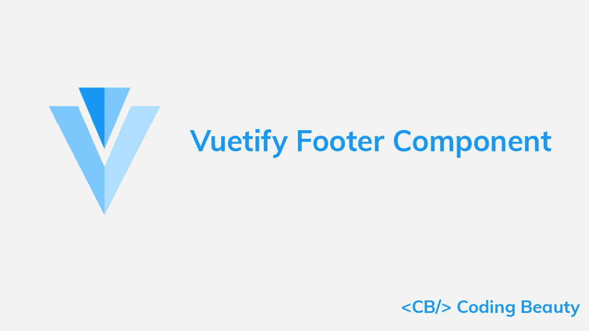
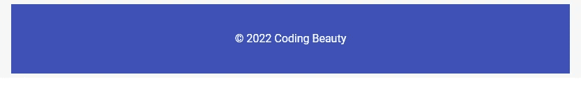
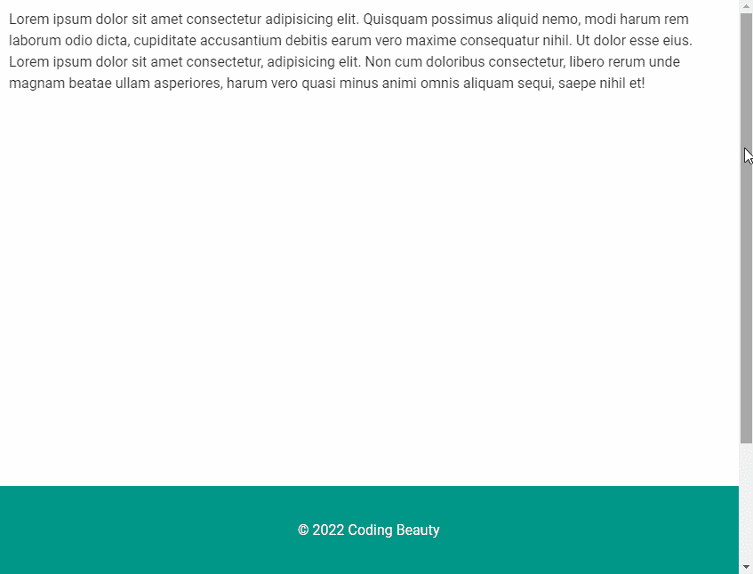

# 如何使用 Vuetify 页脚组件

> 原文：<https://javascript.plainenglish.io/vuetify-footer-bb10808750de?source=collection_archive---------13----------------------->

## 使用 Vuetify 页脚组件创建包含日期、版权和顶级导航链接的页脚。



页脚是位于网页底部，主要内容之后的区域。我们可以用它来显示版权、创建日期和顶级导航链接。在本文中，我们将学习如何使用 Vuetify footer 组件来轻松地为我们的网页创建页脚。

# 页脚组件(v-footer)

Vuetify 提供了用于创建页脚的`v-footer`组件。最简单的形式是作为一个容器。

```
<template>
  <v-app>
    <v-footer>
      <v-card
        tile
        flat
        width="100%"
        color="indigo"
        dark
        height="100px"
        class="d-flex align-center justify-center"
      >
        &copy; 2022 Coding Beauty
      </v-card>
    </v-footer>
  </v-app>
</template>
```



# 使页脚无衬垫化

正如您在前一个例子的结果中所看到的，默认情况下，页脚对其内容应用了一些[填充](https://codingbeautydev.com/blog/vuetify-margin-and-padding/)。我们可以使用`padless`道具来移除它:

```
<template>
  <v-app>
    <v-footer padless>
      <v-card
        tile
        flat
        width="100%"
        color="red accent-2"
        dark
        height="100px"
        class="d-flex align-center justify-center"
      >
        &copy; 2022 Coding Beauty
      </v-card>
    </v-footer>
  </v-app>
</template>
```


# 修改页脚

将`fixed`属性设置为`true`将使页脚保持在同一位置，即使用户滚动页面:

```
<template>
  <v-app>
    <v-container>
      <v-responsive height="800px">
        Lorem ipsum dolor sit amet consectetur adipisicing
        elit. Quisquam possimus aliquid nemo, modi harum rem
        laborum odio dicta, cupiditate accusantium debitis
        earum vero maxime consequatur nihil. Ut dolor esse
        eius. Lorem ipsum dolor sit amet consectetur,
        adipisicing elit. Non cum doloribus consectetur,
        libero rerum unde magnam beatae ullam asperiores,
        harum vero quasi minus animi omnis aliquam sequi,
        saepe nihil et!
      </v-responsive>
    </v-container>
    <v-footer
      fixed
      padless
    >
      <v-card
        tile
        flat
        width="100%"
        color="teal"
        dark
        height="100px"
        class="d-flex align-center justify-center"
      >
        &copy; 2022 Coding Beauty
      </v-card>
    </v-footer>
  </v-app>
</template>
```



# 用美化来美化

使用 Vuetify 材料设计框架创建优雅 web 应用程序的完整指南。


在这里 获得免费副本 [**。**](https://mailchi.mp/583226ee0d7b/beautify-with-vuetify)

# 带链接的页脚

我们可以在页脚中放置链接，这样用户可以从任何网页导航到这些位置。

```
<template>
  <v-app>
    <v-footer
      color="primary"
      dark
    >
      <v-row
        justify="center"
        class="my-4 text-center"
      >
        <v-col cols="12">
          <v-btn
            href="#"
            v-for="link in links"
            :key="link"
            text
            dark
            >{{ link }}
          </v-btn>
        </v-col>
        <v-col cols="12">&copy; 2022 Coding Beauty</v-col>
      </v-row>
    </v-footer>
  </v-app>
</template><script>
export default {
  data: () => {
    return { links: ['Home', 'Blog', 'About'] };
  },
};
</script>
```


# 带有社交链接的页脚

这里有一个页脚，带有社交媒体链接和版权前的一些文本:

```
<template>
  <v-app>
    <v-footer
      color="green"
      dark
    >
      <v-row
        justify="center"
        class="my-4 text-center"
      >
        <v-col cols="12"
          >Lorem ipsum dolor sit amet consectetur
          adipisicing elit.</v-col
        >
        <v-col cols="12">
          <v-btn
            v-for="icon in icons"
            :key="icon"
            text
            dark
          >
            <v-icon>{{ icon }}</v-icon>
          </v-btn>
        </v-col>
        <v-col
          cols="12"
          class="align-center"
          >&copy; 2022 Coding Beauty</v-col
        >
      </v-row>
    </v-footer>
  </v-app>
</template><script>
export default {
  data: () => {
    return {
      icons: [
        'mdi-facebook',
        'mdi-twitter',
        'mdi-instagram',
        'mdi-youtube',
      ],
    };
  },
};
</script>
```


# 结论

页脚可以显示我们希望从网站的任何网页都可以访问的一般信息。我们可以使用 Vuetify footer 组件(`v-footer`)来创建它们。

*更新于:*[*codingbeautydev.com*](https://codingbeautydev.com/blog/vuetify-footer/)*。*

# 订阅编码美容简讯

每周获取新的 web 开发技巧和教程。


[**订阅**](https://codingbeautydev.com/newsletter)