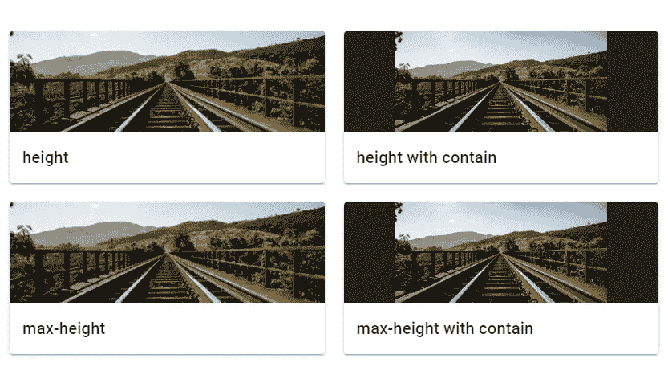

# 如何使用 Vuetify 图像组件

> 原文：<https://javascript.plainenglish.io/vuetify-image-9a7cf7c493a?source=collection_archive---------4----------------------->


图像是每个用户界面不可或缺的一部分。它们改善了用户体验，增加了参与度。由于人们倾向于更快地处理视觉信息，图像可以与文本一起用来解释概念或快速传达信息。在本文中，我们将学习如何使用`v-img`组件在 Vuetify 中显示图像。

# 验证图像组件

Vuetify 提供了用于呈现图像的`v-img`组件。该组件附带了各种道具来定制图像的外观。

```
<template>
  <v-app>
    <div class="d-flex justify-center ma-4">
      <v-img
        contain
        max-height="300"
        min-height="300"
        src="https://picsum.photos/1920/1080?random"
      ></v-img>
    </div>
  </v-app>
</template><script>
export default {
  name: 'App',
};
</script>
```


# 虚拟化中的图像纵横比

使用`v-img`组件的长宽比属性设置一个固定的长宽比。当调整图像大小时，高度和宽度之间的比率保持不变。

```
<template>
  <v-app>
    <div class="d-flex flex-column justify-space-between align-center ma-4">
      <v-slider
        v-model="width"
        class="align-self-stretch"
        min="200"
        max="500"
      ></v-slider> <v-img
        :aspect-ratio="16 / 9"
        :width="width"
        src="https://picsum.photos/1920/1080?random"
      ></v-img>
    </div>
  </v-app>
</template><script>
export default {
  name: 'App',
  data: () => ({
    width: 300,
  }),
};
</script>
```


# 验证图像容器

当提供的宽高比与实际图像的宽高比不匹配时，`v-img`组件将填充同样多的空间并剪切图像的边缘。将`contain`道具设置为`true`会阻止这种情况发生，但会在侧面留下空白。

```
<template>
  <v-app>
    <v-container fluid>
      <v-row justify="space-around">
        <v-col cols="5">
          <div class="text-h6 mb-1">Default (cover)</div>
          <div class="subheading">Matching</div>
          <v-img
            src="https://picsum.photos/510/300?random"
            aspect-ratio="1.7"
          ></v-img>
          <div class="subheading pt-4">Too high</div>
          <v-img
            src="https://picsum.photos/510/300?random"
            aspect-ratio="2"
          ></v-img>
          <div class="subheading pt-4">Too low</div>
          <v-img
            src="https://picsum.photos/510/300?random"
            aspect-ratio="1.4"
          ></v-img>
        </v-col> <v-col cols="5">
          <div class="text-h6 mb-1">Contain</div>
          <div class="subheading">Matching</div>
          <v-img
            src="https://picsum.photos/510/300?random"
            aspect-ratio="1.7"
            contain
          ></v-img>
          <div class="subheading pt-4">Too high</div>
          <v-img
            src="https://picsum.photos/510/300?random"
            aspect-ratio="2"
            contain
          ></v-img>
          <div class="subheading pt-4">Too low</div>
          <v-img
            src="https://picsum.photos/510/300?random"
            aspect-ratio="1.4"
            contain
          ></v-img>
        </v-col>
      </v-row>
    </v-container>
  </v-app>
</template><script>
export default {
  name: 'App',
};
</script>
```


# 用美化来美化

使用 Vuetify 材料设计框架创建优雅 web 应用程序的完整指南。


在 这里免费获得一份 [**。**](https://mailchi.mp/583226ee0d7b/beautify-with-vuetify)

# 美化图像渐变

使用`gradient`道具对图像进行简单的渐变叠加。对于更复杂的渐变，我们可以使用 CSS 类来代替。

```
<template>
  <v-app>
    <v-row class="ma-4">
      <v-col cols="6" sm="4">
        <v-img
          src="https://picsum.photos/1920/1080?random"
          gradient="to top right, rgba(100,115,201,.33), rgba(25,32,72,.7)"
        ></v-img>
      </v-col> <v-col cols="6" sm="4">
        <v-img src="https://picsum.photos/1920/1080?random">
          <div class="fill-height bottom-gradient"></div>
        </v-img>
      </v-col> <v-col cols="6" sm="4">
        <v-img src="https://picsum.photos/1920/1080?random">
          <div class="fill-height repeating-gradient"></div>
        </v-img>
      </v-col>
    </v-row>
  </v-app>
</template><script>
export default {
  name: 'App',};
</script><style scoped>
.bottom-gradient {
  background-image: linear-gradient(
    to top,
    rgba(0, 0, 0, 0.4) 0%,
    transparent 72px
  );
}.repeating-gradient {
  background-image: repeating-linear-gradient(
    -45deg,
    rgba(255, 0, 0, 0.25),
    rgba(255, 0, 0, 0.25) 5px,
    rgba(0, 0, 255, 0.25) 5px,
    rgba(0, 0, 255, 0.25) 10px
  );
}
</style>
```


# 虚拟化图像高度

Vuetify image 组件自动增长到其`src`的大小，并保持正确的纵横比。我们可以使用`height`和`max-height`道具来限制这一点:

```
<template>
  <v-app>
    <v-container class="fill-height" fluid>
      <v-fade-transition mode="out-in">
        <v-row>
          <v-col cols="6">
            <v-card>
              <v-img
                src="https://picsum.photos/350/165?random"
                height="125"
                class="grey darken-4"
              ></v-img>
              <v-card-title class="text-h6"> height </v-card-title>
            </v-card>
          </v-col> <v-col cols="6">
            <v-card>
              <v-img
                src="https://picsum.photos/350/165?random"
                height="125"
                contain
                class="grey darken-4"
              ></v-img>
              <v-card-title class="text-h6"> height with contain </v-card-title>
            </v-card>
          </v-col> <v-col cols="6">
            <v-card>
              <v-img
                src="https://picsum.photos/350/165?random"
                max-height="125"
                class="grey darken-4"
              ></v-img>
              <v-card-title class="text-h6"> max-height </v-card-title>
            </v-card>
          </v-col> <v-col cols="6">
            <v-card>
              <v-img
                src="https://picsum.photos/350/165?random"
                max-height="125"
                contain
                class="grey darken-4"
              ></v-img>
              <v-card-title class="text-h6">
                max-height with contain
              </v-card-title>
            </v-card>
          </v-col>
        </v-row>
      </v-fade-transition>
    </v-container>
  </v-app>
</template><script>
export default {
  name: 'App',
};
</script>
```



# 验证图像占位符

我们可以使用`v-img`占位符槽在图像加载时显示定制内容。以下示例中的图像有一个错误的`src`，它不会加载，因此我们可以看到占位符。

```
<template>
  <v-app>
    <v-row justify="center" class="ma-4">
      <v-img
        src="https://bad.src/not/valid"
        lazy-src="https://picsum.photos/id/12/100/60"
        max-width="500"
        max-height="300"
      >
        <template v-slot:placeholder>
          <v-row class="fill-height ma-0" align="center" justify="center">
            <v-progress-circular
              indeterminate
              color="grey lighten-5"
            ></v-progress-circular>
          </v-row>
        </template>
      </v-img>
    </v-row>
  </v-app>
</template><script>
export default {
  name: 'App',
};
</script>
```


# 创建图像库

我们可以使用`v-img`组件来创建一个图库。

```
<template>
  <v-app>
    <v-row class="ma-4">
      <v-col v-for="n in 6" :key="n" class="d-flex child-flex" cols="4">
        <v-img
          :src="`https://picsum.photos/500/300?image=${n * 12 + 5}`"
          :lazy-src="`https://picsum.photos/10/6?image=${n * 12 + 10}`"
          aspect-ratio="1"
          class="grey lighten-2"
        >
          <template v-slot:placeholder>
            <v-row class="fill-height ma-0" align="center" justify="center">
              <v-progress-circular
                indeterminate
                color="grey lighten-5"
              ></v-progress-circular>
            </v-row>
          </template>
        </v-img>
      </v-col>
    </v-row>
  </v-app>
</template><script>
export default {
  name: 'App',
};
</script>
```


# 结论

图像是每一个界面的重要组成部分，有助于提高参与度，修饰用户界面，让用户更快地处理信息。我们可以使用 Vuetify image 组件(`v-img`)来显示图像并定制它们的显示方式。

*获得关于 Vuetify、Vue、JavaScript 等的每周提示和教程:*[http://eepurl.com/hRfyJL](http://eepurl.com/hRfyJL)

*更新于:*[*【codingbeautydev.com】*](https://codingbeautydev.com/blog/vuetify-image/)