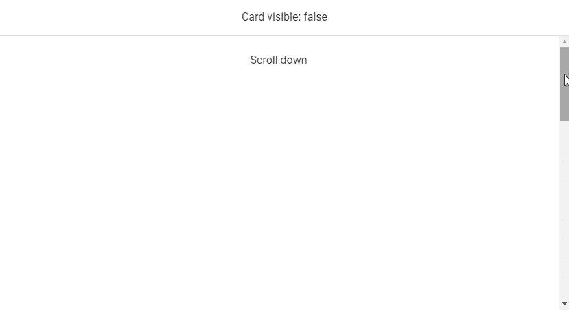
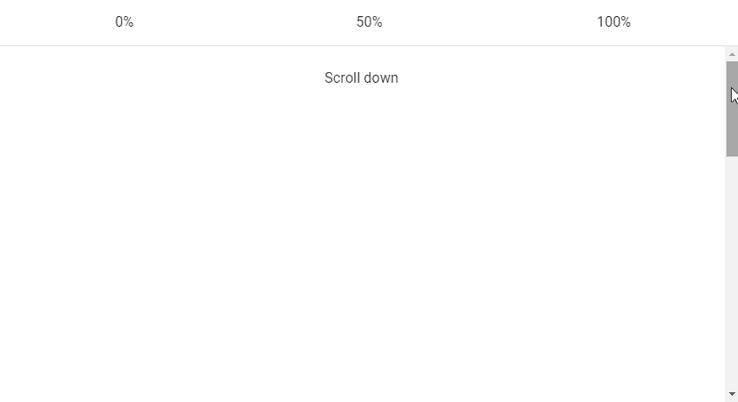
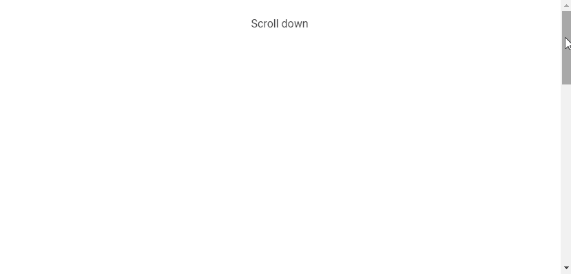

# Vuetify Lazy:如何用 Vuetify 实现延迟加载

> 原文：<https://javascript.plainenglish.io/vuetify-lazy-f51b4078a6f7?source=collection_archive---------17----------------------->


在 web 开发中，惰性加载是一种将 web 页面资源的加载或初始化推迟到实际需要时进行的实践。这是一种减少页面加载时间、节省系统资源和提高性能的有用技术。在这篇文章中，我们将学习如何实现延迟加载，并使用 Vuetify lazy 组件加速我们的网页。

# `v-lazy`组件

Vuetify 提供了`v-lazy`组件，用于根据可见性动态加载 UI 元素。在这个例子中，我们将延迟加载一个[卡](https://codingbeautydev.com/blog/vuetify-card/):

```
<template>
  <v-app>
    <v-responsive class="overflow-y-auto" max-height="400">
      <div class="pa-6 text-center">Scroll down</div><v-responsive height="200vh" class="text-center pa-2">
        <v-responsive min-height="50vh"></v-responsive>
        <div class="text-center text-body-2 mb-12">
          The card will appear below:
        </div><v-lazy min-height="200" :options="{ threshold: 0.5 }">
          <v-card class="mx-auto" max-width="336" color="indigo" dark>
            <v-card-title>Card Title</v-card-title><v-card-text>
              Lorem ipsum dolor sit amet, consectetur adipisicing elit. Ducimus
              totam aperiam, necessitatibus facilis vitae, ratione officiis
              animi earum veritatis repellat enim, dolore sed atque vero?
              Aliquid, pariatur. Cumque, ad voluptate! Lorem ipsum dolor sit
              amet consectetur adipisicing elit. Error vitae, illo tempore
              quisquam velit distinctio ullam illum sint atque impedit suscipit?
              Modi magni quae accusantium iusto ut explicabo sit facere?
            </v-card-text>
          </v-card>
        </v-lazy>
      </v-responsive>
    </v-responsive>
  </v-app>
</template>
<script>
export default {
  name: 'App',
};
</script>
```


# 消灭懒惰`v-model`

我们可以使用`v-model`在`v-lazy`的根元素的渲染可见性和一个变量之间建立一个绑定。在下面的代码示例中，当[卡片](https://codingbeautydev.com/blog/vuetify-card/)出现时，变量(`cardVisible`)将被设置为`true`。

```
<template>
  <v-app>
    <v-banner class="text-center">Card visible: {{ cardVisible }} </v-banner>
    <v-responsive class="overflow-y-auto" max-height="400">
      <div class="pa-6 text-center">Scroll down</div><v-responsive height="200vh" class="text-center pa-2">
        <v-responsive min-height="50vh"></v-responsive>
        <div class="text-center text-body-2 mb-12">
          The card will appear below:
        </div><v-lazy
          min-height="200"
          v-model="cardVisible"
          :options="{ threshold: 0.5 }"
        >
          <v-card class="mx-auto" max-width="336" color="green" dark>
            <v-card-title>Card Title</v-card-title><v-card-text>
              Lorem ipsum dolor sit amet, consectetur adipisicing elit. Ducimus
              totam aperiam, necessitatibus facilis vitae, ratione officiis
              animi earum veritatis repellat enim, dolore sed atque vero?
              Aliquid, pariatur. Cumque, ad voluptate! Lorem ipsum dolor sit
              amet consectetur adipisicing elit. Error vitae, illo tempore
              quisquam velit distinctio ullam illum sint atque impedit suscipit?
              Modi magni quae accusantium iusto ut explicabo sit facere?
            </v-card-text>
          </v-card>
        </v-lazy>
      </v-responsive>
    </v-responsive>
  </v-app>
</template>
<script>
export default {
  name: 'App',
  data: () => ({
    cardVisible: false,
  }),
};
</script>
```



# 用美化来美化

使用 Vuetify 材料设计框架创建优雅 web 应用程序的完整指南。


在 这里免费获得一份 [**。**](https://mailchi.mp/583226ee0d7b/beautify-with-vuetify)

# 使懒惰阈值无效

Vuetify lazy 组件附带了用于定制其行为的`options`道具。这些选项被传递给`v-lazy`内部使用的[交集观察者](https://developer.mozilla.org/en-US/docs/Web/API/Intersection_Observer_API)类的构造函数。其中一个选项是`threshold`。我们可以将`threshold`设置为一个数字，以指示在显示 v-lazy 的根元素之前，它应该进入视口多少。默认的`threshold`是`0`，这意味着只要有一个像素进入视口，元素就会被渲染。

```
<template>
  <v-app>
    <v-banner class="text-center">
      <v-row>
        <v-col> 0% </v-col>
        <v-col> 50% </v-col>
        <v-col> 100% </v-col>
      </v-row>
    </v-banner>
    <v-responsive class="overflow-y-auto" max-height="400">
      <div class="pa-6 text-center">Scroll down</div>
      <v-responsive height="200vh" class="text-center pa-2">
        <v-responsive min-height="50vh"></v-responsive>
        <div class="text-center text-body-2 mb-12">
          The cards will appear below:
        </div>
        <v-row>
          <v-col> <v-lazy min-height="200" :options="{ threshold: 0 }">
              <v-card class="mx-auto" color="red" dark>
                <v-card-title>Card Title</v-card-title> <v-card-text>
                  Lorem ipsum dolor sit amet, consectetur adipisicing elit.
                  Ducimus totam aperiam, necessitatibus facilis vitae, ratione
                  officiis animi earum veritatis repellat enim, dolore sed atque
                  vero? Aliquid, pariatur. Cumque, ad voluptate!
                </v-card-text>
              </v-card>
            </v-lazy>

          </v-col>
          <v-col> <v-lazy min-height="200" :options="{ threshold: 0.5 }">
              <v-card class="mx-auto" color="yellow darken-3" dark>
                <v-card-title>Card Title</v-card-title> <v-card-text>
                  Lorem ipsum dolor sit amet, consectetur adipisicing elit.
                  Ducimus totam aperiam, necessitatibus facilis vitae, ratione
                  officiis animi earum veritatis repellat enim, dolore sed atque
                  vero? Aliquid, pariatur. Cumque, ad voluptate!
                </v-card-text>
              </v-card>
            </v-lazy> </v-col>
          <v-col> <v-lazy min-height="200" :options="{ threshold: 1 }">
              <v-card class="mx-auto" color="blue" dark>
                <v-card-title>Card Title</v-card-title> <v-card-text>
                  Lorem ipsum dolor sit amet, consectetur adipisicing elit.
                  Ducimus totam aperiam, necessitatibus facilis vitae, ratione
                  officiis animi earum veritatis repellat enim, dolore sed atque
                  vero? Aliquid, pariatur. Cumque, ad voluptate!
                </v-card-text>
              </v-card>
            </v-lazy> </v-col>
        </v-row>
      </v-responsive>
    </v-responsive>
  </v-app>
</template>
<script>
export default {
  name: 'App',
};
</script>
```



# 使懒惰的自定义过渡变得有趣

`v-lazy`还附带了`transition`属性，我们可以使用它来定制根元素进入视图的过渡(默认为`fade-transition`)。例如，我们可以设置一个`scale-transition`让它生长到视图中:

```
<template>
  <v-app>
    <v-responsive class="overflow-y-auto" max-height="400">
      <div class="pa-6 text-center">Scroll down</div>
      <v-responsive height="200vh" class="text-center pa-2">
        <v-responsive min-height="50vh"></v-responsive>
        <div class="text-center text-body-2 mb-12">
          The card will appear below:
        </div>
        <v-lazy
          min-height="200"
          :options="{ threshold: 1 }"
          transition="scale-transition"
        >
          <v-card class="mx-auto" color="purple accent-4" dark max-width="300">
            <v-card-title>Card Title</v-card-title> <v-card-text>
              Lorem ipsum dolor sit amet, consectetur adipisicing elit. Ducimus
              totam aperiam, necessitatibus facilis vitae, ratione officiis
              animi earum veritatis repellat enim, dolore sed atque vero?
              Aliquid, pariatur. Cumque, ad voluptate!
            </v-card-text>
          </v-card>
        </v-lazy>
      </v-responsive>
    </v-responsive>
  </v-app>
</template>
<script>
export default {
  name: 'App',
};
</script>
```



# 结论

延迟加载是一种减少页面加载时间和优化性能的有用技术。我们可以使用 Vuetify lazy 组件(`v-lazy`)来实现延迟加载。

*获得关于 Vuetify、Vue、JavaScript 等的每周提示和教程:*[http://eepurl.com/hRfyJL](http://eepurl.com/hRfyJL)

*更新于:*[](https://codingbeautydev.com/blog/vuetify-lazy/)