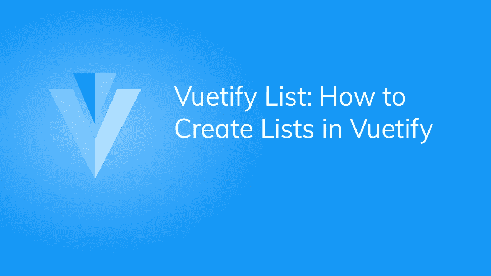
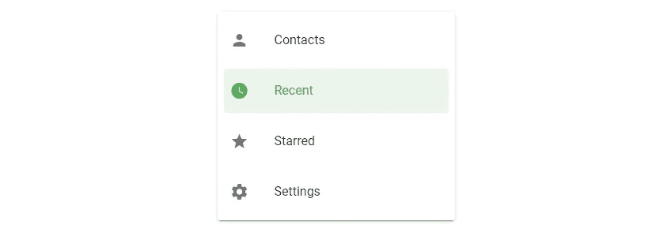
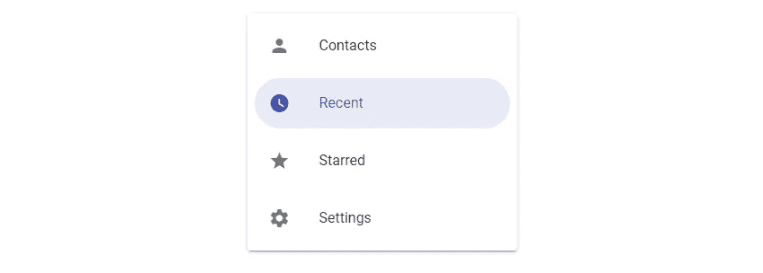
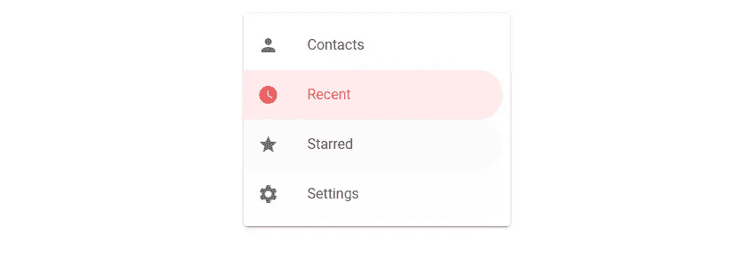
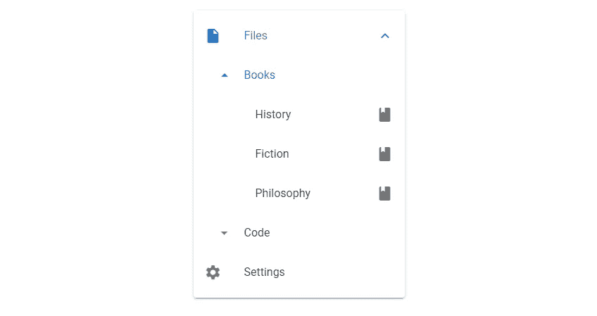
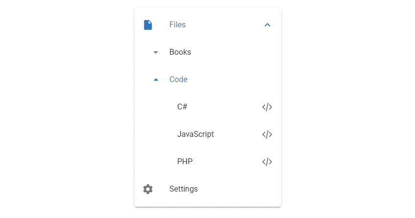

# 如何使用 Vuetify 创建列表

> 原文：<https://javascript.plainenglish.io/vuetify-list-5fec4636535c?source=collection_archive---------24----------------------->

## 创建列表和验证列表的完整指南。



列表用于显示一组相关信息。该信息可以是动态的并且可由用户修改(例如，联系人或任务的列表)，或者它可以是静态的(像用于在应用程序中导航的链接列表)。列表为一组文本或图像提供了一致的样式。在本文中，我们将学习如何使用 Vuetify list 组件将列表添加到我们的 UI 中。

# v 列表组件

在 Vuetify 中创建列表的组件的名称是不言自明的。`v-list`组件用于创建列表。我们使用`v-list-item`组件在列表中创建一个额外的条目。`v-list-item-content`包含主要列表内容，`v-list-item-title`显示列表标题。例如:

```
<template>
  <v-app>
    <v-card class="mx-auto ma-4">
      <v-list>
        <v-list-item
          ><v-list-item-content
            ><v-list-item-title
              >Vuetify list</v-list-item-title
            ></v-list-item-content
          ></v-list-item
        >
      </v-list>
    </v-card>
  </v-app>
</template><script>
export default {
  name: 'App',
};
</script>
```


# 验证两行列表

默认情况下，资格列表是`single-line`。为了在列表中显示两行内容，我们将`two-line`属性设置为`true`:

```
<template>
  <v-app>
    <v-card class="mx-auto ma-4">
      <v-list>
        <v-list-item two-line>
          <v-list-item-content>
            <v-list-item-title>Vuetify list</v-list-item-title>
            <v-list-item-subtitle>Learning Vuetify lists at Coding Beauty!</v-list-item-subtitle>
          </v-list-item-content>
        </v-list-item>
      </v-list>
    </v-card>
  </v-app>
</template><script>
export default {
  name: 'App',
};
</script>
```


# 验证三行列表

我们还可以用`three-line`属性在列表中显示三行文本:

```
<template>
  <v-app>
    <v-card class="mx-auto ma-4">
      <v-list>
        <v-list-item three-line>
          <v-list-item-content>
            <v-list-item-title>Vuetify list</v-list-item-title>
            <v-list-item-subtitle>
              Learning Vuetify lists at Coding Beauty!
            </v-list-item-subtitle>
            <v-list-item-subtitle>
              Using a Vuetify three-line list
            </v-list-item-subtitle>
          </v-list-item-content>
        </v-list-item>
      </v-list>
    </v-card>
  </v-app>
</template><script>
export default {
  name: 'App',
};
</script>
```

[](/create-a-beautiful-to-do-list-app-in-vuetify-displaying-the-list-of-tasks-lists-margins-cc0fde2ed2c1) [## 在 Vuetify 中创建一个漂亮的待办事项列表应用程序——显示任务列表

### 向待办事项列表应用程序显示数据并添加交互性(即列表、边距、复选框)。

javascript.plainenglish.io](/create-a-beautiful-to-do-list-app-in-vuetify-displaying-the-list-of-tasks-lists-margins-cc0fde2ed2c1) 

# 验证列表项目组

我们可以在列表中使用`v-list-item-group`组件来创建一组可选择的列表项。

```
<template>
  <v-app>
    <v-card class="mx-auto ma-4" width="300">
      <v-list>
        <v-list-item-group v-model="selectedItem" color="primary">
          <v-list-item v-for="(item, i) in items" :key="i">
            <v-list-item-icon
              ><v-icon v-text="item.icon"></v-icon
            ></v-list-item-icon>
            <v-list-item-content>
              <v-list-item-title v-text="item.text"></v-list-item-title>
            </v-list-item-content>
          </v-list-item>
        </v-list-item-group>
      </v-list>
    </v-card>
  </v-app>
</template><script>
export default {
  name: 'App',
  data: () => ({
    selectedItem: 1,
    items: [
      { text: 'Contacts', icon: 'mdi-account' },
      { text: 'Recent', icon: 'mdi-clock' },
      { text: 'Starred', icon: 'mdi-star' },
      { text: 'Settings', icon: 'mdi-cog' },
    ],
  }),
};
</script>
```

列表保持状态，单击另一个列表项将更改选择:


# 用美化来美化

使用 Vuetify 材料设计框架创建优雅 web 应用程序的完整指南。


在这里下载免费的[](https://mailchi.mp/583226ee0d7b/beautify-with-vuetify)****！****

# **密集列表**

**我们可以用`dense`属性压缩 Vuetify 中的列表:**

```
<template>
  <v-app>
    <v-card class="mx-auto ma-4" width="300">
      <v-list dense>
        <v-list-item-group v-model="selectedItem" color="primary">
          <v-list-item v-for="(item, i) in items" :key="i">
            <v-list-item-icon
              ><v-icon v-text="item.icon"></v-icon
            ></v-list-item-icon>
            <v-list-item-content>
              <v-list-item-title v-text="item.text"></v-list-item-title>
            </v-list-item-content>
          </v-list-item>
        </v-list-item-group>
      </v-list>
    </v-card>
  </v-app>
</template><script>
export default {
  name: 'App',
  data: () => ({
    selectedItem: 1,
    items: [
      { text: 'Contacts', icon: 'mdi-account' },
      { text: 'Recent', icon: 'mdi-clock' },
      { text: 'Starred', icon: 'mdi-star' },
      { text: 'Settings', icon: 'mdi-cog' },
    ],
  }),
};
</script>
```

****

# **禁用列表**

**我们可以通过将`disabled`属性设置为`true`来禁用与列表的交互:**

```
<template>
  <v-app>
    <v-card class="mx-auto ma-4" width="300">
      <v-list disabled>
        <v-list-item-group v-model="selectedItem" color="primary">
          <v-list-item v-for="(item, i) in items" :key="i">
            <v-list-item-icon
              ><v-icon v-text="item.icon"></v-icon
            ></v-list-item-icon>
            <v-list-item-content>
              <v-list-item-title v-text="item.text"></v-list-item-title>
            </v-list-item-content>
          </v-list-item>
        </v-list-item-group>
      </v-list>
    </v-card>
  </v-app>
</template><script>
export default {
  name: 'App',
  data: () => ({
    selectedItem: 1,
    items: [
      { text: 'Contacts', icon: 'mdi-account' },
      { text: 'Recent', icon: 'mdi-clock' },
      { text: 'Starred', icon: 'mdi-star' },
      { text: 'Settings', icon: 'mdi-cog' },
    ],
  }),
};
</script>
```

# **平面列表**

**`flat`道具去除选中列表项的背景[颜色](https://codingbeautydev.com/blog/vuetify-colors/):**

```
<template>
  <v-app>
    <v-card class="mx-auto ma-4" width="300">
      <v-list flat>
        <v-list-item-group v-model="selectedItem" color="primary">
          <v-list-item v-for="(item, i) in items" :key="i">
            <v-list-item-icon
              ><v-icon v-text="item.icon"></v-icon
            ></v-list-item-icon>
            <v-list-item-content>
              <v-list-item-title v-text="item.text"></v-list-item-title>
            </v-list-item-content>
          </v-list-item>
        </v-list-item-group>
      </v-list>
    </v-card>
  </v-app>
</template><script>
export default {
  name: 'App',
  data: () => ({
    selectedItem: 1,
    items: [
      { text: 'Contacts', icon: 'mdi-account' },
      { text: 'Recent', icon: 'mdi-clock' },
      { text: 'Starred', icon: 'mdi-star' },
      { text: 'Settings', icon: 'mdi-cog' },
    ],
  }),
};
</script>
```

****

# **千万不要错过更新！**

**[注册](http://eepurl.com/hRfyJL)订阅我们的每周简讯，了解更多精彩内容。**

# **验证列表导航样式**

**将`nav`支柱设置到`v-list`上的`true`会减小宽度并使其中的`v-list-items`的角变圆；**

```
<template>
  <v-app>
    <v-card class="mx-auto ma-4" width="300">
      <v-list nav>
        <v-list-item-group v-model="selectedItem" color="green">
          <v-list-item v-for="(item, i) in items" :key="i">
            <v-list-item-icon
              ><v-icon v-text="item.icon"></v-icon
            ></v-list-item-icon>
            <v-list-item-content>
              <v-list-item-title v-text="item.text"></v-list-item-title>
            </v-list-item-content>
          </v-list-item>
        </v-list-item-group>
      </v-list>
    </v-card>
  </v-app>
</template><script>
export default {
  name: 'App',
  data: () => ({
    selectedItem: 1,
    items: [
      { text: 'Contacts', icon: 'mdi-account' },
      { text: 'Recent', icon: 'mdi-clock' },
      { text: 'Starred', icon: 'mdi-star' },
      { text: 'Settings', icon: 'mdi-cog' },
    ],
  }),
};
</script>
```

****

# **Vuetify 中的舍入列表项目**

**我们可以通过将`rounded`道具设置为`true`来使`v-list`内的`v-list-item` s 完全变圆:**

```
<template>
  <v-app>
    <v-card class="mx-auto ma-4" width="300">
      <v-list rounded>
        <v-list-item-group v-model="selectedItem" color="indigo">
          <v-list-item v-for="(item, i) in items" :key="i">
            <v-list-item-icon
              ><v-icon v-text="item.icon"></v-icon
            ></v-list-item-icon>
            <v-list-item-content>
              <v-list-item-title v-text="item.text"></v-list-item-title>
            </v-list-item-content>
          </v-list-item>
        </v-list-item-group>
      </v-list>
    </v-card>
  </v-app>
</template><script>
export default {
  name: 'App',
  data: () => ({
    selectedItem: 1,
    items: [
      { text: 'Contacts', icon: 'mdi-account' },
      { text: 'Recent', icon: 'mdi-clock' },
      { text: 'Starred', icon: 'mdi-star' },
      { text: 'Settings', icon: 'mdi-cog' },
    ],
  }),
};
</script>
```

****

# **Vuetify 中的形状列表项目**

**将`shaped`属性设置为`true`的列表在`v-list-item`的一侧有圆形边框:**

```
<template>
  <v-app>
    <v-card class="mx-auto ma-4" width="300">
      <v-list shaped>
        <v-list-item-group v-model="selectedItem" color="red accent-2">
          <v-list-item v-for="(item, i) in items" :key="i">
            <v-list-item-icon
              ><v-icon v-text="item.icon"></v-icon
            ></v-list-item-icon>
            <v-list-item-content>
              <v-list-item-title v-text="item.text"></v-list-item-title>
            </v-list-item-content>
          </v-list-item>
        </v-list-item-group>
      </v-list>
    </v-card>
  </v-app>
</template><script>
export default {
  name: 'App',
  data: () => ({
    selectedItem: 1,
    items: [
      { text: 'Contacts', icon: 'mdi-account' },
      { text: 'Recent', icon: 'mdi-clock' },
      { text: 'Starred', icon: 'mdi-star' },
      { text: 'Settings', icon: 'mdi-cog' },
    ],
  }),
};
</script>
```

****

# **资格列表子组**

**使用`v-list-group`组件及其`sub-group`属性，我们可以创建最多两个深度级别的子组:**

```
<template>
  <v-app>
    <v-card class="mx-auto ma-4" width="300">
      <v-list>
        <v-list-group :value="true" prepend-icon="mdi-file">
          <template v-slot:activator>
            <v-list-item-title>Files</v-list-item-title>
          </template>
          <v-list-group :value="true" no-action sub-group>
            <template v-slot:activator>
              <v-list-item-content>Books</v-list-item-content>
            </template> <v-list-item v-for="(book, i) in books" :key="i" link>
              <v-list-item-title v-text="book"></v-list-item-title>
              <v-list-item-icon><v-icon>mdi-book</v-icon></v-list-item-icon>
            </v-list-item>
          </v-list-group>
          <v-list-group no-action sub-group>
            <template v-slot:activator>
              <v-list-item-content>Code</v-list-item-content>
            </template> <v-list-item v-for="(code, i) in codes" :key="i" link>
              <v-list-item-title v-text="code"></v-list-item-title>
              <v-list-item-icon><v-icon>mdi-xml</v-icon></v-list-item-icon>
            </v-list-item>
          </v-list-group>
        </v-list-group>
        <v-list-item>
          <v-list-item-icon><v-icon>mdi-cog</v-icon></v-list-item-icon>
          <v-list-item-title>Settings</v-list-item-title>
        </v-list-item>
      </v-list>
    </v-card>
  </v-app>
</template><script>
export default {
  name: 'App',
  data: () => ({
    selectedItem: 1,
    books: ['History', 'Fiction', 'Philosophy'],
    codes: ['C#', 'JavaScript', 'PHP'],
  }),
};
</script>
```

****

**我们可以根据需要扩展和收缩子组:**

****

# **摘要**

**列表用于呈现一组以某种方式相关的信息。Vuetify 提供了`v-list`、`v-list-group`、`v-list-item`等组件，用于创建和定制列表。**

**[*注册*](http://eepurl.com/hRfyJL) *订阅我们的每周简讯，了解更多精彩内容。***

***在*[*codingbeautydev.com*](https://codingbeautydev.com/blog/vuetify-list/)*获取更新文章。***