# 空白和填充:如何使用空白类

> 原文：<https://javascript.plainenglish.io/vuetify-margin-and-padding-daef01087cc5?source=collection_archive---------17----------------------->

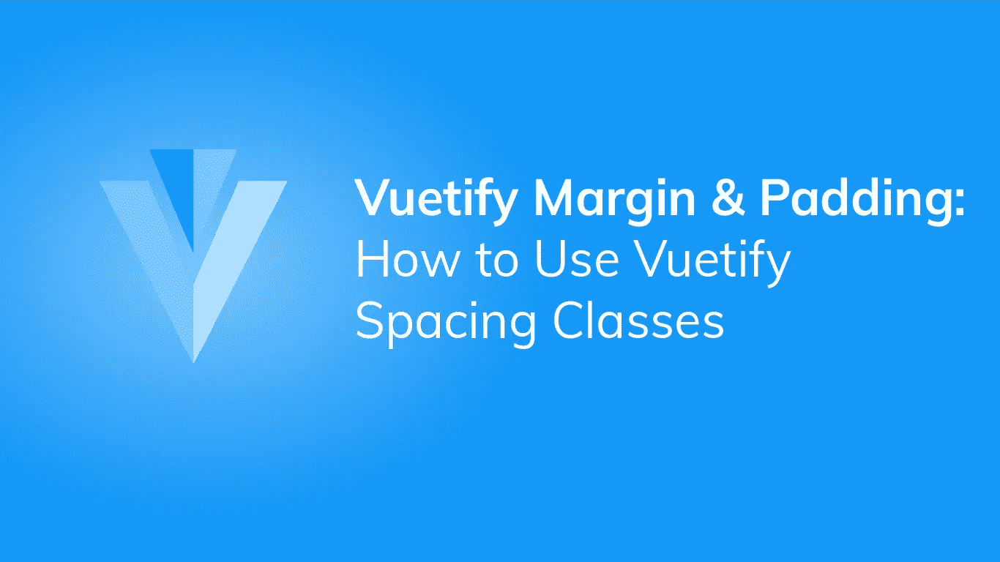

空间是视觉设计的基本元素，在每个用户界面中都很重要。当构建 web 应用程序时，我们通常通过修改元素的填充和边距来分隔元素。Vuetify 提供了间距助手类，用于调整元素的填充和边距，而无需创建新的类。在这篇文章中，我们将学习如何使用它们。

所有的 Vuetify 助手类都是以下格式:`{property}{direction}-{size}`。

# 财产

`property`指定应用于元素的间距类型。有两个可能的值:

*   `m` -应用边距。
*   `p` -应用填充。

# 方向

方向指示应用间距的边距或填充方向。Vuetify 中有九个可用方向:

*   `t` -应用元素的`margin-top`或`padding-top` CSS 属性的间距。
*   `b` -应用`margin-bottom`或`padding-bottom`的间距。
*   `l` -应用`margin-left` 或`padding-left`的间距。
*   `r` -应用`margin-right`或`padding-right`的间距。
*   `s` -当 Vuetify 处于默认 LTR 模式时，`s`的行为类似于`l`。但是在 RTL 模式下，它的行为类似于`r`。
*   `e` -当 Vuetify 处于默认 LTR 模式时，`e`的行为类似于`r`。但是在 RTL 模式下，它的表现就像`l`。
*   `x` -应用`*-left`和`*-right`的间距。
*   `y` -应用`*-top`和`*-bottom`的间距。
*   `a` -在所有四个方向应用属性的间距。

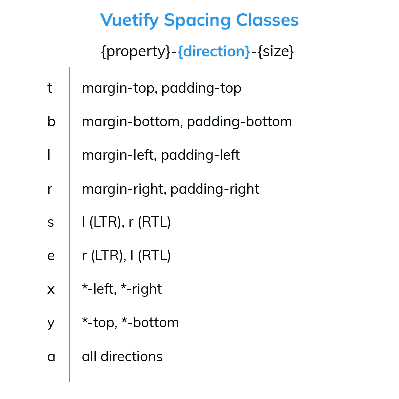

# 大小

大小以像素为单位设置间距的实际值。一个`size` `0`将在指定的方向上从元素中移除边距或填充。要获得正值的像素数，只需将`size`数乘以 4px。Vuetify 提供了 16 种可能的正间距值:

*   `1` -将边距或填充设置为 4px。
*   `2` -将边距或填充设置为 8px。
*   `3` -将边距或填充设置为 12px。
*   `4` -将边距或填充设置为 16px。
*   `5` -将边距或填充设置为 20px。
*   `6` -将边距或填充设置为 24px。
*   `7` -将边距或填充设置为 28px。
*   `8` -将边距或填充设置为 32px。
*   `9` -将边距或填充设置为 36px。
*   `10` -将边距或填充设置为 40px。
*   `11` -将边距或填充设置为 44px。
*   `12` -将边距或填充设置为 48px。
*   `13` -将边距或填充设置为 52px。
*   `14` -将边距或填充设置为 56px。
*   `15` -将边距或填充设置为 60px。
*   `16` -将边距或填充设置为 64px。

我们可以通过在数字前加上`n`来指定负间距值。要获得负值的像素数，将`size`乘以-4px。负间距值仅适用于页边距，Vuetify 中也有 16 个:

*   `n1` -将边距设置为-4px。
*   `n2` -将页边距设置为-8px。
*   `n3` -将页边距设置为-12px。
*   `n4` -将页边距设置为-16px。
*   `n5` -将页边距设置为-20px。
*   `n6` -将页边距设置为-24px。
*   `n7` -将页边距设置为-28px。
*   `n8` -将页边距设置为-32px。
*   `n9` -将页边距设置为-36px。
*   `n10` -将页边距设置为-40px。
*   `n11` -将页边距设置为-44px。
*   `n12` -将页边距设置为-48px。
*   `n13` -将页边距设置为-52px。
*   `n14` -将页边距设置为-56px。
*   `n15` -将页边距设置为-60px。
*   `n16` -将边距设置为-64px。

除了上面可用的间距值，我们还有`auto`间距，它将元素的边距或填充设置为`auto`值。

# 用美化来美化

使用 Vuetify 材料设计框架创建优雅 web 应用程序的完整指南。

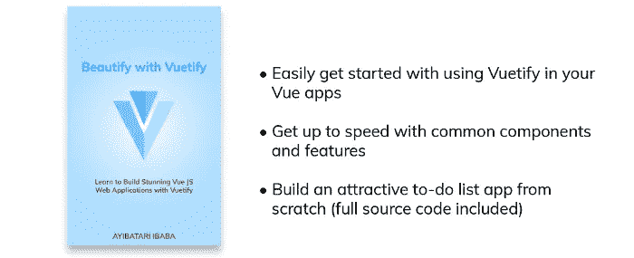

点击这里下载你的免费版本[！](https://mailchi.mp/583226ee0d7b/beautify-with-vuetify)

# 例子

现在我们已经知道了 Vuetify spacing 辅助类，让我们看看如何在实践中使用它们。

```
<template>
  <v-app>
    <v-row>
      <v-col sm="6"> <v-card color="blue" dark>JavaScript</v-card> </v-col>
      <v-col sm="6"> <v-card color="green" dark>PHP</v-card></v-col>
    </v-row>
  </v-app>
</template><script>
export default {
  name: 'App',
};
</script>
```

这里我们创建了两张[卡片](https://codingbeautydev.com/blog/vuetify-cards/)并定制了它们的[颜色](https://codingbeautydev.com/blog/vuetify-colors/):

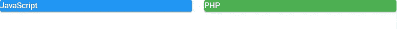

让我们将`mt-2`类添加到包含[卡片](https://codingbeautydev.com/blog/vuetify-cards/)的`v-row`元素中:

```
<template>
  <v-app>
    <v-row class="mt-2">
      <v-col sm="6"> <v-card color="blue" dark>JavaScript</v-card> </v-col>
      <v-col sm="6"> <v-card color="green" dark>PHP</v-card></v-col>
    </v-row>
  </v-app>
</template><script>
export default {
  name: 'App',
};
</script>
```

如果你理解了我们之前讨论的所有内容，你就会知道`mt-2`类会将`v-row`的上边距设置为 8px。当您运行这段代码时，您会看到两张[卡片](https://codingbeautydev.com/blog/vuetify-cards/)和页面顶部之间现在有了一些间隔:

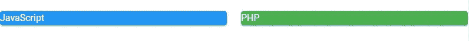

使用`mx-3`类，我们还将创建左右边距(12px):

```
<template>
  <v-app>
    <v-row class="mt-2 mx-3">
      <v-col sm="6"> <v-card color="blue" dark>JavaScript</v-card> </v-col>
      <v-col sm="6"> <v-card color="green" dark>PHP</v-card></v-col>
    </v-row>
  </v-app>
</template><script>
export default {
  name: 'App',
};
</script>
```

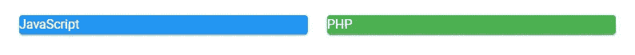

然后，我们将使用`pa-4`和`pa-6`类向两个[卡](https://codingbeautydev.com/blog/vuetify-cards/)添加不同大小的填充:

```
<template>
  <v-app>
    <v-row class="mt-2 mx-3">
      <v-col sm="6">
        <v-card color="blue" dark class="pa-4">JavaScript</v-card>
      </v-col>
      <v-col sm="6">
        <v-card color="green" dark class="pa-6">PHP</v-card></v-col
      >
    </v-row>
  </v-app>
</template><script>
export default {
  name: 'App',
};
</script>
```

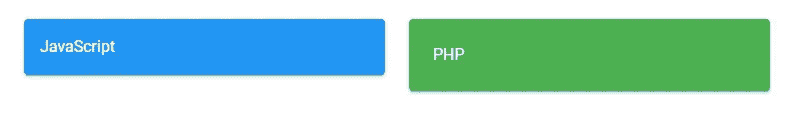

这是另一个例子。我们有两个[按钮](https://codingbeautydev.com/blog/vuetify-buttons/)，它们的[颜色](https://codingbeautydev.com/blog/vuetify-colors/)我们已经设置为绿色和红色:

```
<template>
  <v-app>
    <v-col>
      <v-btn color="green" dark>Okay</v-btn>
      <v-btn color="red" dark>Cancel</v-btn></v-col
    >
  </v-app>
</template><script>
export default {
  name: 'App',
};
</script>
```


`py-10`类将为绿色按钮添加 40px 的底部和顶部填充:

```
<template>
  <v-app>
    <v-col>
      <v-btn color="green" class="py-10" dark>Okay</v-btn>
      <v-btn color="red" dark>Cancel</v-btn></v-col
    >
  </v-app>
</template><script>
export default {
  name: 'App',
};
</script>
```

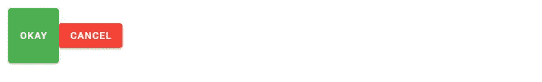

为了隔开按钮，我们将使用`ml-5`类为“取消”按钮添加一个左边距:

```
<template>
  <v-app>
    <v-col>
      <v-btn color="green" class="py-10" dark>Okay</v-btn>
      <v-btn color="red" dark class="ml-5">Cancel</v-btn></v-col
    >
  </v-app>
</template><script>
export default {
  name: 'App',
};
</script>
```

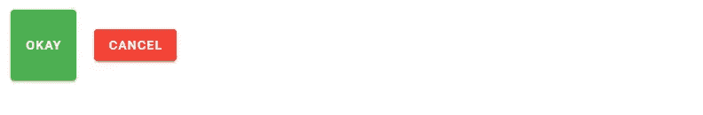

我们还将使用`px-16`类水平填充它:

```
<template>
  <v-app>
    <v-col>
      <v-btn color="green" class="py-10" dark>Okay</v-btn>
      <v-btn color="red" dark class="ml-5 px-16">Cancel</v-btn></v-col
    >
  </v-app>
</template><script>
export default {
  name: 'App',
};
</script>
```

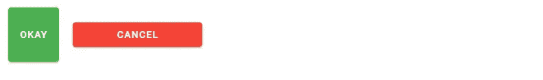

让我们为“确定”按钮添加一个负的右边距，以删除我们添加的间距:

```
<template>
  <v-app>
    <v-col>
      <v-btn color="green" class="py-10 mr-n5" dark>Okay</v-btn>
      <v-btn color="red" dark class="ml-5 px-16">Cancel</v-btn></v-col
    >
  </v-app>
</template><script>
export default {
  name: 'App',
};
</script>
```

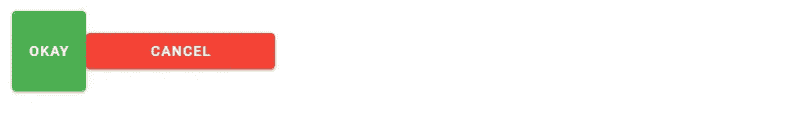

# 摘要

Vuetify 提供了间隔助手类，允许我们在不使用自定义类或内联 CSS 的情况下，间隔和填充我们的 UI 元素。这些类可以改变不同方向和不同大小的元素的边距或填充。

[*注册*](http://eepurl.com/hRfyJL) *订阅我们的每周时事通讯，了解关于 Vuetify 和 Vue 的最新提示和教程。*

*在*[*codingbeautydev.com*](https://codingbeautydev.com/blog/vuetify-margin-and-padding/)*获取更新文章。*