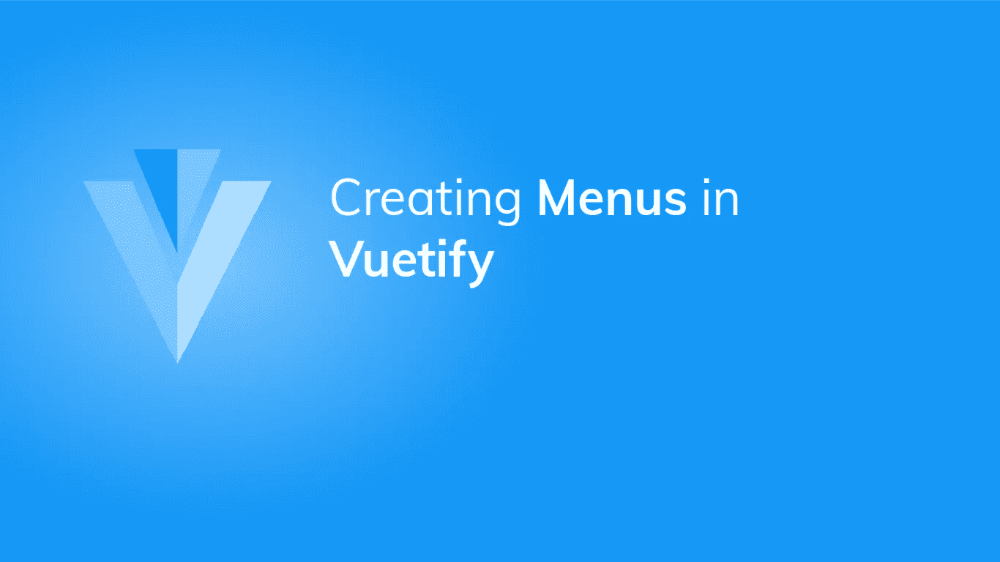
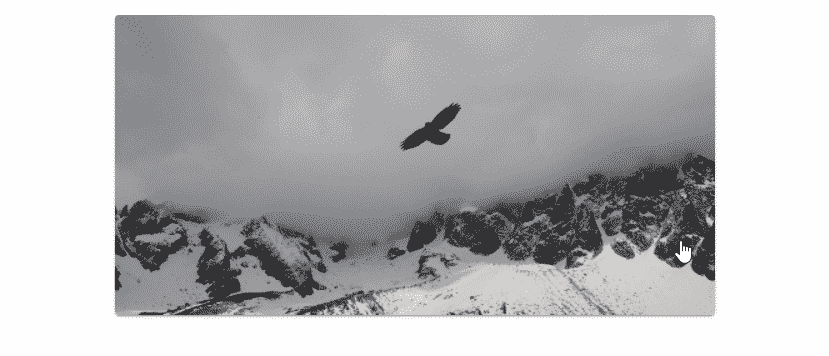
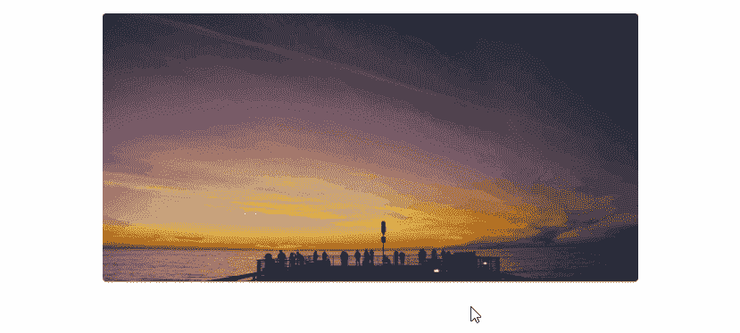
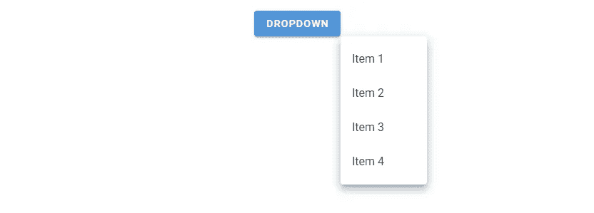
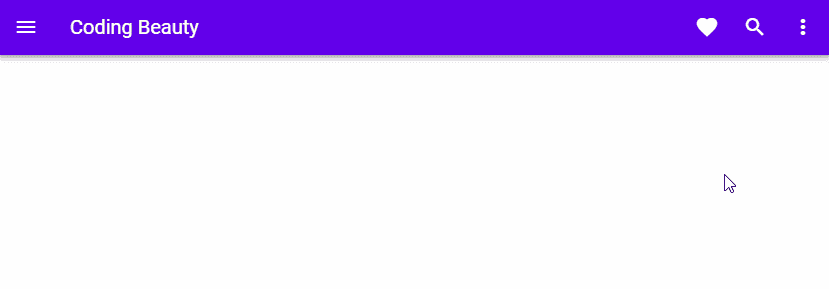

# 如何在 Vuetify 中轻松创建多功能菜单

> 原文：<https://javascript.plainenglish.io/vuetify-menu-6112770ea167?source=collection_archive---------9----------------------->



菜单是用户界面中的通用组件。它显示了一个可以提供各种功能的弹出窗口，比如显示选项列表。它们可以与其他组件一起使用，如[工具栏](https://codingbeautydev.com/blog/vuetify-toolbar/)、[应用程序栏](https://codingbeautydev.com/blog/vuetify-app-bar/)或[按钮](https://codingbeautydev.com/blog/vuetify-button/)。在本文中，我们将学习如何在 Vuetify 中创建和定制菜单。

# v 菜单组件

Vuetify 提供了用于创建菜单的`v-menu`组件。我们使用`activator`槽来设置点击时激活菜单的组件。在本例中，我们将其设置为一个[按钮](https://codingbeautydev.com/blog/vuetify-button/):

```
<template>
  <v-app>
    <div class="text-center ma-4">
      <v-menu offset-y>
        <template v-slot:activator="{ on, attrs }">
          <v-btn color="primary" dark v-bind="attrs" v-on="on">
            Dropdown
          </v-btn>
        </template>
        <v-list>
          <v-list-item v-for="index in 4" :key="index">
            <v-list-item-title>Item {{ index }}</v-list-item-title>
          </v-list-item>
        </v-list>
      </v-menu>
    </div>
  </v-app>
</template><script>
export default {
  name: 'App',
};
</script>
```

点击按钮将显示弹出菜单:


# 在 Vuetify 中创建绝对菜单

我们可以用`absolute`道具在`activator`槽中的元素顶部放置一个菜单。

```
<template>
  <v-app>
    <div class="d-flex justify-center ma-4">
      <v-menu offset-y absolute>
        <template v-slot:activator="{ on, attrs }">
          <v-card
            class="portrait"
            img="https://picsum.photos/1920/1080?random"
            height="300"
            width="600"
            v-bind="attrs"
            v-on="on"
          ></v-card>
        </template>
        <v-list>
          <v-list-item v-for="index in 4" :key="index">
            <v-list-item-title>Item {{ index }}</v-list-item-title>
          </v-list-item>
        </v-list>
      </v-menu>
    </div>
  </v-app>
</template><script>
export default {
  name: 'App',
};
</script>
```



# 无激活器的绝对菜单

通过将`absolute`与`position-x`和`position-y`道具一起使用，我们也可以使用没有`activator`的菜单。这对于创建上下文菜单很有用:

```
<template>
  <v-app>
    <div>
      <div class="d-flex justify-center ma-4">
        <v-card
          :ripple="false"
          class="portrait"
          img="https://picsum.photos/1920/1080?random"
          height="300"
          width="600"
          @contextmenu="show"
        ></v-card>
      </div>
      <v-menu
        v-model="showMenu"
        :position-x="x"
        :position-y="y"
        absolute
        offset-y
      >
        <v-list>
          <v-list-item v-for="index in 4" :key="index">
            <v-list-item-title>Option {{ index }}</v-list-item-title>
          </v-list-item>
        </v-list>
      </v-menu>
    </div>
  </v-app>
</template><script>
export default {
  name: 'App',
  data: () => ({
    showMenu: false,
    x: 0,
    y: 0,
  }), methods: {
    show(e) {
      e.preventDefault();
      this.showMenu = false;
      this.x = e.clientX;
      this.y = e.clientY;
      this.$nextTick(() => {
        this.showMenu = true;
      });
    },
  },
};
</script>
```



# 用美化来美化

使用 Vuetify 材料设计框架创建优雅 web 应用程序的完整指南。


在 这里免费获得一份 [**。**](https://mailchi.mp/583226ee0d7b/beautify-with-vuetify)

# 点击关闭菜单

`close-on-click`道具决定菜单失去焦点时是否关闭。

```
<template>
  <v-app>
    <div class="text-center ma-4">
      <v-menu offset-y :close-on-click="true">
        <template v-slot:activator="{ on, attrs }">
          <v-btn color="primary" dark v-bind="attrs" v-on="on">
            Dropdown
          </v-btn>
        </template>
        <v-list>
          <v-list-item v-for="index in 4" :key="index">
            <v-list-item-title>Item {{ index }}</v-list-item-title>
          </v-list-item>
        </v-list>
      </v-menu>
    </div>
  </v-app>
</template><script>
export default {
  name: 'App',
};
</script>
```

这里`close-on-click`被设置为`true`，所以点击另一个元素将关闭菜单:


如果我们将其设置为`false`:

```
<template>
  <v-app>
    <div class="text-center ma-4">
      <v-menu offset-y :close-on-click="false">
        <template v-slot:activator="{ on, attrs }">
          <v-btn color="primary" dark v-bind="attrs" v-on="on">
            Dropdown
          </v-btn>
        </template>
        <v-list>
          <v-list-item v-for="index in 4" :key="index">
            <v-list-item-title>Item {{ index }}</v-list-item-title>
          </v-list-item>
        </v-list>
      </v-menu>
    </div>
  </v-app>
</template><script>
export default {
  name: 'App',
};
</script>
```

即使当我们单击另一个元素或移除它的焦点时，它也会保持打开状态:


# 单击内容时关闭菜单

我们可以使用`close-on-content-click`属性来决定当菜单的内容被点击时是否应该关闭。

将`close-on-content-click`设置为`true`:

```
<template>
  <v-app>
    <div class="text-center ma-4">
      <v-menu offset-y :close-on-content-click="true">
        <template v-slot:activator="{ on, attrs }">
          <v-btn color="purple accent-4" dark v-bind="attrs" v-on="on">
            Dropdown
          </v-btn>
        </template>
        <v-list>
          <v-list-item v-for="index in 4" :key="index">
            <v-list-item-title>Item {{ index }}</v-list-item-title>
          </v-list-item>
        </v-list>
      </v-menu>
    </div>
  </v-app>
</template><script>
export default {
  name: 'App',
};
</script>
```


将`close-on-content-click`设置为`false`:

```
<template>
  <v-app>
    <div class="text-center ma-4">
      <v-menu offset-y :close-on-content-click="false">
        <template v-slot:activator="{ on, attrs }">
          <v-btn color="purple accent-4" dark v-bind="attrs" v-on="on">
            Dropdown
          </v-btn>
        </template>
        <v-list>
          <v-list-item v-for="index in 4" :key="index">
            <v-list-item-title>Item {{ index }}</v-list-item-title>
          </v-list-item>
        </v-list>
      </v-menu>
    </div>
  </v-app>
</template><script>
export default {
  name: 'App',
};
</script>
```


# 禁用菜单

我们可以防止用`disabled`道具打开菜单:

```
<template>
  <v-app>
    <div class="text-center ma-4">
      <v-menu offset-y disabled>
        <template v-slot:activator="{ on, attrs }">
          <v-btn color="green" dark v-bind="attrs" v-on="on"> Dropdown </v-btn>
        </template>
        <v-list>
          <v-list-item v-for="index in 4" :key="index">
            <v-list-item-title>Item {{ index }}</v-list-item-title>
          </v-list-item>
        </v-list>
      </v-menu>
    </div>
  </v-app>
</template><script>
export default {
  name: 'App',
};
</script>
```


# 菜单偏移

## 偏移 X

我们可以使用`offset-x`道具将菜单偏移 X 轴，使`activator`可见。

```
<template>
  <v-app>
    <div class="text-center ma-4">
      <v-menu offset-x>
        <template v-slot:activator="{ on, attrs }">
          <v-btn color="primary" dark v-bind="attrs" v-on="on">
            Dropdown
          </v-btn>
        </template>
        <v-list>
          <v-list-item v-for="index in 4" :key="index">
            <v-list-item-title>Item {{ index }}</v-list-item-title>
          </v-list-item>
        </v-list>
      </v-menu>
    </div>
  </v-app>
</template><script>
export default {
  name: 'App',
};
</script>
```


## 偏移 Y

我们也可以通过 Y 轴偏移菜单来使`activator`可见。

```
<template>
  <v-app>
    <div class="text-center ma-4">
      <v-menu offset-y>
        <template v-slot:activator="{ on, attrs }">
          <v-btn color="primary" dark v-bind="attrs" v-on="on">
            Dropdown
          </v-btn>
        </template>
        <v-list>
          <v-list-item v-for="index in 4" :key="index">
            <v-list-item-title>Item {{ index }}</v-list-item-title>
          </v-list-item>
        </v-list>
      </v-menu>
    </div>
  </v-app>
</template><script>
export default {
  name: 'App',
};
</script>
```


## 偏移 X 和偏移 Y

我们也可以结合这两个道具:

```
<template>
  <v-app>
    <div class="text-center ma-4">
      <v-menu offset-x offset-y>
        <template v-slot:activator="{ on, attrs }">
          <v-btn color="primary" dark v-bind="attrs" v-on="on">
            Dropdown
          </v-btn>
        </template>
        <v-list>
          <v-list-item v-for="index in 4" :key="index">
            <v-list-item-title>Item {{ index }}</v-list-item-title>
          </v-list-item>
        </v-list>
      </v-menu>
    </div>
  </v-app>
</template><script>
export default {
  name: 'App',
};
</script>
```



# 悬停时打开菜单

将`open-on-hover`按钮设置为`true`会使菜单在其`activator`悬停时打开。

```
<template>
  <v-app>
    <div class="text-center ma-4">
      <v-menu open-on-hover offset-y>
        <template v-slot:activator="{ on, attrs }">
          <v-btn color="teal" dark v-bind="attrs" v-on="on"> Dropdown </v-btn>
        </template>
        <v-list>
          <v-list-item v-for="index in 4" :key="index">
            <v-list-item-title>Item {{ index }}</v-list-item-title>
          </v-list-item>
        </v-list>
      </v-menu>
    </div>
  </v-app>
</template><script>
export default {
  name: 'App',
};
</script>
```


# 在 Vuetify 中创建圆形菜单

属性允许我们自定义菜单的边框半径。

将其设置为`0`将删除边框半径:

```
<template>
  <v-app>
    <div class="text-center ma-4">
      <v-menu offset-y rounded="0">
        <template v-slot:activator="{ on, attrs }">
          <v-btn color="blue" dark v-bind="attrs" v-on="on">
            Removed Radius
          </v-btn>
        </template>
        <v-list>
          <v-list-item v-for="index in 4" :key="index">
            <v-list-item-title>Item {{ index }}</v-list-item-title>
          </v-list-item>
        </v-list>
      </v-menu>
    </div>
  </v-app>
</template><script>
export default {
  name: 'App',
};
</script>
```


我们可以通过设置`rounded`到`true`来给菜单一个大的边框半径:

```
<template>
  <v-app>
    <div class="text-center ma-4">
      <v-menu offset-y rounded="lg">
        <template v-slot:activator="{ on, attrs }">
          <v-btn color="indigo" dark v-bind="attrs" v-on="on">
            Large Radius</v-btn
          >
        </template>
        <v-list>
          <v-list-item v-for="index in 4" :key="index">
            <v-list-item-title>Item {{ index }}</v-list-item-title>
          </v-list-item>
        </v-list>
      </v-menu>
    </div>
  </v-app>
</template><script>
export default {
  name: 'App',
};
</script>
```


我们还可以指定自定义边框半径，例如:

```
<template>
  <v-app>
    <div class="text-center ma-4">
      <v-menu offset-y rounded="b-xl">
        <template v-slot:activator="{ on, attrs }">
          <v-btn color="red" dark v-bind="attrs" v-on="on">
            Custom Radius</v-btn
          >
        </template>
        <v-list>
          <v-list-item v-for="index in 4" :key="index">
            <v-list-item-title>Item {{ index }}</v-list-item-title>
          </v-list-item>
        </v-list>
      </v-menu>
    </div>
  </v-app>
</template><script>
export default {
  name: 'App',
};
</script>
```


# 使用带有工具提示的菜单

我们还可以显示菜单的工具提示。我们通过用`v-slot`语法嵌套`activator`插槽并将插槽的道具附加到同一个`activator`组件(在本例中是一个[按钮](https://codingbeautydev.com/blog/vuetify-button/))来实现这一点。

```
<template>
  <v-app>
    <div class="text-center ma-4">
      <v-menu>
        <template v-slot:activator="{ on: menu, attrs }">
          <v-tooltip bottom>
            <template v-slot:activator="{ on: tooltip }">
              <v-btn
                color="primary"
                dark
                v-bind="attrs"
                v-on="{ ...tooltip, ...menu }"
              >
                Dropdown w/ Tooltip</v-btn
              >
            </template>
            <span>This is a tooltip</span>
          </v-tooltip>
        </template>
        <v-list>
          <v-list-item v-for="index in 4" :key="index">
            <v-list-item-title>Item {{ index }}</v-list-item-title>
          </v-list-item>
        </v-list>
      </v-menu>
    </div>
  </v-app>
</template><script>
export default {
  name: 'App',
};
</script>
```


# Vuetify 中的自定义菜单过渡

我们还可以定制菜单打开和关闭时使用的过渡。Vuetify 有三个标准转换:`scale`、`slide-x`和`slide-y`。

## 规模过渡

`scale-transition`打开时使菜单变大，关闭时缩小:

```
<template>
  <v-app>
    <div class="text-center ma-4">
      <v-menu transition="scale-transition" origin="center center" bottom>
        <template v-slot:activator="{ on, attrs }">
          <v-btn color="primary" dark v-bind="attrs" v-on="on">
            Scale Transition</v-btn
          >
        </template>
        <v-list>
          <v-list-item v-for="index in 4" :key="index">
            <v-list-item-title>Item {{ index }}</v-list-item-title>
          </v-list-item>
        </v-list>
      </v-menu>
    </div>
  </v-app>
</template><script>
export default {
  name: 'App',
};
</script>
```


## 幻灯片 X 过渡

`slide-x-transition`打开时使菜单从左侧滑入，关闭时使菜单滑出:

```
<template>
  <v-app>
    <div class="text-center ma-4">
      <v-menu transition="slide-x-transition" bottom right>
        <template v-slot:activator="{ on, attrs }">
          <v-btn color="primary" dark v-bind="attrs" v-on="on">
            Slide X Transition</v-btn
          >
        </template>
        <v-list>
          <v-list-item v-for="index in 4" :key="index">
            <v-list-item-title>Item {{ index }}</v-list-item-title>
          </v-list-item>
        </v-list>
      </v-menu>
    </div>
  </v-app>
</template><script>
export default {
  name: 'App',
};
</script>
```


## 幻灯片 Y 过渡

`slide-y-transition`打开时使菜单从顶部滑入，关闭时滑回:

```
<template>
  <v-app>
    <div class="text-center ma-4">
      <v-menu transition="slide-y-transition" bottom>
        <template v-slot:activator="{ on, attrs }">
          <v-btn color="primary" dark v-bind="attrs" v-on="on">
            Slide X Transition</v-btn
          >
        </template>
        <v-list>
          <v-list-item v-for="index in 4" :key="index">
            <v-list-item-title>Item {{ index }}</v-list-item-title>
          </v-list-item>
        </v-list>
      </v-menu>
    </div>
  </v-app>
</template><script>
export default {
  name: 'App',
};
</script>
```


# 使用带有应用程序栏的菜单

我们可以使用带有[工具栏](https://codingbeautydev.com/blog/vuetify-toolbar/)或[应用程序栏](https://codingbeautydev.com/blog/vuetify-app-bar/)的菜单:

```
<template>
  <v-app>
    <v-app-bar app color="deep-purple accent-4" dark>
      <v-app-bar-nav-icon> </v-app-bar-nav-icon>
      <v-toolbar-title>Coding Beauty</v-toolbar-title>
      <v-spacer></v-spacer>
      <v-btn icon> <v-icon> mdi-heart </v-icon> </v-btn>
      <v-btn icon>
        <v-icon>mdi-magnify</v-icon>
      </v-btn>
      <v-menu left bottom>
        <template v-slot:activator="{ on, attrs }">
          <v-btn icon v-bind="attrs" v-on="on">
            <v-icon>mdi-dots-vertical</v-icon>
          </v-btn>
        </template> <v-list>
          <v-list-item v-for="n in 4" :key="n" @click="() => {}">
            Option {{ n }}
          </v-list-item>
        </v-list>
      </v-menu>
    </v-app-bar>
  </v-app>
</template><script>
export default {
  name: 'App',
};
</script>
```



# 结论

菜单是用户界面中的一个多功能用户界面组件，它显示了一个弹出窗口，我们可以将它用于各种目的。它可以与一个[按钮](https://codingbeautydev.com/blog/vuetify-button/)、一个[工具栏](https://codingbeautydev.com/blog/vuetify-toolbar/)或一个[应用栏](https://codingbeautydev.com/blog/vuetify-app-bar/)一起工作。Vuetify 提供了用于创建和定制菜单的`v-menu`组件。

*获得关于 Vuetify、Vue、JavaScript 等的每周提示和教程:*[http://eepurl.com/hRfyJL](http://eepurl.com/hRfyJL)

*更新于:*[*codingbeautydev.com*](https://codingbeautydev.com/blog/vuetify-menu/)*。*