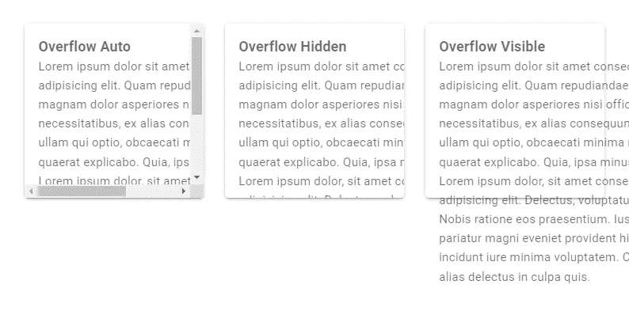
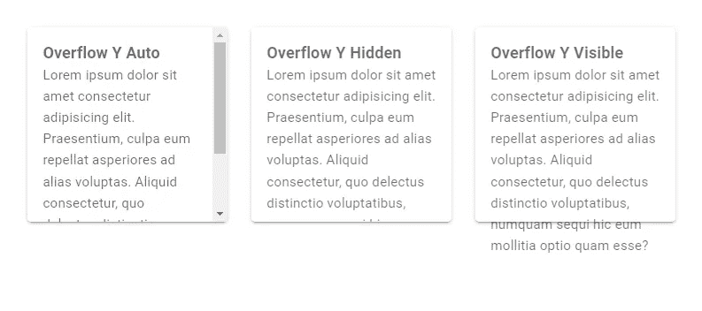
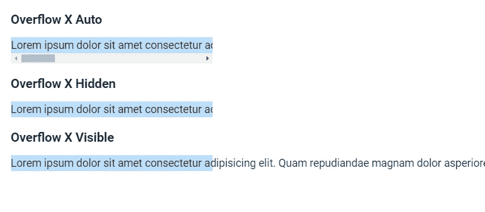

# 如何使用 Vuetify 溢出助手类

> 原文：<https://javascript.plainenglish.io/vuetify-overflow-2dd2586e47c?source=collection_archive---------6----------------------->


Vuetify 提供了实用程序类，允许我们轻松地配置当内容的大小超过其容器的界限时，内容如何溢出。在本文中，我们将学习如何使用它们。

这些类的格式是`{overflow}-{value}`。`overflow`可以是`overflow`、`overflow-x`、`overflow-y`中的任意一个，而 value 可以是`auto`、`hidden`和`visible`中的任意一个。以下是来自 Vuetify 的所有溢出助手类:

*   `overflow-auto`
*   `overflow-hidden`
*   `overflow-visible`
*   `overflow-x-auto`
*   `overflow-x-hidden`
*   `overflow-x-visible`
*   `overflow-y-auto`
*   `overflow-y-hidden`
*   `overflow-y-visible`

# 验证溢出类

*   `overflow-auto`:当元素内容溢出时，在垂直或水平方向上添加滚动条。
*   `overflow-hidden`:裁剪垂直或水平方向溢出其容器边界的内容。
*   `overflow-visible`:允许内容在垂直或水平方向上超出其容器的边界。

```
<template>
  <v-app>
    <v-row class="ma-4">
      <v-col cols="4">
        <v-card
          class="overflow-auto"
          height="200"
        >
          <v-card-text style="width: 300px">
            <h3>Overflow Auto</h3>
            Lorem ipsum dolor sit amet consectetur
            adipisicing elit. Quam repudiandae magnam dolor
            asperiores nisi officia, necessitatibus, ex
            alias consequuntur ullam qui optio, obcaecati
            minima modi quaerat explicabo. Quia, ipsa minus.
            Lorem ipsum dolor, sit amet consectetur
            adipisicing elit. Delectus, voluptatum? Nobis
            ratione eos praesentium. Iusto pariatur magni
            eveniet provident hic incidunt iure minima
            voluptatem. Corrupti alias delectus in culpa
            quis.
          </v-card-text>
        </v-card>
      </v-col>
      <v-col cols="4">
        <v-card
          class="overflow-hidden"
          height="200"
        >
          <v-card-text style="width: 300px">
            <h3>Overflow Hidden</h3>
            Lorem ipsum dolor sit amet consectetur
            adipisicing elit. Quam repudiandae magnam dolor
            asperiores nisi officia, necessitatibus, ex
            alias consequuntur ullam qui optio, obcaecati
            minima modi quaerat explicabo. Quia, ipsa minus.
            Lorem ipsum dolor, sit amet consectetur
            adipisicing elit. Delectus, voluptatum? Nobis
            ratione eos praesentium. Iusto pariatur magni
            eveniet provident hic incidunt iure minima
            voluptatem. Corrupti alias delectus in culpa
            quis.
          </v-card-text>
        </v-card>
      </v-col>
      <v-col cols="4">
        <v-card
          class="overflow-visible"
          height="200"
        >
          <v-card-text style="width: 300px">
            <h3>Overflow Visible</h3>
            Lorem ipsum dolor sit amet consectetur
            adipisicing elit. Quam repudiandae magnam dolor
            asperiores nisi officia, necessitatibus, ex
            alias consequuntur ullam qui optio, obcaecati
            minima modi quaerat explicabo. Quia, ipsa minus.
            Lorem ipsum dolor, sit amet consectetur
            adipisicing elit. Delectus, voluptatum? Nobis
            ratione eos praesentium. Iusto pariatur magni
            eveniet provident hic incidunt iure minima
            voluptatem. Corrupti alias delectus in culpa
            quis.
          </v-card-text>
        </v-card>
      </v-col>
    </v-row>
  </v-app>
</template><script>
export default {
  name: 'App',
};
</script>
```



# 用美化来美化

使用 Vuetify 材料设计框架创建优雅 web 应用程序的完整指南。


在 这里免费获得一份 [**。**](https://mailchi.mp/583226ee0d7b/beautify-with-vuetify)

# 验证溢出的 Y 类

*   `overflow-y-auto`:当元素内容溢出时，在垂直方向上添加滚动条。
*   `overflow-y-hidden`:裁剪垂直方向溢出容器边界的内容。
*   `overflow-y-visible`:允许内容在垂直方向上超出其容器的边界。

```
<template>
  <v-app>
    <v-row class="ma-4">
      <v-col cols="4">
        <v-card
          class="overflow-y-auto"
          height="200"
        >
          <v-card-text>
            <h3>Overflow Y Auto</h3>
            Lorem ipsum dolor sit amet consectetur
            adipisicing elit. Praesentium, culpa eum
            repellat asperiores ad alias voluptas. Aliquid
            consectetur, quo delectus distinctio
            voluptatibus, numquam sequi hic eum mollitia
            optio quam esse?
          </v-card-text>
        </v-card>
      </v-col>
      <v-col cols="4">
        <v-card
          class="overflow-y-hidden"
          height="200"
        >
          <v-card-text>
            <h3>Overflow Y Hidden</h3>
            Lorem ipsum dolor sit amet consectetur
            adipisicing elit. Praesentium, culpa eum
            repellat asperiores ad alias voluptas. Aliquid
            consectetur, quo delectus distinctio
            voluptatibus, numquam sequi hic eum mollitia
            optio quam esse?
          </v-card-text>
        </v-card>
      </v-col>
      <v-col cols="4">
        <v-card
          class="overflow-y-visible"
          height="200"
        >
          <v-card-text>
            <h3>Overflow Y Visible</h3>
            Lorem ipsum dolor sit amet consectetur
            adipisicing elit. Praesentium, culpa eum
            repellat asperiores ad alias voluptas. Aliquid
            consectetur, quo delectus distinctio
            voluptatibus, numquam sequi hic eum mollitia
            optio quam esse?
          </v-card-text>
        </v-card>
      </v-col>
    </v-row>
  </v-app>
</template><script>
export default {
  name: 'App',
};
</script>
```



# 验证溢出 X 类

*   `overflow-x-auto`:当元素的内容溢出时，在水平方向上添加滚动条。
*   `overflow-x-hidden`:裁剪水平方向溢出容器边界的内容。
*   `overflow-x-visible`:允许内容在水平方向上超出其容器的边界。

```
<template>
  <v-app>
    <div style="width: 300px;white-space:nowrap" class="ma-4">
      <h3 class="mb-3">Overflow X Auto</h3>
      <p class="overflow-x-auto blue lighten-4">
        Lorem ipsum dolor sit amet consectetur adipisicing elit. Quam repudiandae magnam dolor asperiores nisi officia, necessitatibus, ex alias consequuntur ullam qui optio, obcaecati minima modi quaerat explicabo. Quia, ipsa minus.
      </p>
      <h3 class="mb-3">Overflow X Hidden</h3>
      <p class="overflow-x-hidden blue lighten-4">
        Lorem ipsum dolor sit amet consectetur adipisicing elit. Quam repudiandae magnam dolor asperiores nisi officia, necessitatibus, ex alias consequuntur ullam qui optio, obcaecati minima modi quaerat explicabo. Quia, ipsa minus.
      </p>
      <h3 class="mb-3">Overflow X Visible</h3>
      <p class="overflow-x-visible blue lighten-4">
        Lorem ipsum dolor sit amet consectetur adipisicing elit. Quam repudiandae magnam dolor asperiores nisi officia, necessitatibus, ex alias consequuntur ullam qui optio, obcaecati minima modi quaerat explicabo. Quia, ipsa minus.
      </p>
    </div>
  </v-app>
</template><script>
export default {
  name: 'App',
};
</script>
```



# 结论

我们可以使用 Vuetify 中的溢出助手类来控制在垂直或水平方向上溢出其容器边界的内容会发生什么。

*通过每周一次的关于 Vuetify、Vue、JavaScript 和更多来自 Coding Beauty 的技巧和教程提高您的开发技能:*[*【http://eepurl.com/hRfyJL】*](http://eepurl.com/hRfyJL)

*更新于:*[*codingbeautydev.com*](https://codingbeautydev.com/blog/vuetify-overflow/)