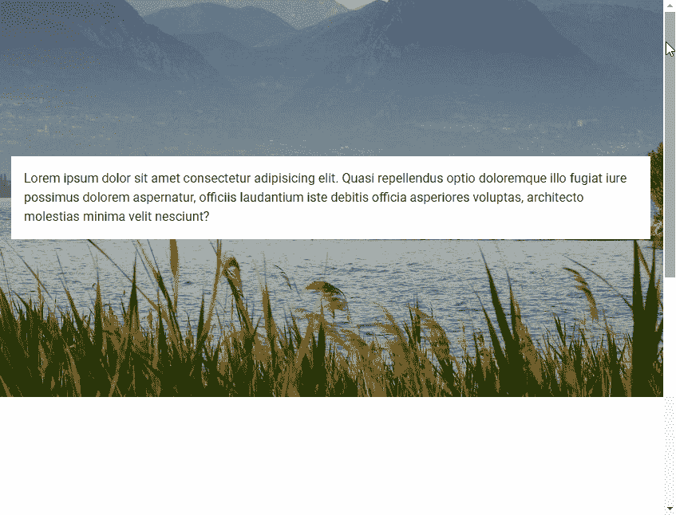
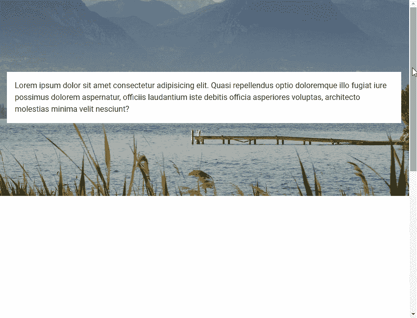

# 如何使用虚拟化视差组件

> 原文：<https://javascript.plainenglish.io/vuetify-parallax-f73539f05e40?source=collection_archive---------15----------------------->


视差滚动是网页上使用的一种视觉效果，其中背景内容的移动速度比前景内容慢。在本文中，我们将学习如何使用 Vuetify 中的视差组件来创建背景图像的视差滚动效果。

# 虚拟视差组件(v 视差)

我们使用`v-parallax`来创建一个视差组件。它有一个`src`属性，用于指定作为背景使用的图像的 URL。

```
<template>
  <v-app>
    <div style="height: 1200px">
      <v-parallax
        src="https://picsum.photos/1920/1080?random"
      >
      </v-parallax>
    </div>
  </v-app>
</template>
```


# 视差内容

我们可以通过使视差成为`v-parallax`的子视差来包含内容。这对创造英雄形象很有用。例如:

```
<template>
  <v-app>
    <div style="height: 1200px">
      <v-parallax
        src="https://picsum.photos/1920/1080?random"
      >
        <div class="white black--text pa-4">
          Lorem ipsum dolor sit amet consectetur adipisicing
          elit. Quasi repellendus optio doloremque illo
          fugiat iure possimus dolorem aspernatur, officiis
          laudantium iste debitis officia asperiores
          voluptas, architecto molestias minima velit
          nesciunt?
        </div>
      </v-parallax>
    </div>
  </v-app>
</template>
```



# 视差高度

我们可以用`height`道具自定义视差组件的高度。例如:

```
<template>
  <v-app>
    <div style="height: 1200px">
      <v-parallax
        src="https://picsum.photos/1920/1080?random"
        height="400"
      >
        <div class="white black--text pa-4">
          Lorem ipsum dolor sit amet consectetur adipisicing
          elit. Quasi repellendus optio doloremque illo
          fugiat iure possimus dolorem aspernatur, officiis
          laudantium iste debitis officia asperiores
          voluptas, architecto molestias minima velit
          nesciunt?
        </div>
      </v-parallax>
    </div>
  </v-app>
</template>
```



【codingbeautydev.com】更新于:[](https://codingbeautydev.com/blog/vuetify-parallax/)

# *用美化来美化*

*使用 Vuetify 材料设计框架创建优雅 web 应用程序的完整指南。*

**

*在这里 免费获得一份 [**。**](https://mailchi.mp/583226ee0d7b/beautify-with-vuetify)*