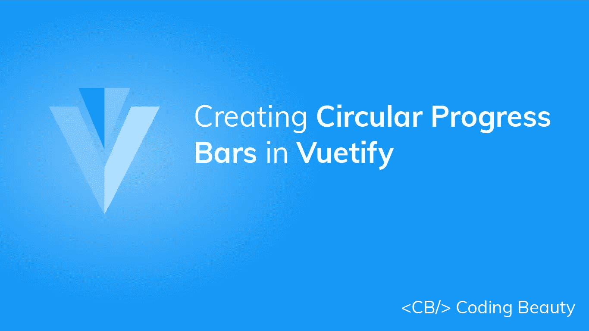

# 如何创建循环进度条

> 原文：<https://javascript.plainenglish.io/vuetify-progress-circular-b42ae6986acd?source=collection_archive---------15----------------------->



圆形进度条用于向用户传递一些正在进行的操作的信息。就像[水平进度条](https://codingbeautydev.com/blog/vuetify-progress-linear/)一样，它们在视觉上表示操作已经前进了多远。请继续阅读，了解 Vuetify 进度循环组件以及我们可以定制它的各种方式。

# “验证进度循环”组件

Vuetify 提供了`v-progress-circular component for creating`圆形进度条。我们使用`value`属性将进度条值设置为一个介于`0`和`100`之间的数字。

```
<template>
  <v-app>
    <div class="d-flex justify-center ma-4">
      <div class="d-flex justify-space-between" style="width: 60%">
        <v-progress-circular></v-progress-circular> <v-progress-circular :value="20"></v-progress-circular> <v-progress-circular :value="40"></v-progress-circular> <v-progress-circular :value="60"></v-progress-circular> <v-progress-circular :value="80"></v-progress-circular> <v-progress-circular :value="100"></v-progress-circular>
      </div>
    </div>
  </v-app>
</template><script>
export default {
  name: 'App',
};
</script>
```


# Vuetify 中的圆形进度条颜色

虚拟化进度圆形组件为自定义圆形进度条的[颜色](https://codingbeautydev.com/blog/vuetify-colors/)提供了`color`道具。

```
<template>
  <v-app>
    <div class="d-flex justify-center ma-4">
      <div class="d-flex justify-space-between" style="width: 60%">
        <v-progress-circular :value="20" color="green"></v-progress-circular> <v-progress-circular :value="40" color="primary"></v-progress-circular> <v-progress-circular :value="60" color="red"></v-progress-circular> <v-progress-circular
          :value="80"
          color="purple accent-4"
        ></v-progress-circular> <v-progress-circular
          :value="100"
          color="yellow darken-3"
        ></v-progress-circular>
      </div>
    </div>
  </v-app>
</template><script>
export default {
  name: 'App',
};
</script>
```


# 虚拟化中不确定的循环进度条

与 [Vuetify progress 线性组件](https://codingbeautydev.com/blog/vuetify-progress-linear/)类似，`v-progress-circular`可以设置为不确定模式。当不确定时，它会连续显示动画:

```
<template>
  <v-app>
    <div class="d-flex justify-center ma-4">
      <div class="d-flex justify-space-between" style="width: 60%">
        <v-progress-circular indeterminate color="lime"></v-progress-circular> <v-progress-circular indeterminate color="red"></v-progress-circular> <v-progress-circular
          indeterminate
          color="primary"
        ></v-progress-circular> <v-progress-circular
          indeterminate
          color="yellow darken-3"
        ></v-progress-circular> <v-progress-circular
          indeterminate
          color="purple accent-4"
        ></v-progress-circular>
      </div>
    </div>
  </v-app>
</template><script>
export default {
  name: 'App',
};
</script>
```


# 用美化来美化

使用 Vuetify 材料设计框架创建优雅 web 应用程序的完整指南。


在这里 免费获得一份 [**。**](https://mailchi.mp/583226ee0d7b/beautify-with-vuetify)

# 虚拟化进度循环旋转

道具允许我们自定义圆形进度条的原点。

```
<template>
  <v-app>
    <div class="d-flex justify-center ma-4">
      <div class="d-flex justify-space-between" style="width: 60%">
        <v-progress-circular
          :rotate="360"
          :size="100"
          :width="15"
          :value="value"
          color="purple accent-4"
        >
          {{ value }}
        </v-progress-circular> <v-progress-circular
          :rotate="-90"
          :size="100"
          :width="15"
          :value="value"
          color="primary"
        >
          {{ value }}
        </v-progress-circular> <v-progress-circular
          :rotate="90"
          :size="100"
          :width="15"
          :value="value"
          color="green"
        >
          {{ value }}
        </v-progress-circular> <v-progress-circular
          :rotate="180"
          :size="100"
          :width="15"
          :value="value"
          color="red accent-2"
        >
          {{ value }}
        </v-progress-circular>
      </div>
    </div>
  </v-app>
</template><script>
export default {
  name: 'App',
  data() {
    return {
      interval: {},
      value: 0,
    };
  },
  beforeDestroy() {
    clearInterval(this.interval);
  },
  mounted() {
    this.interval = setInterval(() => {
      this.value = this.value === 100 ? 0 : this.value + 10;
    }, 1000);
  },
};
</script>
```


# 圆形尺寸和厚度

`v-progress-circular`的`size`支柱允许我们修改圆形进度条的高度，而`width`支柱可以定制进度条的厚度。

```
<template>
  <v-app>
    <div class="d-flex justify-center ma-4">
      <div class="d-flex justify-space-between align-center" style="width: 60%">
        <v-progress-circular
          :size="50"
          color="red accent-2"
          indeterminate
        ></v-progress-circular> <v-progress-circular
          :width="3"
          color="primary"
          indeterminate
        ></v-progress-circular> <v-progress-circular
          :size="70"
          :width="9"
          color="orange"
          indeterminate
        ></v-progress-circular> <v-progress-circular
          :width="3"
          color="green"
          indeterminate
        ></v-progress-circular> <v-progress-circular
          :size="50"
          color="purple accent-4"
          indeterminate
        ></v-progress-circular>
      </div>
    </div>
  </v-app>
</template><script>
export default {
  name: 'App',
  data() {
    return {
      interval: {},
      value: 0,
    };
  },
  beforeDestroy() {
    clearInterval(this.interval);
  },
  mounted() {
    this.interval = setInterval(() => {
      this.value = this.value === 100 ? 0 : this.value + 10;
    }, 1000);
  },
};
</script>
```


# 结论

圆形进度条向用户传达关于应用程序中正在进行的进程的当前进度的信息。使用 Vuetify 进度循环组件(`v-progress-circular`)创建和自定义循环进度条。

http://eepurl.com/hRfyJL获得关于 Vuetify、Vue、JavaScript 等的每周提示和教程

*更新于:*[*【codingbeautydev.com】*](https://codingbeautydev.com/blog/vuetify-progress-circular/)