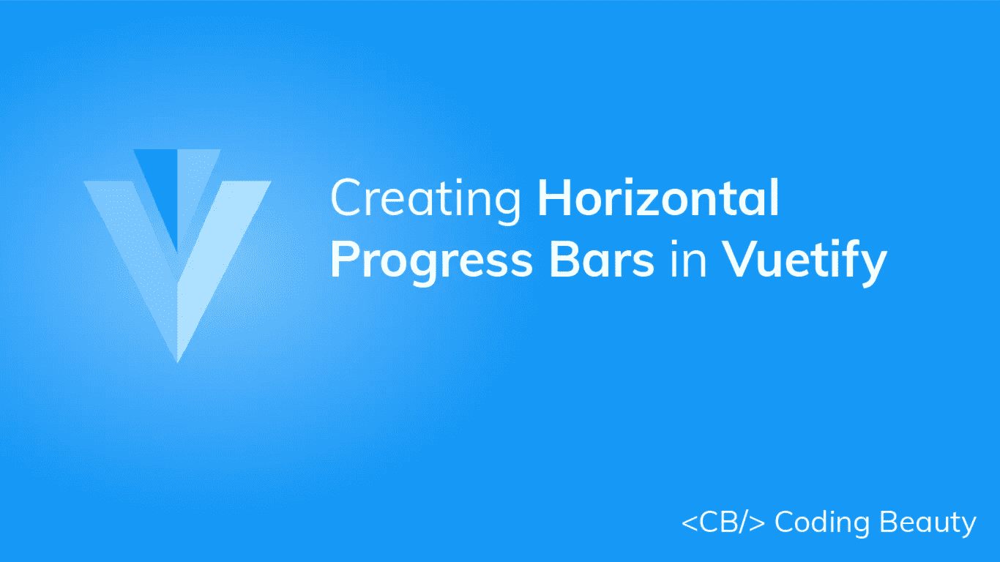
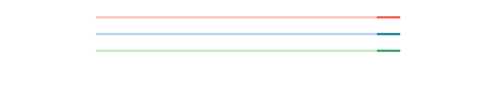
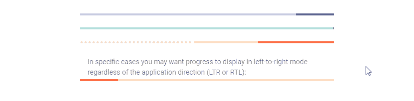
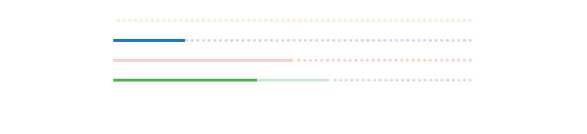
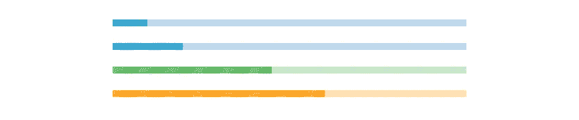
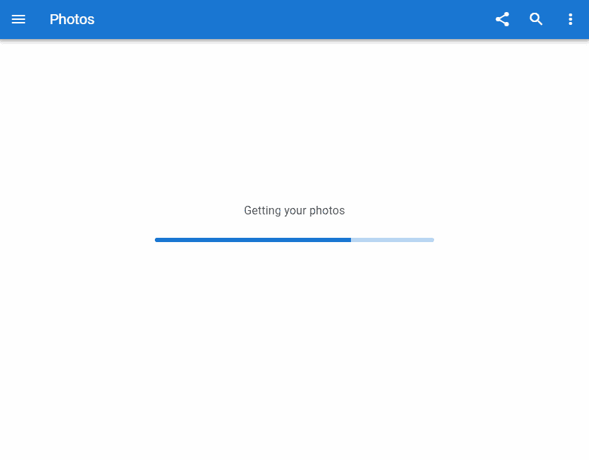
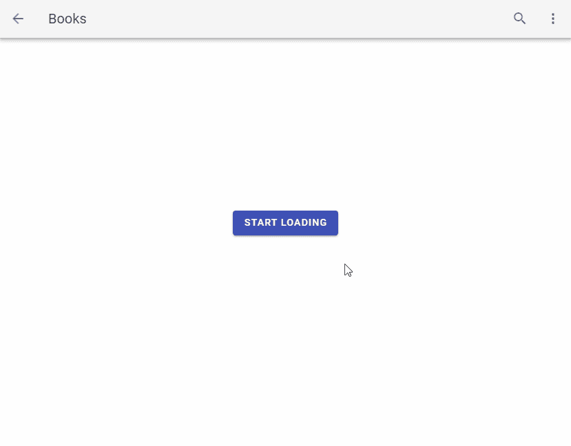

# 如何创建水平进度条

> 原文：<https://javascript.plainenglish.io/vuetify-progress-linear-16f401636002?source=collection_archive---------17----------------------->



进度条在界面中用于向用户传递与某个操作的已知进度相关的信息。它们直观地表示操作进行了多远，可以是圆形的，也可以是水平的。它们也可以是不确定的，以指示数据的加载或处理。在这篇文章中，我们将学习如何用 Vuetify progress 线性组件创建一个水平进度条。

# 垂直进度线性组件

Vuetify 提供了用于创建水平进度条的组件`v-progress-linear`。

```
<template>
  <v-app>
    <v-progress-linear></v-progress-linear>
  </v-app>
</template><script>
export default {
  name: 'App',
};
</script>
```


# 进度条值

进度线性组件带有`value`道具，我们可以使用它将进度条设置为`0`和`100`之间的确定值:

```
<template>
  <v-app>
    <v-row justify="center" class="ma-4">
      <v-col sm="6">
        <v-progress-linear value="40"></v-progress-linear>
      </v-col>
    </v-row>
  </v-app>
</template><script>
export default {
  name: 'App',
};
</script>
```


# 进度线性 v 型模型

我们可以使用`v-model`在进度条的值和变量之间建立一个双向绑定:

```
<template>
  <v-app>
    <v-row justify="center" class="ma-4">
      <v-col sm="6">
        <v-progress-linear v-model="value"></v-progress-linear>
      </v-col>
    </v-row>
  </v-app>
</template><script>
export default {
  name: 'App',
  data: () => ({
    value: 30,
  }),
};
</script>
```


要查看这种双向绑定的效果，让我们创建两个[按钮](https://codingbeautydev.com/blog/vuetify-button/)来更改进度条值，并创建一些[文本](https://codingbeautydev.com/blog/vuetify-typography/)来显示该值。我们用一个[虚拟间距](https://codingbeautydev.com/blog/vuetify-margin-and-padding/)辅助类(`ma-2`)将[按钮](https://codingbeautydev.com/blog/vuetify-button/)隔开。

```
<template>
  <v-app>
    <v-row justify="center" class="ma-4">
      <v-col sm="6">
        <v-row>
          <v-progress-linear v-model="value"></v-progress-linear>
        </v-row>
        <v-row justify="center">{{ value }}%</v-row>
        <v-row justify="center">
          <v-btn class="ma-2" @click="value -= 10" color="red" dark>
            -10
          </v-btn>
          <v-btn class="ma-2" @click="value += 10" color="green" dark>
            +10
          </v-btn>
        </v-row>
      </v-col>
    </v-row>
  </v-app>
</template><script>
export default {
  name: 'App',
  data: () => ({
    value: 30,
  }),
};
</script>
```


# 用美化来美化

使用 Vuetify 材料设计框架创建优雅 web 应用程序的完整指南。


在这里 免费获得一份 [**。**](https://mailchi.mp/583226ee0d7b/beautify-with-vuetify)

# 进度线性缓冲值

一个缓冲状态同时代表两个值。主值由`v-model`控制，而缓冲值由`buffer-value`控制:

```
<template>
  <v-app>
    <v-row justify="center" class="ma-4">
      <v-col sm="8">
        <v-progress-linear
          v-model="value"
          :buffer-value="bufferValue"
        ></v-progress-linear>
        <br />
        <v-progress-linear
          v-model="value"
          :buffer-value="bufferValue"
          color="green"
        ></v-progress-linear>
        <br />
        <v-progress-linear
          v-model="value"
          :buffer-value="bufferValue"
          color="orange"
        ></v-progress-linear>
        <br />
        <v-progress-linear
          v-model="value"
          :buffer-value="bufferValue"
          color="purple accent-4"
        ></v-progress-linear>
      </v-col>
    </v-row>
  </v-app>
</template><script>
export default {
  name: 'App',
  data() {
    return {
      value: 10,
      bufferValue: 20,
      interval: 0,
    };
  }, watch: {
    value(val) {
      if (val < 100) return; this.value = 0;
      this.bufferValue = 10;
      this.startBuffer();
    },
  }, mounted() {
    this.startBuffer();
  }, beforeDestroy() {
    clearInterval(this.interval);
  }, methods: {
    startBuffer() {
      clearInterval(this.interval); this.interval = setInterval(() => {
        this.value += Math.random() * (15 - 5) + 5;
        this.bufferValue += Math.random() * (15 - 5) + 6;
      }, 1000);
    },
  },
};
</script>
```


# 进度条自定义颜色

Vuetify progress 线性组件带有一个`color`道具，允许我们定制水平进度条的[颜色](https://codingbeautydev.com/blog/vuetify-colors/):

```
<template>
  <v-app>
    <v-row justify="center" class="ma-4">
      <v-col sm="8">
        <v-progress-linear
          background-color="blue"
          color="red accent-2"
          value="20"
        ></v-progress-linear>
        <br />
        <v-progress-linear
          background-color="grey"
          color="yellow"
          value="40"
        ></v-progress-linear>
        <br />
        <v-progress-linear
          background-color="green lighten-3"
          color="green"
          value="60"
        ></v-progress-linear>
      </v-col>
    </v-row>
  </v-app>
</template><script>
export default {
  name: 'App',
};
</script>
```


# 线性不确定进度

我们可以用`indeterminate`道具显示一个不确定的进度条。

```
<template>
  <v-app>
    <v-row justify="center" class="ma-4">
      <v-col sm="8">
        <v-progress-linear indeterminate color="red"></v-progress-linear>
        <br />
        <v-progress-linear indeterminate color="primary"></v-progress-linear>
        <br />
        <v-progress-linear indeterminate color="green"></v-progress-linear>
      </v-col>
    </v-row>
  </v-app>
</template><script>
export default {
  name: 'App',
};
</script>
```

不确定时，进度条将连续显示动画:



# 反向进度条

将`reverse`杆设置为`true`将显示一个反向进度条(在 LTR 模式下从右到左，在 RTL 模式下从左到右)。

```
<template>
  <v-app>
    <v-row justify="center" class="ma-4">
      <v-col sm="8">
        <v-progress-linear
          color="indigo"
          value="15"
          reverse
        ></v-progress-linear> <br /> <v-progress-linear
          color="teal"
          indeterminate
          reverse
        ></v-progress-linear> <br /> <v-progress-linear
          buffer-value="55"
          color="red accent-2"
          reverse
          stream
          value="30"
        ></v-progress-linear> <br /> <v-subheader
          >In specific cases you may want progress to display in left-to-right
          mode regardless of the application direction (LTR or
          RTL):</v-subheader
        > <v-progress-linear
          :reverse="$vuetify.rtl"
          value="15"
          color="yellow darken-3"
        ></v-progress-linear>
      </v-col>
    </v-row>
  </v-app>
</template><script>
export default {
  name: 'App',
};
</script>
```



# 进度线性舍入

我们可以通过将`rounded`属性设置为`true`来为虚拟化进度线性组件添加边界半径:

```
<template>
  <v-app>
    <v-row justify="center" class="ma-4">
      <v-col sm="8">
        <v-progress-linear
          color="blue accent-2"
          rounded
          value="100"
        ></v-progress-linear> <br /> <v-progress-linear color="pink" rounded value="100"></v-progress-linear> <br /> <v-progress-linear
          color="orange"
          rounded
          value="100"
        ></v-progress-linear> <br /> <v-progress-linear
          color="purple accent-4"
          rounded
          value="100"
        ></v-progress-linear>
      </v-col>
    </v-row>
  </v-app>
</template><script>
export default {
  name: 'App',
};
</script>
```


# 进度条流

`stream`道具和`buffer-value`一起工作来通知用户一些动作正在发生。

```
<template>
  <v-app>
    <v-row justify="center" class="ma-4">
      <v-col sm="8">
        <v-progress-linear
          color="yellow darken-3"
          buffer-value="0"
          stream
        ></v-progress-linear>
        <br />
        <v-progress-linear
          color="primary"
          buffer-value="0"
          value="20"
          stream
        ></v-progress-linear>
        <br />
        <v-progress-linear
          buffer-value="50"
          stream
          color="red"
        ></v-progress-linear>
        <br />
        <v-progress-linear
          buffer-value="60"
          value="40"
          stream
          color="green"
        ></v-progress-linear>
      </v-col>
    </v-row>
  </v-app>
</template><script>
export default {
  name: 'App',
};
</script>
```



# 条纹进度条

`striped`道具在水平进度条的值部分应用条纹背景。

```
<template>
  <v-app>
    <v-row justify="center" class="ma-4">
      <v-col sm="8">
        <v-progress-linear
          color="indigo"
          height="10"
          value="10"
          striped
        ></v-progress-linear>
        <br />
        <v-progress-linear
          color="cyan"
          height="10"
          value="20"
          striped
        ></v-progress-linear>
        <br />
        <v-progress-linear
          height="10"
          value="45"
          striped
          color="green"
        ></v-progress-linear>
        <br />
        <v-progress-linear
          value="60"
          height="10"
          striped
          color="orange"
        ></v-progress-linear>
      </v-col>
    </v-row>
  </v-app>
</template><script>
export default {
  name: 'App',
};
</script>
```



# 默认插槽

使用 progress linear 组件的默认槽，我们可以在进度条中显示自定义组件。

```
<template>
  <v-app>
    <v-row justify="center" class="ma-4">
      <v-col sm="8">
        <v-progress-linear
          :indeterminate="query"
          :query="true"
          height="25"
          value="30"
        >
          <template v-slot:default="{ value }">
            <strong>{{ value }}%</strong>
          </template>
        </v-progress-linear>
      </v-col>
    </v-row>
  </v-app>
</template><script>
export default {
  name: 'App',
  data: () => ({
    query: false,
  }),
};
</script>
```

这里，我们简单地将进度条值显示为百分比:


# 使用进度条作为加载指示器

进度线性组件有用的一个实例是向用户传达响应待定。就像在样本照片应用程序中从服务器获取用户的照片一样。

```
<template>
  <v-app>
    <v-app-bar app color="primary" dark>
      <v-app-bar-nav-icon></v-app-bar-nav-icon>
      <v-toolbar-title>Photos</v-toolbar-title>
      <v-spacer></v-spacer>
      <v-btn icon>
        <v-icon>mdi-share-variant</v-icon>
      </v-btn>
      <v-btn icon>
        <v-icon>mdi-magnify</v-icon>
      </v-btn>
      <v-btn icon>
        <v-icon>mdi-dots-vertical</v-icon>
      </v-btn>
    </v-app-bar>
    <v-container style="flex: 1">
      <v-row class="fill-height" align-content="center" justify="center">
        <v-col class="text-subtitle-1 text-center" cols="12">
          Getting your photos
        </v-col>
        <v-col cols="6">
          <v-progress-linear
            color="primary"
            indeterminate
            rounded
            height="6"
          ></v-progress-linear>
        </v-col>
      </v-row>
    </v-container>
  </v-app>
</template><script>
export default {
  name: 'App',};
</script>
```



# 使用进度条作为应用程序栏加载器

进度条也可以作为[应用程序条](https://codingbeautydev.com/blog/vuetify-app-bar/)加载器。使用`absolute`和`bottom`道具，我们可以将其放置在应用程序栏的底部，并使用`active`道具控制其可见性:

```
<template>
  <v-app>
    <v-system-bar>
      <v-spacer></v-spacer>
      <v-icon>mdi-square</v-icon>
      <v-icon>mdi-circle</v-icon>
      <v-icon>mdi-triangle</v-icon>
    </v-system-bar> <v-app-bar app color>
      <v-btn icon>
        <v-icon>mdi-arrow-left</v-icon>
      </v-btn> <v-toolbar-title>Books</v-toolbar-title> <v-progress-linear
        :active="loading"
        :indeterminate="loading"
        absolute
        bottom
        color="indigo"
      ></v-progress-linear> <v-spacer></v-spacer> <v-btn icon>
        <v-icon>mdi-magnify</v-icon>
      </v-btn> <v-btn icon>
        <v-icon>mdi-dots-vertical</v-icon>
      </v-btn>
    </v-app-bar> <v-container style="flex: 1">
      <v-row class="fill-height" align="center" justify="center">
        <v-scale-transition>
          <div v-if="!loading" class="text-center">
            <v-btn color="indigo" dark @click="loading = true">
              Start loading
            </v-btn>
          </div>
        </v-scale-transition>
      </v-row>
    </v-container>
  </v-app>
</template><script>
export default {
  name: 'App',
  data: () => ({
    loading: false,
  }),
  watch: {
    loading(val) {
      if (!val) return; setTimeout(() => (this.loading = false), 3000);
    },
  },
};
</script>
```



# 结论

进度条向用户传达关于应用程序中正在进行的事件的当前进度的信息。使用 Vuetify progress 线性组件(`v-progress-linear`)及其各种道具来创建和定制水平进度条。

*获得关于 Vuetify、Vue、JavaScript 等的每周提示和教程:*[http://eepurl.com/hRfyJL](http://eepurl.com/hRfyJL)

*更新于:*[*codingbeautydev.com*](https://codingbeautydev.com/blog/vuetify-progress-linear/)