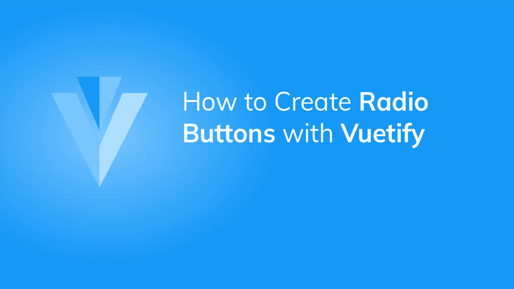

# 如何用 Vuetify 创建单选按钮

> 原文：<https://javascript.plainenglish.io/vuetify-radio-button-be83b119b2a7?source=collection_archive---------12----------------------->

## 创建和定制 Vuetify 单选按钮的完整指南。使用它们从预定义的选项集中接收用户输入。



当您需要从一组选项中获取用户输入时，单选按钮非常有用。例如，用户可以选择自己喜欢的语言或国家。在本文中，我们将学习如何使用 Vuetify 创建和定制单选按钮。

# 虚拟无线电组件

使用`v-radio`组件创建一个基本的单选按钮:

```
<template>
  <v-app>
    <div class="d-flex justify-center mt-4">
      <v-radio></v-radio>
    </div>
  </v-app>
</template><script>
export default {
  name: 'App',
};
</script>
```


# 单选按钮标签

为了向用户描述一个单选按钮，我们可以使用`label`属性:

```
<template>
  <v-app>
    <div class="d-flex justify-center mt-4">
      <v-radio label="Radio"></v-radio>
    </div>
  </v-app>
</template><script>
export default {
  name: 'App',
};
</script>
```


单选按钮通常与单选按钮组一起使用。我们可以通过将所有的`v-radio`包装在一个`v-radio-group`中来做到这一点。然后，我们可以通过`v-model`设置与单选按钮组组件的双向绑定，这将允许我们访问和设置组中当前选中的单选按钮:

```
<template>
  <v-app>
    <div class="d-flex justify-center mt-4">
      <v-radio-group v-model="radioGroup">
        <v-radio
          v-for="n in 3"
          :key="n"
          :label="`Radio ${n}`"
          :value="n"
        ></v-radio>
      </v-radio-group>
    </div>
  </v-app>
</template><script>
export default {
  name: 'App',
  data: () => ({
    radioGroup: 1,
  }),
};
</script>
```


单击组中的另一个单选按钮将更新变量并更改选择:


# 用美化来美化

使用 Vuetify 材料设计框架创建优雅 web 应用程序的完整指南。


点击这里下载你的免费版本[！](https://mailchi.mp/583226ee0d7b/beautify-with-vuetify)

# 单选按钮自定义颜色

单选按钮组件有一个`color`属性，我们可以用它来定制它的[颜色](https://codingbeautydev.com/blog/vuetify-colors/):

```
<template>
  <v-app>
    <div class="d-flex justify-center mt-4">
      <v-radio-group v-model="radioGroup">
        <v-radio
          v-for="(color, i) in colors"
          :key="i"
          :label="color"
          :value="color"
          :color="color"
        ></v-radio>
      </v-radio-group>
    </div>
  </v-app>
</template><script>
export default {
  name: 'App',
  data: () => ({
    colors: ['indigo', 'yellow', 'error', 'green', 'primary'],
  }),
};
</script>
```


The radio button with the yellow [color](https://codingbeautydev.com/blog/vuetify-colors/) is selected.


The radio button with the Vuetify theme primary [color](https://codingbeautydev.com/blog/vuetify-colors/) is selected.

# 单选按钮方向

我们可以使用`row`道具来水平显示单选按钮:

```
<template>
  <v-app>
    <div class="d-flex justify-center mt-4">
      <v-radio-group v-model="radioGroup" row>
        <v-radio
          v-for="i in 3"
          :key="i"
          :label="`Option ${i}`"
          :value="i"
        ></v-radio>
      </v-radio-group>
    </div>
  </v-app>
</template><script>
export default {
  name: 'App',
};
</script>
```


`column`道具会垂直呈现单选按钮，默认方向是:

```
<template>
  <v-app>
    <div class="d-flex justify-center mt-4">
      <v-radio-group v-model="radioGroup" column>
        <v-radio
          v-for="i in 3"
          :key="i"
          :label="`Option ${i}`"
          :value="i"
        ></v-radio>
      </v-radio-group>
    </div>
  </v-app>
</template><script>
export default {
  name: 'App',
};
</script>
```


# 确保强制值

为了确保单选按钮组始终有一个值，将`mandatory`属性设置为`true`:

```
<template>
  <v-app>
    <div class="d-flex justify-center mt-4">
      <v-radio-group v-model="radioGroup" mandatory>
        <v-radio
          v-for="i in 3"
          :key="i"
          :label="`Option ${i}`"
          :value="i"
        ></v-radio>
      </v-radio-group>
    </div>
  </v-app>
</template><script>
export default {
  name: 'App',
};
</script>
```


# 带有 HTML 的标签

如果我们想在一个单选按钮组的标签中包含 HTML，我们可以将内容放在`v-radio-group`的`label`槽中:

```
<template>
  <v-app>
    <div class="d-flex justify-center mt-4">
      <v-radio-group v-model="radioGroup" mandatory>
        <template v-slot:label> Pick an <strong>option</strong> </template>
        <v-radio
          v-for="i in 3"
          :key="i"
          :label="`Option ${i}`"
          :value="i"
        ></v-radio>
      </v-radio-group>
    </div>
  </v-app>
</template><script>
export default {
  name: 'App',
};
</script>
```


我们还可以在单选按钮的标签中包含 HTML，这些按钮有自己的`label`槽:

```
<template>
  <v-app>
    <div class="d-flex justify-center mt-4">
      <v-radio-group v-model="selected">
        <template v-slot:label>
          Select your default <strong>search engine</strong>
        </template>
        <v-radio v-for="(url, name) in searchEngines" :key="name" :value="name"
          ><template v-slot:label
            ><a :href="url">{{ name }}</a></template
          ></v-radio
        >
      </v-radio-group>
    </div>
  </v-app>
</template><script>
export default {
  name: 'App',
  data: () => ({
    selected: 'Google',
    searchEngines: {
      Bing: 'https://bing.com',
      Google: 'https://google.com',
      Duckduckgo: 'https://duckduckgo.com',
    },
  }),
};
</script>
```


# 摘要

当我们希望从一组预定义的选项中接收用户输入时，我们可以创建一组单选按钮。Vuetify 提供了`v-radio`组件来创建单选按钮，并提供了`v-radio-group`组件来添加可分组的功能。这些组件带有各种定制的道具。

[*注册*](http://eepurl.com/hRfyJL) *获取我们的每周简讯，了解 Vuetify 和 Vue 的最新提示和教程！*

*在*[*codingbeautydev.com*](https://codingbeautydev.com/blog/vuetify-radio-button/)*获取更新文章。*