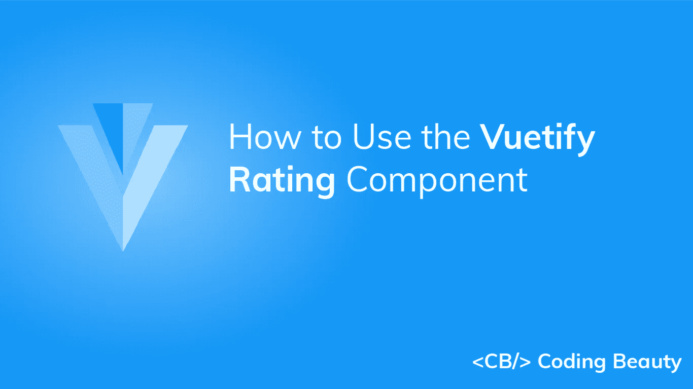

# 如何使用虚拟化评级组件

> 原文：<https://javascript.plainenglish.io/vuetify-rating-28b58ce4a1af?source=collection_archive---------13----------------------->



“虚拟化评级”组件对于收集用户反馈非常有用。用户可以用它来表明他们对某些内容的满意程度。请继续阅读，了解关于该组件的更多信息，以及我们可以定制它的各种方式。

# 虚拟评级组件(虚拟评级)

我们使用`v-rating`来创建一个评级组件。

```
<template>
  <v-app>
    <div class="d-flex ma-2 justify-center">
      <v-rating></v-rating>
    </div>
  </v-app>
</template><script>
export default {
  name: 'App',
};
</script>
```


用户可以通过点击其中一个项目来指示不同的满意度。


# 鉴定等级值

我们使用价值主张以编程方式设置评级组件中选定项目的数量。默认为`0`。

```
<template>
  <v-app>
    <div class="text-center ma-2">
      <v-rating></v-rating>
      <v-rating :value="3"></v-rating>
      <v-rating :value="5"></v-rating>
    </div>
  </v-app>
</template><script>
export default {
  name: 'App',
};
</script>
```


# 虚拟化评级 v-模型

我们可以使用`v-model`在`v-rating`的`value`和变量之间建立一个双向绑定。在下面的代码示例中，我们使用`v-model`创建一个评分组件，其下方的文本显示当前的`value`:

```
<template>
  <v-app>
    <div class="d-flex ma-2 justify-center">
      <v-rating v-model="rating"></v-rating>
    </div>
    <div class="d-flex ma-2 justify-center">
      Rating: {{ rating }}
    </div>
  </v-app>
</template><script>
export default {
  name: 'App',
  data: () => ({
    rating: 0,
  }),
};
</script>
```


我们还可以使用双向绑定来添加一个[按钮](https://codingbeautydev.com/blog/vuetify-button/)，当点击它时会改变等级:

```
<template>
  <v-app>
    <div class="d-flex ma-2 justify-center">
      <v-rating v-model="rating"></v-rating>
    </div>
    <div class="d-flex ma-2 justify-center">
      Rating: {{ rating }}
    </div>
    <div class="d-flex ma-2 justify-center">
      <v-btn
        @click="rating = 5"
        color="primary"
      >
        5 stars
      </v-btn>
    </div>
  </v-app>
</template><script>
export default {
  name: 'App',
  data: () => ({
    rating: 0,
  }),
};
</script>
```


# 用美化来美化

使用 Vuetify 材料设计框架创建优雅 web 应用程序的完整指南。


在这里 免费获得一份 [**。**](https://mailchi.mp/583226ee0d7b/beautify-with-vuetify)

# 只读

我们可以用`readonly`道具关闭与`v-rating`组件的交互。

```
<template>
  <v-app>
    <div class="text-center ma-2">
      <v-rating
        :value="3"
        readonly
      ></v-rating>
    </div>
  </v-app>
</template><script>
export default {
  name: 'App',
};
</script>
```


# 分级颜色

`v-rating`自带`color`和`background-color`道具，用于定制其[颜色](https://codingbeautydev.com/blog/vuetify-colors/)。我们可以使用[材料设计规格](https://material.io/design/color/the-color-system.html)中的任何[颜色](https://codingbeautydev.com/blog/vuetify-colors/)。

`color`道具设置选中物品的[颜色](https://codingbeautydev.com/blog/vuetify-colors/)，而`background-color`道具设置未选中物品的[颜色](https://codingbeautydev.com/blog/vuetify-colors/)。

```
<template>
  <v-app>
    <div class="text-center">
      <v-rating
        v-model="rating"
        background-color="purple accent-4"
        color="purple"
      >
      </v-rating> <v-rating
        v-model="rating"
        background-color="primary"
        color="pink"
      >
      </v-rating> <v-rating
        v-model="rating"
        background-color="green"
        color="orange"
      >
      </v-rating> <v-rating
        v-model="rating"
        background-color="yellow darken-3"
        color="green"
      >
      </v-rating> <v-rating
        v-model="rating"
        background-color="red"
        color="red"
      >
      </v-rating> <v-rating
        v-model="rating"
        background-color="indigo"
        color="indigo"
      ></v-rating>
    </div>
  </v-app>
</template><script>
export default {
  name: 'App',
  data: () => ({
    rating: 3,
  }),
};
</script>
```


# 资格评定长度

我们可以使用`length`属性来设置我们希望评级组件拥有的评级级别数。

```
<template>
  <v-app>
    <div class="text-center ma-2">
      <v-rating
        :value="3"
        color="yellow darken-3"
        background-color="grey darken-1"
      ></v-rating>
      <v-rating
        length="6"
        :value="3"
        color="yellow darken-3"
        background-color="grey darken-1"
      ></v-rating>
      <v-rating
        length="7"
        :value="4"
        color="yellow darken-3"
        background-color="grey darken-1"
      ></v-rating>
      <v-rating
        length="8"
        :value="4"
        color="yellow darken-3"
        background-color="grey darken-1"
      ></v-rating>
      <v-rating
        length="9"
        :value="5"
        color="yellow darken-3"
        background-color="grey darken-1"
      ></v-rating>
    </div>
  </v-app>
</template><script>
export default {
  name: 'App',
};
</script>
```


# 分级悬停

设置`hover`属性使`v-rating`在用户用鼠标悬停在它上面时显示视觉反馈。

```
<template>
  <v-app>
    <div class="text-center ma-2">
      <v-rating hover></v-rating>
    </div>
  </v-app>
</template><script>
export default {
  name: 'App',
  data: () => ({
    rating: 3,
  }),
};
</script>
```


# 将评级减半

使用`half-increments`道具允许选择一半的等级增量。

```
<template>
  <v-app>
    <div class="text-center ma-2">
      <v-rating
        hover
        half-increments
        color="yellow darken-3"
        background-color="grey darken-1"
        :value="0.5"
      ></v-rating>
      <v-rating
        hover
        half-increments
        color="yellow darken-3"
        background-color="grey darken-1"
        :value="2.5"
      ></v-rating>
      <v-rating
        hover
        half-increments
        color="yellow darken-3"
        background-color="grey darken-1"
        :value="4.5"
      ></v-rating>
    </div>
  </v-app>
</template><script>
export default {
  name: 'App',
};
</script>
```


# 分级大小

我们可以使用[图标组件](https://codingbeautydev.com/blog/vuetify-icons/) ( `v-icon`)中可用的相同类来定制评级组件的大小。

```
<template>
  <v-app>
    <div class="text-center ma-2">
      <v-rating
        hover
        color="yellow darken-3"
        background-color="grey darken-1"
        :value="3"
        x-small
      ></v-rating>
      <v-rating
        hover
        color="yellow darken-3"
        background-color="grey darken-1"
        :value="3"
        small
      ></v-rating>
      <v-rating
        hover
        color="yellow darken-3"
        background-color="grey darken-1"
        :value="3"
        medium
      ></v-rating>
      <v-rating
        hover
        color="yellow darken-3"
        background-color="grey darken-1"
        :value="3"
        large
      ></v-rating>
      <v-rating
        hover
        color="yellow darken-3"
        background-color="grey darken-1"
        :value="3"
        x-large
      ></v-rating>
    </div>
  </v-app>
</template><script>
export default {
  name: 'App',
};
</script>
```


我们也可以通过将`size`道具设置为一个数值来定制尺寸:

```
<template>
  <v-app>
    <div class="text-center ma-2">
      <v-rating
        hover
        color="yellow darken-3"
        background-color="grey darken-1"
        :value="3"
        v-for="num in 5"
        :key="num"
        :size="num * 10"
      ></v-rating>
    </div>
  </v-app>
</template><script>
export default {
  name: 'App',
};
</script>
```


# 项目槽

`v-rating`带有一个`item`插槽，我们可以使用它来进行更多的定制。

```
<template>
  <v-app>
    <div class="text-center ma-2">
      <v-rating v-model="rating">
        <template v-slot:item="props">
          <v-icon
            :color="
              props.isFilled
                ? getColor(props.index)
                : 'grey lighten-1'
            "
            large
            @click="props.click"
          >
            {{
              props.isFilled
                ? 'mdi-star-circle'
                : 'mdi-star-circle-outline'
            }}
          </v-icon>
        </template>
      </v-rating>
    </div>
  </v-app>
</template><script>
export default {
  name: 'App',
  data: () => ({
    colors: [
      'primary',
      'yellow darken-3',
      'red',
      'purple accent-4',
      'indigo',
    ],
    rating: 4,
  }),
  methods: {
    getColor(index) {
      return this.colors[index];
    },
  },
};
</script>
```


# 结论

我们可以在应用程序中使用 Vuetify rating 组件(`v-rating`)来收集用户反馈。该组件带有各种支持定制的道具和插槽。

*获得关于 Vuetify、Vue、JavaScript 等的每周提示和教程:*[http://eepurl.com/hRfyJL](http://eepurl.com/hRfyJL)

*更新于:*[*codingbeautydev.com*](https://codingbeautydev.com/blog/vuetify-rating/)