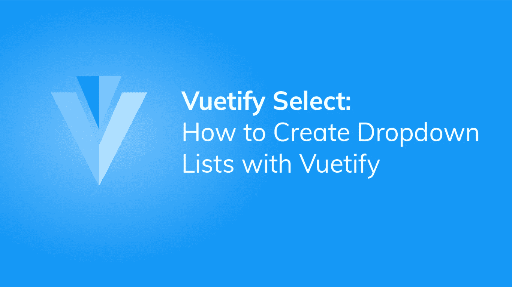
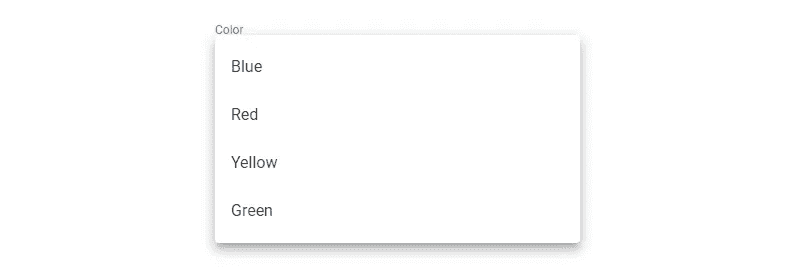
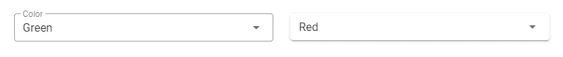
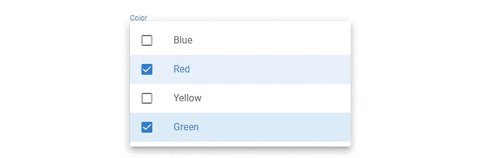
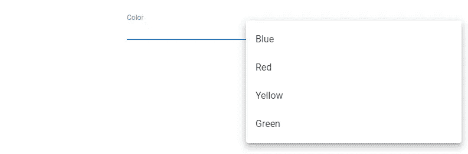

# Vuetify Select:如何用 Vuetify 创建下拉列表

> 原文：<https://javascript.plainenglish.io/vuetify-select-243d12bf1cf5?source=collection_archive---------21----------------------->

## 关于 Vuetify 中的下拉列表，你需要知道的一切。使用 Vuetify Select 组件为用户提供选项列表。



下拉列表对于从一组已知的选项中获取用户输入非常有用，例如，在世界上所有国家中选择一个国家，或者选择一天中的某个小时作为闹铃。也称为选择字段。在本文中，我们将学习如何使用 Vuetify Select 组件在我们的应用程序中创建下拉列表。

# 垂直选择组件

Vuetify 提供了用于创建选择字段的`v-select`组件:

```
<template>
  <v-app>
    <v-row justify="center">
      <v-col sm="6"><v-select></v-select></v-col>
    </v-row>
  </v-app>
</template><script>
export default {
  name: 'App',
};
</script>
```


# 验证选择字段标签

我们可以用`v-select`的`label`道具来描述一个下拉列表。我们将显示一个[颜色](https://codingbeautydev.com/blog/vuetify-colors/)的列表，所以我们将其标记为“颜色”:

```
<template>
  <v-app>
    <v-row justify="center" class="ma-2">
      <v-col sm="6"><v-select label="Color"></v-select></v-col>
    </v-row>
  </v-app>
</template><script>
export default {
  name: 'App',
};
</script>
```


# 验证选择字段项目

下拉列表中还没有可供选择的选项。当您点按它时，会显示以下内容:

我们可以通过给`items`道具分配一个数组来添加物品。物品将是一组[颜色](https://codingbeautydev.com/blog/vuetify-colors/)。

```
<template>
  <v-app>
    <v-row justify="center" class="ma-2">
      <v-col sm="6"
        ><v-select label="Color" :items="items"></v-select
      ></v-col>
    </v-row>
  </v-app>
</template><script>
export default {
  name: 'App',
  data: () => ({
    items: ['Blue', 'Red', 'Yellow', 'Green'],
  }),
};
</script>
```

现在下拉列表中有选项了。



我们现在可以选择其中一个选项:


# 验证选择设置默认值

要为下拉列表设置默认值，我们可以使用`v-model`在下拉列表的当前值和变量之间创建一个双向绑定。该变量的初始值将是选择字段的默认值:

```
<template>
  <v-app>
    <v-row justify="center" class="ma-2">
      <v-col sm="6"
        ><v-select
          label="Color"
          :items="items"
          v-model="defaultSelection"
        ></v-select
      ></v-col>
    </v-row>
  </v-app>
</template><script>
export default {
  name: 'App',
  data: () => ({
    defaultSelection: 'Yellow',
    items: ['Blue', 'Red', 'Yellow', 'Green'],
  }),
};
</script>
```


# 用美化来美化

使用 Vuetify 材料设计框架创建优雅 web 应用程序的完整指南。


在这里免费下载[](https://mailchi.mp/583226ee0d7b/beautify-with-vuetify)****！****

# **验证选择字段填充的变量**

**我们可以使用`filled`属性为选择字段设置一个替代填充变量:**

```
<template>
  <v-app>
    <v-row justify="center" class="ma-2">
      <v-col sm="6"
        ><v-select label="Color" :items="items" filled></v-select
      ></v-col>
    </v-row>
  </v-app>
</template><script>
export default {
  name: 'App',
  data: () => ({
    items: ['Blue', 'Red', 'Yellow', 'Green'],
  }),
};
</script>
```

****

# **验证选择字段概述变量**

**我们也可以使用另一种轮廓样式，将`v-select`的`outlined`属性设置为`true`:**

```
<template>
  <v-app>
    <v-row justify="center" class="ma-2">
      <v-col sm="6"
        ><v-select label="Color" :items="items" outlined></v-select
      ></v-col>
    </v-row>
  </v-app>
</template><script>
export default {
  name: 'App',
  data: () => ({
    items: ['Blue', 'Red', 'Yellow', 'Green'],
  }),
};
</script>
```

****

# **验证选择字段 Solo 变量**

**我们可以使用带有`solo`道具的 solo 变体:**

```
<template>
  <v-app>
    <v-row justify="center" class="ma-2">
      <v-col sm="6"
        ><v-select label="Color" :items="items" solo></v-select
      ></v-col>
    </v-row>
  </v-app>
</template><script>
export default {
  name: 'App',
  data: () => ({
    items: ['Blue', 'Red', 'Yellow', 'Green'],
  }),
};
</script>
```

****

# **密集选择字段**

**将`dense`道具设置为`v-select`上的`true`将会压缩下拉列表:**

```
<template>
  <v-app>
    <v-row justify="center" class="ma-2">
      <v-col sm="6"
        ><v-select label="Color" :items="items" outlined dense></v-select
      ></v-col>
      <v-col sm="6"
        ><v-select label="Color" :items="items" solo dense></v-select
      ></v-col>
    </v-row>
  </v-app>
</template><script>
export default {
  name: 'App',
  data: () => ({
    items: ['Blue', 'Red', 'Yellow', 'Green'],
  }),
};
</script>
```

****

# **禁用的选择字段**

**为了防止与选择字段的交互，使用`disabled`属性:**

```
<template>
  <v-app>
    <v-row justify="center" class="ma-2">
      <v-col sm="6"
        ><v-select label="Color" :items="items" disabled></v-select
      ></v-col>
    </v-row>
  </v-app>
</template><script>
export default {
  name: 'App',
  data: () => ({
    items: ['Blue', 'Red', 'Yellow', 'Green'],
  }),
};
</script>
```

****

# **选择字段图标**

**属性允许我们在下拉列表中添加一个图标。这里我们显示一个调色板图标来代表[颜色](https://codingbeautydev.com/blog/vuetify-colors/):**

```
<template>
  <v-app>
    <v-row justify="center" class="ma-2">
      <v-col sm="6"
        ><v-select
          label="Color"
          :items="items"
          prepend-icon="mdi-palette"
        ></v-select
      ></v-col>
    </v-row>
  </v-app>
</template><script>
export default {
  name: 'App',
  data: () => ({
    items: ['Blue', 'Red', 'Yellow', 'Green'],
  }),
};
</script>
```

****

**类似地，我们可以使用`append-icon`属性将一个图标附加到一个选择字段:**

```
<template>
  <v-app>
    <v-row justify="center" class="ma-2">
      <v-col sm="6"
        ><v-select
          label="Color"
          :items="items"
          append-icon="mdi-palette"
        ></v-select
      ></v-col>
    </v-row>
  </v-app>
</template><script>
export default {
  name: 'App',
  data: () => ({
    items: ['Blue', 'Red', 'Yellow', 'Green'],
  }),
};
</script>
```

****

# **Vuetify 中的多选下拉列表**

**在我们希望用户能够选择多个选项的情况下，我们可以使用`multiple`属性:**

```
<template>
  <v-app>
    <v-row justify="center" class="ma-2">
      <v-col sm="6"
        ><v-select
          label="Color"
          :items="items" multiple
        ></v-select
      ></v-col>
    </v-row>
  </v-app>
</template><script>
export default {
  name: 'App',
  data: () => ({
    items: ['Blue', 'Red', 'Yellow', 'Green'],
  }),
};
</script>
```

****

**Select two options in a dropdown list.**

****

**The options are comma-separated.**

# **在多选下拉列表中显示筹码**

**我们可以将选项显示为一组芯片，而不是逗号分隔的值。我们用`chips`道具来做这件事:**

```
<template>
  <v-app>
    <v-row justify="center" class="ma-2">
      <v-col sm="6"
        ><v-select
          label="Color"
          :items="items" multiple
          chips
        ></v-select
      ></v-col>
    </v-row>
  </v-app>
</template><script>
export default {
  name: 'App',
  data: () => ({
    items: ['Blue', 'Red', 'Yellow', 'Green'],
  }),
};
</script>
```

****

# **自定义选择字段菜单属性**

**我们可以自定义单击下拉列表时弹出的菜单的某些属性。可修改的属性包括`top`、`bottom`、`offsetX`和`offsetY`。**

```
<template>
  <v-app>
    <v-row justify="center" class="ma-2">
      <v-col sm="6"
        ><v-select
          label="Color"
          :items="items"
          :menu-props="{ offsetX: true }"
        ></v-select
      ></v-col>
    </v-row>
  </v-app>
</template><script>
export default {
  name: 'App',
  data: () => ({
    items: ['Blue', 'Red', 'Yellow', 'Green'],
  }),
};
</script>
```

****

# **摘要**

**当我们想要提供一个有限的已知选项列表给用户选择时，下拉列表就派上了用场。Vuetify 提供了`v-select`组件来以多种方式创建和定制它们。**

**[*注册*](http://eepurl.com/hRfyJL) *订阅我们的每周简讯，了解 Vuetify 和 Vue.js 的最新提示和教程。***

***在*[*codingbeautydev.com*](https://codingbeautydev.com/blog/vuetify-select/)*获取更新文章。***