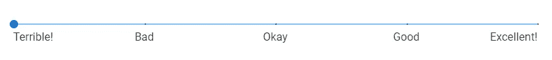

# 如何用 Vuetify 创建滑块

> 原文：<https://javascript.plainenglish.io/vuetify-slider-7010a3c21b4?source=collection_archive---------18----------------------->


滑块是从一系列值中获取用户输入的好方法。有用于各种功能，如调整显示器的亮度或调节扬声器音量。在这篇文章中，我们将探索用 Vuetify 创建和定制滑块的各种方法。

# 垂直滑块组件

Vuetify 提供了用于创建滑块的`v-slider`组件:

```
<template>
  <v-app>
    <v-row justify="center" class="mt-2">
      <v-col sm="6">
        <v-slider></v-slider>
      </v-col>
    </v-row>
  </v-app>
</template><script>
export default {
  name: 'App',
};
</script>
```


基本滑块由轨道(长线)和拇指(圆圈)组成。单击轨道上的某个位置会将滑块移动到该位置:


# 滑块标签

为了向用户描述我们的滑块，我们可以用`label`属性指定一个标签:

```
<template>
  <v-app>
    <v-row justify="center" class="mt-2">
      <v-col sm="6">
        <v-slider label="Slider"></v-slider>
      </v-col>
    </v-row>
  </v-app>
</template><script>
export default {
  name: 'App',
};
</script>
```


# 滑块提示

我们可以用`hint`道具显示滑块的提示。

```
<template>
  <v-app>
    <v-row justify="center" class="mt-2">
      <v-col sm="6">
        <v-slider label="Slider" hint="hint"></v-slider>
      </v-col>
    </v-row>
  </v-app>
</template><script>
export default {
  name: 'App',
};
</script>
```

当您点按拇指时，会显示提示:


# 使用 v-model 的双向绑定

我们可以使用`v-model`在滑块值和变量之间创建一个双向绑定。

```
<template>
  <v-app>
    <div class="d-flex justify-center mt-2">
      <v-col sm="6">
        <v-slider label="Slider" hint="hint" v-model="sliderValue"></v-slider>
      </v-col>
    </div>
    <div class="d-flex justify-center">
      <v-col sm="6">Slider value: {{ sliderValue }}</v-col>
    </div>
  </v-app>
</template><script>
export default {
  name: 'App',
  data: () => ({
    sliderValue: 0,
  }),
};
</script>
```

在上面的代码中，我们添加了一些文本来显示滑块的当前值(由`sliderValue`决定):


当滑块接收到输入时`sliderValue`被更新，文本反映了这一点:


让我们添加一个【复位】按钮:

```
<template>
  <v-app>
    <div class="d-flex justify-center mt-2">
      <v-col sm="6">
        <v-slider label="Slider" hint="hint" v-model="sliderValue"></v-slider>
      </v-col>
    </div>
    <div class="d-flex justify-center">
      <v-col sm="6">Slider value: {{ sliderValue }}</v-col>
    </div>
    <div class="d-flex justify-center">
      <v-col sm="6"
        ><v-btn color="primary" @click="sliderValue = 0"
          >Reset slider</v-btn
        ></v-col
      >
    </div>
  </v-app>
</template><script>
export default {
  name: 'App',
  data: () => ({
    sliderValue: 0,
  }),
};
</script>
```


我们为按钮[添加了一个点击处理程序，当点击按钮](https://codingbeautydev.com/blog/vuetify-buttons/)时，它会将`sliderValue`设置为 0:


# 用美化来美化

使用 Vuetify 材料设计框架创建优雅 web 应用程序的完整指南。


点击这里下载你的免费版本[！](https://mailchi.mp/583226ee0d7b/beautify-with-vuetify)

# 滑块最小值和最大值

Vuetify 滑块的默认最小值和最大值分别为 0 和 100。我们可以用`min`和`max`道具把它们换成别的东西:

```
<template>
  <v-app>
    <div class="d-flex justify-center mt-2">
      <v-col sm="6">
        <v-slider
          label="Slider"
          hint="hint"
          v-model="sliderValue"
          min="20"
          max="60"
        ></v-slider>
      </v-col>
    </div>
    <div class="d-flex justify-center">
      <v-col sm="6">Slider value: {{ sliderValue }}</v-col>
    </div>
  </v-app>
</template><script>
export default {
  name: 'App',
  data: () => ({
    sliderValue: null,
  }),
};
</script>
```

现在滑块的最小值是 20:


最大值现在是 60:


# 滑块自定义颜色

v- `slider`自带道具，允许我们修改其各种元素的[颜色](https://codingbeautydev.com/blog/vuetify-colors/)。

使用`color`道具改变拇指前轨道部分的[颜色](https://codingbeautydev.com/blog/vuetify-colors/):

```
<template>
  <v-app>
    <div class="d-flex justify-center mt-2">
      <v-col sm="6">
        <v-slider label="color" v-model="sliderValue" color="green"></v-slider>
      </v-col>
    </div>
  </v-app>
</template><script>
export default {
  name: 'App',
  data: () => ({
    sliderValue: 0,
  }),
};
</script>
```


`track-color`道具会修改拇指后部分轨迹的[颜色](https://codingbeautydev.com/blog/vuetify-colors/):

```
<template>
  <v-app>
    <div class="d-flex justify-center mt-2">
      <v-col sm="6">
        <v-slider
          label="track-color"
          v-model="sliderValue"
          track-color="red"
        ></v-slider>
      </v-col>
    </div>
  </v-app>
</template><script>
export default {
  name: 'App',
  data: () => ({
    sliderValue: 0,
  }),
};
</script>
```


要改变拇指的[颜色](https://codingbeautydev.com/blog/vuetify-colors/)，使用`thumb-color`道具:

```
<template>
  <v-app>
    <div class="d-flex justify-center mt-2">
      <v-col sm="6">
        <v-slider
          label="thumb-color"
          v-model="sliderValue"
          thumb-color="orange"
          thumb-label="always"
        ></v-slider>
      </v-col>
    </div>
  </v-app>
</template><script>
export default {
  name: 'App',
  data: () => ({
    sliderValue: 0,
  }),
};
</script>
```


# 禁用的滑块

将`disabled`道具设置为`true`，关闭与滑块的交互:

```
<template>
  <v-app>
    <div class="d-flex justify-center mt-2">
      <v-col sm="6">
        <v-slider disabled value="50" label="Disabled"></v-slider>
      </v-col>
    </div>
  </v-app>
</template><script>
export default {
  name: 'App',
};
</script>
```


# 离散滑块

默认情况下，Vuetify 滑块的步长值为 1。这些类型的滑块被称为连续滑块，因为滑块从其最小值平滑地移动到最大值。在我们需要较低精度的情况下，我们可以使用`step`道具增加该步长值:

```
<template>
  <v-app>
    <div class="d-flex justify-center mt-10">
      <v-col sm="6">
        <v-slider
          v-model="sliderValue"
          step="10"
          thumb-label="always"
        ></v-slider>
      </v-col>
    </div>
  </v-app>
</template><script>
export default {
  name: 'App',
  data: () => ({
    sliderValue: 0,
  }),
};
</script>
```


# 滑块图标

`v-slider`提供了显示图标[和滑块](https://codingbeautydev.com/blog/vuetify-icons/)的道具，有助于添加更多的上下文。

`prepend-icon`道具会在滑块前显示相应的图标:

```
<template>
  <v-app>
    <div class="d-flex justify-center mt-2">
      <v-col sm="6">
        <v-slider v-model="volume" prepend-icon="mdi-volume-high"></v-slider>
      </v-col>
    </div>
  </v-app>
</template><script>
export default {
  name: 'App',
  data: () => ({
    volume: 0,
  }),
};
</script>
```


`append-icon`将在滑块后显示图标:

```
<template>
  <v-app>
    <div class="d-flex justify-center mt-2">
      <v-col sm="6">
        <v-slider v-model="volume" append-icon="mdi-volume-high"></v-slider>
      </v-col>
    </div>
  </v-app>
</template><script>
export default {
  name: 'App',
  data: () => ({
    volume: 0,
  }),
};
</script>
```


# 只读滑块

只读滑块也像禁用滑块一样阻止交互，但是它们不会失去它们的[颜色](https://codingbeautydev.com/blog/vuetify-colors/):

```
<template>
  <v-app>
    <div class="d-flex justify-center mt-2">
      <v-col sm="6">
        <v-slider readonly value="30" label="Readonly"></v-slider>
      </v-col>
    </div>
  </v-app>
</template><script>
export default {
  name: 'App',
};
</script>
```


# 反向标签

要在滑块末端显示滑块标签，使用`inverse-label`道具:

```
<template>
  <v-app>
    <div class="d-flex justify-center mt-2">
      <v-col sm="6">
        <v-slider label="Inverse label" inverse-label></v-slider>
      </v-col>
    </div>
  </v-app>
</template><script>
export default {
  name: 'App',
};
</script>
```


# 滑块拇指

`v-slider`为自定义拇指的行为和显示提供了某些支持。将`thumb-label`旋钮设置为`true`显示，以便在使用滑块时仅显示缩略图:

```
<template>
  <v-app>
    <div class="d-flex justify-center mt-10">
      <v-col sm="6">
        <v-slider v-model="value" label="Slider" thumb-label></v-slider>
      </v-col>
    </div>
  </v-app>
</template><script>
export default {
  name: 'App',
  data: () => ({
    value: 0,
  }),
};
</script>
```


无论用户是否使用滑块，要始终显示缩略图，请将`thumb-label`按钮设置为`always`:

```
<template>
  <v-app>
    <div class="d-flex justify-center mt-10">
      <v-col sm="6">
        <v-slider v-model="value" label="Slider" thumb-label="always"></v-slider>
      </v-col>
    </div>
  </v-app>
</template><script>
export default {
  name: 'App',
  data: () => ({
    value: 0,
  }),
};
</script>
```


## 自定义拇指大小

`thumb-size`道具让我们修改拇指大小:

```
<template>
  <v-app>
    <div class="d-flex justify-center mt-16">
      <v-col sm="6">
        <v-slider
          v-model="value"
          label="Slider"
          thumb-label="always"
          thumb-size="50"
        ></v-slider>
      </v-col>
    </div>
  </v-app>
</template><script>
export default {
  name: 'App',
  data: () => ({
    value: 0,
  }),
};
</script>
```


## 自定义缩略图标签

thumb 通常显示滑块的当前数值，但是我们通过向`v-slider`的`thumb-label`槽提供一个元素来改变它所显示的内容:

```
<template>
  <v-app>
    <div class="d-flex justify-center mt-16">
      <v-col sm="6">
        <v-slider
          v-model="value"
          label="Volume"
          thumb-label="always"
          thumb-size="50"
        >
          <template v-slot:thumb-label>
            <v-icon dark>mdi-volume-high</v-icon>
          </template>
        </v-slider>
      </v-col>
    </div>
  </v-app>
</template><script>
export default {
  name: 'App',
  data: () => ({
    value: 0,
  }),
};
</script>
```


# 滑块刻度

刻度直观地表示用户可以将滑块移动到的值。将`ticks`杆设置为`true`只会在使用滑块时显示滑块:

```
<template>
  <v-app>
    <div class="d-flex justify-center mt-2">
      <v-col sm="6">
        <v-slider v-model="value" step="10" ticks> </v-slider>
      </v-col>
    </div>
  </v-app>
</template><script>
export default {
  name: 'App',
  data: () => ({
    value: 0,
  }),
};
</script>
```


将`ticks`设置为`always`使刻度一直显示:

```
<template>
  <v-app>
    <div class="d-flex justify-center mt-2">
      <v-col sm="6">
        <v-slider v-model="value" step="10" ticks="always"> </v-slider>
      </v-col>
    </div>
  </v-app>
</template><script>
export default {
  name: 'App',
  data: () => ({
    value: 0,
  }),
};
</script>
```


## 自定义刻度大小

我们还可以使用`tick-size`道具自定义刻度大小:

```
<template>
  <v-app>
    <div class="d-flex justify-center mt-2">
      <v-col sm="6">
        <v-slider v-model="value" step="10" ticks="always" tick-size="4">
        </v-slider>
      </v-col>
    </div>
  </v-app>
</template><script>
export default {
  name: 'App',
  data: () => ({
    value: 0,
  }),
};
</script>
```


# 刻度标签

我们可以添加文字来描述记号。为此，将`tick-labels`属性设置为一个字符串数组。

```
<template>
  <v-app>
    <div class="d-flex justify-center mt-2">
      <v-col sm="12">
        <v-slider
          v-model="value"
          step="10"
          ticks="always"
          :tick-labels="tickLabels"
        >
        </v-slider>
      </v-col>
    </div>
  </v-app>
</template><script>
export default {
  name: 'App',
  data: () => ({
    value: 0,
    tickLabels: ['Terrible!', 'Bad', 'Okay', 'Good', 'Excellent!'],
  }),
};
</script>
```

数组中的每一项都将被分配给一个分笔成交点:



# 摘要

Vuetify 提供了`v-slider`组件来创建滑块。我们可以使用它的道具来定制其行为和外观的各个方面。

[*注册*](http://eepurl.com/hRfyJL) *订阅我们的每周简讯，了解 Vuetify 和 Vue 的最新提示和教程。*

*在*[*codingbeautydev.com*](https://codingbeautydev.com/blog/vuetify-slider/)*获取更新文章。*