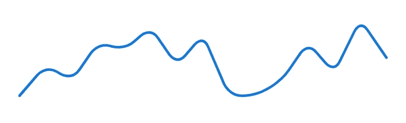
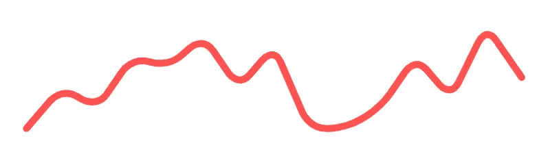
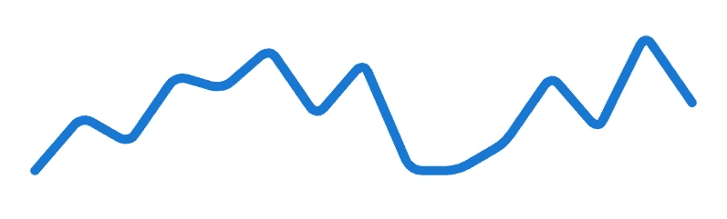
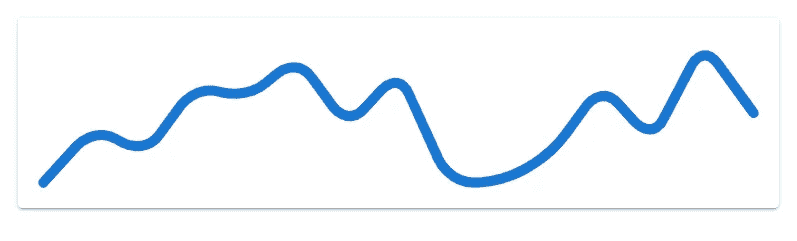
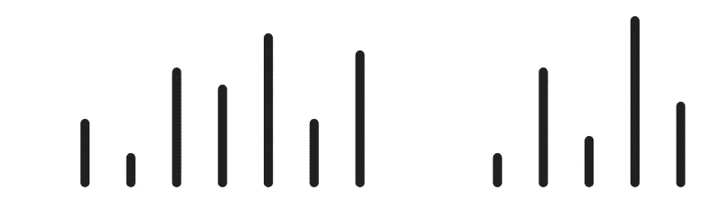
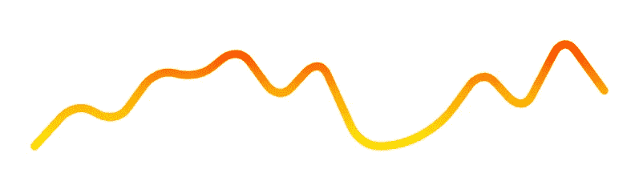
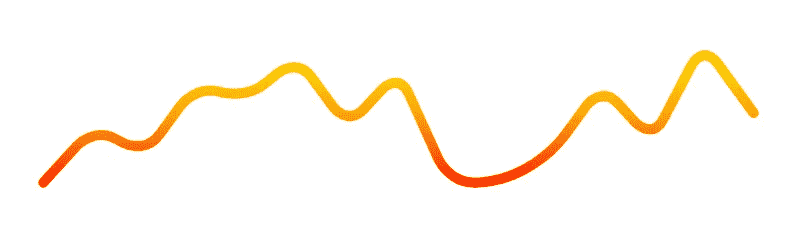

# 如何使用虚拟化迷你图组件

> 原文：<https://javascript.plainenglish.io/vuetify-sparkline-8ea7d95f2a35?source=collection_archive---------18----------------------->


我们可以使用迷你图，用简单的图形直观地表示数字或统计信息。在这本内容丰富的指南中，我们将了解如何使用 Vuetify 迷你图组件轻松创建和自定义迷你图。

# 虚拟化迷你图组件(v 型迷你图)

Vuetify 提供了用于创建迷你图的`v-sparkline`组件。它有一个`value`属性，接受一个包含要表示的数据的数组:

```
<template>
  <v-app>
    <div class="ma-4">
      <v-sparkline
        :value="value"
        smooth="10"
      ></v-sparkline>
    </div>
  </v-app>
</template><script>
export default {
  name: 'App',
  data: () => ({
    value: [0, 4, 2, 7, 6, 9, 4, 8, 0, 0, 2, 7, 3, 10, 5],
  }),
};
</script>
```


# 使迷你图线条帽可视化

默认情况下，迷你图有一个尖锐的线帽。我们可以通过将`stroke-linecap`道具设置为`round`来使其变圆:

```
<template>
  <v-app>
    <div class="ma-4">
      <v-sparkline
        :value="value"
        smooth="10"
        stroke-linecap="round"
      ></v-sparkline>
    </div>
  </v-app>
</template><script>
export default {
  name: 'App',
  data: () => ({
    value: [0, 4, 2, 7, 6, 9, 4, 8, 0, 0, 2, 7, 3, 10, 5],
  }),
};
</script>
```


# 虚拟化迷你图填充

我们可以通过将`fill`属性设置为`true`来给迷你图下方的区域上色:

```
<template>
  <v-app>
    <div class="ma-4">
      <v-sparkline
        :value="value"
        smooth="10"
        fill
      ></v-sparkline>
    </div>
  </v-app>
</template><script>
export default {
  name: 'App',
  data: () => ({
    value: [0, 4, 2, 7, 6, 9, 4, 8, 0, 0, 2, 7, 3, 10, 5],
  }),
};
</script>
```


# 用美化来美化

使用 Vuetify 材料设计框架创建优雅 web 应用程序的完整指南。


在这里 免费获得一份 [**。**](https://mailchi.mp/583226ee0d7b/beautify-with-vuetify)

# 量化迷你图线条宽度

我们可以使用`line-width`道具来控制迷你图的粗细。

```
<template>
  <v-app>
    <div class="ma-4">
      <v-sparkline
        :value="value"
        smooth="10"
        line-width="2"
        stroke-linecap="round"
      ></v-sparkline>
    </div>
  </v-app>
</template><script>
export default {
  name: 'App',
  data: () => ({
    value: [0, 4, 2, 7, 6, 9, 4, 8, 0, 0, 2, 7, 3, 10, 5],
  }),
};
</script>
```



# 迷你图颜色

`v-sparkline`附带一个`color`道具，用于定制迷你图的[颜色](https://codingbeautydev.com/blog/vuetify-colors/)。我们可以使用[材料设计规格](https://material.io/design/color/the-color-system.html)中的任何[颜色](https://codingbeautydev.com/blog/vuetify-colors/)。

```
<template>
  <v-app>
    <div class="ma-4">
      <v-sparkline
        :value="value"
        smooth="10"
        color="red accent-2"
        stroke-linecap="round"
      ></v-sparkline>
    </div>
  </v-app>
</template><script>
export default {
  name: 'App',
  data: () => ({
    value: [0, 4, 2, 7, 6, 9, 4, 8, 0, 0, 2, 7, 3, 10, 5],
  }),
};
</script>
```



# 平滑化迷你图

使用`smooth`道具，我们可以设置从追踪数据点的迷你图形成的角的圆度。我们可以向`smooth`传递一个数字或一个布尔值。将其设置为`true`会设置`8px`的圆角半径。在下面的代码示例中，我们将其设置为`5`(拐角半径为`5px`):

```
<template>
  <v-app>
    <div class="ma-4">
      <v-sparkline
        :value="value"
        smooth="5"
        stroke-linecap="round"
      ></v-sparkline>
    </div>
  </v-app>
</template><script>
export default {
  name: 'App',
  data: () => ({
    value: [0, 4, 2, 7, 6, 9, 4, 8, 0, 0, 2, 7, 3, 10, 5],
  }),
};
</script>
```



将平滑设置为`false`会将圆角半径设置为`0px`:

```
<template>
  <v-app>
    <div class="ma-4">
      <v-sparkline
        :value="value"
        :smooth="false"
      ></v-sparkline>
    </div>
  </v-app>
</template><script>
export default {
  name: 'App',
  data: () => ({
    value: [0, 4, 2, 7, 6, 9, 4, 8, 0, 0, 2, 7, 3, 10, 5],
  }),
};
</script>
```


# 使迷你图填充可视化

我们可以使用`padding`属性将[填充](https://codingbeautydev.com/blog/vuetify-margin-and-padding/)添加到迷你图中。默认情况下，它有一个`8`的`padding`。

```
<template>
  <v-app>
    <v-card class="ma-4">
      <v-sparkline
        :value="value"
        smooth="10"
        padding="10"
        stroke-linecap="round"
      ></v-sparkline>
    </v-card>
  </v-app>
</template><script>
export default {
  name: 'App',
  data: () => ({
    value: [0, 4, 2, 7, 6, 9, 4, 8, 0, 0, 2, 7, 3, 10, 5],
  }),
};
</script>
```



# 虚拟化迷你图自动绘制

将`auto-draw`道具设置为`v-sparkline`上的`true`将使迷你图在首次渲染时运行轨迹动画。

```
<template>
  <v-app>
    <div class="ma-4">
      <v-sparkline
        :value="value"
        smooth="10"
        padding="10"
        stroke-linecap="round"
        auto-draw
      ></v-sparkline>
    </div>
  </v-app>
</template><script>
export default {
  name: 'App',
  data: () => ({
    value: [0, 4, 2, 7, 6, 9, 4, 8, 0, 0, 2, 7, 3, 10, 5],
  }),
};
</script>
```


# 迷你图自动绘制持续时间

属性允许我们以毫秒为单位设置轨迹动画的持续时间。它有一个默认值`2000` (2 秒)。

```
<template>
  <v-app>
    <div class="ma-4">
      <v-sparkline
        :value="value"
        smooth="10"
        padding="10"
        stroke-linecap="round"
        auto-draw
        :auto-draw-duration="4000"
      ></v-sparkline>
    </div>
  </v-app>
</template><script>
export default {
  name: 'App',
  data: () => ({
    value: [0, 4, 2, 7, 6, 9, 4, 8, 0, 0, 2, 7, 3, 10, 5],
  }),
};
</script>
```


# 迷你图自动绘制缓解

我们可以用`auto-draw-easing`道具指定轨迹动画的缓动功能:

```
<template>
  <v-app>
    <div class="ma-4">
      <v-sparkline
        :value="value"
        smooth="10"
        padding="10"
        stroke-linecap="round"
        auto-draw
        :auto-draw-duration="4000"
        auto-draw-easing="linear"
      ></v-sparkline>
    </div>
  </v-app>
</template><script>
export default {
  name: 'App',
  data: () => ({
    value: [0, 4, 2, 7, 6, 9, 4, 8, 0, 0, 2, 7, 3, 10, 5],
  }),
};
</script>
```


# 虚拟化迷你图类型

通过将`type`属性设置为`bar`，我们可以让`v-sparkline`显示一组条而不是一条线。默认`type`为`trend`，显示连续线。

```
<template>
  <v-app>
    <div class="ma-4">
      <v-sparkline
        :value="value"
        smooth="10"
        padding="10"
        stroke-linecap="round"
        type="bar"
      ></v-sparkline>
    </div>
  </v-app>
</template><script>
export default {
  name: 'App',
  data: () => ({
    value: [0, 4, 2, 7, 6, 9, 4, 8, 0, 0, 2, 7, 3, 10, 5],
  }),
};
</script>
```



# 量化迷你图渐变

我们可以使用渐变属性将迷你图的[颜色](https://codingbeautydev.com/blog/vuetify-colors/)设置为线性渐变。`gradient`接受一个[颜色](https://codingbeautydev.com/blog/vuetify-colors/)的数组用于线性渐变。

```
<template>
  <v-app>
    <div class="ma-4">
      <v-sparkline
        :value="value"
        smooth="10"
        padding="10"
        stroke-linecap="round"
        :gradient="gradient"
      ></v-sparkline>
    </div>
  </v-app>
</template><script>
export default {
  name: 'App',
  data: () => ({
    value: [0, 4, 2, 7, 6, 9, 4, 8, 0, 0, 2, 7, 3, 10, 5],
    gradient: ['red', 'orange', 'yellow'],
  }),
};
</script>
```



# 量化迷你图渐变方向

`v-sparkline`的`gradient-direction`属性设置[颜色](https://codingbeautydev.com/blog/vuetify-colors/)渐变应该运行的方向。

```
<template>
  <v-app>
    <div class="ma-4">
      <v-sparkline
        :value="value"
        smooth="10"
        padding="10"
        stroke-linecap="round"
        :gradient="gradient"
        gradient-direction="bottom"
      ></v-sparkline>
    </div>
  </v-app>
</template><script>
export default {
  name: 'App',
  data: () => ({
    value: [0, 4, 2, 7, 6, 9, 4, 8, 0, 0, 2, 7, 3, 10, 5],
    gradient: ['red', 'orange', 'yellow'],
  }),
};
</script>
```



# 结论

迷你图显示直观表示数字或统计信息的简单图形。我们可以使用 Vuetify 迷你图组件(`v-sparkline`)及其各种属性来创建和定制迷你图。

*通过每周一次的关于 Vuetify、Vue、JavaScript 的技巧和教程来提高你的开发者技能，更多来自《编码之美》:*[*http://eepurl.com/hRfyJL*](http://eepurl.com/hRfyJL)

*更新于:*[*codingbeautydev.com*](https://codingbeautydev.com/blog/vuetify-sparkline/)