# 如何使用虚拟化步进器组件

> 原文：<https://javascript.plainenglish.io/vuetify-stepper-8d4818404ab3?source=collection_archive---------11----------------------->

## 你需要知道的关于 Vuetify 步进器组件的一切。创建可编辑的步进、垂直步进、线性步进等等。


步进器通过将序列分成多个逻辑和编号的步骤来显示进度。我们可以在购物车这样的场景中使用它，或者在输入字段决定后续字段的情况下使用它。在本文中，我们将学习如何使用 Vuetify stepper 组件来轻松创建和定制步进器。

# 验证步进器组件(垂直步进器)

Vuetify 提供了用于创建步进器的`v-stepper`组件。我们用`v-stepper-step`组件表示步骤，用`v-stepper-content`组件显示每个步骤的内容。每个`v-stepper-step`或`v-stepper-content`都有一个`step`道具，我们用它来设置它应该关联的步骤。`v-stepper-step` s 通常被包裹在`v-stepper-header`中，而`v-stepper-content` s 被包裹在`v-stepper-items`中。

```
<template>
  <v-app>
    <div class="ma-4">
      <v-stepper v-model="step">
        <v-stepper-header>
          <v-stepper-step
            :complete="step > 1"
            step="1"
          >
            Step 1
          </v-stepper-step> <v-divider></v-divider> <v-stepper-step
            :complete="step > 2"
            step="2"
          >
            Step 2
          </v-stepper-step> <v-divider></v-divider> <v-stepper-step step="3"> Step 3 </v-stepper-step>
        </v-stepper-header> <v-stepper-items>
          <v-stepper-content step="1">
            <v-card
              class="mb-12"
              color="grey lighten-1"
              height="200px"
            ></v-card> <v-btn
              color="primary"
              @click="step = 2"
            >
              Continue
            </v-btn> <v-btn text> Cancel </v-btn>
          </v-stepper-content> <v-stepper-content step="2">
            <v-card
              class="mb-12"
              color="grey lighten-1"
              height="200px"
            ></v-card> <v-btn
              color="primary"
              @click="step = 3"
            >
              Continue
            </v-btn> <v-btn text> Cancel </v-btn>
          </v-stepper-content> <v-stepper-content step="3">
            <v-card
              class="mb-12"
              color="grey lighten-1"
              height="200px"
            ></v-card> <v-btn color="primary"> Continue </v-btn> <v-btn text> Cancel </v-btn>
          </v-stepper-content>
        </v-stepper-items>
      </v-stepper>
    </div>
  </v-app>
</template><script>
export default {
  name: 'App',
  data: () => ({
    step: 1,
  }),
};
</script>
```

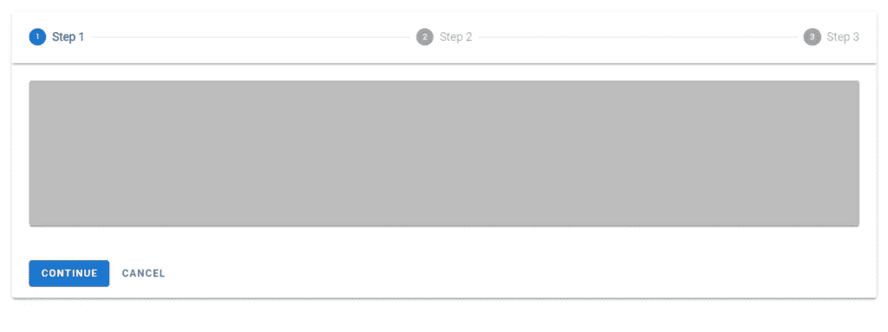

点击“继续”[按钮](https://codingbeautydev.com/blog/vuetify-button/)将步进器移动到下一步，并显示动画:

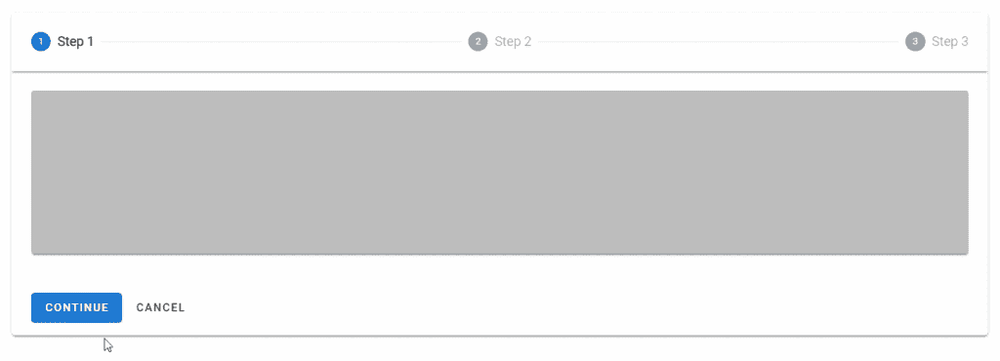

# 较小的屏幕

步骤名称不会显示在较小的屏幕上:

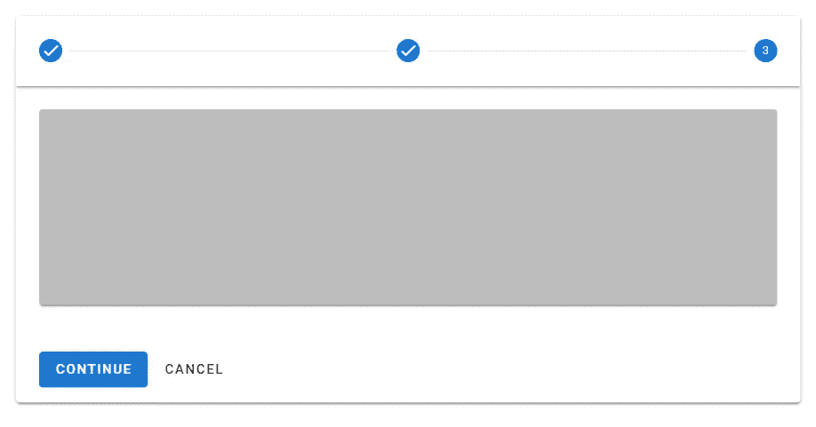

# 验证步进器 Alt 标签

使用`v-stepper`上的`alt-labels`支柱将每个步骤的名称放在代表该步骤的圆圈下。

```
<template>
  <v-app>
    <div class="ma-4">
      <v-stepper
        v-model="step"
        alt-labels
      >
        <v-stepper-header>
          <v-stepper-step
            :complete="step > 1"
            step="1"
          >
            Step 1
          </v-stepper-step> <v-divider></v-divider> <v-stepper-step
            :complete="step > 2"
            step="2"
          >
            Step 2
          </v-stepper-step> <v-divider></v-divider> <v-stepper-step step="3"> Step 3 </v-stepper-step>
        </v-stepper-header>
      </v-stepper>
    </div>
  </v-app>
</template><script>
export default {
  name: 'App',
  data: () => ({
    step: 1,
  }),
};
</script>
```

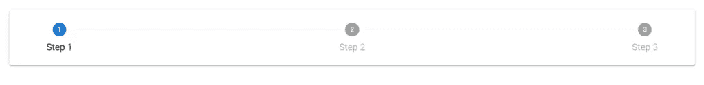

# 用美化来美化

使用 Vuetify 材料设计框架创建优雅 web 应用程序的完整指南。


在 这里免费获得一份 [**。**](https://mailchi.mp/583226ee0d7b/beautify-with-vuetify)

# 步进颜色

通过`v-stepper-step` s 的`color`道具，可以自定义已完成步骤或当前步骤的[颜色](https://codingbeautydev.com/blog/vuetify-colors/)。我们可以使用[材料设计规格](https://material.io/design/color/the-color-system.html)中的任何颜色。

```
<template>
  <v-app>
    <div class="ma-4">
      <v-stepper
        value="3"
      >
        <v-stepper-header>
          <v-stepper-step
            complete
            step="1"
            color="green"
          >
            Step 1
          </v-stepper-step> <v-divider></v-divider> <v-stepper-step
            complete
            step="2"
            color="green"
          >
            Step 2
          </v-stepper-step> <v-divider></v-divider> <v-stepper-step
            step="3"
            color="green"
          >
            Step 3
          </v-stepper-step> <v-divider></v-divider> <v-stepper-step
            step="4"
            color="green"
          >
            Step 4
          </v-stepper-step>
        </v-stepper-header>
      </v-stepper>
    </div>
  </v-app>
</template><script>
export default {
  name: 'App',
};
</script>
```

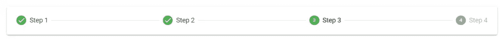

# 可编辑的步骤

可编辑的步骤允许用户稍后返回修改它。我们可以通过将与其相关的`v-stepper-step`上的`editable`属性设置为`true`来编辑一个步骤。

```
<template>
  <v-app>
    <div class="ma-4">
      <v-stepper
        v-model="step"
        alt-labels
        non-linear
      >
        <v-stepper-header>
          <v-stepper-step
            complete
            editable
            step="1"
          >
            Step 1
          </v-stepper-step> <v-divider></v-divider> <v-stepper-step
            editable
            step="2"
          >
            Step 2
          </v-stepper-step> <v-divider></v-divider> <v-stepper-step
            step="3"
            complete
            editable
          >
            Step 3
          </v-stepper-step>
        </v-stepper-header> <v-stepper-items>
          <v-stepper-content step="1">
            <v-card
              class="mb-12 pa-4"
              color="text-h2 text-center"
              height="200px"
            >
              <div>Step 1</div>
            </v-card> <v-btn
              color="primary"
              @click="step = 2"
            >
              Continue
            </v-btn> <v-btn text> Cancel </v-btn>
          </v-stepper-content> <v-stepper-content step="2">
            <v-card
              class="mb-12 pa-4"
              color="text-h2 text-center"
              height="200px"
            >
              <div>Step 2</div>
            </v-card> <v-btn
              color="primary"
              @click="step = 3"
            >
              Continue
            </v-btn> <v-btn text> Cancel </v-btn>
          </v-stepper-content> <v-stepper-content step="3">
            <v-card
              class="mb-12 pa-4"
              color="text-h2 text-center"
              height="200px"
            >
              <div>Step 3</div>
            </v-card> <v-btn color="primary"> Continue </v-btn> <v-btn text> Cancel </v-btn>
          </v-stepper-content>
        </v-stepper-items>
      </v-stepper>
    </div>
  </v-app>
</template><script>
export default {
  name: 'App',
  data: () => ({
    step: 1,
  }),
};
</script>
```

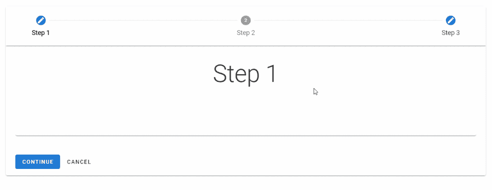

# 不可编辑的步骤

一旦完成，不可编辑的步骤将阻止修改。如果关联的`v-stepper-step`没有将其`step`属性设置为`true`，则步骤不可编辑。

```
<template>
  <v-app>
    <div class="ma-4">
      <v-stepper
        v-model="step"
        alt-labels
        non-linear
      >
        <v-stepper-header>
          <v-stepper-step
            complete
            editable
            step="1"
          >
            Step 1
          </v-stepper-step> <v-divider></v-divider> <v-stepper-step
            editable
            step="2"
          >
            Step 2
          </v-stepper-step> <v-divider></v-divider> <v-stepper-step
            step="3"
            complete
          >
            Step 3
          </v-stepper-step> <v-divider></v-divider> <v-stepper-step
            step="4"
            complete
            editable
          >
            Step 4
          </v-stepper-step>
        </v-stepper-header> <v-stepper-items>
          <v-stepper-content step="1">
            <v-card
              class="mb-12 pa-4"
              color="text-h2 text-center"
              height="200px"
            >
              <div>Step 1</div>
            </v-card> <v-btn
              color="primary"
              @click="step = 2"
            >
              Continue
            </v-btn> <v-btn text> Cancel </v-btn>
          </v-stepper-content> <v-stepper-content step="2">
            <v-card
              class="mb-12 pa-4"
              color="text-h2 text-center"
              height="200px"
            >
              <div>Step 2</div>
            </v-card> <v-btn
              color="primary"
              @click="step = 3"
            >
              Continue
            </v-btn> <v-btn text> Cancel </v-btn>
          </v-stepper-content> <v-stepper-content step="3">
            <v-card
              class="mb-12 pa-4"
              color="text-h2 text-center"
              height="200px"
            >
              <div>Step 3</div>
            </v-card> <v-btn color="primary"> Continue </v-btn> <v-btn text> Cancel </v-btn>
          </v-stepper-content> <v-stepper-content step="4">
            <v-card
              class="mb-12 pa-4"
              color="text-h2 text-center"
              height="200px"
            >
              <div>Step 4</div>
            </v-card> <v-btn color="primary"> Continue </v-btn> <v-btn text> Cancel </v-btn>
          </v-stepper-content>
        </v-stepper-items>
      </v-stepper>
    </div>
  </v-app>
</template><script>
export default {
  name: 'App',
  data: () => ({
    step: 1,
  }),
};
</script>
```

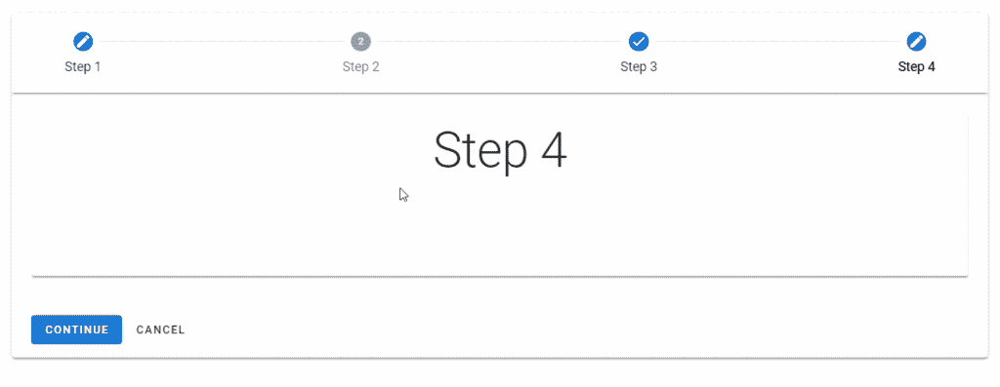

# 验证步进线性

线性步进器使用户通过定义的路径。在进入下一步之前，必须完成一个步骤。

```
<template>
  <v-app>
    <div class="ma-4">
      <v-stepper alt-labels>
        <v-stepper-header>
          <v-stepper-step step="1"> Step 1 </v-stepper-step>
          <v-divider></v-divider>
          <v-stepper-step step="2"> Step 2 </v-stepper-step>
          <v-divider></v-divider>
          <v-stepper-step step="3"> Step 3 </v-stepper-step>
          <v-divider></v-divider>
          <v-stepper-step step="4"> Step 4 </v-stepper-step>
        </v-stepper-header>
      </v-stepper> <v-stepper
        alt-labels
        value="2"
        class="mt-12"
      >
        <v-stepper-header>
          <v-stepper-step
            step="1"
            complete
          >
            Step 1
          </v-stepper-step>
          <v-divider></v-divider>
          <v-stepper-step step="2"> Step 2 </v-stepper-step>
          <v-divider></v-divider>
          <v-stepper-step step="3"> Step 3 </v-stepper-step>
          <v-divider></v-divider>
          <v-stepper-step step="4"> Step 4 </v-stepper-step>
        </v-stepper-header>
      </v-stepper> <v-stepper
        alt-labels
        value="3"
        class="mt-12"
      >
        <v-stepper-header>
          <v-stepper-step
            step="1"
            complete
          >
            Step 1
          </v-stepper-step>
          <v-divider></v-divider>
          <v-stepper-step
            step="2"
            complete
          >
            Step 2
          </v-stepper-step>
          <v-divider></v-divider>
          <v-stepper-step step="3"> Step 3 </v-stepper-step>
          <v-divider></v-divider>
          <v-stepper-step step="4"> Step 4 </v-stepper-step>
        </v-stepper-header>
      </v-stepper> <v-stepper
        alt-labels
        value="4"
        class="mt-12"
      >
        <v-stepper-header>
          <v-stepper-step
            step="1"
            complete
          >
            Step 1
          </v-stepper-step>
          <v-divider></v-divider>
          <v-stepper-step
            step="2"
            complete
          >
            Step 2
          </v-stepper-step>
          <v-divider></v-divider>
          <v-stepper-step
            step="3"
            complete
          >
            Step 3
          </v-stepper-step>
          <v-divider></v-divider>
          <v-stepper-step step="4"> Step 4 </v-stepper-step>
        </v-stepper-header>
      </v-stepper>
    </div>
  </v-app>
</template><script>
export default {
  name: 'App',
};
</script>
```

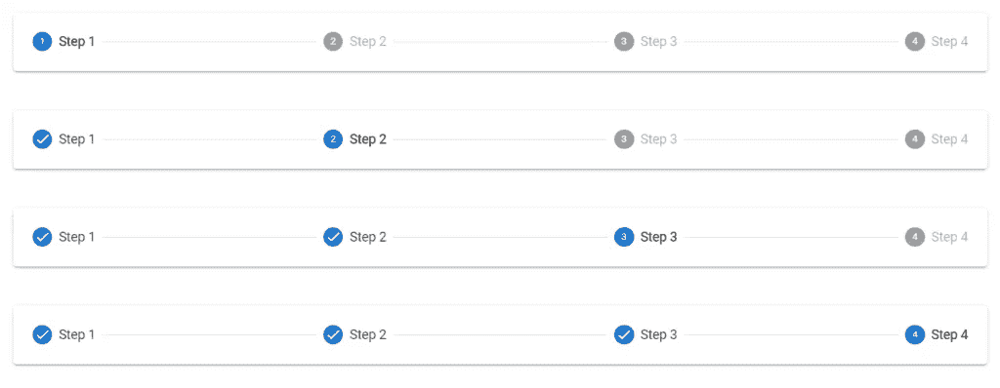

# 验证步进器非线性

非线性步进器允许用户以他们喜欢的方式在你的过程中移动。

```
<template>
  <v-app>
    <div class="ma-4">
      <v-stepper non-linear>
        <v-stepper-header>
          <v-stepper-step
            step="1"
            editable
          >
            Step 1
          </v-stepper-step>
          <v-divider></v-divider>
          <v-stepper-step
            step="2"
            editable
          >
            Step 2
          </v-stepper-step>
          <v-divider></v-divider>
          <v-stepper-step
            step="3"
            editable
          >
            Step 3
          </v-stepper-step>
          <v-divider></v-divider>
          <v-stepper-step
            step="4"
            editable
          >
            Step 4
          </v-stepper-step>
        </v-stepper-header>
      </v-stepper> <v-stepper
        value="4"
        class="mt-12"
        non-linear
      >
        <v-stepper-header>
          <v-stepper-step
            step="1"
            complete
            editable
          >
            Step 1
          </v-stepper-step>
          <v-divider></v-divider>
          <v-stepper-step
            step="2"
            editable
          >
            Step 2
          </v-stepper-step>
          <v-divider></v-divider>
          <v-stepper-step
            step="3"
            editable
          >
            Step 3
          </v-stepper-step>
          <v-divider></v-divider>
          <v-stepper-step
            step="4"
            editable
          >
            Step 4
          </v-stepper-step>
        </v-stepper-header>
      </v-stepper> <v-stepper
        value="2"
        class="mt-12"
        non-linear
      >
        <v-stepper-header>
          <v-stepper-step
            step="1"
            complete
            editable
          >
            Step 1
          </v-stepper-step>
          <v-divider></v-divider>
          <v-stepper-step
            step="2"
            editable
          >
            Step 2
          </v-stepper-step>
          <v-divider></v-divider>
          <v-stepper-step
            step="3"
            editable
          >
            Step 3
          </v-stepper-step>
          <v-divider></v-divider>
          <v-stepper-step
            step="4"
            editable
            complete
          >
            Step 4
          </v-stepper-step>
        </v-stepper-header>
      </v-stepper> <v-stepper
        value="3"
        class="mt-12"
        non-linear
      >
        <v-stepper-header>
          <v-stepper-step
            step="1"
            complete
            editable
          >
            Step 1
          </v-stepper-step>
          <v-divider></v-divider>
          <v-stepper-step
            step="2"
            complete
            editable
          >
            Step 2
          </v-stepper-step>
          <v-divider></v-divider>
          <v-stepper-step
            step="3"
            editable
          >
            Step 3
          </v-stepper-step>
          <v-divider></v-divider>
          <v-stepper-step
            step="4"
            editable
            complete
          >
            Step 4
          </v-stepper-step>
        </v-stepper-header>
      </v-stepper>
    </div>
  </v-app>
</template><script>
export default {
  name: 'App',
};
</script>
```

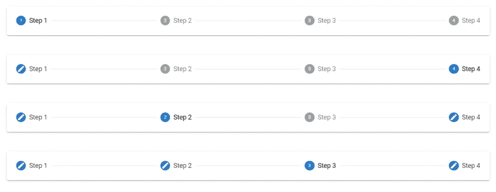

# 垂直验证步进器

垂直步进器使用户沿着 y 轴移动步进，其工作方式类似于水平步进器。我们可以通过将`v-stepper`的`vertical`支柱设置为`true`来使步进器垂直。

```
<template>
  <v-app>
    <div class="ma-4">
      <v-stepper
        v-model="step"
        vertical
      >
        <v-stepper-items>
          <v-stepper-step
            :complete="step > 1"
            step="1"
          >
            Step 1
          </v-stepper-step>
          <v-stepper-content step="1">
            <v-card
              class="mb-12"
              color="grey lighten-1"
              height="200px"
            ></v-card> <v-btn
              color="primary"
              @click="step = 2"
            >
              Continue
            </v-btn> <v-btn text> Cancel </v-btn>
          </v-stepper-content> <v-stepper-step
            :complete="step > 2"
            step="2"
          >
            Step 2
          </v-stepper-step>
          <v-stepper-content step="2">
            <v-card
              class="mb-12"
              color="grey lighten-1"
              height="200px"
            ></v-card> <v-btn
              color="primary"
              @click="step = 3"
            >
              Continue
            </v-btn> <v-btn text> Cancel </v-btn>
          </v-stepper-content> <v-stepper-content step="3">
            <v-stepper-step step="3">
              Step 3
            </v-stepper-step> <v-card
              class="mb-12"
              color="grey lighten-1"
              height="200px"
            ></v-card> <v-btn color="primary"> Continue </v-btn> <v-btn text> Cancel </v-btn>
          </v-stepper-content>
        </v-stepper-items>
      </v-stepper>
    </div>
  </v-app>
</template><script>
export default {
  name: 'App',
  data: () => ({
    step: 1,
  }),
};
</script>
```


验证水平步进器

水平步进器使用户沿着 x 轴移动步进。`v-stepper`默认情况下是水平的。

```
<template>
  <v-app>
    <div class="ma-4">
      <v-stepper value="3">
        <v-stepper-header>
          <v-stepper-step
            complete
            step="1"
          >
            Step 1
          </v-stepper-step> <v-divider></v-divider> <v-stepper-step
            complete
            step="2"
          >
            Step 2
          </v-stepper-step> <v-divider></v-divider> <v-stepper-step step="3"> Step 3 </v-stepper-step> <v-divider></v-divider> <v-stepper-step step="4"> Step 4 </v-stepper-step>
        </v-stepper-header>
      </v-stepper>
    </div>
  </v-app>
</template><script>
export default {
  name: 'App',
};
</script>
```

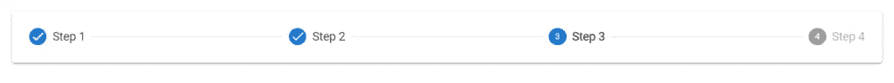

# 验证步进器错误消息

我们可以在步进器上显示错误状态，以指示强制操作。

```
<template>
  <v-app>
    <div class="ma-4">
      <v-stepper
        v-model="step"
        alt-labels
        non-linear
      >
        <v-stepper-header>
          <v-stepper-step
            complete
            step="1"
          >
            Step 1
          </v-stepper-step> <v-divider></v-divider> <v-stepper-step
            editable
            step="2"
          >
            Step 2
          </v-stepper-step> <v-divider></v-divider> <v-stepper-step
            step="3"
            editable
            :rules="step3Rules"
          >
            <div class="text-center">
              Step 3
              <small>Alert message</small>
            </div>
          </v-stepper-step> <v-divider></v-divider> <v-stepper-step
            step="4"
            editable
          >
            Step 4
          </v-stepper-step>
        </v-stepper-header>
        <v-stepper-items>
          <v-stepper-content step="1">
            <v-card
              class="mb-12 pa-4"
              color="text-h2 text-center"
              height="200px"
            >
              <div>Step 1</div>
            </v-card> <v-btn
              color="primary"
              @click="step = 2"
            >
              Continue
            </v-btn> <v-btn text> Cancel </v-btn>
          </v-stepper-content> <v-stepper-content step="2">
            <v-card
              class="mb-12 pa-4"
              color="text-h2 text-center"
              height="200px"
            >
              <div>Step 2</div>
            </v-card> <v-btn
              color="primary"
              @click="step = 3"
            >
              Continue
            </v-btn> <v-btn text> Cancel </v-btn>
          </v-stepper-content> <v-stepper-content step="3">
            <v-card
              class="mb-12 pa-4"
              color="text-h2 text-center"
              height="200px"
            >
              <div>Step 3</div>
            </v-card> <v-btn color="primary"> Continue </v-btn> <v-btn text> Cancel </v-btn>
          </v-stepper-content> <v-stepper-content step="4">
            <v-card
              class="mb-12 pa-4"
              color="text-h2 text-center"
              height="200px"
            >
              <div>Step 4</div>
            </v-card> <v-btn color="primary"> Continue </v-btn> <v-btn text> Cancel </v-btn>
          </v-stepper-content>
        </v-stepper-items>
      </v-stepper>
    </div>
  </v-app>
</template><script>
export default {
  name: 'App',
  data: () => ({
    step: 1,
    step3Rules: [(value) => false],
  }),
};
</script>
```

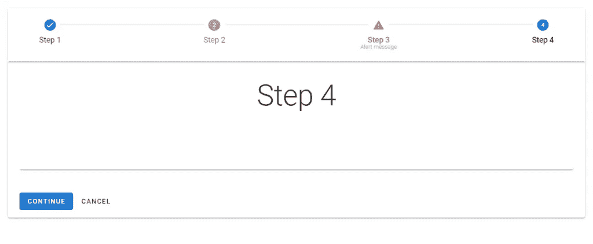

我们还可以在垂直步进机中显示错误状态:

```
<template>
  <v-app>
    <div class="ma-4">
      <v-stepper
        v-model="step"
        vertical
      >
        <v-stepper-items>
          <v-stepper-step
            :complete="step > 1"
            step="1"
          >
            Step 1
          </v-stepper-step>
          <v-stepper-content step="1">
            <v-card
              class="mb-12"
              color="grey lighten-1"
              height="200px"
            ></v-card> <v-btn
              color="primary"
              @click="step = 2"
            >
              Continue
            </v-btn> <v-btn text> Cancel </v-btn>
          </v-stepper-content> <v-stepper-step
            step="2"
            :rules="step2Rules"
            editable
          >
            Step 2
            <small>Alert message</small>
          </v-stepper-step>
          <v-stepper-content step="2">
            <v-card
              class="mb-12"
              color="grey lighten-1"
              height="200px"
            ></v-card> <v-btn
              color="primary"
              @click="step = 3"
            >
              Continue
            </v-btn> <v-btn text> Cancel </v-btn>
          </v-stepper-content> <v-stepper-content step="3">
            <v-stepper-step
              step="3"
              editable
            >
              Step 3
            </v-stepper-step> <v-card
              class="mb-12"
              color="grey lighten-1"
              height="200px"
            ></v-card> <v-btn color="primary"> Continue </v-btn> <v-btn text> Cancel </v-btn>
          </v-stepper-content>
        </v-stepper-items>
      </v-stepper>
    </div>
  </v-app>
</template><script>
export default {
  name: 'App',
  data: () => ({
    step: 1,
    step2Rules: [() => false],
  }),
};
</script>
```

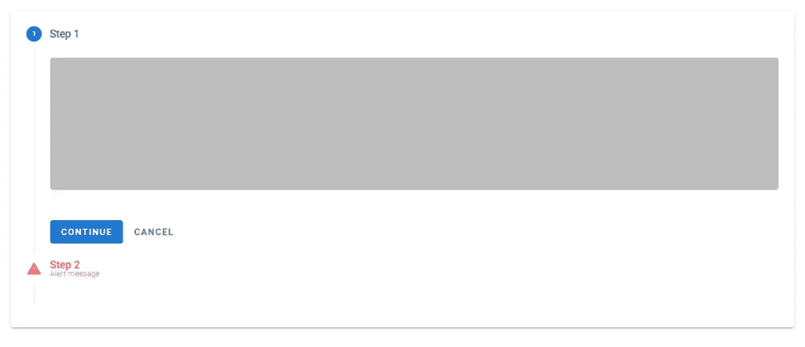

# 可选步骤

我们可以在步进器中用子文本指示可选步骤。

```
<template>
  <v-app>
    <div class="ma-4">
      <v-stepper value="3">
        <v-stepper-header>
          <v-stepper-step
            step="1"
            complete
          >
            Step 1
          </v-stepper-step>
          <v-divider></v-divider>
          <v-stepper-step
            step="2"
            complete
          >
            Step 2
          </v-stepper-step>
          <v-divider></v-divider>
          <v-stepper-step step="3">
            Step 3 <small>Optional</small></v-stepper-step
          >
          <v-divider></v-divider>
          <v-stepper-step step="4"> Step 4 </v-stepper-step>
        </v-stepper-header>
      </v-stepper>
    </div>
  </v-app>
</template><script>
export default {
  name: 'App',
};
</script>
```

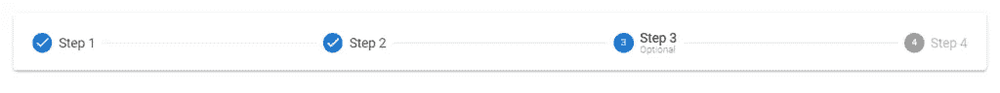

# 结论

步进器通过编号的步骤显示进度。我们可以使用 Vuetify stepper 组件(`v-stepper`)及其各种子组件来创建和定制步进器。

# 提升你的技能

每周获取新的 web 开发技巧和教程。


[**订阅**](https://codingbeautydev.com/newsletter/)

*更新于:*[*codingbeautydev.com*](https://codingbeautydev.com/blog/vuetify-stepper/)*。*