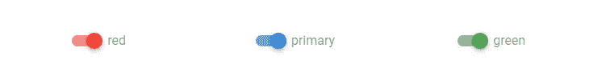

# vue tity 开关:如何使用 vue tity 创建开关

> 原文：<https://javascript.plainenglish.io/vuetify-switch-f5ba09a7ad64?source=collection_archive---------15----------------------->


开关允许用户在两个不同的值之间进行选择。您可以在 UI 中使用它们来代替[复选框](https://codingbeautydev.com/blog/vuetify-checkbox/)。在本文中，我们将了解 Vuetify switch 组件以及定制它的不同方式。

# v 形开关组件

`v-switch`是 Vuetify 提供的用于创建开关的组件的名称:

```
<template>
  <v-app>
    <div class="d-flex justify-center mt-2">
      <v-switch></v-switch>
    </div>
  </v-app>
</template><script>
export default {
  name: 'App',
};
</script>
```


点按开关打开它:


# 使用 v-model 的双向绑定

我们可以用`v-model`在开关的值和变量之间建立一个双向绑定。在下面的代码中，我们创建了一个开关和一个按钮[来关闭它。我们给](https://codingbeautydev.com/blog/vuetify-button/)[按钮](https://codingbeautydev.com/blog/vuetify-button/)添加了一个点击处理程序，将`switch1`设置为`false`，这将由于`v-model`而关闭开关。`two-way binding`还确保在用户界面中切换开关将更新`switch1`。

```
<template>
  <v-app>
    <div class="d-flex justify-center mt-2">
      <v-switch v-model="switch1"></v-switch>
    </div>
    <div class="d-flex justify-center mt-2">
      <v-btn color="primary" @click="switch1 = false">Turn off</v-btn>
    </div>
  </v-app>
</template><script>
export default {
  name: 'App',
  data: () => ({
    switch1: false,
  }),
};
</script>
```


点击[按钮](https://codingbeautydev.com/blog/vuetify-button/)关闭开关；


# 切换标签

我们可以用`label`道具向用户解释开关的功能:

```
<template>
  <v-app>
    <div class="d-flex justify-center mt-2">
      <v-switch
        v-model="switch1"
        :label="`Switch: ${switch1 ? 'on' : 'off'}`"
      ></v-switch>
    </div>
  </v-app>
</template><script>
export default {
  name: 'App',
  data: () => ({
    switch1: false,
  }),
};
</script>
```


# 用美化来美化

使用 Vuetify 材料设计框架创建优雅 web 应用程序的完整指南。


在这里免费下载[](https://mailchi.mp/583226ee0d7b/beautify-with-vuetify)**！**

# **自定义 HTML 标签**

**要在交换机的标签中包含 HTML，请使用`label`插槽:**

```
<template>
  <v-app>
    <div class="d-flex justify-center mt-2">
      <v-switch v-model="switch1">
        <template v-slot:label>
          Switch:
          <b :class="{ 'primary--text': switch1 }">{{
            switch1 ? 'on' : 'off'
          }}</b>
        </template>
      </v-switch>
    </div>
  </v-app>
</template><script>
export default {
  name: 'App',
  data: () => ({
    switch1: false,
  }),
};
</script>
```

********

# **自定义颜色**

**像许多其他 Vuetify 组件一样，`v-switch`带有`color`属性，允许我们设置自定义的[颜色](https://codingbeautydev.com/blog/vuetify-colors/):**

```
<template>
  <v-app>
    <div class="d-flex justify-center mt-2">
      <v-col sm="4" class="d-flex justify-center"
        ><v-switch color="red" label="red"></v-switch>
      </v-col>
      <v-col sm="4" class="d-flex justify-center"
        ><v-switch color="primary" label="primary"></v-switch>
      </v-col>
      <v-col sm="4" class="d-flex justify-center"
        ><v-switch color="green" label="green"></v-switch>
      </v-col>
    </div>
  </v-app>
</template><script>
export default {
  name: 'App',
};
</script>
```

****

# **平面开关**

**我们可以使用平支柱移除开关拇指上的凸起。**

```
<template>
  <v-app>
    <div class="d-flex justify-center mt-2">
      <v-switch
        v-model="switch1"
        :label="`Switch: ${switch1 ? 'on' : 'off'}`"
        flat
      ></v-switch>
    </div>
  </v-app>
</template><script>
export default {
  name: 'App',
  data: () => ({
    switch1: false,
  }),
};
</script>
```

********

# **在插入模式下切换**

**要在插入模式下渲染开关，将`inset`道具设置为`true`:**

```
<template>
  <v-app>
    <div class="d-flex justify-center mt-2">
      <v-switch
        v-model="switch1"
        :label="`Switch: ${switch1 ? 'on' : 'off'}`"
        inset
      ></v-switch>
    </div>
  </v-app>
</template><script>
export default {
  name: 'App',
  data: () => ({
    switch1: false,
  }),
};
</script>
```

********

# **将数组传递给 v-model**

**我们可以将一个共享数组变量传递给多个开关组件的`v-model`。**

```
<template>
  <v-app>
    <div class="d-flex justify-center mt-2">
      {{ people }}
    </div> <div class="d-flex justify-center mt-2">
      <v-switch
        v-model="people"
        color="primary"
        label="Peter"
        value="Peter"
      ></v-switch>
    </div>
    <div class="d-flex justify-center mt-2">
      <v-switch
        v-model="people"
        color="primary"
        label="Daniel"
        value="Daniel"
      ></v-switch>
    </div>
  </v-app>
</template><script>
export default {
  name: 'App',
  data: () => ({
    people: [],
  }),
};
</script>
```

****

**切换任何一个开关都会更新阵列:**

****

# **禁用开关**

**我们可以使用`disabled`道具禁用开关:**

```
<template>
  <v-app>
    <div class="d-flex justify-center mt-2">
      <v-switch label="off disabled" :value="false" disabled></v-switch>
    </div>
    <div class="d-flex justify-center mt-2">
      <v-switch label="on disabled" :value="true" disabled></v-switch>
    </div>
  </v-app>
</template><script>
export default {
  name: 'App',
};
</script>
```

****

# **加载状态下的开关**

**使用`loading`按钮将开关设置为加载状态:**

```
<template>
  <v-app>
    <div class="d-flex justify-center mt-2">
      <v-switch label="off loading" :value="false" loading="primary"></v-switch>
    </div>
    <div class="d-flex justify-center mt-2">
      <v-switch label="on loading" :value="true" loading="primary"></v-switch>
    </div>
  </v-app>
</template><script>
export default {
  name: 'App',
};
</script>
```

****

# **摘要**

**开关对于接受用户的布尔输入很有用。使用`v-switch`组件及其各种道具来创建和定制它们。**

**[*注册*](http://eepurl.com/hRfyJL) *订阅我们的每周简讯，了解 Vuetify 和 Vue 的最新技巧和教程。***

***在*[*codingbeautydev.com*](https://codingbeautydev.com/blog/vuetify-switch/)*获取更新文章。***