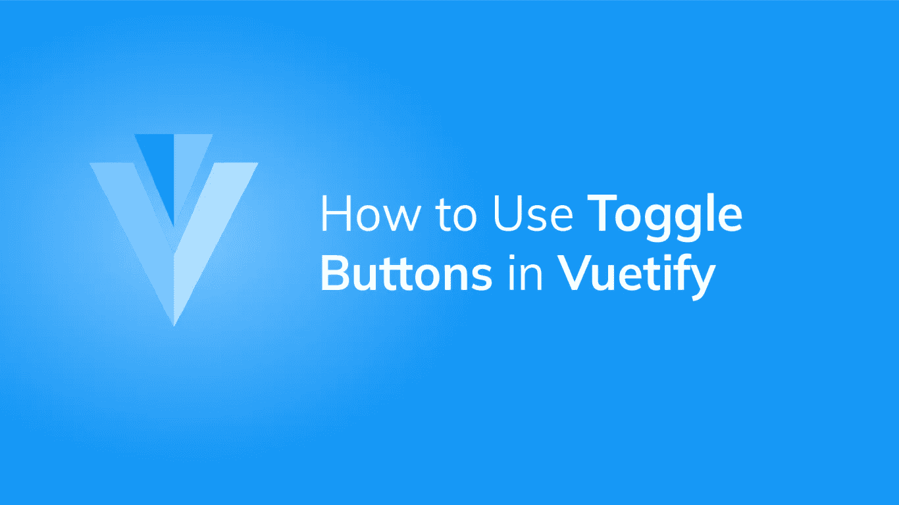

# 如何用 Vuetify 创建切换按钮

> 原文：<https://javascript.plainenglish.io/vuetify-toggle-buttons-fb6e204eb017?source=collection_archive---------22----------------------->



切换按钮对于创建一组[按钮](https://codingbeautydev.com/blog/vuetify-buttons)非常有用，这些按钮的单个选择状态都依赖于单个变量。在本文中，我们将看到在 Vuetify 中创建和定制这个组件的方法。

# v-btn-toggle 组件

我们可以用`v-btn-toggle`组件在 Vuetify 中创建一个[按钮](https://codingbeautydev.com/blog/vuetify-buttons)组(或切换按钮)。一组[按钮](https://codingbeautydev.com/blog/vuetify-buttons)可以在单个`v-model`下选择或切换，该按钮绑定到`format`变量:

```
<template>
  <v-app>
    <v-row class="ma-2" justify="center">
      <v-btn-toggle v-model="format" borderless>
        <v-btn value="left">
          <span>Left</span><v-icon right>mdi-format-align-left</v-icon>
        </v-btn>
        <v-btn value="center">
          <span>Center</span><v-icon right>mdi-format-align-center</v-icon>
        </v-btn>
        <v-btn value="right">
          <span>Right</span><v-icon right>mdi-format-align-right</v-icon>
        </v-btn>
      </v-btn-toggle>
    </v-row>
  </v-app>
</template><script>
export default {
  name: 'App',
  data: () => ({
    format: 'center',
  }),
};
</script>
```


单击组中的一个按钮会取消选择当前选定的按钮:


# 确保切换按钮值具有强制属性

Vuetify 提供了`mandatory`属性，用于确保切换按钮总是有一个值:

```
<template>
  <v-app>
    <v-row class="ma-2" justify="center">
      <v-btn-toggle v-model="format" borderless mandatory>
        <v-btn value="left">
          <span>Left</span><v-icon right>mdi-format-align-left</v-icon>
        </v-btn>
        <v-btn value="center">
          <span>Center</span><v-icon right>mdi-format-align-center</v-icon>
        </v-btn>
        <v-btn value="right">
          <span>Right</span><v-icon right>mdi-format-align-right</v-icon>
        </v-btn>
      </v-btn-toggle>
    </v-row>
  </v-app>
</template><script>
export default {
  name: 'App',
  data: () => ({
    format: null,
  }),
};
</script>
```


# 用美化来美化

使用 Vuetify 材料设计框架创建优雅 web 应用程序的完整指南。


在这里免费下载[](https://mailchi.mp/583226ee0d7b/beautify-with-vuetify)****！****

# **验证切换按钮多重选择**

**`multiple`道具允许我们在组中选择多个[按钮](https://codingbeautydev.com/blog/vuetify-buttons):**

```
<template>
  <v-app>
    <v-row class="ma-2" justify="center">
      <v-btn-toggle v-model="selectedLetters" multiple>
        <v-btn v-for="(ch, index) in word" :key="index">{{ch}}</v-btn>
      </v-btn-toggle>
    </v-row>
  </v-app>
</template><script>
export default {
  name: 'App',
  data: () => ({
    word: 'Beauty'.split(''),
    selectedLetters: []
  }),
};
</script>
```

****

# **验证圆形切换按钮**

**我们可以用`rounded`道具使 Vuetify 中的切换按钮变圆:**

```
<template>
  <v-app>
    <v-row class="ma-2" justify="center">
      <v-btn-toggle v-model="letter" rounded>
        <v-btn v-for="(ch, index) in word" :key="index">{{ ch }}</v-btn>
      </v-btn-toggle>
    </v-row>
  </v-app>
</template><script>
export default {
  name: 'App',
  data: () => ({
    word: 'Coding'.split(''),
    letter: '',
  }),
};
</script>
```

****

# **美化无边框切换按钮**

**将`v-btn-toggle`上的`borderless`支柱设置为`true`将移除组中每个[按钮](https://codingbeautydev.com/blog/vuetify-buttons)的边框。**

```
<template>
  <v-app>
    <v-row class="ma-2" justify="center">
      <v-btn-toggle v-model="letter" rounded borderless>
        <v-btn v-for="(ch, index) in word" :key="index">{{ ch }}</v-btn>
      </v-btn-toggle>
    </v-row>
  </v-app>
</template><script>
export default {
  name: 'App',
  data: () => ({
    word: 'Coding'.split(''),
    letter: '',
  }),
};
</script>
```

****

# **在 Vuetify 中自定义切换按钮颜色**

**我们可以用`color`道具改变[按钮](https://codingbeautydev.com/blog/vuetify-buttons)组中所选[按钮](https://codingbeautydev.com/blog/vuetify-buttons)的[颜色:](https://codingbeautydev.com/blog/vuetify-colors/)**

```
<template>
  <v-app>
    <v-row class="ma-2" justify="center">
      <v-btn-toggle v-model="selectedLetters" rounded multiple color="blue">
        <v-btn v-for="(ch, index) in word" :key="index">{{ ch }}</v-btn>
      </v-btn-toggle>
    </v-row>
  </v-app>
</template><script>
export default {
  name: 'App',
  data: () => ({
    word: 'Beauty'.split(''),
    selectedLetters: [],
  }),
};
</script>
```

****

# **摘要**

**当我们有一组逻辑相关的[按钮](https://codingbeautydev.com/blog/vuetify-buttons)时，切换按钮是有用的，这些按钮的选择状态需要由单个变量来控制。Vuetify 提供了用于创建它们的`v-btn-toggle`组件和用于定制的各种道具。**

**[*注册*](http://eepurl.com/hRfyJL) *订阅我们的每周简讯，了解更多精彩内容。***

***最初发表于*[*codingbeautydev.com*](https://codingbeautydev.com/blog/vuetify-toggle-buttons/)*。***