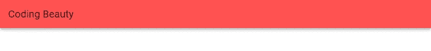
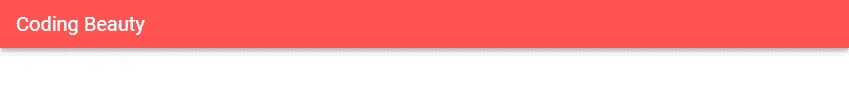
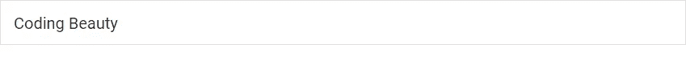
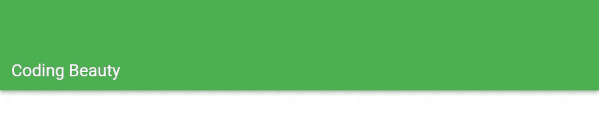

# 如何用 Vuetify 创建工具栏

> 原文：<https://javascript.plainenglish.io/vuetify-toolbars-779e6071ae?source=collection_archive---------9----------------------->


工具栏是浏览 web 应用程序的主要方式之一。在本文中，我们将了解 Vuetify 如何允许我们为用户界面创建和定制工具栏。

# 垂直工具栏组件

我们用`v-toolbar`组件在 Vuetify 中创建工具栏。

```
<template>
  <v-app>
    <v-toolbar class="flex-grow-0" color="red accent-2"> </v-toolbar>
  </v-app>
</template><script>
export default {
  name: 'App',
};
</script>
```

我们使用工具栏上的`flex-grow-0`类来防止它覆盖半个屏幕(移除这个类来亲自查看)并用`color`道具定制它的[颜色](https://codingbeautydev.com/blog/vuetify-colors/):


# 在 Vuetify 中设置工具栏标题

我们使用`v-toolbar`中的`v-toolbar-title`组件来设置工具栏标题。例如:

```
<template>
  <v-app>
    <v-toolbar class="flex-grow-0" color="red accent-2">
      <v-toolbar-title>Coding Beauty</v-toolbar-title>
    </v-toolbar>
  </v-app>
</template><script>
export default {
  name: 'App',
};
</script>
```



# 使工具栏变暗

将`dark`属性应用到工具栏组件将使工具栏上的文本变成白色，而不是黑色。

```
<template>
  <v-app>
    <v-toolbar class="flex-grow-0" color="red accent-2" dark>
      <v-toolbar-title>Coding Beauty</v-toolbar-title>
    </v-toolbar>
  </v-app>
</template><script>
export default {
  name: 'App',
};
</script>
```

# 用美化来美化

使用 Vuetify 材料设计框架创建优雅 web 应用程序的完整指南。


在这里免费下载[](https://mailchi.mp/583226ee0d7b/beautify-with-vuetify)****！****

# **密集工具栏**

**将工具栏组件上的`dense`属性设置为`true`会使其更加紧凑:**

```
<template>
  <v-app>
    <v-toolbar class="flex-grow-0" color="red accent-2" dark dense>
      <v-toolbar-title>Coding Beauty</v-toolbar-title>
    </v-toolbar>
  </v-app>
</template><script>
export default {
  name: 'App',
};
</script>
```

****

# **Vuetify 中的平面工具栏**

**我们可以用`flat`属性删除工具栏提升:**

```
<template>
  <v-app>
    <v-toolbar class="flex-grow-0" color="red accent-2" dark flat>
      <v-toolbar-title>Coding Beauty</v-toolbar-title>
    </v-toolbar>
  </v-app>
</template><script>
export default {
  name: 'App',
};
</script>
```

****

# **轮廓工具栏**

**`outlined`道具在工具栏周围添加一个轮廓。让我们去掉[颜色](https://codingbeautydev.com/blog/vuetify-colors/)，这样我们可以更清楚地看到这个轮廓:**

```
<template>
  <v-app>
    <v-toolbar class="flex-grow-0" flat outlined>
      <v-toolbar-title>Coding Beauty</v-toolbar-title>
    </v-toolbar>
  </v-app>
</template><script>
export default {
  name: 'App',
};
</script>
```

****

# **突出的工具栏**

**使用`prominent`道具，我们可以创建高度增加到 128 像素的工具栏。突出的工具栏把它们的标题放在容器的底部。**

```
<template>
  <v-app>
    <v-toolbar class="flex-grow-0" dark color="green" prominent>
      <v-toolbar-title>Coding Beauty</v-toolbar-title>
    </v-toolbar>
  </v-app>
</template><script>
export default {
  name: 'App',
};
</script>
```

****

# **Vuetify 中的圆形工具栏**

**将`rounded`道具设置为`true`将创建圆形工具栏:**

```
<template>
  <v-app>
    <v-card tile flat>
      <v-toolbar color="green" dark rounded>
        <v-toolbar-title>Coding Beauty</v-toolbar-title>
      </v-toolbar>
    </v-card>
  </v-app>
</template><script>
export default {
  name: 'App',
};
</script>
```

****

# **Vuetify 中的异形工具栏**

**我们也可以创建异形工具栏，用`shaped`道具:**

```
<template>
  <v-app>
    <v-toolbar class="flex-grow-0" dark color="green" shaped>
      <v-toolbar-title>Coding Beauty</v-toolbar-title>
    </v-toolbar>
  </v-app>
</template><script>
export default {
  name: 'App',
};
</script>
```

****

# **摘要**

**工具栏是网站和应用导航的有用 UI 元素。Vuetify 提供了用于创建它们的`v-toolbar`组件，带有各种定制选项。**

**[*注册*](http://eepurl.com/hRfyJL) *订阅我们的每周简讯，了解更多精彩内容。***

***最初发表于*[*【codingbeautydev.com】*](https://codingbeautydev.com/blog/vuetify-toolbar/)*。***