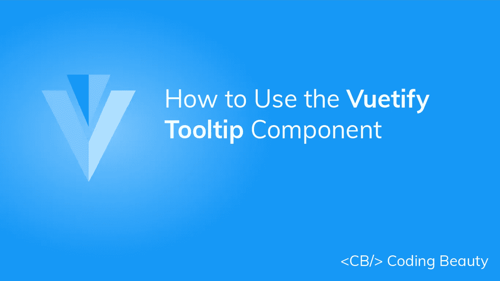
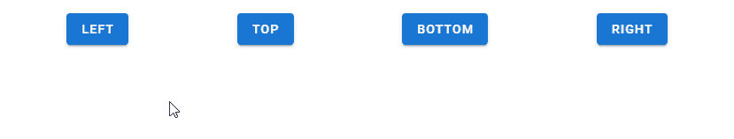
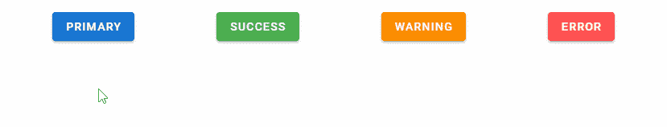

# 如何使用 Vuetify 工具提示组件

> 原文：<https://javascript.plainenglish.io/vuetify-tooltip-d7a54896d1d1?source=collection_archive---------22----------------------->



当用户将鼠标悬停在界面中的某个元素上时，工具提示对于传递信息非常有用。当工具提示被激活时，它会显示一个标识其关联元素的文本标签，例如，描述其功能。请继续阅读，了解关于 Vuetify 工具提示组件和所提供的不同定制选项的更多信息。

# `v-tooltip`组件

Vuetify 提供了用于创建工具提示的`v-tooltip`组件。`v-tooltip`可以包裹任何元素。

```
<template>
  <v-app>
    <div class="text-center d-flex ma-4 justify-center">
      <v-tooltip bottom>
        <template v-slot:activator="{ on, attrs }">
          <v-btn color="primary" dark v-bind="attrs" v-on="on"> Button </v-btn>
        </template>
        <span>Tooltip</span>
      </v-tooltip>
    </div>
  </v-app>
</template><script>
export default {
  name: 'App',
};
</script>
```


# 验证工具提示对齐方式

我们可以使用`v-tooltip`组件的一个位置道具(`top`、`bottom`、`left`或`right`)来设置工具提示对齐。注意，需要设置这些属性中的一个。

```
<template>
  <v-app>
    <div class="d-flex ma-4 justify-space-around">
      <v-tooltip left>
        <template v-slot:activator="{ on, attrs }">
          <v-btn color="primary" dark v-bind="attrs" v-on="on"> Left </v-btn>
        </template>
        <span>Left tooltip</span>
      </v-tooltip> <v-tooltip top>
        <template v-slot:activator="{ on, attrs }">
          <v-btn color="primary" dark v-bind="attrs" v-on="on"> Top </v-btn>
        </template>
        <span>Top tooltip</span>
      </v-tooltip> <v-tooltip bottom>
        <template v-slot:activator="{ on, attrs }">
          <v-btn color="primary" dark v-bind="attrs" v-on="on"> Bottom </v-btn>
        </template>
        <span>Bottom tooltip</span>
      </v-tooltip> <v-tooltip right>
        <template v-slot:activator="{ on, attrs }">
          <v-btn color="primary" dark v-bind="attrs" v-on="on"> Right </v-btn>
        </template>
        <span>Right tooltip</span>
      </v-tooltip>
    </div>
  </v-app>
</template><script>
export default {
  name: 'App',
};
</script>
```



# 用美化来美化

使用 Vuetify 材料设计框架创建优雅 web 应用程序的完整指南。


在 这里免费获得一份 [**。**](https://mailchi.mp/583226ee0d7b/beautify-with-vuetify)

# 美化工具提示颜色

像 Vuetify 中的许多其他组件一样，`v-tooltip`组件附带了用于定制工具提示的[颜色](https://codingbeautydev.com/blog/vuetify-colors/)的`color`道具。

```
<template>
  <v-app>
    <div class="d-flex ma-4 justify-space-around">
      <v-tooltip bottom color="primary">
        <template v-slot:activator="{ on, attrs }">
          <v-btn color="primary" dark v-bind="attrs" v-on="on"> primary </v-btn>
        </template>
        <span>Primary tooltip</span>
      </v-tooltip> <v-tooltip bottom color="success">
        <template v-slot:activator="{ on, attrs }">
          <v-btn color="success" dark v-bind="attrs" v-on="on"> success </v-btn>
        </template>
        <span>Success tooltip</span>
      </v-tooltip> <v-tooltip bottom color="warning">
        <template v-slot:activator="{ on, attrs }">
          <v-btn color="warning" dark v-bind="attrs" v-on="on"> warning </v-btn>
        </template>
        <span>Warning tooltip</span>
      </v-tooltip> <v-tooltip bottom color="error">
        <template v-slot:activator="{ on, attrs }">
          <v-btn color="error" dark v-bind="attrs" v-on="on"> error </v-btn>
        </template>
        <span>Error tooltip</span>
      </v-tooltip>
    </div>
  </v-app>
</template><script>
export default {
  name: 'App',
};
</script>
```



# 赋予工具提示可见性

在`v-tooltip`上使用`v-model`允许我们在工具提示的可见性和变量之间建立双向绑定。例如，在下面的代码中，我们创建了一个[按钮](https://codingbeautydev.com/blog/vuetify-button/)和它下面的工具提示。点击[按钮](https://codingbeautydev.com/blog/vuetify-button/)将否定`show`变量并切换工具提示的可见性。

```
<template>
  <v-app>
    <v-container fluid class="text-center ma-4">
      <v-row class="flex" justify="space-between">
        <v-col cols="12">
          <v-btn @click="show = !show" color="purple accent-4" dark>
            toggle
          </v-btn>
        </v-col> <v-col cols="12" class="mt-12">
          <v-tooltip v-model="show" top>
            <template v-slot:activator="{ on, attrs }">
              <v-btn icon v-bind="attrs" v-on="on">
                <v-icon color="grey lighten-1"> mdi-alarm </v-icon>
              </v-btn>
            </template>
            <span>Programmatic tooltip</span>
          </v-tooltip>
        </v-col>
      </v-row>
    </v-container>
  </v-app>
</template><script>
export default {
  name: 'App',
  data: () => ({
    show: false,
  }),
};
</script>
```


# 结论

当用户将鼠标悬停在某个元素上时，工具提示对于传达信息非常有用。使用 Vuetify 工具提示组件(`v-tooltip`)及其各种道具来创建和定制工具提示。

*获得关于 Vuetify、Vue、JavaScript 等的每周提示和教程:*[http://eepurl.com/hRfyJL](http://eepurl.com/hRfyJL)

*更新于:*[*codingbeautydev.com*](https://codingbeautydev.com/blog/vuetify-tooltip/)