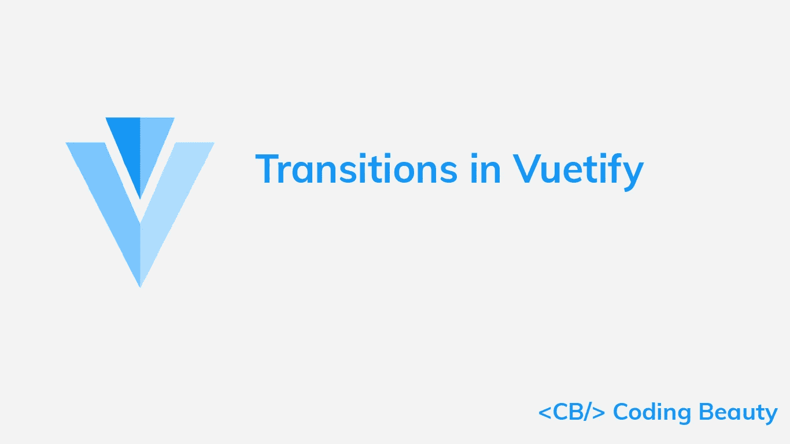
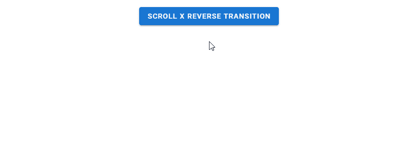
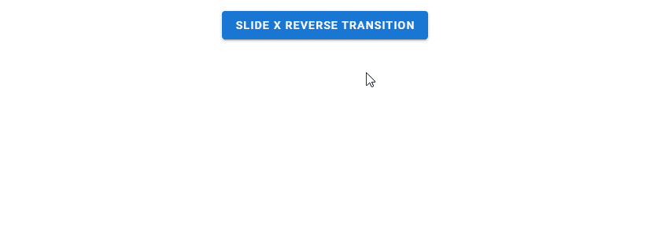

# 虚拟化过渡:如何轻松创建过渡

> 原文：<https://javascript.plainenglish.io/vuetify-transition-4659338cd2f2?source=collection_archive---------14----------------------->



Vuetify 提供了广泛的内置过渡，我们可以将其应用于各种元素，以制作平滑的动画来改善用户体验。我们可以通过在受支持的组件上设置`transition`属性来使用转换，或者像`v-expand-transition`一样将组件包装在转换组件中。

# 虚拟化扩展转换

为了将扩展转换应用于一个元素，我们将它包装在一个`v-expand-transition`组件中。这种转换用于扩展面板和列表组。

```
<template>
  <v-app>
    <div class="text-center ma-4">
      <v-btn
        dark
        color="primary"
        @click="expand = !expand"
      >
        Expand Transition
      </v-btn>
      <v-expand-transition>
        <v-card
          v-show="expand"
          height="100"
          width="100"
          class="blue mx-auto mt-4"
        ></v-card>
      </v-expand-transition>
    </div>
  </v-app>
</template><script>
export default {
  data() {
    return {
      expand: false,
    };
  },
};
</script>
```


# 展开 X 过渡

我们可以用`v-expand-x-transition`代替`v-expand-transition`来应用扩展过渡的水平版本。

```
<template>
  <v-app>
    <div class="text-center ma-4">
      <v-btn
        dark
        color="primary"
        @click="expand = !expand"
      >
        Expand X Transition
      </v-btn>
      <v-expand-x-transition>
        <v-card
          v-show="expand"
          height="100"
          width="100"
          class="blue mx-auto mt-4"
        ></v-card>
      </v-expand-x-transition>
    </div>
  </v-app>
</template><script>
export default {
  data() {
    return {
      expand: false,
    };
  },
};
</script>
```


# 虚拟化 FAB 过渡

当使用`v-speed-dial`组件时，我们可以看到一个 FAB 转换在起作用。目标元素旋转并放大到视图中。

```
<template>
  <v-app>
    <div class="text-center ma-4">
      <v-menu transition="fab-transition">
        <template v-slot:activator="{ on, attrs }">
          <v-btn
            dark
            color="primary"
            v-bind="attrs"
            v-on="on"
          >
            Fab Transition
          </v-btn>
        </template>
        <v-list>
          <v-list-item
            v-for="n in 5"
            :key="n"
          >
            <v-list-item-title
              v-text="'Item ' + n"
            ></v-list-item-title>
          </v-list-item>
        </v-list>
      </v-menu>
    </div>
  </v-app>
</template>
```


# 渐变过渡

淡入淡出过渡作用于目标元素的不透明度。我们可以通过将`transition`设置为`fade-transition`来创建一个。

```
<template>
  <v-app>
    <div class="text-center ma-4">
      <v-menu transition="fade-transition">
        <template v-slot:activator="{ on, attrs }">
          <v-btn
            dark
            color="primary"
            v-bind="attrs"
            v-on="on"
          >
            Fade Transition
          </v-btn>
        </template>
        <v-list>
          <v-list-item
            v-for="n in 5"
            :key="n"
          >
            <v-list-item-title
              v-text="'Item ' + n"
            ></v-list-item-title>
          </v-list-item>
        </v-list>
      </v-menu>
    </div>
  </v-app>
</template>
```


# 用美化来美化

使用 Vuetify 材料设计框架创建优雅 web 应用程序的完整指南。


在这里 免费获得一份 [**。**](https://mailchi.mp/583226ee0d7b/beautify-with-vuetify)

# 虚拟化规模转换

缩放过渡作用于目标元素的宽度和高度。我们可以通过将`transition`设置为`scale-transition`来创建它们。

```
<template>
  <v-app>
    <div class="text-center ma-4">
      <v-menu transition="scale-transition">
        <template v-slot:activator="{ on, attrs }">
          <v-btn
            dark
            color="primary"
            v-bind="attrs"
            v-on="on"
          >
            Scale Transition
          </v-btn>
        </template>
        <v-list>
          <v-list-item
            v-for="n in 5"
            :key="n"
          >
            <v-list-item-title
              v-text="'Item ' + n"
            ></v-list-item-title>
          </v-list-item>
        </v-list>
      </v-menu>
    </div>
  </v-app>
</template>
```


# 过渡原点

像 [v-menu](https://codingbeautydev.com/blog/vuetify-menu/) 这样的组件有一个原点属性，允许我们指定一个过渡应该从哪个点开始。例如，我们可以从 x 轴和 y 轴的中心点开始缩放过渡:

```
<template>
  <v-app>
    <div class="text-center ma-4">
      <v-menu
        transition="scale-transition"
        origin="center center"
      >
        <template v-slot:activator="{ on, attrs }">
          <v-btn
            dark
            color="primary"
            v-bind="attrs"
            v-on="on"
          >
            Scale Transition
          </v-btn>
        </template>
        <v-list>
          <v-list-item
            v-for="n in 5"
            :key="n"
            @click="() => {}"
          >
            <v-list-item-title
              v-text="'Item ' + n"
            ></v-list-item-title>
          </v-list-item>
        </v-list>
      </v-menu>
    </div>
  </v-app>
</template>
```


# 验证滚动 X 过渡

Scroll X 过渡处理目标元素的不透明度和水平位置。它淡入，同时也沿着 x 轴移动。

```
<template>
  <v-app>
    <div class="text-center ma-4">
      <v-menu transition="scroll-x-transition">
        <template v-slot:activator="{ on, attrs }">
          <v-btn
            dark
            color="primary"
            v-bind="attrs"
            v-on="on"
          >
            Scroll X Transition
          </v-btn>
        </template>
        <v-list>
          <v-list-item
            v-for="n in 5"
            :key="n"
          >
            <v-list-item-title
              v-text="'Item ' + n"
            ></v-list-item-title>
          </v-list-item>
        </v-list>
      </v-menu>
    </div>
  </v-app>
</template>
```


# 滚动 X 反向过渡

反向滚动 x 转换使元素从右侧滑入。

```
<template>
  <v-app>
    <div class="text-center ma-4">
      <v-menu transition="scroll-x-reverse-transition">
        <template v-slot:activator="{ on, attrs }">
          <v-btn
            dark
            color="primary"
            v-bind="attrs"
            v-on="on"
          >
            Scroll X Reverse Transition
          </v-btn>
        </template>
        <v-list>
          <v-list-item
            v-for="n in 5"
            :key="n"
          >
            <v-list-item-title
              v-text="'Item ' + n"
            ></v-list-item-title>
          </v-list-item>
        </v-list>
      </v-menu>
    </div>
  </v-app>
</template>
```



# 使滚动 Y 过渡变得有价值

“滚动 y”过渡的工作方式与“滚动 x”过渡类似，但它们作用于元素的垂直位置。

```
<template>
  <v-app>
    <div class="text-center ma-4">
      <v-menu transition="scroll-y-transition">
        <template v-slot:activator="{ on, attrs }">
          <v-btn
            dark
            color="primary"
            v-bind="attrs"
            v-on="on"
          >
            Scroll Y Transition
          </v-btn>
        </template>
        <v-list>
          <v-list-item
            v-for="n in 5"
            :key="n"
          >
            <v-list-item-title
              v-text="'Item ' + n"
            ></v-list-item-title>
          </v-list-item>
        </v-list>
      </v-menu>
    </div>
  </v-app>
</template>
```


# 滚动 Y 反转过渡

反向滚动 y 转换使元素从底部滑入。

```
<template>
  <v-app>
    <div class="text-center ma-4">
      <v-menu transition="scroll-y-reverse-transition">
        <template v-slot:activator="{ on, attrs }">
          <v-btn
            dark
            color="primary"
            v-bind="attrs"
            v-on="on"
          >
            Scroll Y Reverse Transition
          </v-btn>
        </template>
        <v-list>
          <v-list-item
            v-for="n in 5"
            :key="n"
          >
            <v-list-item-title
              v-text="'Item ' + n"
            ></v-list-item-title>
          </v-list-item>
        </v-list>
      </v-menu>
    </div>
  </v-app>
</template>
```


# 美化幻灯片 X 过渡

幻灯片 x 过渡使元素淡入，同时也沿 x 轴滑入。与滚动过渡不同，元素滑出的方向与关闭时滑入的方向相同。

```
<template>
  <v-app>
    <div class="text-center ma-4">
      <v-menu transition="slide-x-transition">
        <template v-slot:activator="{ on, attrs }">
          <v-btn
            dark
            color="primary"
            v-bind="attrs"
            v-on="on"
          >
            Slide X Transition
          </v-btn>
        </template>
        <v-list>
          <v-list-item
            v-for="n in 5"
            :key="n"
          >
            <v-list-item-title
              v-text="'Item ' + n"
            ></v-list-item-title>
          </v-list-item>
        </v-list>
      </v-menu>
    </div>
  </v-app>
</template>
```


# 幻灯片 X 反向过渡

反向幻灯片 x 转换使元素从右侧滑入。

```
<template>
  <v-app>
    <div class="text-center ma-4">
      <v-menu transition="slide-x-reverse-transition">
        <template v-slot:activator="{ on, attrs }">
          <v-btn
            dark
            color="primary"
            v-bind="attrs"
            v-on="on"
          >
            Slide X Reverse Transition
          </v-btn>
        </template>
        <v-list>
          <v-list-item
            v-for="n in 5"
            :key="n"
          >
            <v-list-item-title
              v-text="'Item ' + n"
            ></v-list-item-title>
          </v-list-item>
        </v-list>
      </v-menu>
    </div>
  </v-app>
</template>
```



# 美化幻灯片 Y 过渡

幻灯片 y 过渡的工作方式类似于幻灯片 x 过渡，但它们是沿着 y 轴移动元素。

```
<template>
  <v-app>
    <div class="text-center ma-4">
      <v-menu transition="slide-y-transition">
        <template v-slot:activator="{ on, attrs }">
          <v-btn
            dark
            color="primary"
            v-bind="attrs"
            v-on="on"
          >
            Slide Y Transition
          </v-btn>
        </template>
        <v-list>
          <v-list-item
            v-for="n in 5"
            :key="n"
          >
            <v-list-item-title
              v-text="'Item ' + n"
            ></v-list-item-title>
          </v-list-item>
        </v-list>
      </v-menu>
    </div>
  </v-app>
</template>
```


# 幻灯片 Y 反向转换

反向滑动 y 转换使元素从底部滑入。

```
<template>
  <v-app>
    <div class="text-center ma-4">
      <v-menu transition="slide-y-reverse-transition">
        <template v-slot:activator="{ on, attrs }">
          <v-btn
            dark
            color="primary"
            v-bind="attrs"
            v-on="on"
          >
            Slide Y Reverse Transition
          </v-btn>
        </template>
        <v-list>
          <v-list-item
            v-for="n in 5"
            :key="n"
          >
            <v-list-item-title
              v-text="'Item ' + n"
            ></v-list-item-title>
          </v-list-item>
        </v-list>
      </v-menu>
    </div>
  </v-app>
</template>
```


# 结论

Vuetify 自带一个内置的过渡系统，可以让我们轻松地创建流畅的动画，而无需编写自己的 CSS。我们可以用各种可用的过渡来缩放、淡入淡出或平移 UI 元素。

*更新于:*[*【codingbeautydev.com】*](https://codingbeautydev.com/blog/vuetify-transition/)

# 订阅编码美容简讯

每周获取新的 web 开发技巧和教程。


[**订阅**](http://codingbeautydev.com/newsletter)