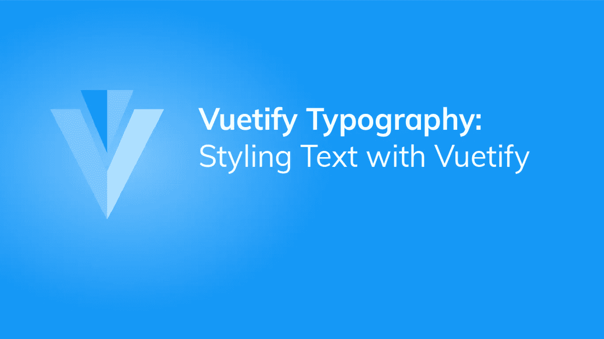
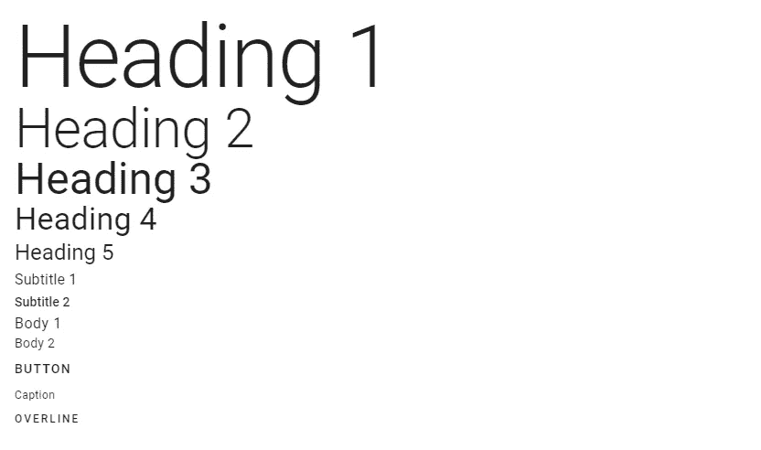
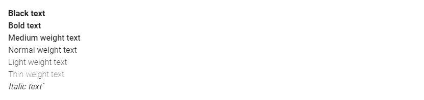
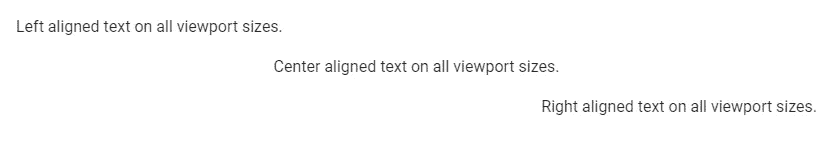
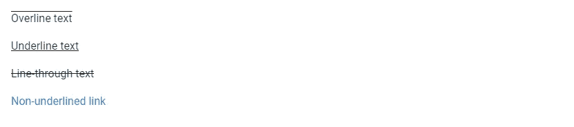
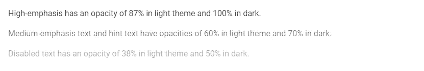
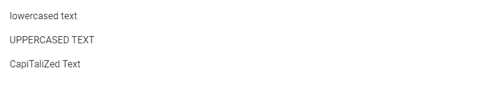
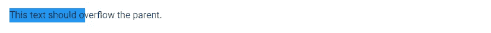

# 字体设计:如何使用字体设计设计文本样式

> 原文：<https://javascript.plainenglish.io/vuetify-typography-e52bf0d0af41?source=collection_archive---------12----------------------->



每个用户界面都包含一些文本。根据文本在用户界面中的用途，不同的文本有不同的样式。Vuetify 提供了各种类，我们可以用它们来控制各种文本属性，比如大小、对齐、包装、溢出和转换。在这篇文章中，我们将学习这些排版助手类。

# 字体大小

Vuetify 附带了修改文本字体大小和样式的类。它们具有以下格式:

*   `.text-{value}`为`xs`断点。
*   `.text-{breakpoint}-{value}`为`sm`、`md`、`lg`和`xl`断点。

`value`可以是以下任何一种:

*   `h1`
*   `h2`
*   `h3`
*   `h4`
*   `h5`
*   `h6`
*   `subtitle-1`
*   `subtitle-2`
*   `body-1`
*   `body-2`
*   `button`
*   `caption`
*   `overline`

```
<template>
  <v-app>
    <div class="ma-4">
      <div class="text-h1">Heading 1</div>
      <div class="text-h2">Heading 2</div>
      <div class="text-h3">Heading 3</div>
      <div class="text-h4">Heading 4</div>
      <div class="text-h5">Heading 5</div>
      <div class="text-subtitle-1">Subtitle 1</div>
      <div class="text-subtitle-2">Subtitle 2</div>
      <div class="text-body-1">Body 1</div>
      <div class="text-body-2">Body 2</div>
      <div class="text-button">Button</div>
      <div class="text-caption">Caption</div>
      <div class="text-overline">Overline</div>
    </div>
  </v-app>
</template><script>
export default {
  name: 'App',
};
</script>
```



# 字体强调

Vuetify 还提供了控制文本字体强调的排版类。材料设计支持 100、300、400、500、700 和 900 的斜体文本和字体粗细。

```
<template>
  <v-app>
    <div class="ma-4">
      <div class="font-weight-black">Black text</div>
      <div class="font-weight-bold">Bold text</div>
      <div class="font-weight-medium">Medium weight text</div>
      <div class="font-weight-regular">Normal weight text</div>
      <div class="font-weight-light">Light weight text</div>
      <div class="font-weight-thin">Thin weight text</div>
      <div class="font-italic">Italic text`</div>
    </div>
  </v-app>
</template><script>
export default {
  name: 'App',
};
</script>
```



# 用美化来美化

使用 Vuetify 材料设计框架创建优雅 web 应用程序的完整指南。


在这里 获得免费副本 [**。**](https://mailchi.mp/583226ee0d7b/beautify-with-vuetify)

# 文本对齐

`text-left`、`text-center`和`text-right`是用于设置文本对齐的排版类:

```
<template>
  <v-app>
    <div class="ma-4">
      <p class="text-left">Left aligned text on all viewport sizes.</p>
      <p class="text-center">Center aligned text on all viewport sizes.</p>
      <p class="text-right">Right aligned text on all viewport sizes.</p>
    </div>
  </v-app>
</template><script>
export default {
  name: 'App',
};
</script>
```



就像字体粗细一样，Vuetify 也附带了针对特定视口宽度范围的排版类。它们包括:

*   `text-sm-{value}`
*   `text-md-{value}`
*   `text-lg-{value}`
*   `text-xl-{value}`

`value`可以是`left`、`center`或`right`。

# 文本装饰

此外，Vuetify 还有用于添加文本装饰的排版类。有形式为`text-decoration-{value}`的，其中值可以是`none`、`overline`、`underline`或`line-through`。

```
<template>
  <v-app>
    <div class="ma-4">
      <p class="text-decoration-overline">Overline text</p>
      <p class="text-decoration-underline">Underline text</p>
      <p class="text-decoration-line-through">Line-through text</p>
      <a href="#" class="text-decoration-none">Non-underlined link</a>
    </div>
  </v-app>
</template><script>
export default {
  name: 'App',
};
</script>
```



# 文本不透明度

不透明排版助手类是另一种用 Vuetify 调整文本强调的便捷方法。`text--primary`具有与默认文本相同的不透明度，`text--secondary`用于提示和帮助文本。用`text--disabled`弱化文本。

```
<template>
  <v-app>
    <div class="ma-4">
      <p class="text--primary">
        High-emphasis has an opacity of 87% in light theme and 100% in dark.
      </p>
      <p class="text--secondary">
        Medium-emphasis text and hint text have opacities of 60% in light theme
        and 70% in dark.
      </p>
      <p class="text--disabled">
        Disabled text has an opacity of 38% in light theme and 50% in dark.
      </p>
    </div>
  </v-app>
</template><script>
export default {
  name: 'App',
};
</script>
```



# 文本转换

我们可以使用文本大写印刷术类用 Vuetify 转换文本。分别是`text-lowercase`、`text-uppercase`和`text-capitalize`。

```
<template>
  <v-app>
    <div class="ma-4">
      <p class="text-lowercase">Lowercased text</p>
      <p class="text-uppercase">Uppercased text</p>
      <p class="text-capitalize">CapiTaliZed text</p>
    </div>
  </v-app>
</template><script>
export default {
  name: 'App',
};
</script>
```



# 包装和溢出

`text-no-wrap`排版类允许我们防止文本换行:

```
<template>
  <v-app>
    <div class="text-no-wrap blue ma-4" style="width: 8rem">
      This text should overflow the parent.
    </div>
  </v-app>
</template><script>
export default {
  name: 'App',
};
</script>
```



# 摘要

字体设计是每个用户界面的一个重要方面。Vuetify 提供了各种助手类，允许我们轻松地修改文本属性。

[***注册***](http://eepurl.com/hRfyJL) *订阅我们的每周时事通讯，了解关于 Vuetify、Vue、JavaScript 等的所有最新技巧和教程。*

*在【codingbeautydev.com】[](https://codingbeautydev.com/blog/vuetify-typography/)**获取更新文章。***