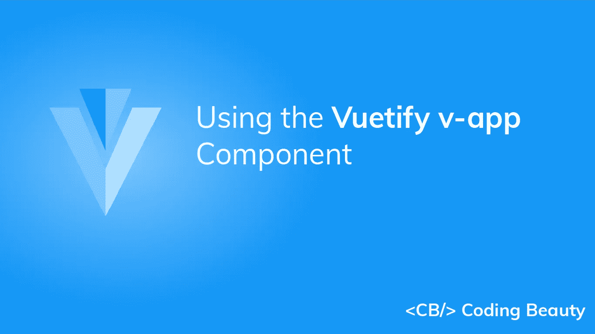
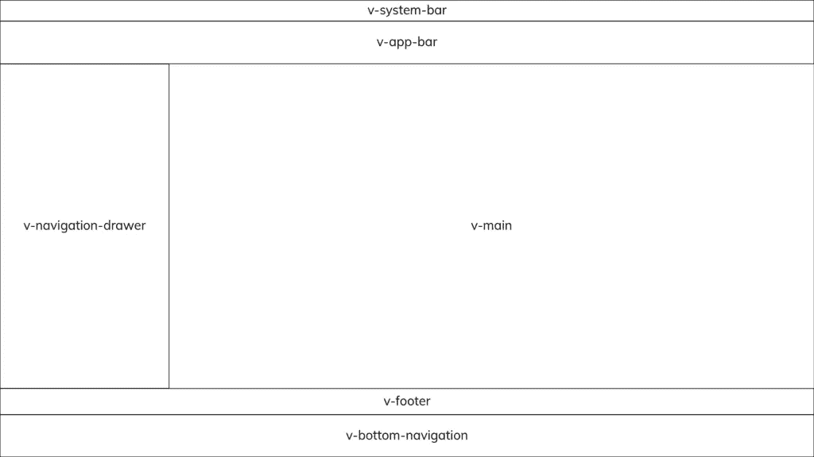
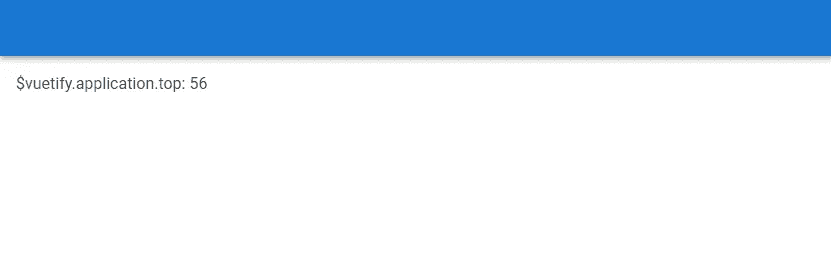
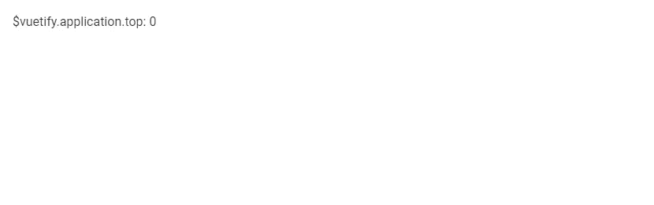

# Vuetify v-app:如何使用 v-app 和 v-main

> 原文：<https://javascript.plainenglish.io/vuetify-v-app-e04a673c52?source=collection_archive---------6----------------------->



当第一次[开始使用 Vuetify](https://codingbeautydev.com/blog/vuetify-getting-started/) 时，您遇到的第一个组件是`v-app`。使用 vue tity 创建的所有应用程序都需要 vue tity`v-app`组件。它支持 Vuetify 提供的许多功能。通过`v-app`，子组件可以从 Vuetify 访问全局数据，比如应用程序主题[颜色](https://codingbeautydev.com/blog/vuetify-colors/)或者主题变体(亮/暗)。`v-app`还确保了适当的跨浏览器兼容性，比如支持 Safari 等浏览器中的某些点击事件。我们可以在其他组件上使用`app` prop，比如 [v-navigation-drawer](https://codingbeautydev.com/blog/vuetify-navigation-drawer/) 、 [v-app-bar](https://codingbeautydev.com/blog/vuetify-app-bar/) 和`v-footer`等等，来帮助我们在`v-main`组件周围设置适当的大小。这样，我们可以专注于构建我们的应用程序，而不需要手动管理布局大小。

# 用`v-app`和`v-main`验证应用程序标记

由于自动调整布局大小，我们可以将主要的布局元素放在标记中的任何地方，只要我们将`app`属性设置为`true`。`v-main`组件对于让我们的页面内容与我们的布局元素一起正常工作非常重要。`v-main`将根据应用了`app`属性的布局元素的结构动态调整大小。

下面是一个典型的 Vuetify 应用程序标记的示例:

```
<!-- App.vue --><v-app>
  <v-navigation-drawer app>
    <!-- -->
  </v-navigation-drawer> <v-app-bar app>
    <!-- -->
  </v-app-bar> <!-- Sizes your content based upon application components -->
  <v-main> <!-- Provides the application the proper gutter -->
    <v-container fluid> <!-- If using vue-router -->
      <router-view></router-view>
    </v-container>
  </v-main> <v-footer app>
    <!-- -->
  </v-footer>
</v-app>
```

注意:应用`app`属性会自动将元素的`position` CSS 属性设置为`fixed`。如果我们需要`absolute`定位，您可以用`absolute`道具覆盖此功能。

# 验证应用程序组件

以下是所有支持使用 app prop 自动调整布局大小的 Vuetify 组件的列表:

*   `v-app-bar`:[应用栏组件](https://codingbeautydev.com/blog/vuetify-app-bar/)总是放在优先级比`v-system-bar`低的应用的顶部。
*   `v-bottom-navigation`:底部导航组件总是放在应用程序的底部，优先级高于`v-footer`。
*   `v-footer`:页脚组件总是放在应用程序的底部，优先级比`v-bottom-navigation`低。
*   `v-navigation-drawer`:[导航抽屉组件](https://codingbeautydev.com/blog/vuetify-navigation-drawer/)可以放置在应用程序的左侧或右侧，并且可以配置为位于 v-app-bar 的旁边或下面
*   `v-system-bar`:系统栏组件总是放在应用程序的顶部，优先级高于`v-app`。



Layout placement of the Vuetify application components.

# 用美化来美化

使用 Vuetify 材料设计框架创建优雅 web 应用程序的完整指南。


在 这里免费获得一份 [**。**](https://mailchi.mp/583226ee0d7b/beautify-with-vuetify)

# 验证应用服务

我们可以用 Vuetify 应用程序服务配置我们的布局。该服务与`v-main`组件通信，以便它能够正确地调整应用程序内容的大小。它附带了许多可访问的属性:

```
{
  bar: number
  bottom: number
  footer: number
  insetFooter: number
  left: number
  right: number
  top: number
}
```

这些属性是只读的，所以我们不能编辑它们。我们可以从`$vuetify`对象的`application`属性中访问它们。该服务使用它们来调整我们主要内容的布局，并在我们添加或删除应用了`app` prop 的应用程序组件时自动更新它们。例如，当在标记中添加或删除 [v-app-bar](https://codingbeautydev.com/blog/vuetify-app-bar/) 时，`top`属性会发生变化:

带`v-app-bar`:

```
<template>
  <v-app>
    <v-app-bar
      color="primary"
      app
    ></v-app-bar>
    <v-main>
      $vuetify.application.top:
      {{ this.$vuetify.application.top }}
    </v-main>
  </v-app>
</template><script>
export default {
  name: 'App',
};
</script>
```



不带`v-app-bar`:

```
<template>
  <v-app>
    <v-main>
      <div class="ma-4">
        $vuetify.application.top:
        {{ this.$vuetify.application.top }}
      </div>
    </v-main>
  </v-app>
</template><script>
export default {
  name: 'App',
};
</script>
```



# 结论

Vuetify `v-app`组件是一个基本组件，在所有使用框架的应用程序中都是必需的。它提供了自动调整布局大小、主题功能和跨浏览器兼容性等功能。

*获得关于 Vuetify、Vue、JavaScript 等的每周提示和教程:*http://eepurl.com/hRfyJL[](http://eepurl.com/hRfyJL)

【codingbeautydev.com】更新于:[](https://codingbeautydev.com/blog/vuetify-v-app/)