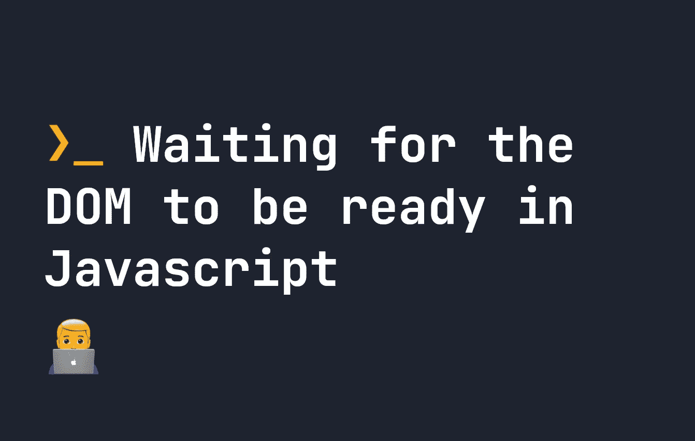

# 等待 JavaScript 中的 DOM 准备就绪

> 原文：<https://javascript.plainenglish.io/waiting-for-the-dom-to-be-ready-in-javascript-843cba3dc1e5?source=collection_archive---------14----------------------->

## 如何使用 DOMContentLoaded 在 JavaScript 中等待 DOM 就绪的快速指南。



当您使用 JavaScript 时，您可能会遇到一个非常常见的问题:如果您的 JavaScript 出现在 HTML 之前，那么尝试将事件附加到 HTML 是不可能的。例如，考虑以下代码:

```
<!DOCTYPE HTML>
<html>
    <head>
        <script type="text/javascript">
            document.querySelector('#button').addEventListener('click', () => {
                console.log('You clicked me!')
            });
        </script>
    </head>
    <body>
        <button id="button">Click Me</button>
    </body>
</html>
```

即使有一个 ID 为`#button`的按钮，这段代码实际上会抛出一个错误。原因是 JavaScript 在 DOM 之前加载。因此，尝试查询选择`#button`会返回空值:

```
Uncaught TypeError: Cannot read properties of null (reading 'addEventListener')
    at file.html:5:46
```

这是一个与 DOM 就绪相关的常见问题——您的 HTML DOM 还没有加载——所以它还没有准备好应用 Javascript。

# 在 Javascript 中等待 DOM 准备就绪 [#](https://fjolt.com/article/javascript-dom-ready#waiting-for-the-dom-to-be-ready-in-javascript)

如果你想在 Javascript 运行之前等待 HTML 的加载，那么尝试使用`DOMContentLoaded`。我们可以将整个 Javascript 封装在这个事件监听器中，如下所示:

```
window.addEventListener('DOMContentLoaded', () => {
    document.querySelector('#button').addEventListener('click', () => {
        console.log('You clicked me!')
    });
});
```

现在，您的代码中不会产生错误，因为只有当 HTML 被触发时，`DOMContentLoaded`事件监听器中的代码才会被触发。这意味着您可以在 HTML 之前继续使用 Javascript，不会遇到任何问题。当然，也可以通过将 Javascript 放在 HTML 之后来解决这个问题——但这并不总是可行的。

我希望你喜欢这个 DOM 准备和 JavaScript 中的`DOMContentLoaded`的快速指南。

[🙇‍♂️:如果你喜欢这个，可以考虑在 Patreon 上支持我](https://www.patreon.com/smpnjn?fan_landing=true)

*更多内容请看*[***plain English . io***](https://plainenglish.io/)*。报名参加我们的* [***免费周报***](http://newsletter.plainenglish.io/) *。关注我们关于*[***Twitter***](https://twitter.com/inPlainEngHQ)[***LinkedIn***](https://www.linkedin.com/company/inplainenglish/)*[***YouTube***](https://www.youtube.com/channel/UCtipWUghju290NWcn8jhyAw)*[***不和***](https://discord.gg/GtDtUAvyhW) *。对增长黑客感兴趣？检查* [***电路***](https://circuit.ooo/) *。***