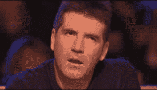
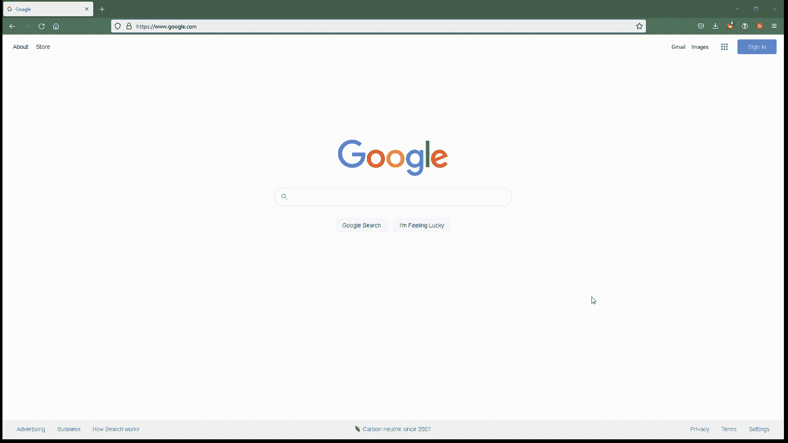
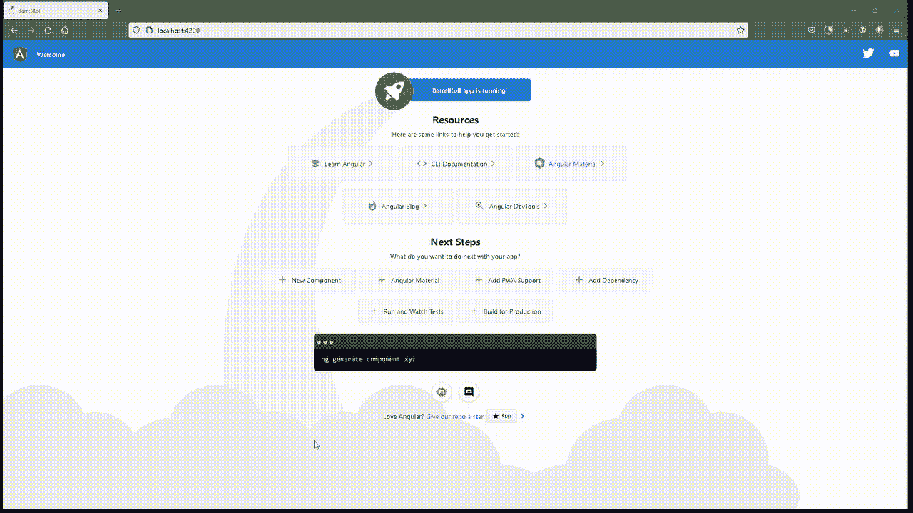

# 想要一个无聊的有棱角的 App？那就不要这样。

> 原文：<https://javascript.plainenglish.io/want-a-boring-angular-app-then-dont-do-this-31c4a39f524c?source=collection_archive---------4----------------------->

如果你想创建一个无聊的角度应用**，那么不要读这个。**


Photo by [cottonbro](https://www.pexels.com/@cottonbro?utm_content=attributionCopyText&utm_medium=referral&utm_source=pexels) from [Pexels](https://www.pexels.com/photo/man-in-gray-jacket-sitting-on-green-couch-4114855/?utm_content=attributionCopyText&utm_medium=referral&utm_source=pexels)



…

…

…

还在吗？

啊。你似乎对此很认真。😀

所以，你想给你的棱角分明的应用程序添加一些阴谋和神秘，给它增添一些乐趣。当你自己爽的时候。Aaaannnddd…不会浪费你几个小时的时间。

一种方法是在你的 Angular 应用程序中添加一些隐藏的复活节彩蛋。

我所知道的最酷的复活节彩蛋之一是谷歌的桶形滚彩蛋。只需进入[谷歌](https://google.com)并输入“做一个桶滚”,就能看到你的页面随着 360 度旋转而晕头转向。



这不是很酷吗？😎

而且更酷的是只需要几行 CSS。

想在你自己的 Angular 应用程序中添加桶卷内容吗？那么下面是如何用“滚桶”动画隐藏一个复活节彩蛋。

# 将桶形辊添加到角度项目

我将拿出一个终端，并使用 Angular CLI 来生成一个新的演示项目。

```
ng new BarrelRoll
```

下一步是打开`styles.css`文件并添加以下 CSS 动画。

```
@-webkit-keyframes roll {
    from { -webkit-transform: rotate(0deg) }
    to { -webkit-transform: rotate(360deg) }
}

@keyframes roll {
    from { transform: rotate(0deg) }
    to { transform: rotate(360deg) }
}

body {
    -webkit-animation-name: roll;
    -webkit-animation-duration: 3s;
    -webkit-animation-iteration-count: 1;
}
```

我们将使用以下命令运行它…

```
ng serve --open
```

…看着它在我们面前旋转。



但是我们如何把它变成像复活节彩蛋一样神秘的东西呢？

# 如何添加滚复活节彩蛋

为了保持简单有趣，我们假设用户必须点击页面上的任意位置 6 次才能触发桶形滚动效果。

第一步是编辑我们的`styles.css`文件，如下所示。

```
@-webkit-keyframes roll {
    from { -webkit-transform: rotate(0deg) }
    to { -webkit-transform: rotate(360deg) }
}

@keyframes roll {
    from { transform: rotate(0deg) }
    to { transform: rotate(360deg) }
}

.easter-egg {
    -webkit-animation-name: roll;
    -webkit-animation-duration: 3s;
    -webkit-animation-iteration-count: 1;
}
```

然后，我将编辑`app.component.ts`文件，如下所示。

```
import { Component } from '@angular/core';

@Component({
  selector: 'app-root',
  templateUrl: './app.component.html',
  styleUrls: ['./app.component.css']
})
export class AppComponent {
  title = 'BarrelRoll';
  displayEasterEgg = false;
  clickCount = 0;

  onPress() {
    this.clickCount = ++this.clickCount;
    if (this.clickCount == 6) {
      this.displayEasteregg = true;
      this.clickCount = 0;
    }
  }
}
```

最后，我们将打开`app-component.html`文件，用我们的 CSS 类`easter-egg`将整个应用程序包装在 HTML [div](https://developer.mozilla.org/en-US/docs/Web/HTML/Element/div) 标签中，作为一个条件 CSS 类。

```
<div [class.easter-egg]="displayEasterEgg" (click)="onPress()">
    ... rest of your HTML code here...
</div>
```

现在，你要做的就是…

1.  转到您的角度应用程序。
2.  单击任意位置 6 次。
3.  观看你的角度应用程序做桶滚。
4.  重复一遍。重复一遍。重复一遍。😁

你觉得桶滚动画怎么样？添加到您的角度项目中容易吗？

请在下面的评论中告诉我。

**关注我:** [GitHub](https://github.com/dkreider) ，[媒体](https://dkreider.medium.com/)，[个人博客](https://danielk.tech/)

*原载于*[*https://danielk . tech*](https://danielk.tech/home/barrel-roll-easter-egg-with-angular)*。*

*更多内容请看*[***plain English . io***](http://plainenglish.io/)*。报名参加我们的* [***免费周报***](http://newsletter.plainenglish.io/) *。在我们的* [***社区***](https://discord.gg/GtDtUAvyhW) *获得独家获得写作机会和建议。*