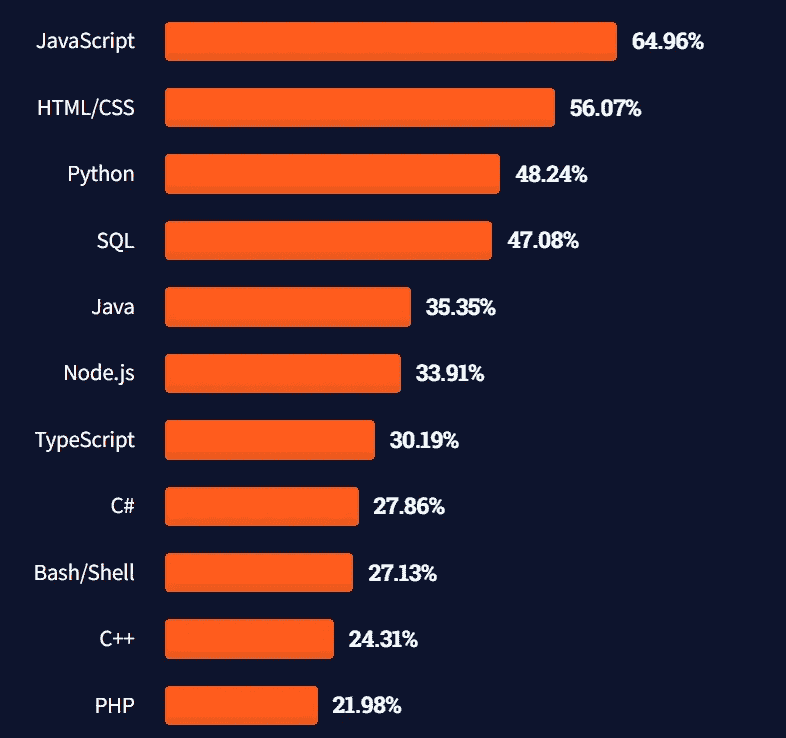

# 想学编程却不知道从何入手

> 原文：<https://javascript.plainenglish.io/want-to-learn-programming-but-dont-know-where-to-start-1c5a918ada0f?source=collection_archive---------16----------------------->

## 了解如何开始您的编程教育。

Photo by [Christopher Campbell](https://unsplash.com/@chrisjoelcampbell?utm_source=medium&utm_medium=referral) on [Unsplash](https://unsplash.com?utm_source=medium&utm_medium=referral)

当我刚开始从事编程工作时，我经常问我的学长该学哪种编程语言，公司需要什么，以及如何开始。

我的大学曾经教我 C 编程语言，然后下学期，我学习了 Java。但是我的头脑也需要知道语言是否足够或者我是否需要学习新的东西。

如果你还有同样的问题，我也许能帮上忙。有两个因素影响它。你想为一份工作学习一门编程语言，或者开始创造一些新的东西。

嗯，我属于第二类；我想学习这门语言，这样我就可以用它做一些事情，比如自由职业。所以，很明显，我学习 JavaScript 是为了学习 web 编程，然后赚点钱。

# 让我们来谈谈与顶级编程语言相关的调查

在深入研究之前，我们需要知道程序员在使用什么，当前的趋势是什么，这些都可以通过调查轻松获得。

根据 [2021 年开发者调查](https://insights.stackoverflow.com/survey/2021#technology-most-popular-technologies)显示，JavaScript 仍然是排名第一的语言，其次是 HTML/CSS 和 Python。

Src: Stack Overflow

所以你们大多数人都很清楚世界其他地方现在在用什么。让我简单地概述一下每种语言的用例。

所以，让我们从 JavaScript 开始。JavaScript 可能被称为“网络之王”大多数企业和初创公司都需要网站来扩展或推出他们的服务。

为此，我们必须使用 JavaScript。如果你熟悉 React，Angular，或者 Vue(大部分知名的前端框架，没错，React 是一个库)，你会注意到它们都需要 JavaScript。此外，如果您想要构建一个应用程序，React Native 与 React 是相同的。

所以你抓住了它的要点，对吗？

同样，HTML/CSS 是用来创建网站的核心技术。

最后，Python 是我最喜欢的编程语言。我在网上见过的最简单的语言之一。

但是最初，我应该学什么？这要看情况。

# 想找份工作

如果你希望从事软件开发工作，你需要掌握至少一门语言的基础知识。您可以使用任何可用的编程语言，如 Python、Java 或 C++。

不要求学习某种语言。但如果你问我用哪种语言，我只会说 Python。

这样做的原因是它很容易理解，并且可以用来实现几乎任何东西。

是的，我指的是从建立网站到开发机器学习模型等任何事情。

这里我特别指的是编程语言。如果你学了 JavaScript，你也可以获得一份工作。同样，如果你学会了扎实，你会有更多的选择。

# 想开始自由职业吗

说实话，我是在工程二年级的时候学的 JavaScript。接下来，我去学习 React。毫无疑问，我想通过学习编程语言来赚钱。

简而言之，自由职业。我的 web 开发之旅就这样开始了。

没必要学 JavaScript 你也可以学 Python，然后学 Flask 或者 Django。但是，掌握 JavaScript 会给你带来优势。

同样的，如果你想做 app，你可以学 Java，React Native，或者 Flutter。这完全取决于你。

# 从哪里开始

有钱就去 Udemy 否则，去 YouTube。这就是全部了。

这里有 80 多种免费的网络开发资源。

 [## 2022 年为网页设计师和网页开发者提供 80 多种免费资源

### 成为网页开发者的完整指南。

javascript.plainenglish.io](/80-free-resources-for-web-designers-and-web-developers-in-2021-f400be2875ea) 

# 包裹

我相信你有你的答案。但是等等，因为技术是累积的，你永远不知道一种新的语言什么时候会流行起来。

因此，与其学习一门特定的语言，不如坚持不懈地获取最新的趋势。

谷歌是你最好的伙伴。就像今天，我知道网络开发，我也可以很容易地找到工作。但是我们永远不知道未来。

这就是全部内容——谢谢。

[*如果你喜欢阅读这样的故事，并想帮助我成为一名作家，可以考虑成为一名中等会员*](https://nitinfab.medium.com/membership) *。每月花费 5 美元，你可以无限制地访问媒体内容。如果你通过我的链接注册，我会得到一点佣金。*

*更多内容看* [***说白了。报名参加我们的***](https://plainenglish.io/) **[***免费周报***](http://newsletter.plainenglish.io/) *。关注我们*[***Twitter***](https://twitter.com/inPlainEngHQ)*和*[***LinkedIn***](https://www.linkedin.com/company/inplainenglish/)*。加入我们的* [***社区***](https://discord.gg/GtDtUAvyhW) *。***